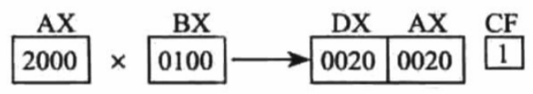

# 基础概念

- 8086CPU有14个寄存器 它们的名称为：AX、BX、CX、DX、SI、DI、SP、BP、IP、CS、SS、DS、ES、PSW
- 8086CPU所有的寄存器都是16位的，可以存放两个字节
- AX、BX、CX、DX 通常用来存放一般性数据被称为通用寄存器
- 8086上一代CPU中的寄存器都是8位的；
- 为保证兼容性，这四个寄存器都可以分为两个独立的8位寄存器使用。
  - AX可以分为AH和AL；
  - BX可以分为BH和BL；
  - CX可以分为CH和CL；
  - DX可以分为DH和DL
- DEBUG

>- R命令查看、改变CPU寄存器的内容；
>- D命令查看内存中的内容；
>- E命令改写内存中的内容；
>- U命令将内存中的机器指令翻译成汇编指令；
>- T命令执行一条机器指令；
>- A命令以汇编指令的格式在内存中写入一条机器指令

# 汇编习题

## 1.1

1. 1个CPU的寻址能力为8KB，那么它的地址总线的宽度为 13位
2. 1KB的存储器有 1024 个存储单元，存储单元的编号从 0 到 1023 
3. 1KB的存储器可以存储 8192（2^13） 个bit， 1024个Byte
4. 1GB 是 1073741824 （2^30） 个 Byte、1MB 是 1048576（2^20） 个 Byte、1KB 是 1024（2^10）个Byte
5. 8080、8088、80296、80386 的地址总线宽度分别为 16根、20根、24根、32根，则 它们的寻址能力分别为: 64 （KB）、 1 （MB）、 16 （MB）、 4 （GB）
6. 8080、8088、8086、80286、80386 的数据总线宽度分别为 8根、8根、16根、16根、 32 根。则它们一次可以传送的数据为: 1 （B）、 1 （B）、 2 （B）、 2 （B）、 4 （B）
7. 从内存中读取1024字节的数据，8086至少要读 512 次，80386至少要读 256 次
8. 在存储器中，数据和程序以 二进制 形式存放

---

- **解题过程：**

1. 1KB=1024B，8KB=1024B*8=2^N，N=13
2. 存储器的容量是以字节为最小单位来计算的，1KB=1024B
3. 8Bit=1Byte，1024Byte=1KB（1KB=1024B=1024B*8Bit）。
4. 1GB=1073741824B（即2^30）1MB=1048576B（即2^20）1KB=1024B（即2^10）
5. 一个CPU有 N根地址线，则可以说这个 CPU的地址总线的宽度为 N。这样的 CPU最 多可以寻找2的N次方个内存单元。（一个内存单元=1Byte）
6. 8根数据总线一次可以传送8位二进制数据（即一个字节）
7. 8086 的数据总线宽度为 16 根（即一次传送的数据为 2B）1024B/2B=512，同理 1024B/4B=256
8. 在存储器中指令和数据没有任何区别，都是二进制信息

##  2.1

- 写出每条汇编指令执行后相关寄存器中的值，以下指令是在16位计算机中完成的(两个字节)

```assembly
mov ax,62627   AX=F4A3H   ;62627十进制 = F4A3H 十六进制
mov ah,31H     AX=31A3H   ;31H覆盖ax的高位
mov al,23H     AX=3123H   ;23H覆盖ax的地位
add ax,ax      AX=6246H 
mov bx,826CH   BX=826CH 
mov cx,ax      CX=6246H 
mov ax,bx      AX=826CH 
add ax,bx      AX=04D8H 
mov al,bh      AX=0482H 
mov ah,bl      AX=6C82H 
add ah,ah      AX=D882H   ;ax的高位字节相加
add al,6       AX=D888H 
add al,al      AX=D810H   ;ax的低位字节相加
mov ax,cx      AX=6246H
```

- 只能使用目前学过的汇编指令，最多使用4条指令，编程计算2的4次方

```assembly
mov  ax,2         AX=2 
add  ax,ax        AX=4 
add  ax,ax        AX=8 
add  ax,ax        AX=16 
```

## 2.2

1. 给定段地址为0001H，仅通过变化偏移地址寻址，CPU的寻址范围为 0010H 到 1000FH 。

- 解题过程：

>- 物理地址＝SA * 16+EA 
>- EA的变化范围为0h~ffffh 
>- 物理地址范围为(SA * 16+0h)~(SA * 16+ffffh)
>- 现在SA=0001h,那么寻址范围为 (0001h * 16+0h)~(0001h * 16+ffffh) =0010h~1000fh  

---

2.  有一数据存放在内存 20000H单元中，现给定段地址为 SA，若想用偏移地址寻到此单元。 则SA应满足的条件是：最小为 1001H ，最大为 2000H 
   - 当段地址给定为 1001H 以下和 2000H 以上，CPU 无论怎么变化偏移地址都无法寻到 20000H单元

- 解题过程：

>- 物理地址＝SA * 16+EA 
>- 20000h＝SA * 16+EA 
>- SA=(20000h-EA)/16=2000h-EA/16 
>- EA取最大值时,SA=2000h-ffffh/16=1001h,SA为最小值 
>- EA取最小值时,SA=2000h-0h/16=2000h,SA为最大值 

- 注：取最大值的除法部分是除不尽的，所以向上取值为1001H

## 2.3

- 下面的3条指令执行后，cpu几次修改IP？都是在什么时候？最后IP中的值是多少？ 

```assembly
mov ax,bx ;第一次：读取mov ax,bx之后 
sub ax,ax ;第二次：读取sub ax,ax之后 
jmp ax ;第三次：读取jmp ax之后 第四次：执行jmp ax修改IP 
```

- 答：一共修改四次
- 最后IP的值为0000H，因为最后ax中的值为0000H，所以IP中的值也为0000H 
- 在取得执行指令的地址后IP地址就会修改然后在执行对应的mov或sub或jmp指令

## 3.1

- 在DEBUG中,用 "D 0:0 lf" 查看内存,结果如下: 

>0000:0000 70 80 F0 30 EF 60 30 E2-00 80 80 12 66 20 22 60 
>0000:0010 62 26 E6 D6 CC 2E 3C 3B-AB BA 00 00 26 06 66 88 

- 下面的程序执行前,AX=0,BX=0,写出每条汇编指令执行完后相关寄存器中的值
- 关键：段地址 * 16 + 偏移地址

```assembly
mov ax,1 ;把1h放入ax寄存器中
mov ds,ax ;把ax中的数据作为段地址
mov ax,[0000]  ax=2662H ;0001h*16+0000h = 0010h ==> 2362H
mov bx,[0001]  bx=E626H ;0001h*16+0001h = 0011h ==> E626H
mov ax,bx      ax=E626H 
mov ax,[0000]  ax=2662H 
mov bx,[0002]  bx=D6E6H ;0001h*16+0002h = 0012h ==> D6E6H
add ax,bx      ax=FD48H 
add ax,[0004]  ax=2C14H ;0001h*16+0004h = 0014h ==> FD48H+2ECCH=12C14H ==> 2C14H
mov ax,0       ax=0   
mov al,[0002]  ax=00e6H 
mov bx,0       bx=0   
mov bl,[000c]  bx=0026H 
add al,bl      ax=000CH 
```

## 3.2

- 补全下面的程序，使其可以将 10000H—1000FH 中的 8 个字，逆序拷贝到 20000H—2000FH中
- **压栈**

```assembly
mov ax,1000H 
mov ds,ax ;段地址为1000H
mov ax,2000H 
mov ss,ax ;ss指向栈空间段地址 2000H    
mov sp,0 ;sp指向栈空间偏移地址 0000H   
push [0] ;将10000H地址里的字压入地址为20000H的栈空间------1
push [2] ;将10002H地址里的字压入地址为20002H的栈空间------2
push [4] ;...以此类推------X
push [6] 
push [8] 
push [A] 
push [C] 
push [E] 
```

---

- **弹栈**

```assembly
mov ax,2000H 
mov ds,ax ;段地址为2000H
mov ax,1000H
mov ss,ax ;初始栈空间段地址1000H 
mov sp,0  ;初始栈空间偏移地址0000H  
pop [e]   ;2000EH地址处的数据出栈------即第8个字出栈变成第一个
pop [c]   ;2000CH地址处的数据出栈------即第7个字出栈变成第一个
pop [a]   ;以此类推,实现逆序拷贝
pop [8] 
pop [6] 
pop [4] 
pop [2] 
pop [0] 
```

# X86习题

## 3.1

1. **使用数值-35，按照MASM语法，写出该数值的十进制、十六进制、八进制和二进制格式的整数常量**

>- 十进制：-35d
>- 十六进制：DDh
>- 八进制：335o
>- 二进制：1101 1101b

- 在计算机中，正数是直接用原码表示的，如单字节5，在计算机中就表示为：0000 0101
- 负数以其正值的补码形式表示，如单字节-5，在计算机中表示为1111 1011
- 整数-1在计算机中如何表示？

>- 假设这也是一个int类型，那么：
>  1. 先取-1的原码：10000000 00000000 00000000 00000001
>  2. 得反码：11111111 11111111 11111111 11111110（除符号位按位取反）
>  3. 得补码：11111111 11111111 11111111 11111111（反码+1）
>- 可见，－1在计算机里用二进制表达就是全1。16进制为：0xFFFFFF

2. **（是/否）：A5h是一个有效的十六进制常量吗？**

>- 否，以字母开头的十六进制数必须加个前置0，以防止汇编器将其解释为标识符

3. **（是/否）：整数表达式中，乘法运算符（*）是否比除法运算符（/）具有更高优先级？**


>- 否，乘法和除法运算符的优先级是相同的

4. **编写一个整数表达式，要求用到3.1.2节中的所有运算符。计算该表达式的值**

```asm
30MOD(3 x 4)+(3-1)/2 = 20
```

---

```asm
.data         ;数据区
sum dword 0   ;定义名为sum的变量
.code         ;代码区
main PROC
mov eax,5     ;将数字5送入eax寄存器
add eax,6     ;eax寄存器加6
mov sum,eax
IINVOKE ExitProcess,0 ;程序结束
main ENDP
```

6. **（是/否）：字符串常量必须被包含在单引号中吗？**

>- 否，字符串常量（string literal）是用单引号或双引号包含的一个字符（含空格符）序列：

```asm
'ABC'
x
"Good night，Gracie"
```

- 嵌套引号也是被允许的，使用方法如下例所示：

```asm
"This isn't a test"
‘Say"Good night，"Gracie'
```

7. **保留字可以用作指令助记符、属性、运算符、预定义符号，和?**

>保留字（reserved words）有特殊意义并且只能在其正确的上下文中使用。默认情况下，保留字是没有大小写之分的。比如，MOV与mov、Mov是相同的。保留字有不同的类型

- 指令助记符，如MOV、ADD和MUL
- 寄存器名称
- **伪指令，告诉汇编器如何汇编程序**
- 属性，提供变量和操作数的大小与使用信息。例如BYTE和WORD
- 运算符，在常量表达式中使用
- 预定义符号，比如@data，它在汇编时返回常量的整数值

8. **标识符的最大长度是多少？**

>- 标识符是由程序员选择的名称，它用于标识常量、常数、子程序和代码标签
>- 247个字符
>- 不区分大小写

## 3.2

```asm
;AddTwo.asm
.386                ;.386伪指令,它表示这是一个32位程序，能访问32位寄存器和地址
.model flat,stdcall ;告诉编译器使用平面存储模式
.stack 4096         ;.stack伪指令告诉编译器应该为程序运行时堆栈保留多少内存字节
ExitProcess PROTO, dwExitCode:dword  ;声明了ExitProcess函数的原型，它是一个标准的Windows服务

.code                 ;标记一个程序代码区的起点,代码区
main PROC             ;main程序,声明程序的入口,是指程序要执行的第一条指令的位置
mov eax,5             ;将数字5送入寄存器
add eax,6             ;eax寄存器加6
INVOKE ExitProcess,0 
main ENDP             ;ENDP伪指令标志一个过程的结束,如果程序有名为main的过程,则endp就必须使用同样的名称 main endp
END main              ;END伪指令标记一个程序的结束,并要引用程序的入口
```

1. **在AddTwo程序中，ENDP伪指令的含义是什么？**

>- ENDP伪指令标志一个过程的结束

2. **在AddTwo程序中，.CODE伪指令标识了什么？**

>- 标识了代码段的开始

3. AddTwo程序中两个段的名称是什么？

>- 那些被.code和.data伪指令标记的代码和数据区，被称为段。即，程序有代码段和数据段。实际还要命名第三种段：堆栈（stack）
>- 该程序中的两个段是代码段和堆栈段
>- code和stack

4. 在AddTwo程序中，哪个寄存器保存了和数？

>- eax寄存器

5. 在AddTwo程序中，哪条语句使程序停止？

>- INVOKE ExitProcess,0 
>- 第11行调用Windows服务（也被称为函数）ExitProcess停止程序，并将控制权交还给操作系统；
>- 第12行是主程序结束的标记

## 3.3

1. 汇编器生成什么类型的文件？

>- 汇编器生成包含机器语言的文件，称为目标文件(.OBJ)和列表文件(.LST)

2. （真/假）：链接器从链接库中抽取已汇编程序，并将其插入到可执行程序中

>- 真，链接器读取并检查目标文件，以便发现该程序是否包含了任何对链接库中过程的调用。链接器从链接库中复制任何被请求的过程，将它们与目标文件组合，以生成可执行文件

3.（真/假）：程序源代码修改后，它必须再次进行汇编和链接才能按照修改内容执行

>- 真

4. 操作系统的哪一部分来读取和执行程序？

>- 加载器
>- 操作系统加载程序将可执行文件读入内存，并使CPU分支到该程序起始地址然后程序开始执行

5. 链接器生成什么类型的文件？

>- 从而生成可执行文件（.EXE）


## 3.4数据类型


```asm
;数据定义语句
;名字 伪指令 初始值
count dword 123456
```

- 初始值：数据定义中至少要有一个初始值，即使该值为0。其他初始值，如果有的话，用逗号分隔。对整数数据类型而言，初始值是整数常量或是与变量类型，如BTYE或WORD相匹配的整数表达式
- 如果程序员希望不对变量进行初始化（随机分配数值），可以用符号？作为初始值。所有初始值，不论其格式，都由汇编器转换为二进制数据。初始值00110010b、32h和50d都具有相同的二进制数值

```asm
;AddTwoSum.asm
.386
.model flat,stdcall
.stack 4096
ExitProcess PROTO,dwExitCode:dword

.data            ;数据段
sum dword 0

.code            ;代码段
main PROC
mov eax,5
add eax,6
mov sum,eax

INVOKE ExitProcess,0
main ENDP
END main
```

1. 为一个16位有符号整数创建未初始化数据声明

```asm
value1 sword ? ;sword伪指令表示16位有符号整数 问号(?)初始值使得变量未初始化,这意味着在运行时分配数值到该变量
```

2. 为一个8位无符号整数创建未初始化数据声明

```asm
value2 byte ?
```

3. 为一个8位有符号整数创建未初始化数据声明

```asm
value3 sbyte ?
```

4. 为一个64位整数创建未初始化数据声明

```asm
value4 qword ?
```

5. 哪种数据类型能容纳32位有符号整数？

```asm
sdword
```

## 3.5符号常量

1. 用等号伪指令定义一个符号常量，使其包含Backspace键的ASCll码(08h)

```asm
Backspace=08h
```

2. 用等号伪指令定义符号常量SecondInDay，并为其分配一个算术表达式计算24小时包含的秒数

```asm
SecondInDay=24*60*60
```

3. 编写一条语句使汇编器计算下列数组的字节数，并将结果赋给符号常量ArraySize

```asm
myArray word 20 dup(?)
ArraySize=($-myArray)
```

4. 说明如何计算下列数组的元素个数，并将结果赋给符号常量ArraySize

``` asm
myArray dword 30 dup(?)
ArraySize=($-myArray)/4
```

5. 使用TEXTEQU表达式将"proc"重定义为"procedure"

```asm
procedure textequ<proc>
```

6. 使用TEXTEQU将一个字符串常量定义为符号Sample，再使用该符号定义字符串MyString

```asm
Sample TEXTEQU<This is s string>
MyString byte Sample
```

7. 使用TEXTEQU将下面的代码行赋给符号SetupESI

```asm
mov esi,offset myArray ;代码行
SetupESI TEXTEQU<mov esi,offset myArray>
```

## 3.6定义变量

```asm
;AddTwoSum_64.asm---64位编程
ExitProcess PROTO
.data
sum dword 0
.code
main PROC
mov eax,5
add eax,6
mov sum,eax

mov ecx,0
call ExitProcess
main ENDP
END
```

## 3.9助记符

1. **举例说明三种不同的指令助记符**


>- mov add mul 不区分大小写

2. **什么是调用规范，如何在汇编语言中声明并使用它**

```asm
.model flat,stdcall
```

3. **如何在程序中为堆栈预留空间**

```asm
.stack 4096
```

4. **说明为什么汇编器语言不太正确**

- 从汇编语言源文件到执行要经过 编辑--->汇编--->链接 执行几个过程，有以下步骤：

>1. 使用文本编译器创建ASCII文件，也就是源文件
>2. 汇编器读取源文件，并生成目标文件,或者，也会生成列表文件
>3. 链接器读取并检查目标文件，寻找程序中对链接库的调用，并从连接库中复制被请求的过程，生成可执行文件
>4. 操作系统加载可执行程序读入内存，并使CPU分支该程序的起始地址

5. **说明大端序与小端序之间的区别，并在网上查找这些术语的起源**


>- 小端序中最低有效字节放在第一个内存地址中。 假设有DWORD 12345678h分配的起始地址为0000,则其最低有效字节78h放入0000，56h放入0001

6. **为什么在代码中使用符号常量而不是整数常量**

>- 符号常量是用符号来代替数值，通过合理的命名以便于理解代码

7. **源文件和列表文件的区别是什么**

>- 源文件是ASCII编码的程序源代码， 列表文件包括源文件的副本，行号每条指令的数字地址，每条指令的机器代码字节(十六进制)以及符号表
>- 符号表中包含了程序中所使用的所有标识符名称，段和相关信息
>- 指令的数字地址是相对程序占用的起点而言的，从0000 0000开始。

- AddTwo的源文件

```asm
.386
.model flat,stdcall
.stack 4096

.data
sum DWORD 0ah
.code
main PROC
	mov eax,3
	add eax,4
main ENDP
end main 
```

- AddTwo的列表文件

```asm
Microsoft (R) Macro Assembler Version 14.16.27031.1	    06/18/19 13:16:32
a.asm							     Page 1 - 1


				.386
				.model flat,stdcall
				.stack 4096

 00000000			.data
 00000000 0000000A		sum DWORD 0ah

 00000000			.code
 00000000			main PROC
 00000000  B8 00000003			mov eax,3
 00000005  83 C0 04			add eax,4
 00000008			main ENDP
				end main 

 
Microsoft (R) Macro Assembler Version 14.16.27031.1	    06/18/19 13:16:32
a.asm							     Symbols 2 - 1


Segments and Groups:

                N a m e                 Size     Length   Align   Combine Class

FLAT . . . . . . . . . . . . . .	GROUP
STACK  . . . . . . . . . . . . .	32 Bit	 00001000 DWord	  Stack	  'STACK'	 
_DATA  . . . . . . . . . . . . .	32 Bit	 00000004 DWord	  Public  'DATA'	
_TEXT  . . . . . . . . . . . . .	32 Bit	 00000008 DWord	  Public  'CODE'	


Procedures, parameters, and locals:

                N a m e                 Type     Value    Attr

main . . . . . . . . . . . . . .	P Near	 00000000 _TEXT	Length= 00000008 Public STDCALL


Symbols:

                N a m e                 Type     Value    Attr

@CodeSize  . . . . . . . . . . .	Number	 00000000h   
@DataSize  . . . . . . . . . . .	Number	 00000000h   
@Interface . . . . . . . . . . .	Number	 00000003h   
@Model . . . . . . . . . . . . .	Number	 00000007h   
@code  . . . . . . . . . . . . .	Text   	 _TEXT
@data  . . . . . . . . . . . . .	Text   	 FLAT
@fardata?  . . . . . . . . . . .	Text   	 FLAT
@fardata . . . . . . . . . . . .	Text   	 FLAT
@stack . . . . . . . . . . . . .	Text   	 FLAT
sum  . . . . . . . . . . . . . .	DWord	 00000000 _DATA	

	   0 Warnings
	   0 Errors
```

8. **数据标号与代码标号的区别是什么**

>- **数据标号**表示变量的位置，它提供了一种简便的方式操作变量。例:

```asm
value1 DWORD 0123h
```

>- **代码标号**标记程序的代码位置，使用冒号结束，通常用于循环与跳转。例:

```asm
target:
	mov eax  12
	...
	...
	jmp target
```

9. **标识符可否以数字开头**

- 标识符是由程序员自定义的，用于标记变量，常数，子程序和代码位置的标签。命名有以下规则:

>1. 1-247位字符。
>2. 不区分大小写。
>3. 首位必须是字母 下划线_ @ ? $
>4. 不能与**汇编器保留字**重复

10. **十六进制常量可否写为0x3A**

>- 可以，0x表示十六进制

11. **汇编语言伪指令是否在运行时执行**

>- **伪指令**是嵌入代码中的命令,由汇编器识别与执行，不在运行时执行。例如DWORD,code,data。可以定义变量，宏和子程序，为内存段分配空间

12. **汇编语言伪指令可写为大写字母与小写字母的任意组合**

>- 对，不区分大小写

13. **说出汇编语言指令的四个基本组成部分**

>- 标号(可选) 
>- 助记符(必选) 
>- 操作数(通常必须) 
>- 注释(可选)

14. **MOV是指令助记符**

>- 对

15. **代码标号后跟冒号，而数据标号没有**

>- 对

16. **给出注释块的列子**

- 单行注释

```asm
mov eax,5 ;这个一个单行注释,用分号(;)开始,汇编器将忽略在同一行上分号之后的所有字符
```

- 块注释：用COMMENT伪指令和一个用户定义的符号开始，汇编器将忽略其后所有的文本行，直到相同的用户定义符号出现为止

```asm
comment !
This line is a comment.
This line is also a comment
!
```

- 其他符号也可以使用

```asm
comment &
This line is a comment.
This line is also a comment
&
```

17. **使用数字地址编写指令来访问变量，为什么不是一个好主意**

>- 数字不便于记忆，也容易与数值弄混

18. **必须向ExitProcess 过程传递什么参数**

>- DWORD

```asm
EXitProcess PROTO,dwExitCode:DWORD
```

19. **什么伪指令用来结束子程序**

>- ENDP 伪指令，标记一个过程结束
>- END 伪指令，标记一个程序结束

20. **32位模式下，END伪指令中的标识符有什么作用**

>- 标识程序结束，引入程序入口

21. **PROTO伪指令的作用是什么**

>- 函数声明

22. **目标文件由链接器生成**

>- 由汇编器生成目标文件 列表文件 连接器生成可执行文件

23. **列表文件由汇编器生成**

>- 对

24. **链接库只有在生成可执行文件之前才加入到程序中**

>- 对

---

## 3.9算法基础

1. **定义四个符号常量分别表示25的十进制，二进制，八进制，十六进制**

```asm
.386
.model flat,stdcall
.stack 4096

.data

val1 DWORD 25d  ;十进制
val3 DWORD 00011001b  ;二进制
val2 DWORD 19h  ;十六进制

.data
val4 DWORD 31o  ;八进制
val5 DWORD 31q	;八进制

.code
main PROC
	mov eax,0
	mov eax,val1
	mov eax,0 
	mov eax,val3
	mov eax,0 
	mov eax,val2 
	mov eax,0 
	mov eax,val4 

main ENDP
end main 

.code
```

2. **通过实践，判断一个程序可否有多个代码段和数据段**

>- 可以，见上例

3. **编写数据定义，把一个双字按大端顺序放在内存中**

```asm
.data
comment !
	Storing the value 01020304h
!

myVal LABEL DWORD
BYTE 04h,03h,02h,01h

.code 
main PROC
mov eax, myVal
```


4. **试发现用DWORND类型定义一个变量时，能否向其赋予负值，这说明了汇编器类型检查的什么问题**


>- 可以向DWORD赋负值，-1在寄存器中都是以反码形式存在

5. **编写一个程序，包含两条指令：(1)EAX寄存器加5，(2)EDX寄存器加5。生成列表文件并检查由汇编器生成的机器代码。发现两条指令的不同之处了吗？是什么**


>- 操作码不同，向EAX和EBX中做加法是不同的指令

6. **假设有数值456789ABh，按小端输出其字节内容**

>- ABh 89h 56h 45h

7. **声明一个数字，其包含有120个未初始化无符号双字数值**

```asm
myVal DWORD 120 DUP(?)
```

8. **声明一个字节数组，并将其初始化为字母前5个字母**

```asm
my BYTE 5 DUP ("ABCDE")
val BYTE "ABCDE"
```

9. **声明一个32位有符号整型变量，并初始化为尽可能小的十进制负数**

```asm
myVal SDWORD 800000000h
```

10. **声明一个16位无符号整数变量，使其具有三个初始值**

- DUP操作符使用一个整数表达式作为计数器，为多个数据项分配存储空间。在为字符串或数组分配存储空间时，这个操作符非常有用，它可以使用初始化或非初始化数据：
- 示例

```asm
byte 20 dup(0)       ;20个字节,值都为0
byte 20 dup(?)       ;20个字节,非初始化 
byte 4 dup("stack")  ;20个字节
```

- 题解

```asm
myVal WORD 3 DUP(0001h,0002h,0003h)
```

11. **声明一个字符串变量，包含你最喜欢颜色的名字，并将其初始化为空字节结束的字符串**

- 定义一个字符串，要用单引号或双引号将其括起来。最常见的字符串类型是用一个空字节（值为0）作为结束标记，称为以空字节结束的字符串，很多编程语言中都使用这种类型的字符串：

```asm
myVal BYTE "COLOR",0
```

12. **声明一个未初始化数组dArray, 包含50个有符号双字**

```asm
dArray DWORD 50 DUP(?) ;50个数值,未初始化
```

13. **声明一个字符串变量，包含单词“TEST" 并重复500次**

```asm
myVal BYTE 500 DUP("TEST")
```

14. **声明一个数组array,包含20个无符号字节，并将其所有元素都初始化为0**

```asm
array BYTE 20 DUP(0)
```

## 4.1操作数/寄存器


```asm
.data
var1 byte 10h ;var1的声明表示该变量的大小类型为字节,值为十六进制的10
mov al var1   ;将var1变量的值复制到al寄存器中


;另一种表示法,直接操作数的表达方式,括号意味着解析操作
mov al [var1]
;直接偏移量操作数
mov al [var1+5]
```

- 指令会被汇编为下面的机器指令

```asm
;A0是操作码 00010400是var1的32位十六进制地址
A0 00010400
```

1. 操作数的三种基本类型是什么？

>- 立即数——使用数字文本表达式
>- 寄存器操作数—使用CPU内已命名的寄存器
>- 内存操作数——引用内存位置

2. （真/假）：MOV指令的目的操作数不能为段寄器

>- 错，如4.1开头所示

3. （真/假）：MOV指令中的第二个操作数是目的操作数

>- 假
>- MOV指令将源操作数复制到目的操作数。作为数据传送指令，它几乎用在所有程序中。在它的基本格式中，第一个操作数是目的操作数，第二个操作数是源操作数

4. （真/假）：EIP寄存器不能作为MOV指令的目的操作数

>- 真

- MOV指令使用操作数是非常灵活的：

>- 两个操作数必须是同样的大小
>- 两个操作数不能同时为内存操作数
>- 指令指针寄存器（IP、EIP或RIP）不能作为目标操作数

5. Intel使用的操作数符号中，reg/mem32的含义是什么？

>- 32位寄存器或内存操作数

6. Intel使用的操作数符号中，imm16的含义是什么？

>- 16位立即（常数）操作数


---

- **覆盖值**

```asm
.data
ontByte byte 78h     
oneWord word 1234h
oneDword dword 12345678h
.code
mov eax,0            ;eax=0000 0000h
mov al,oneByte       ;eax=0000 0078h  覆盖低8位字节---al是8位寄存器
mov ax,oneWord       ;eax=0000 1234h  覆盖低16位字节--ax是16位寄存器
mov eax,oneDword     ;eax=1234 5678h  覆盖整个eax寄存器
mov ax,0             ;eax=1234 0000h  覆盖eax的低16位字节
```

## 4.2add/inc

- **示例程序**

```asm
;加法和减法
.386
.model flat,stdcall
.stack 4096
ExitProcess proto,dwExitCode:dword

.data
Rval sdword ?
Xval sdword 26
Yval sdword 30
Zval sdword 40

.code
main proc
;inc 和 dec
mov ax,1000h
inc ax   ;1001h
dec ax   ;1000h

;表达式:Rval = -Xval + (Yval-Zval)
mov eax,Xval
neg eax        ;-26  ---> neg指令是对操作数取反
mov ebx,Yval   ;ebx=30
sub ebx,Zval   ;-10  ---> 30-40=-10 ---> sub指令是用目的操作数减去源操作数
add eax,ebx    ;eax=(-26)+(-10)=-36
mov Rval,eax   ;-36
;标志位进位标志位、零标志位、符号标志位、溢出标志位、辅助进位标志位和奇偶标志位根据存入目标操作数的数值进行变化
;零标志位示例
mov cx,1
sub cx,1   ;ZF = 1  --->(zero flag)
mov ax,oFFFFh
inc ax     ;ZF = 1  --->ax=10000h,由于ax是16位寄存器,所以ax=0000h
```

- 加法指令和减法指令会影响标志位

>- 进位标志位意味着无符号整数溢出。比如，如果指令目的操作数为8位，而指令产生的结果大于二进制的11111111，那么进位标志位置1
>- 溢出标志位意味着有符号整数溢出。比如，指令目的操作数为16位，但其产生的负数结果小于十进制的-32768(8000h)，那么溢出标志位置1
>- 零标志位意味着操作结果为0。比如，如果两个值相等的操作数相减，则零标志位置1。符号标志位意味着操作产生的结果为负数。如果目的操作数的最高有效位（MSB）置1，则符号标志位置1
>- 奇偶标志位是指，在一条算术或布尔运算指令执行后，立即判断目的操作数最低有效字节中1的个数是否为偶数
>- 辅助进位标志位置1，意味着目的操作数最低有效字节中位3有进位

---

- **问题1到问题5使用如下数据**

```asm
.data
val1 byte 10h
val2 word 8000h
val3 dword 0FFFFh
val4 word 7FFFh
```

1. **编写一条指令实现val2加1**

>INC（增加）和DEC（减少）指令分别表示寄存器或内存操作数加1和减1，语法如下所示：

- 示例

```asm
.data
myWord word 1000h
.code
inc myWord     ;myWord = 1001h
mov bx,myWord
dec bx         ;bx = 1000h
```

- 题解

```asm
inc val2
```

2. 编写一条指令实现从EAX中减去val3

```asm
sub eax val3
```

3. 编写指令实现从val2中减去val4。

```asm
mov ax,val4   ;两个数值不能直接相减
sub val2,ax
```

4. **如果用ADD指令实现val2加1，则进位标志位和符号标志位的值是多少？**

>- ADD指令将长度相同的源操作数和目的操作数进行相加操作
>- 在操作中，源操作数不能改变，相加之和存放在目的操作数中
>- inc和dec指令不会影响到进位标志位

- 题解

```asm
add val2 1    ;val2=8000h=1000 0000 0000 0000 ---> 加1后还在16位存储范围内,所以CF=0,结果是负数,所以SF=1
```

---

- 加法操作示例

```asm
.data
var1 dword 10000h
var2 dword 20000h
.code
mov eax,var1   ;eax=10000h
add eax,var2   ;eax=30000h
```

- 零标志位示例

```asm
mov ecx,1
sub ecx,1                ;ecx=0, ZF=1 ----->eax=0
mov eax,0FFFFFFFFh       
inc eax                  ;eax=0, ZF=1 ----->inc加1让eax的值溢出,但不会改变零标志位
inc eax                  ;eax=1, ZF=0 ----->inc不会改变零标志位
dec eax                  ;eax=0, ZF=1 ----->dec不会改变零标志位
```

- 加法与进位标志位示例

```asm
mov al,0FFh
add al,1         ;al=00, CF=1  ------>如果和数超过了目的操作数的存储大小,就可以认为CF=1 (carry flag)
;如果再进行加1操作后和数不会超过8位,那进位标志位就会清零
```

- 减法与进行标志位示例

```asm
;从较小的无符号整数中减去较大的无符号整数时,减法操作就会将进位标志位设置为1
mov al.1
sub al,2   ;al=FFh, CF=1
```

- 符号标志位

```asm
;有符号数算术操作结果为负数,则符号标志位置1,小数4减去大数5
mov eax,4
sub eax,5    ;eax=-1, SF=1 (sign flag)
```

5. 如果用ADD指令实现val4加1，则溢出标志位和符号标志位的值是多少？

```asm
add val4 1  ;OF=1, SF=1
```

6. 有如下程序段，每条指令执行后，写出进位标志位、符号标志位、零标志位和溢出标志位的值：


```asm
mov ax,7FF0h    ;7FF0h=0111 1111 1111 0000 --- 10h=0000 0000 0001 0000
add al,10h      ;a. CF=1      SF=0      ZF=1       OF=0
add ah,1        ;b. CF=0      SF=1      ZF=0       OF=1
add ax,2        ;c. CF=0      SF=1      ZF=0       OF=0
```

```asm
al = 1111 0000 + 0001 0000 = 1 0000 0000 ;溢出了
ah = 0111 1111 + 0000 0001 = 1000 0000 = -128
ax = 1000 0000 0000 0000(-32768) + 0000 0000 0000 0010 = 1000 0000 0000 0010
```

## 4.3offset/ptr

1. （真/假）：OFFSET运算符总是返回一个16位的数值

>- 错

- 在下面例子中，将用到如下三种类型的变量

```asm
.data
bVal byte ?
wVal word ?
dVal dword ?
dval2 dword ?
```

- 假设bVal在偏移量为0040 4000(十六进制)的位置，则offset运算符返回值如下

```asm
mov esi,offset bval     ;esi=0040 4000h
mov esi,offset wval     ;esi=0040 4001h
mov esi,offset dval     ;esi=0040 4003h
mov esi,offset dval2    ;esi=0040 4007h
```

2.（真/假）：PTR运算符返回变量的32位地址

>- 错

- PTR运算符可以用来重写一个已经被声明过的操作数的大小类型。只要试图用不同于汇编器设定的大小属性来访问操作数，那么这个运算符就是必需的
- 例如，假设想要将一个双字变量myDouble的低16位传送给AX。由于操作数大小不匹配，因此，汇编器不会允许这种操作：

```asm
.data
myDouble dword 1234 5678h
.code
mov ax,myDouble
```

- 但是，使用word ptr运算符就能将低位字(5678h)送入AX

```asm
mov ax,word ptr myDouble ;因为X86采用的是小端存储方式,所以不是传入1234h到AX
```

3. （真/假）：对双字操作数，TYPE运算符返回值为4

>- 对

```asm
.data
var1 byte ?
var2 word ?
var3 dword ?
var4 qword ?
```


4. （真/假）：LENGTHOF 运算符返回操作数的字节数

>- 错

- LENGTHOF运算符计算数组中元素的个数，元素个数是由数组标号同一行出现的数值来定义的。示例如下：

```asm
.data 
byte1 byte 10,20,30
array1 word 30 dup(?),0,0
array2 word 5 dup(3 dup(?))
array3 dword 1,2,3,4
digitStr byte "12345678",0
```


5. （真/假）：SIZEOF运算符返回操作数的字节数

>- 对

- SIZEOF 运算符返回值等于LENGTHOF与TYPE返回值的乘积。如下例所示，intArray数组的TYPE=2，LENGTHOF=32，因此，SIZEOF intArray=64：

```asm
.data
intArray word 32 dup(0)
.code
mov eax,sizeof intArray    ;eax=64=32*2
```

---

- LABEL伪指令可以插入一个标号，并定义它的大小属性，但是不为这个标号分配存储空间。LABEL中可以使用所有的标准大小属性，如BYTE、WORD、DWORD、QWORD或TBYTE。LABEL常见的用法是，为数据段中定义的下一个变量提供不同的名称和大小属性。如下例所示，在变量val32前定义了一个变量，名称为vall6，属性为WORD：

```asm
.data
val16 label word
val32 dword 12345678h
.code
mov ax,val16           ;ax=5678h
mov dx,[val16+2]       ;dx=1234h
```

- val16与val32共享同一个内存位置。LABEL伪指令自身不分配内存

## 4.4间接寻址

- 间接操作数是遍历数组的理想工具

```asm
.data
arrayB byte 10h,20h,30h
.code
mov esi,offset arrayB
mov al,[esi]            ;al=10h
inc esi
mov al,[esi]            ;al=20h
inc esi
mov al,[esi]            ;al=30h
```

- 如果数组是16位整数类型，则esi加2

```asm
.data
arrayW word 1000h,2000h,3000h
.code
mov esi,offset arrayW
mov al,[esi]            ;al=1000h
add esi,2
mov al,[esi]            ;al=2000h
add esi,2
mov al,[esi]            ;al=3000h
```


- 变址操作数中的比例因子

>在计算偏移量时，变址操作数必须考虑每个数组元素的大小。比如下例中的双字数组，下标（3）要乘以4（一个双字的大小）才能生成内容为400h的数组元素的偏移量

```asm
.data
arrayD dword 100h,200h,300h,400h
.code
mov esi,3*type arrayD           ;arrayD[3]的偏移量
mov eax,arrayD[esi]             ;eax=400h
```

- Intel设计师希望能让编译器编写者的常用操作更容易，因此，他们提供了一种计算偏移量的方法，即使用比例因子。比例因子是数组元素的大小（字=2，双字=4，四字=8）。现在对刚才的例子进行修改，将数组下标（3）送入ESI，然后ESI乘以双字的比例因子（4）

```asm
.data
arrayD dword 1,2,3,4
.code 
mov esi,3              ;下标
mov eax,arrayD[esi*4]  ;eax=4
```

- TYPE运算符能让变址更加灵活，它可以让arrayD在以后重新定义为别的类型

```asm
mov esi,3                              ;下标
mov eax,arrayD[esi*TYPE arrayD]        ;eax=4
```


1. （真/假）：任何一个32位通用寄存器都可以用作间接操作数

>- 对

- 间接寻址

>直接寻址很少用于数组处理，因为，用常数偏移量来寻址多个数组元素时，直接寻址不实用。反之，会用寄存器作为指针（称为间接寻址）并控制该寄存器的值。如果一个操作数使用的是间接寻址，就称之为间接操作数

- 保护模式：任何一个32位通用寄存器（EAX、EBX、ECX、EDX、ESI、EDI、EBP和ESP）加上括号就能构成一个间接操作数。寄存器中存放的是数据的地址

2.（真/假）：EBX寄存器通常是保留的，用于寻址堆栈

>- 错

3. （真/假）：指令inc[esi]是非法的

>- 真

4. （真/假）：array[esi]是变址操作数

>- 真

5. 问题5～问题6使用如下数据定义：

```asm
mybytes byte 10h,20,30,40h
mywords word 8ah,3bh,72h,44h,66h
mydoubles dword 1,2,3,4,5
mypointer dword mydoubles
```

- 有如下指令序列，填写右侧要求的寄存器的值

```asm
mov esi,offset mybytes
mov al,[esi]                       ;a. al=10h
mov al,[esi+3]                     ;b. al=40h
mov esi,offset mywords + 2
mov ax,[esi]                       ;c. ax=003bh
mov edi,8
mov edx,[mydoubles + edi]    　　　 ;d. edx=3
mov edx,mydoubles[edi]        　　　;e. edx=3
mov ebx,mypointer
mov eax,[ebx+4]                    ;f. eax=2
```

- 有如下指令序列，填写右侧要求的寄存器的值

```asm
mov esi,offset mybytes
mov ax,[esi]                        ;a. ax=2010h
mov eax,dword ptr mywords     　　　 ;b. eax=003b 008Ah
mov esi,mypointer
mov ax,[esi+2]                      ;c. ax=0
mov ax,[esi+6]                      ;d. ax=0
mov ax,[esi-4]                      ;e. ax=0044h ;数组越界
```

## 4.5jmp

- 无条件转移：无论什么情况都会转移到新地址。新地址加载到指令指针寄存器，使得程序在新地址进行执行。JMP指令实现这种转移
- 条件转移：满足某种条件，则程序出现分支。各种条件转移指令还可以组合起来，形成条件逻辑结构。CPU基于ECX和标志寄存器的内容来解释真/假条件

```asm
;loop指令正式称为安装ecx计数器循环,将程序块重复特定的次数
mov ax,0
mov ecx,5      ;ecx的数值决定了循环的次数
L1:            ;L1是代码标号
inc ax         ;每次循环都将ax加1
loop L1        ;循环结束后ax=5 ecx=0
```

- 循环嵌套

```asm
.data
count dword ?
.code
mov ecx,100      ;设置外层循坏计数值
L1: 
mov count,ecx    ;保存外层循坏计数值
mov ecx,20       ;设置内层循坏计数值
L2:
.
.
loop L2          ;重复内层循坏
mov ecx,count    ;恢复外层循环计数值
loop L1          ;重复外层循环
```

- **数值求和**

```asm
.386
.model flat,stdcall
.stack 4096
ExitProcess protr,deExitCode:dword
.data
intarray dword 10000h,20000h,30000h,40000h

.code
main proc
mov edi,offset intarray         ;1: EDI=intarray地址
mov ecx,lengthof intarray       ;2: 循环计数器初始化
mov eax,0                       ;3: sum=0

L1:                             ;4: 标记循环开始的地方
add eax,[edi]                   ;5: 加一个整数
add edi,type intarray           ;6: 指向下一个元素
loop L1                         ;7: 重复,知道ecx=0

invoke ExitProcess,0
main ENDP
END main
```

- **复制字符串**

```asm
.386
.model flat,stdcall
.stack 4096
ExitProcess protr,deExitCode:dword

.data
source byte "This is the source string",0
target byte suzeof source dup(0)

.code
main proc
mov esi,0               ;变址寄存器
mov ecx,sizeof source   ;循环计数器
                        
L1:                     ;代码标号
mov al,source[esi]      ;从源字符串获取一个字符
mov target[esi],al      ;保存到目标字符串
inc esi                 ;指向下一个字符
loop L1                 ;重复,直到整个字符串完成

invoke ExitProcess,0
main ENDP
END main
```

- 注意：MOV指令不能同时有两个内存操作数，所以，每个源字符串字符送入AL，然后再从AL送入目标字符串

1. **（真假）jmp指令只能跳转到当前过程中的标号**

>- 真

2. **（真假）jmp是条件跳转指令**

>- 假（无条件指令跳转）

3. **循环开始时，如果ecx初始化为0，那么loop指令要循环多少次？**

>- 一个常见的编程错误是，在循环开始之前，无意间将ECX初始化为0。如果执行了这个操作，LOOP指令将ECX减1后，其值就为FFFFFFFFh，那么循环次数就变成了4294967296！如果计数器是CX（实地址模式下），那么循环次数就为65536

4. **（真假）loop指令首先检查ecx是否等于0，然后ecx减1，再跳转到目标标号**

>- 假，是先减1再与0比较

- 循环目标必须距离当前地址计数器-128到+127字节范围内。LOOP指令的执行有两个步骤：第一步，ECX减1，第二步，将ECX与0比较。如果ECX不等于0，则跳转到由目标给出的标号。否则，如果ECX等于0，则不发生跳转，并将控制传递到循环后面的指令

5. **（真假）loop指令执行过程如下：ecx减1；如果ecx不等于0，loop跳转到目标标号**

>- 真

6. **实地址模式中，loop指令使用哪一个寄存器作计数器？**


>- cx

7. **实地址模式中，loopd指令使用哪一个寄存器作计数器？**

>- ecx

8. **（真假）loop指令的跳转目标必须在距离当前地址256个字节的范围内**

>- 假（-128-+127字节）

9. **（挑战）程序如下所示，eax最后的值是多少？**

```asm
;答案：eax=1ch

mov eax,0    ;累加器
mov ecx,10   ;外层循环计数器
l1:
mov eax,3                          
mov ecx,5    ;内层循环计数器
l2:
add eax,5
loop l2      ;重复内层循环
loop l1      ;重复外层循环
```

- **修改上题代码，使得内层循环开始时，外层循环计数器不会被擦除**

```asm
mov eax,0
mov ecx,10    ;外层循环计数器
l1:
mov eax,3
mov ecx,5    ;内层循环计数器
push ecx
l2:
add eax,5
loop l2    ;重复内层循环
pop ecx
loop l1    ;重复外层循环
```

## 4.6rax/rcx

1. （真假）将常数值0ffh送入rax寄存器，将清除其位8-位63

>- 真（位8~位63清零）

2. （真假）一个32位常数可以被送入64位寄存器中，但是64位常数不可以

>- 假

3. 执行下列指令后，rcx的值是多少？

```asm
mov rcx,1234567800000000h
sub ecx,1                   ;rcx=12345678ffffffffh
```

4. 执行下列指令后，rcx的值是多少？

```asm
mov rcx,1234567800000000h
add rcx,0ababababh           ;rcx=12345678ababababh
```

5. 执行下列指令后，al寄存器的值是多少？

```asm
.data
barray byte 10h,20h,30h,40h,50h

.code
mov rdi,offset barrya
dec byte ptr[rdi+1]
inc rdi
mov al,[rdi]                 ;al=1fh
```

6. 执行下列指令后，rcx的值是多少？

```asm
mov rcx,0dfffh
mov bx,3
add cx,bx                    ;rcx=e002h
```

## 小结

- MOV，数据传送指令，将源操作数复制到目的操作数。MOVZX指令将一个较小的操作数零扩展为较大的操作数。MOVSX指令将一个较小的操作数符号扩展为较大的操作数。XCHG指令交换两个操作数的内容，指令中至少有一个操作数是寄存器。
- 操作数类型本章中出现了下列操作数类型：

>- 直接操作数是变量的名字，表示该变量的地址
>- 直接一偏移量操作数是在变量名上加位移，生成新的偏移量。可以用它来访问内存数据
>- 间接操作数是寄存器，其中存放了数据地址。通过在寄存器名外面加方括号（如
>  [esi]），程序就能解析该地址，并检索内存数据
>- 变址操作数将间接操作数与常数组合在一起。常数与寄存器值相加，并解析结果偏移量。如，[array+esi]和[esi]都是变址操作数

- 下面列出了重要的算术运算指令：

>- NC指令实现操作数加1。·DEC指令实现操作数减1
>- ADD指令实现源操作数与目的操作数相加
>- SUB指令实现目的操作数减去源操作数
>- NEG指令实现操作数符号翻转
>- 当把简单算术运算表达式转换为汇编语言时，利用标准运算符优先级原则来选择首先实

- 状态标志下面列出了受算术运算操作影响的CPU状态标志：

>- 算术运算操作结果为负时，符号标志位置1
>- 与目标操作数相比，无符号算术运算操作结果太大时，进位标志位置1
>- 执行算术或布尔指令后，奇偶标志位能立即反映出目标操作数最低有效字节中1的个数是奇数还是偶数
>- 目标操作数的位3有进位或借位时，辅助进位标志位置1
>- 算术操作结果为0时，零标志位置1
>- 有符号算术运算操作结果超过目标操作数范围时，溢出标志位置1

- 运算符下面列出了汇编语言中常用的运算符：

>- OFFSET运算符返回的是变量与其所在段首地址的距离（按字节计）
>- PTR运算符重新定义变量的大小
>- TYPE运算符返回的是单个变量或数组中单个元素的大小（按字节计）
>- LENGTHOF运算符返回的是，数组元素的个数。·SIZEOF运算符返回的是，数组初始化的字节数
>- TYPEDEF运算符创建用户定义类型

- 循环JMP（跳转）指令无条件分支到另一个位置：

>- LOOP（按ECX计数器内容进行循环）指令用于计数型循环
>- 32位模式下，LOOP用ECX作计数器；64位模式下，用RCX作计数器
>- 两种模式下，LOOPD用ECX作计数器；LOOPW用CX作计数器
>- MOV指令的操作在32位模式和64位模式下几乎相同。但是，向64位寄存器送常数和内存操作数则有点棘手。只要有可能，在64位模式下尽量使用64位操作数，间接操作数和变址操作数也总是使用64位寄存器

## 4.9复习和练习

1. 执行下列标记为（a）和（b）的指令后，edx的值分别为多少？

```asm
.data
one word 8002h
two word 4321h

.code
mov edx,21348041h
movsx edx,one           ;(a). edx=ffff8002h
movsx edx,two           ;(b). edx=00004321h
```

2. 执行下列指令后，eax的值是多少？

```asm
mov eax,1002ffffh
inc ax                ;eax=10020000h
```

3. 执行下列指令后，eax的值是多少？

```asm
mov eax,30020000h
dec ax                ;eax=3002ffffh
```

4. 执行下列指令后，eax的值是多少？

```asm
mov eax,1002ffffh
neg ax               ;eax=10020001h ---> -1取反后为1
```

5. 执行下列执行后，奇偶标志位的值是多少？

```asm
mov al,1
add al,3             ;PF=0 ---> al=4 ---> 标志位为0表示偶数
```

6. 执行下列指令后，eax和符号标志位的值分别是多少？

```asm
mov eax,5
sub eax,6           ;eax=-1，SF=1 ---> 变为负数后符号位要置1
```

7. 下面的代码中，al为一字节有符号数。说明，在判断al最终结果是否在有符号数的有效范围内时，溢出标志位是否有用，若有用，是如何起作用的？

```asm
;-1=0ffh,130=82h，0ff已经是一字节最大值，所以它减去82h时，of标志位为0，也说明了al的值没有溢出，在有效范围内
mov al,-1
add al,130
```

8. 执行下列指令后，rax的值是多少？

```asm
mov rax,44445555h    ;rax=0000000044445555h ---> rax是64位寄存器
```

9. 执行下列指令后，rax的值是多少？

```asm
.data
dwordval dword 84326732h

.code
mov rax,0ffffffff00000000h
mov rax,dwordval            ;rax=0000000084326732h
```

10. 执行下列指令后，eax的值是多少？

```asm
.data
dval dword 12345678h

.code
mov ax,3
mov word ptr dval+2,ax
mov eax,dval             ;eax=00035678h
```

11. 执行下列指令后，eax的值是多少？

```asm
.data
.dval dword ?

.code
mov dval,12345678h
mov ax,word ptr dval+2
add ax,3
mov word ptr dval,ax
mov eax,dval            ;eax=12341237h
```

12. （是否）正数与负数相加时，是否可能使溢出标志位置1？否
13. （是否）两负数相加，结果为正数，溢出标志位是否置1？是
14. （是否）执行neg指令是否能将溢出标志位置1？是
15. （是否）符号标志位和零标志位是否能同时置1？否
16. 问题16~19使用如下变量定义：

```asm
.data
var1 sbyte -4,-2,3,1
var2 word 1000h,2000h,3000h,4000h
var3 sword -16,-42
var4 dword 1,2,3,4,5
```

- 判断下述每条指令是否为有效指令：

```asm
mov ax,var1 ?　　;n
mov ax,var2　　  ;y
mov eax,var3　　 ;n
mov var2,var3　　;n
movzx ax,var2　　;n
movzx var2,al　　;n
mov ds,ax　　    ;y
mov ds,1000h　　 ;y
```

- 顺序执行下列指令，则每条指令目标操作数的十六进制值是多少？

```asm
mov al,var1        ;a. al=eh=-2
mov ah,[var1+3]    ;b. ah=0ffh=-1
```

- 顺序执行下列指令，则每条指令目标操作数的值是多少？

```asm
mov ax,var2        ;a. ax=1000h
mov ax,[var2+4]    ;b. ax=2000h
mov ax, var3       ;c. ax=-16
mov ax,[var3-2]    ;d. ax=0
```

- 顺序执行下列指令，则每条指令目标操作数的值是多少？

```asm
mov edx,var4　　　　　　    ;a. edx=1
movzx edx,var2　　　　　　  ;b. edx=00001000h
mov edx,[var4+4]　　　　　　;c. edx=2
movsx edx,var1             ;d. edx=11111011
```

## 5.1stack

```asm
.386
.model flat, stdcall
.stack 4096
ExitProcess proto. dwExitCode:dword

.data
array dword 10000h,20000h,30000h,40000h,50000h
theSum dword ?

.code
main proc
mov esi,offset array     ;esi指向数组
mov ecx,lengthof array   ;ecx=数组计数器
call ArraySum            ;调用计算和数的方法
mov theSum,eax           ;用eax返回和数

invoke ExitProcess,0
main ENDP

;计算32位整数数组之和
;接收: esi = 数组偏移量
;      ecx = 数组元素的个数
;返回: eax = 数组元素之和
ArraySum proc
push esi
push ecx                  ;保存esi个ecx
mov eax,0                 ;初始化和数为0

L1:
add eax,[esi]             ;将每一个整数与和数相加
add esi,type dword        ;指向下一个整数
loop L1                   ;按照数组大小重复
```

- 使用uses伪指令

```asm
;计算32位整数数组之和
;接收: esi = 数组偏移量
;      ecx = 数组元素的个数
;返回: eax = 数组元素之和
ArraySum proc uses esi ecx
mov eax,0                 ;初始化和数为0

L1:
add eax,[esi]             ;将每一个整数与和数相加
add esi,type dword        ;指向下一个整数
loop L1                   ;按照数组大小重复
ret                       ;和数在eax中,返回
ArraySum ENDP
```


1.哪个寄存器（32位模式中）管理堆栈？

>- 运行时堆栈是内存数组，CPU用ESP（扩展堆栈指针，extended stack pointer）寄存器对其进行直接管理

2. 为什么堆栈被称为LIFO结构？

>- 其原因是，最后进入堆栈的值也是第一个出堆栈的值

3. 当一个32位数值压入堆栈时，ESP发生了什么变化？

- 运行时堆栈在内存中是向下生长的，即从高地址向低地址扩展


- 出栈操作从堆栈删除数据。数值弹出堆栈后，栈顶指针增加（按堆栈元素大小）


>- 32位入栈操作把栈顶指针减4，再将数值复制到栈顶指针指向的堆栈位置

## 5.2call/ret

1. （真/假）：PROC伪指令标识过程的开始，ENDP伪指令标识过程的结束

>- 真

2. 可以在现有过程中定义一个过程

>- 假

3. 如果在过程中省略RET指令会发生什么情况？

>- 如果结束后将会继续执行，很可能进入另一个过程的开始。这种编程错误往往难以被检测到

4. 在建议的过程说明中，如何使用名称Receives和Returns？

>- Receives表示过程被调用时向其传递的输入参数。Returns表示过程返回到其调用者时可能产生的值

5. CALL指令把自身指令的偏移量压入堆栈

>- 假，入栈的是call指令后面一条指令的偏移量

6. CALL指令把紧跟其后的指令的偏移量压入堆栈

>- 真

## 5.3链接库

1. （真/假）：链接库由汇编语言源代码组成

>- 假，其中包含了目标代码

2. 在一个外部链接库中，用PROTO伪指令声明过程MyProc

```asm
myProc proto
```

3. 编写CALL语句调用外部链接库中的过程MyProc

```asm
call myProc
```

4. 本书支持的32位链接库的名称是什么？

- `Irvine32.lib`

5. kernel32.dll是什么类型的文件？

>- 是动态链接库，是MS-Windows操作系统的基本组成部分

## 6.2and


- AND指令可以清除一个操作数中的1个位或多个位，同时又不影响其他位。这个技术就称为位屏蔽，就像在粉刷房子时，用遮盖胶带把不用粉刷的地方（如窗户）盖起来

```asm
and al,11110110b    ;清除位0和位3,其他位不变
```

- 示例

```asm
mov al,1010 1110b
and al,1111 0110b           ;al=1010 0110
```

- **使用将字符转换为大写**

>- AND指令提供了一种简单的方法将字符从小写转换为大写。如果对比大写A和小写a的ASCI1码，就会发现只有位5不同：

```asm
0110 0001 = 61h('a')
0100 0001 = 41h('A')
```

- 其他的字母字符也是同样的关系。把任何一个字符与二进制数1101 1111进行AND，则除位5外的所有位都保持不变，而位5清0。下例中，数组中所有字符都转换为大写：

```asm
.data
array byte 50 dup(?)
.code 
mov ecx,lengthof array
mov esi,offset array

L1:
and byte ptr [esi],1101 1111b   ;清除位5
inc esi
loop L1
```

## 6.2or

- OR指令在两个操作数的对应位之间进行（按位）逻辑或（OR）操作，并将结果存放在目标操作数中：
- 操作数可以是8位、16位、32位和64位，但是两个操作数必须是同样大小。对两个操作数的每一对对应位而言，只要有一个输入位是1，则输出位就是1
- 当需要在不影响其他位的情况下，将操作数中的1个位或多个位置为1时，OR指令就非常有用了

```asm
or AL 00000100b ;位2置1，其他位不变
```

- 示例

```asm
mov al 11100011b 
or al 00000100b ;将al中的第三个二进制数置为1 ---> AL中的结果=1110 0111
```

- OR指令总是清除进位和溢出标志位，并根据目标操作数的值来修改符号标志位、零标志位和奇偶标志位


## 6.2xor

- XOR指令在两个操作数的对应位之间进行（按位）逻辑异或（XOR）操作，并将结果存放在目标操作数中：
- 如果两个位的值相同（同为0或同为1），则结果位等于0；否则结果位等于1
- 与0异或值保持不变，与1异或则被触发（求补）。对相同操作数进行两次XOR运算，则结果逆转为其本身
- 异或运算这种“可逆的”属性使其成为简单对称加密的理想工具
- 标志位：XOR指令总是清除溢出和进位标志位，并根据目标操作数的值来修改符号标志位、零标志位和奇偶标志位

## 6.2not

- NOT指令触发（翻转）操作数中的所有位。其结果被称为反码

```asm
mov al, 11110000b 
not al                  ;AL = 00001111b
```

- 标志位：NOT指令不影响标志位

## 6.2cmp

- 如果比较的是两个无符号数，则零标志位和进位标志位表示的两个操作数之间的关系如下表所示：


- CMP指令是创建条件逻辑结构的重要工具。当在条件跳转指令中使用CMP时，汇编语言的执行结果就和IF语句一样
- 示例

```asm
mov ax, 5    ;5-10 需要借位
cmp ax, 10   ;ZF = 0 and CF= 1
```

```asm
mov ax. 1000
mov cx, 1000
cmp cx, ax   ;ZF= 1 and CF=0
```

```asm
mov si, 105
cmp si, o    ;ZF = 0 and CF = 0
```

## 6.2练习

1. 编写一条指令，用16位操作数清除AX的高8位，而AX的低8位不变

```asm
and ax, 0000 0000 1111 1111(00ffh)
```

2. 编写一条指令，用16位操作数使AX的高8位置1，而AX的低8位不变

```asm
or ax, 1111 1111 0000 0000(0ff00h)
```

3. 编写一条指令（不使用NOT），使EAX中所有位取反

```asm
xor eax,0ffff ffffh
```

4. 编写指令实现如下功能，当EAX的32位值为偶数时，将零标志位置1；当EAX的值为奇数时，将零标志位清零

```asm
test eax,1 ;若eax为奇数则低位置为1
```

5. 编写一条指令，将AL中的大写字母转换为小写字母；如果AL中已包含小写字母，则不修改AL

```asm
or al,0010 0000b
```

## 6.3跳转


```asm
cmp eax,0
jz L1        ;如果ZF=1则跳转
.
.
L1:
```

```asm
cmp eax,5
je L1         ;如果相等则跳转
.
.
L1:
```

```asm
mov ax,5
cmp ax,6
jl L1         ;小于则跳转
.
.
L1:
```

```asm
mov ax,7
cmp ax,6
jl L1         ;大于则跳转
.
.
L1:
```


- 示例一

```asm
mov edx, 0A523h
cmp edx,0A523h 
jne L5              ;不发生跳转j
je L1               ;跳转
```

- 示例二

```asm
mov bx,1234h
sub bx,1234h
jne L5             ;不发生跳转
je L1              ;跳转
```


- 示例一

```asm
mov edx,-1
cmp edx,0
jnl L5         ;不发生跳转(-1>=0为假)
jnle L5        ;不发生跳转(-1>0为假)
jl L1          ;跳转(-1<0为真)
```

- 示例二

```asm
mov bx,+32
cmp bx,-35
jng L5       ;不发生跳转(+32 <= -35为假)
jnge L5      ;不发生跳转(+32 < -35为假)
jge L1       ;跳转(+32 >= -35为真)
```


1. 哪些跳转指令用于无符号整数比较？

```asm
ja  jnbe  jae  jnb  jb  jnae jbe  jna
```

2. 哪些跳转指令用于有符号整数比较？

```asm
jg  jnle  jge  jnl  jl  jnge  jle  jng
```

3. 与JNAE等价的条件跳转指令是哪条？

```asm
jb 等价于 jnae
```

4. 与JNA指令等价的条件跳转指令是哪条？

```asm
JBE
```

5. 与JNGE指令等价的条件跳转指令是哪条？

```asm
JL
```

6. （是/否）：下面的代码会跳转到标号Target吗？

```asm
mov ax，8109h 
cmp ax，26h 
jg Target
```

>- 否，8109h为负数，26h为正数

## 6.4loop

1，（真/假）：当（且仅当）零标志位被清除时，LOOPE指令跳转到标号

>- 假

2，（真/假）：32位模式下，当ECX大于零且零标志位被清除时，LOOPNZ指令跳转到标号

>- 真

3.（真/假）：LOOPZ指令的目的标号必须处在距离其后指令的-128到+127字节范围之内

>- 真

4，修改6.4.2节中的LOOPNZ示例，使之扫描数组并搜索其中的第一个负数。改变数组的初始化，用正数作为其起始值

```asm
.data array sword 3,5,14,-3,-6,-1,-10,10,30,40,4
sentinel SWORD 0
.code 
main PROC 
mov esi，OFFSET array 
mov ecx，LENGTHOF array 

next:
test WORD PTR[esi]，8000h ;测试符号位pushfd；标志位入栈
pushfd                    ;标志位入栈                 
add esi，TYPE array 
popfd                     ;标志位出栈
loopz next                ;当ZF=1时继续循环
jz quit                   ;未发现
sub esi，TYPE array       ;ESI指向数值
```

5. 挑战：6.4.2节的LOOPNZ示例依靠一个标记值来处理没有发现正数的可能性。如果把这个标记值去掉，会发生什么？

>- 如果没有发现匹配值，ESI将以指向数组末尾之外作为结束。若指向了一个未定义的内存位置，那么程序运行就可能导致运行时错误。

## 6.5if/while


- **IF结构包含一个布尔表达式，其后有两个语句列表：一个是当表达式为真时执行，另一个是当表达式为假时执行：**

```asm
mov eax,op1
cmp eax,op2       ;op1 == op2?
jne L1            ;否:跳过后续指令
mov X,1           ;是:X,Y赋值
mov Y,2
L1:
```

- 如果用JE来实现=-运算符，生成的代码就没有那么紧凑了

```asm
mov eax,op1
cmp eax,op2       ;op1 == op2?
je L1             ;是:跳转到L1
jmp L2            ;否:跳过赋值语句

L1:
mov X,1           ;是:X,Y赋值
mov Y,2
L2:
```

- **While循环**

```java
while(val1 < val2){
    val1++;
    val2--;
}
```

- 汇编代码

```asm
mov eax,val1    ;把变量复制带eax

beginwhile:
cmp eax,val2    ;如果非val1 < val2
jnl endwhile    ;退出循环
inc eax         ;val1++
dec val2        ;val2--
jmp beginwhile  ;重复循环

endwhile:
mov val1,eax    ;保存val1的新值
```

---

- 注意：所有复合表达式都使用短路求值。假设vall和x是32位变量

1. 用汇编语言实现下述伪代码：

```java
if (ebx > ecx){
    x=1;
}
```

- 汇编代码

```asm
cmp ebx,ecx
jna next
mov X,1
next:
```

2. 用汇编语言实现下述伪代码：

```java
if(edx <= ecx){
    x = 1;
}else{
    x = 2;
}
```

- 汇编代码

```asm
cmp edx,ecx
jnbe L1
mov X,1
jmp next

L1:
mov X,2
next:
```

3. 对6.5.4节中的程序来说，为什么让汇编器计算NumberOfEntries比对其赋值（如NumberOfEntries-4）效果更好？

>- 后面表格的变化会修改NumberOEntries的值。程序员可能会忘记手动修改常数，但汇编器会正确调整计算结果

4. 挑战：重新编写6.5.3节中的代码，使其功能不变，但指令数更少

## 7.1shl/shr

- 位移动：在操作数内向左或向右移动


- SHL（左移）指令使目的操作数逻辑左移一位，最低位用0填充。最高位移入进位标志位，而进位标志位中原来的数值被丢弃：


```asm
mov bl,8Fh      ;BL = 1000 1111b
shl bl,1        ;CF = 1,BL = 0001 1110b 
```

- 当一个数多次进行左移时，进位标志位保存的是最后移出最高有效位（MSB）的数值
- 下例中，位7没有留在进位标志位中，因为，它被位6（0）替换了：

```asm
mov al,1000 0000b
ahl al,2         ;CF = 0,AL = 0000 0000b
```

---


```asm
mov al,0D0h      ;al = 1101 0000b
shr al,1         ;al = 0110 1000b , CF = 0
```

- 在多位移操作中，最后一个移出位0（LSB）的数值进入进位标志位

```asm
mov al,0000 0010b
shr al,2          ;al = 0000 0000b , CF = 1
```

## 7.1sal/sar

- SAL（算术左移）指令的操作与SHL指令一样。每次移动时，SAL都将目的操作数中的每一位移动到下一个最高位上。最低位用0填充；最高位移入进位标志位，该标志位原来的值被丢弃：

```asm
mov al,0F0h   ;AL = 1111 0000b(-16)
sar al,1      ;AL = 1111 1000b(-8),CF=0
```

- 有符号数除法 使用SAR指令，就可以将有符号操作数除以2的幂。下例执行的是-128除以2，商为-16：

```asm
mov al,-128    ;DL = 1000 0000b
sar dl,3       ;DL = 1111 0000b
```

## 7.1rol/ror

- 以循环方式来移位即为位元循环


```asm
mov al,40h           ;AL = 0100 0000b
rol al,1             ;AL = 1000 0000b , CF = 0
rol al,1             ;AL = 0000 0001b , CF = 1
rol al,1             ;AL = 0000 0010b , CF = 0
```

- 循环多次 当循环计数值大于1时，进位标志位保存的是最后循环移出MSB的位：

```asm
mov al, 0010 0000b
rol al, 3            ;CF = 1,AL = 0000 0001b
```

---

- 循环右移


```asm
mov al,01h        ;AL = 0000 0001h
ror al,1          ;AL = 1000 0000h , CF = 1
ror al,1          ;AL = 0100 0000b , CF = 0
```

- 循环多次 当循环计数值大于1时，进位标志位保存的是最后循环移出LSB的位:

```asm
mov al,0000 0100b
ror al,3          ;AL = 1000 0000b , CF = 1
```

## 7.1shld/shrd

- SHLD（双精度左移）指令将目的操作数向左移动指定位数。移动形成的空位由源操作数的高位填充。源操作数不变，但是符号标志位、零标志位、辅助进位标志位、奇偶标志位和进位标志位会受影响：


- 下述语句将wval左移4位，并把AX的高4位插入wval的低4位

```asm
.data
wval word 9BA6h
.code
mov ax,0AC36h
shld wval,ax,4         ;wval = BA6Ah
```

## 7.2

1. 编写汇编语言指令，用二进制乘法计算${EAX * 24}$

```asm
;将表达式分解为(eax * 16) + (eax * 8)
mov ebx,eax    ;保存eax的副本
shl eax,4      ;乘以16
shl ebx,3      ;乘以8
add eax,ebx    ;乘积相加
```

2. 编写汇编语言指令，用二进制乘法计算${EAX * 24}$，提示：${21 = 2^4 + 2^ 2 + 2^0}$

```asm
;根据提示，将乘法表示为(eax * 16) + (eax * 4) + eax
mov ebx,eax    ;保存eax的副本
mov ecx,eax    ;保存eax的另一个副本
shl eax,4      ;乘以16
shl ebx,2      ;乘以4
add eax,bebx   ;乘积相加
add eax,ecx    ;加上eax的初始值
```

3. 若用7.2.3节的BinToAsc过程反向显示二进制位，应怎样修改该过程？

>- 将标号L1处的指令修改为shr eax，1

4. 文件目录项的时间戳字段结构为：位0~位4为秒，位5~位10为分钟，位11~位15为小时。编写指令序列，提取分钟字段，并将值复制到字节变量bMinutes中

```asm
shr ax,
and dl,0011 1111b      ;前置0可选
mov bMinutes,dl        ;保存到变量
```

## 7.3mul

- 32位模式下，MUL（无符号数乘法）指令有三种类型：第一种执行8位操作数与AL寄存器的乘法；第二种执行16位操作数与AX寄存器的乘法；第三种执行32位操作数与EAX寄存器的乘法。乘数和被乘数的大小必须保持一致，乘积的大小则是它们的一倍。这三种类型都可以使用寄存器和内存操作数，但不能使用立即数：


- 例如，当AX乘以一个16位操作数时，乘积存放在DX和AX寄存器对中。其中，乘积的高16位存放在Dx，低16位存放在AX。如果DX不等于零，则进位标志位置1，这就意味着隐含的目的操作数的低半部分容纳不了整个乘积
- 下述语句实现AL乘以BL，乘积存放在AX中。由于AH（乘积的高半部分）等于零，因此进位标志位被清除（CF-0）：

```asm
mov al,5h
mov bl,10h
mul bl       ;ax = 0050h , CF = 0
```


- 下述语句实现16位值2000h乘以0100h。由于乘积的高半部分（存放于DX）不等于零，因此进位标志位被置1：

```asm
.data
val1 word 2000h
val2 word 0100h
.code
mov ax,val1          ;AX = 2000h
mul val2             ;DX:AX = 0020 0000h , CF = 1
```



## 7.3imul

- IMUL（有符号数乘法）指令执行有符号整数乘法。与MUL指令不同，IMUL会保留乘积的符号，实现的方法是，将乘积低半部分的最高位符号扩展到高半部分
- 示例一：下述指令执行48乘以4，乘积+192保存在AX中。虽然乘积是正确的，但是AH不是AL的符号扩展，因此溢出标志位置1

```asm
mov al,48
mov bl,4
imul bl      ;AX = 00C0h , OF = 1  
```

- 示例二：下述指令执行-4乘以4，乘积-16保存在AX中。AH是AL的符号扩展，因此溢出标志位清零

```asm
mov al,-1
mov bl,4
imul bl      ;AX = FFF0h , OF = 0
```

## 7.3div

- 32位模式下，DIV（无符号除法）指令执行8位、16位和32位无符号数除法


- 示例一：下述指令执行8位无符号除法（83h/2），生成的商为41h，余数为1

```asm
mov ax,0083h   ;被除数
mov bl,2       ;除数
div bl         ;AL = 41h(商) , AH = 01h(余数)
```


- 示例二：下述指令执行16位无符号除法（8003h/100h），生成的商为80h，余数为3.DX包含的是被除数的高位部分，因此在执行DIV指令之前，必须将其清零：

```asm
mov dx,0      ;清除被除数的高16位
mov ax,8003h  ;清除被除数的低16位
mov cx,100h   ;除数
div cx        ;Ax = 0080h , DX = 0003h
```


## 7.3练习

1. 请说明执行MUL指令和单操作数的IMUL指令时，不会发生溢出的原因

>- 保存乘积的寄存器大小是乘数和被乘数大小的两倍。比如，计算OFFh乘以OFFh，则乘积（FE01h）很容易就扩展到16位

2. 生成乘积时，单操作数IMUL指令与MUL指令有何不同？

>- 当相乘结果正好可以完全存放在乘积的低位寄存器时，IMUL对乘积符号扩展到高位乘积寄存器。而MUL则对乘积进行全零扩展

3. 什么情况下单操作数IMUL指令会将进位标志位和溢出标志位置1？

>- 对IMUL来说，若乘积的高半部分不是其低半部分的符号扩展，那么进位标志位和溢出标志位置1

4. DIV指令中，若EBX为操作数，则商保存在哪个寄存器中？

>eax

5. DIV指令中，若BX为操作数，则商保存在哪个寄存器中？

>ax

6. MUL指令中，若BL为操作数，则乘积保存在哪个寄存器中？

>ax

7. 举例说明，在调用IDIV指令前，如何对其16位操作数进行符号扩展。

```asm
mov ax,dividendLow
cwd                    ;被除数符号扩展
mov bx,divisor
idiv bx
```

## 8.2堆栈

- 示例一：值传递 当一个参数通过数值传递时，该值的副本会被压入堆栈。假设调用一个名为AddTwo的子程序，向其传递两个32位整数

```asm
.data
val1 dword 5
val2 dword 6
.code
push val2
push val1
call AddTwo
```


- 汇编中的栈是倒过来的
- 示例二：引用传递 通过引用来传递的参数包含的是对象的地址（偏移量）。下面的语句调用了Swap，并传递了两个引用参数

```asm
push offset val2
push offset val1
call Swap
```


- 示例三：传递数组

```asm
.data
array dword 50 dup(?)
.code 
push offset array
call ArrayFill
```

- AddTwo示例
- 用会先把第一个参数入栈，再把第二个参数入栈：


- 基址-偏移量寻址 可以使用基址-偏移量寻址（base-offset adressing）方式来访问堆栈参数。其中，EBP是基址寄存器，偏移量是常数。通常，EAX为32位返回值。AddTwo的实现如下所示，参数相加后，EAX返回它们的和数：

```asm
AddTwo proc
push ebp
mov ebp,esp         ;堆栈帧的基址
mov eax,[ebp + 12]  ;第二个参数
add eax,[ebp + 8]   ;第一个参数
pop ebp
ret
AddTwo ENDP
```

## 8.2练习

1. （真/假）：子程序的堆栈帧总是包含主调程序的返回地址和子程序的局部变量

>真

2. （真/假）：为了避免被复制到堆栈，数组通过引用来传递

>真

3. （真/假）：子程序开始部分的代码总是将EBP入栈

>真

4. （真/假）：堆栈指针加上一个正值即可创建局部变量

>假

5. （真/假）：32位模式下，子程序调用中最后入栈的参数保存于EBP+8的位置

>真 

6. （真/假）：引用传递意味着将参数的地址保存在运行时堆栈中

>真

7. 堆栈参数有哪两种常见类型？

>值参数和引用参数

