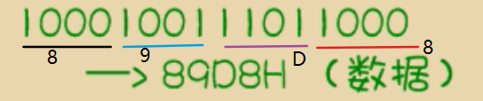

# 汇编基础

## 汇编的产生

- 机器指令：1000100111011000
- 操作：寄存器BX的内容送到AX中汇编括令：MOV AX , BX 
  - 这样的写法与人类语言接近，便于阅读和记忆

- 寄存器：简单的讲是CPU中可以存储数据的器件，一个CPU中有多个寄存器。
  - AX是其中一个寄存器的代号，BX是另一个寄存器的

## 汇编语言的组成

- 汇编语言由以下3类组成：

>1. 汇编指令（机器码的助记符）
>2. 伪指令（由编译器执行）
>3. 其它符号（由编译器识别）

- 汇编语言的核心是汇编指令，它决定了汇编语言的特性

## 存储器

- CPU是计算机的核心部件·它控制整个计等机的运作并进行运算，要想让一个CPU工作，就必须向它提供指令和数据
- 指令和数据在存储器中存放，也就是平时所说的内存
- 在一台PC机中内存的作用仅次于CPU
- 离开了内存，性能再好的CPU也无法互作。
- 磁盘不同于内存，磁盘上的数据或程序如果不读到内存中，就无法被CPU使用

## 指令和数据

- 指令和数据是应用上的概念。
- 在内存或磁盘上，指令和数据没有任何区别，都是二进制信息。二进制信息：

- 1000100111011000一>89D8H（数据）
- 1000100111011000一>MOV AX，BX（程序）

>- **是数据还是指令由我们告诉计算机**

## 存储单元

- 存储器被划分为若干个存储单元，每个存储单元从0开始顺序编号