# 计算机基本组成

>**把感应器嵌入和装备到电网、铁 路、桥梁、隧道、 公路、建筑、供水系统、大坝、 油气管道等各种 物体中，并且被普遍连接，形成所谓“物联网”， 然后将“物联网” 与现有的互联网整合起来，实现人类社会与物理 系统的整合，形 成智慧地球**

## 概论

计算机系统由软件和硬件组成

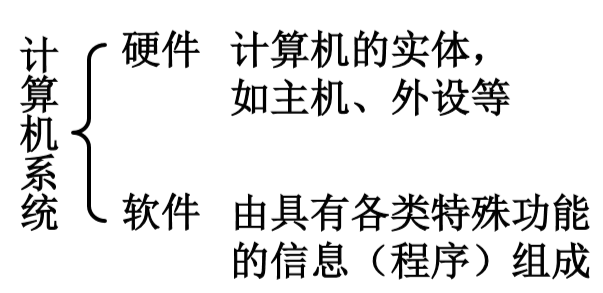

## 软件

- 系统软件：用来管理整个计算机系统
  - 语言处理程序 
  - 操作系统 
  - 服务性程序 
  - 数据库管理系统 
  - 网络软件
- 应用软件：按任务需要编制成的各种程序
- 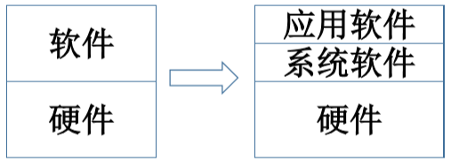

- 抽象的概念：
  - 指高级的模型，和低级的实体相对
  - 隐藏系统中不重要的细节

## 层次结构 

高级语言---------(转换)-------->汇编语言-----------(转换)-------->机器语言

- 一开始只有机器语言，全都是由0和1构成，非常不易读写；
- 于是出现了汇编语言，汇编语言是符号语言，与机器语言一一对应，也就是说一条机器语言对应一条汇编语言，两种语言可以彼此转换；
- 但是汇编语言的读写也不简单，于是出现了高级语序，例如C，C++，Java等高级程序语言

## 基本组成

- 冯·诺依曼计算机：
  1. 计算机由五大部件组成 
     - 运算器 
     - 控制器 
     - 存储器 
     - 输入设备 
     - 输出设备 
  2. 指令和数据以同等地位存于存储器，可按地址寻访  
  3. 指令和数据用二进制表示 
     - 0和1
  4. 指令由操作码和地址码组成 
     - 操作码指明了这条指令要做什么
     - 地址码指明了操作数的地址
  5. 存储程序 
     - 具有存储程序特征的机器都叫做冯·诺依曼计算机
  6. 以运算器为中心 

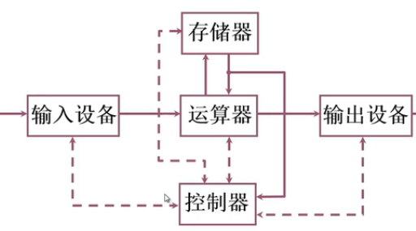

- 输入设备：把人认识的信息转化为机器能识别的形式
- 运算器：算术运算和逻辑运算
- 储存器：存放数据和程序 
- 运算器和储存器：通过运算器把数据保存到存储器中，数据的输入和输出必须经过运算器。所以说运算器是整个计算机的核心，也会成为计算机的性能瓶颈。
- 控制器：指挥控制程序的运行
- 输出设备：将结果转换成人们所熟悉的形式

## 现代计算机硬件框图 

- **ALU ：Arithmetic Logical Unit 数字逻辑单元**
- **CU ：Control Unit 控制单元**
- **CPU ：Central Processing Unit 中央处理器**

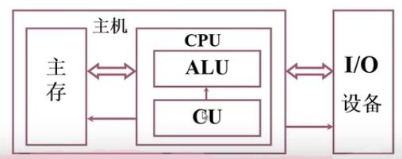

## 系统复杂性管理

- 层次化（Hierachy）：将被设计的系统 划分为多个模块或子模块 
- 模块化（Modularity）：有明确定义 （well-defined）的功能和接口 
- 规则性（regularity）：模块更容易被重用 

## 用计算机解决问题

1. 先分析确定这个问题是否能用计算机解决，若能；
2. 建立数学模型
3. 确定计算方法
4. 编制解题程序
   - 程序：运算的全部步骤
   - 指令：每一个步骤

### 例如：

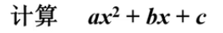

1. 取X，至运算器中的累加器中 (累加器是一个寄存器)；
2. 乘以X，在运算器中，得到X^2，这个结果保存在累加器(ACC)中；
3. 乘以a，在运算器中，结果保证在累加器里；
4. 存aX^2，在存储器中，需要一条存数指令；
5. 取b，至运算器中；
6. 乘以X，在运算器中；
7. 加aX^2，在运算器中；
8. 加c，在运算器中。

**简化指令：**

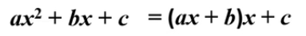

1. 取x，至运算器中 
2. 乘以a，在运算器中 
3. 加b，在运算器中 
4. 乘以x，在运算器中 
5. 加c，在运算器中 

### 指令格式

| 操作码       | 地址码     |
| ------------ | ---------- |
| 例如：000001 | 0000001000 |

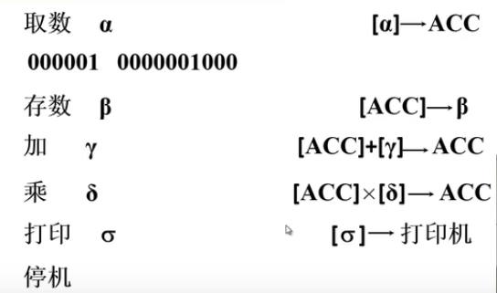

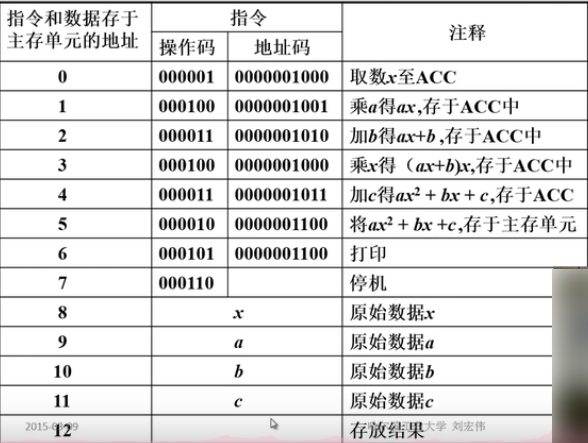

## 存储器

- 存储体—存储单元 —存储元件 （0/1）
  - **存储体：**相当与一个酒店
  - **存储单元：**相当于酒店的房间，存放一串二进制代码；每个存储单元都有一个地址号，相当于房间的门牌号
  - **存储原件（0/1）：**相当于房间里的床位 （有人/无人）
- 存储字：存储单元中二进制代码的组合，每个存储单元中保存的数据
- 存储字长：存储单元中二进制代码的位数

- MAR (Memory Address Register) ：存储器地址寄存器，反映存储单元的个数；保存了存储单元的地址或者存储单元的编号，相当于把酒店的房间号全都保存在里面。
- MDR (Memory Data Register)：存储器数据寄存器，反映存储字长；保存了要保存到存储体中的数据或者是刚刚从存储体中取出的数据。

### 例如

假设MAR是4位二进制数，MDR是8位二进制数，MAR可以从0000-1111，一共可以保存16个地址，这就说明存储体一共有16个和储存单元，而MDR是8位二进制数，所以存储字长为8

- 对存储器的读出和写入我们要用带MAR和MDR两个寄存器

## 运算器

- 功能：完成基本运算

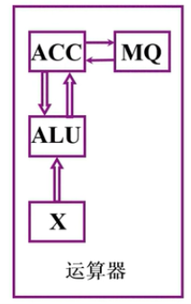

- ACC和X是两个寄存器，作为运算的输入，其中ACC也用于保存计算的结果
- MQ：像进行乘法这样操作，操作数会增加一倍，那么把增加的部分保存在MQ里面

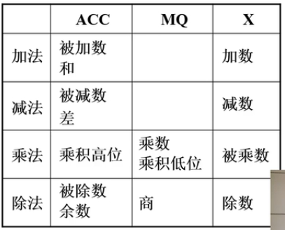

- 乘法可以利用加法或位运算的方式

- 除法可以利用减法或位运算的方式

### 加法操作过程

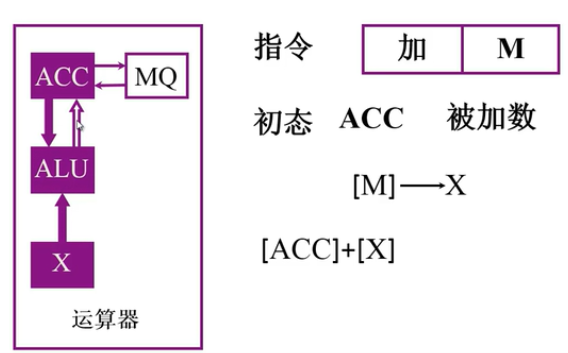

- 只涉及到了ACC和X寄存器；

- 要执行加法先要有指令，这个指令只有一个操作数，另一个操作数隐含在了ACC寄存器当中，这也说明我们在做加法操作之前先要有一条输入指令，把数据输入到ACC当中，为加法做准备；

- 初态时ACC中已经保存了被加数，指令当中的M给出来的是加数在内存单元中的地址。要想完成这个加法，需要把加数从给定的内存单元中取出并保存到X寄存器中。

**因此：**

1. 执行这个加法操作的第一步就是把内存单元M中的数据送到X这个寄存器里，此时两个操作数都已经被放入了寄存器；
2. 由ALU来执行加法操作，加法操作的结果保存在ACC当中；
3. 注：在加法操作中没有用到MQ寄存器。

### 减法操作过程

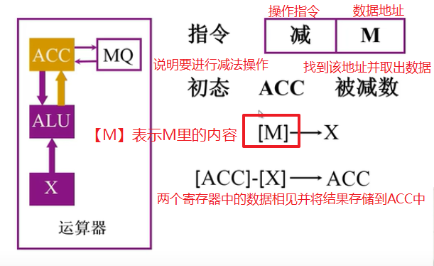

### 乘法操作过程

- 本质是通过累加或移位的方式来实现的
- 乘数从内存单元M中取出来放入MQ寄存器

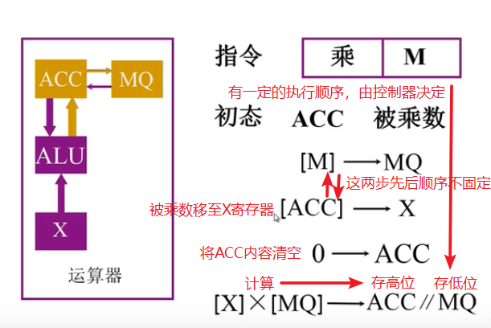

### 除法操作过程

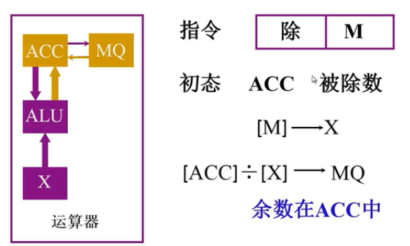

1. 先用一条取数指令将被除数从内存单元M中取出来放入到ACC；

2. 除数按照规定从内存单元中被传输到X寄存器，传输在控制器的控制下完成；

3. 做除法操作。商保存在MQ寄存器中，余数保存在ACC中；

- 在乘法中MQ保存乘数，在除法中保存商，所以MQ也叫做乘-商寄存器
- MQ（Memory Quotient)

## 控制器

1. 解释指令：从取址到分析，到取操作数，到真正的去执行指令，一直到保存结果，这样的一个全过程，都是由控制器来完成的；
2. 保证指令有序的执行；

### 控制器的基本组成

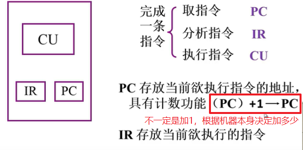

- 取指令：把内存单元中的指令取出来送入到控制器当中；

- 分析指令：把操作码部分送给控制单元进行分析；

- 执行指令：由控制单元控制相应的执行部件去完成这条指令需要进行的操作；

>- **PC：程序数器的缩写，保存了当前要执行的指令的地址，取值就是从PC开始，把要执行的指令取出放入IR中，之后PC自动调整它的值，指向下一条它要执行的指令**
>
>- **IR：指令寄存器的缩写，存放当前要执行的的指令。控制单元可以从IR中把操作码取出来进行分析**
>
>- **CU：控制单元**

## 总结

- 运算器、控制器、存储器构成了计算机的主机

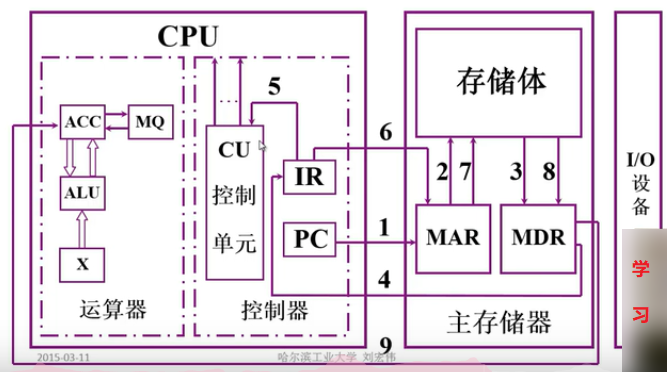

### 主机完成一条指令的过程：以取数指令为例

总的分成三个阶段：

- 取指令

- 分析指令

- 执行指令

#### 取指令

1. PC把指令的地址送给MAR；
2. 再由MAR送给存储体；
3. 在控制器的控制下，存储体把指令存储单元中保存的那条取数指令把数取出来送入到MDR中；
4. 此时指令已经存在MDR中了。现在把指令取出放入IR中保存。

#### 分析指令

5. 把IR指令寄存器中保存的操作码部分送给CU，经过译码之后CU会发出多条信号去控制相应的执行部件去执行指令要求的各种操作。

>**由于我们发出的取数指令，所以会把保存在内存单元中的那个数据取出放入ACC寄存器中，为了完成这个操作，在控制器的控制之下，我们要把指令中的地址部分送给存储器以便我们把数据从存储体中取出来。**

#### 执行指令

6. 这个操作还是从IR开始，因为IR保存了当前的这条指令，同时也保存了当前这条指令操作数的地址。从IR的地址码中把地址取出放入MAR;
7. 再由MAR把这个地址送给存储体;
8. 在控制器的控制之下从存储体中把取数指令要取的数取出来存入到MDR;
9. 然后把它送入ACC寄存器。这样就完成了取数的操作。

### 主机完成一条指令的过程：以存数指令为例

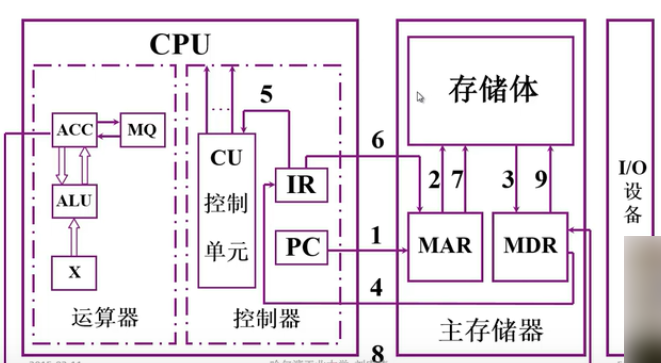

### 例子

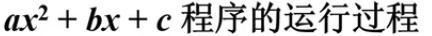

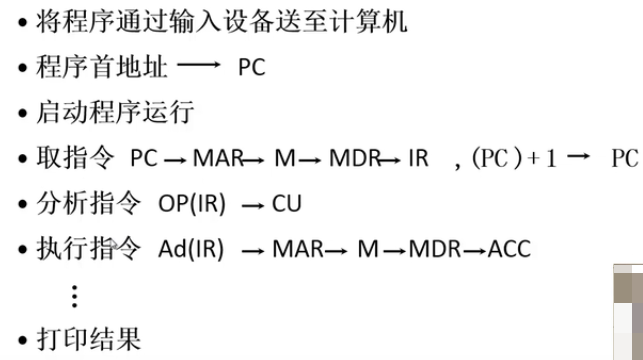

## 练习

- 什么是机器字长、指令字长、存储字长、数据字长？
  1. 机器字长：CPU一次能处理数据的位数，通常与CPU的寄存器位数有关。
  2. 存储字长：存储器中一个存储单元(存储地址)所存储的二进制代码的位数，即存储器中的MDR的位数。
  3. 指令字长：计算机指令字的位数。
  4. 数据字长：计算机数据存储所占用的位数。

## 补充1

>计算机中的信息用二进制表示，常用的单位有位、字节和字。
>
>1. 位（bit）：是计算机中最小的数据单位，存放一位二进制数，即0或1。它也是存储器存储信息的最小单位，通常用“b”来表示。
>2. 字节（Byte）：字节是计算机中表示存储容量的最常用的基本单位。一个字节由8位二进制数组成，通常用“B”表示。一个字符占一个字节，一个汉字占两个字节。其它常见的存储单位有：
>
>- 存储容量的计量单位有字节B、千字节KB、兆字节MB以及十亿字节GB等。它们之间的换算关系如下：
>- 1KB (Kilobyte 千字节) = 1024B = 2^10B
> - 1MB (Megabyte 兆字节 简称“兆”) = 1024KB = 2^20
> - 1GB (Gigabyte 吉字节 又称“千兆”) = 1024MB = 2^30
> - 1TB (Trillionbyte 万亿字节 太字节) = 1024GB = 2^40
>
>3. 字（Word）与字长：字是指在计算机中作为一个整体被存取、传送、处理的一组二进制数。一个字的位数（即字长）是计算机系统结构中的一个重要特性。字长是由CPU的类型所决定，不同的计算机系统的字长是不同的，常见的有8位、16位、32位、64位等，字长越长，计算机一次处理的信息位就越多，精度就越高，字长是计算机性能的一个重要指标，目前主流微机正在由32位机向64位机转变。
>
>-  注意字与字长的区别，字是单位，而字长是指标。
>- 机器的字长会影响机器的运算速度。倘若CPU字长较短，又要运算位数较多的数据，那么需要经过两次或多次的运算才能完成，这样势必影响整机的运行速度。
>- 机器的字长对硬件的造价也有较大的影响。它将直接影响加法器（或ALU），数据总线以及存储字长的位数。所以机器字长的确不能单从精度和数的表示范围来考虑。
>- 为了适应不同的要求及协调运算精度和硬件造价间的关系，大多数计算机均支持变字长运算，即机内可实现半字长、全字长（或单字长）和双倍字长运算。

## 补充2

>- 说起存储容量单位，大家很自然的会想起自己的硬盘有多少GB、内存有多少MB，我们知道了字节(B)是电脑中表示信息含义的最小单位，通常情况下一个ACSII码就是一个字节的空间来存放。而事实上电脑中还有比字节更小的单位，因为一个字节是由八个二进制位组成的，换一句话说，每个二进制位所占的空间才是电脑中最小的单位，我们把它称为位，也称比特（bit）。由此可见，一个字节等于八位。人们之所以把字节称为电脑中表示信息含义的最小单位，是因为一位并不能表示我们现实生活中的一个相对完整的信息。
>
>- 有的时候，为了简写，我们会把位的单位缩写成b，这个时候大家一定会有疑问了，因为字节的单位我们用B表示，两者不就是一样了吗?其实，字节的表示单位B是Byte的缩写，位的表示单位b是bit的缩写，1b与1B之间只要大小写不同，那么表示的含义也不同，因为8b才等于1B。
>
>- 大家可能会有疑问，位它到底有什么用呢？一般来说，我们讲到存储设备时，都是按照字节进行换算，例如1GB=1024MB=1024*1024KB。但是在网络传输之中，数据传输则是按照位进行传输的。这就可以解释为什么自己家里的宽带ADSL是1Mb的带宽，但是下载数据却只能在100KB左右徘徊。因为1Mb=1024Kb，由于字节与位之间的关系是八倍，因此将1024Kb除以8就得到128KB。由此可见，实现上网络传输带宽中的1M只等于电脑中的128KB。这样加上信号的衰减，一般只能保持在100KB左右。
>
>- 相同的道理，我们的网卡一般都是100M的，但是为什么传输速度达不到这么高呢？因为100Mb，将其除以8得到12.5MB，这就是我们网卡能够达到的最高速度了。

## 换算进率

>- 解释一下为什么计算机储存单位的进率是1024而不是1000。
>
>- 目前计算机都是二进制的，让它们计算单位，只有2的整数幂时才能非常方便计算机计算，因为电脑内部的电路工作有高电平和低电平两种状态.所以就用二进制来表示信号，(控制信号和数据)，以便计算机识别。而人习惯于使用10进制，所以存储器厂商们才用1000作进率。这样导致的后果就是实际容量要比标称容量少，不过这是合法的。1024是2的10次方，因为如果取大了，不接近10的整数次方，不方便人们计算；取小了，进率太低，单位要更多才能满足需求，所以取2的10次方正好。
>
>- 计算实例：标称100GB的硬盘，其实际容量为100×1000×1000×1000字节/1024×1024×1024≈93.1GB
>
>- 可见产品容量缩水只要满足计算的实际容量结果（上下误差应该在10%内），你买的就是正品，没被骗。

## 带宽存储换算

>在我们的记忆中，我们恐怕最熟悉的就是当初用Modem接入互联网时，接入的速度仅仅为56Kbps。在这个单位中，bps是bit Per Second的缩写，翻译成中文就是比特位每秒，也就是表示一秒钟传输多少位（bit）的意思。Kb与KB之间的关系：我们在电脑原理中知道，电脑的最小存储单位是字节Byte，一个字节，是由八位二进制位组成的。由此，我们可以这样认为，一个字节是由8个位组成的，或者说一个字节与八个位所占的空间是相同的。因为，当我们使用100Mb带宽的网络下载时，理论上的速度应该是100除以8等于12.5MB。

## 10M宽带非10M

>- 这个问题究其重点还是缘由自对bit和Byte的错误理解。
>
>- 我们常说的10M带宽，其实就是10Mbps，而bps是bits per second的缩写，意思是每秒传输的位数。我们默认的理解：10M就是10MB/s,B/s这个单位是Byte/s的缩写，意思是每秒传输的Byte数。而实际上1Byte=8bit,所以说10M带宽也就是1.25Mb/s。所以说,其实我们是在这个字母b上有误解。
>- Bit一般与传输速度有关，而byte一般是指存储容量。
>  - 举例：usb2.0传输速度可以达到480Mbps，这里的b指的是比特，换算过来也就是60MB/s(这是理论值，实际不超过30MB/s，因为它会受到系统环境，如cpu/磁盘的制约）
>- 我的U盘容量是16GB，这里的B是指的Byte。

