# 输入输出系统

没有丰富多彩的外部设备就没有计算机在各个领域的大规模的应用

## 输入输出系统的发展概况

1. 早期：分散连接
   - 每个设备都有专门的控制线路，这些控制电路甚至和CPU的线路混在一起，所以对外部设备的增加和删除都非常难。当时外部设备的数量非常少，计算机的数量也非常少，这种设计还是能够满足需求的。
   - CPU 和 I/O设备串行工作程序查询方式 
2. 接口模块和DMA 阶段 ：总线连接 
   - CPU和 I/O设备并行工作
     - 中断方式 
     - DMA方式 
3. 具有通道结构的阶段 
4. 具有 I/O 处理机的阶段 

## 输入输出系统的组成 

1. I/O 软件 
   - I/O 指令 ：CPU 指令的一部分 
     - IO指令的格式：操作码 命令码 设备码 
   - 通道指令：通道自身的指令 
     - 指出数组的首地址、传送字数、操作命令 
     - 如 IBM/370 通道指令为 64 位 

>通道是一种小型的DMA处理机，能够实现IO设备和主机之间直接进行信息传送。通道有自己的控制器，有的通道还有自己的存储器，通道能够执行由通道指令组成的通道程序。

2. I/O 硬件 
   - 设备 I/O 接口 
   - 设备 设备控制器 通道

## I/O 设备与主机的联系方式 

- I/O 设备编址方式 
  1. 统一编址：把IO设备看做是内存地址的一部分 
     - 用取数、存数指令
  2. 不统一编址 / 单独编址：在内存地址空间之外专门设计一个地址空间
     -  有专门的 I/O 指令 
- 设备选址：用设备选择电路识别是否被选中 
- 传送方式 
  1. 串行 
  2. 并行 

## 联络方式

- 外部设备接收或发送信号的响应方式

1. 立即响应：对一些结构简单的设备，数量也比较少，接收或者是输入出去的话可以直接进行显示
   - 如LED灯
2. 异步工作采用应答信号 

3. 同步工作采用同步时标

## I/O 设备与主机的连接方式

1. 辐射式连接：实际就是分散连接，增加一个IO设备就需要在主机中增加一套控制电路对IO设备进行控制

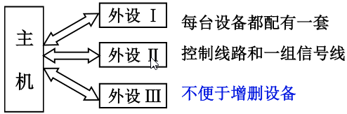

>随着计算机的发展，外部设备越来越多，如果采用这种方式，每个设备都给它配一套信号线，会遭成主机系统增加或删除设备都非常麻烦。另外，为一台主机系统设计的设备要拿到另一台机器上使用的可移植性非常弱

2. 总线连接 ：外部设备和IO设备通过接口进行连接，接口能够向外部设备传输主机的控制命令。可以向主机传输外部设备状态信息，同样接口还可以完成数据传送。外部设备的输入数据可以先缓存到接口中，完成对数据的格式转换操作，然后再数据到主机。或者从主机传出数据到外部设备。遵循一样的操作。
   - 便于增删设备 

## I/O设备与主机信息传送的控制方式 

1. 程序查询方式 
   - CPU和外部设备是采用串行方式进行工作的
2. 程序中断方式 
   - CPU实现了和IO设备的部分并行工作。即在IO设备进行数据准备的时候CPU还可以执行自己的程序
3. DMA方式 
   - 进一步的把CPU从输入输出的工作中解放出来，使外部设备和内存之间可以建立直接的连接。由DMA控制器或DMA接口直接控制外部设备和内存之间进行的数据交换

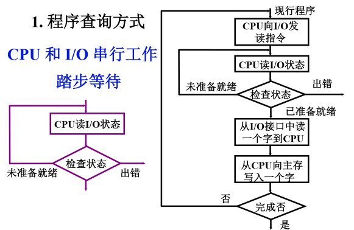

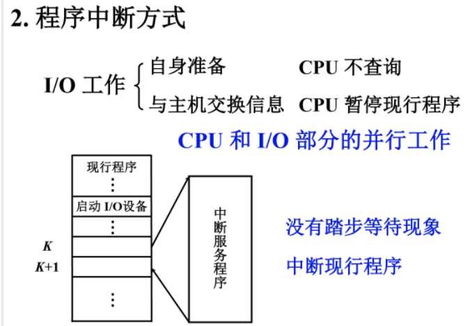

- 程序中断方式流程 

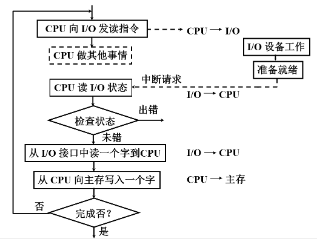

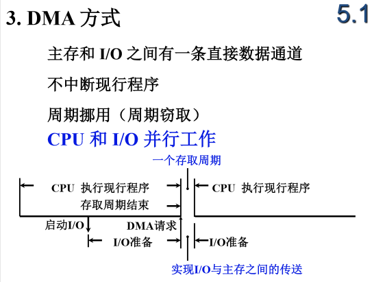

- 三种方式的 CPU 工作效率比较

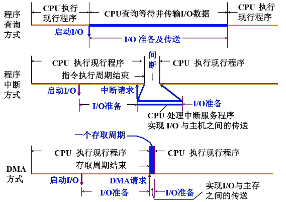

- 程序查询方式 —> 程序中断方式  —> DMA 方式 
  - I/O 系统 的自治能力越来越强 

## 程序查询方式

### 程序查询方式的流程

- 如果在传输的过程中只有一个设备参与内存和IO之间设备传输，在执行程序的过程中，CPU会执行到一个输入输出指令，由这个输入输出指令发出启动设备的命令，相应的设备接收到这个命令以后就开始进行数据准备，准备好后就传输给CPU，CPU在发出设备启动命令之后就开始检查状态标记，看IO接口中的数据是否已经准备好进行输入输出。如果准备就绪就进行数据交换，如果没有准备就绪CPU就处于一种"踏步状态"，通过循环的方式检查状态标记，直到设备准备好开始交换数据为止。在这个过程中我们要执行3条指令。

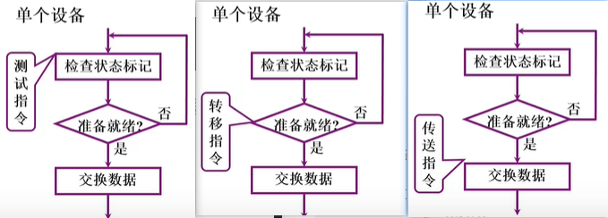

- 多个设备：都要通过程序查询方式和CPU进行数据交换，都要通过程序查询方式和内存进行数据交换。我们需要把参与传输的设备根据他的优先级，根据轻重缓急进行排序。优先级越高的设备被查询的时间就越早。

  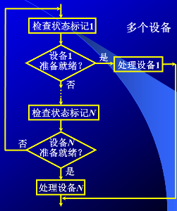

- 设备1的优先级最高最先被检查，CPU检查设备1已经准备就绪就处理设备1和内存间的信息交换，如果没有准备就绪CPU就检查次优先级的设备2，以此类推逐步向后检查完成数据的输入输出。

#### 程序流程

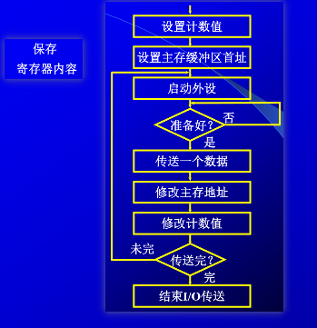

1. 先保存寄存器的内容，因为程序查询方式要完成内存和外部设备之间数据的输入输出需要借助CPU的某一个寄存器对数据进行暂存，如果这个寄存器中的数据是有用的，那么我们要对这个寄存器中的数据进行保存。可以把它写入到某一个内存单元中，压入堆栈中或者放到CPU里其他闲置的寄存器中保存。
2. 设置计数器的值：为了控制我们传输的数据量，内存和IO之间进行数据传输到底传输多大量的数据。
   - 如果传输n个字符：有两种方式
     1. 计数器的值就设置成n。每完成一个字的传输就把计数器的值减1，直到完成数据的传输。
     2. 把计数器的值就设置成 -n，并且这个负数我们用补码来表示，每完成一个字的传输就把计数器的值加1，直到计数器发生溢出，计数器当中的值变为0，则完成数据的传输。
3. 设置主存缓冲区首址：为了完成内存和IO之间进行数据传输，我们要知道内存块的起始地址，所以要设置主存缓冲区首址。我们保存或读取数据就从这个缓冲区的起始地址开始。
4. 启动外设：让外部设备进行准备和数据传输。
5. 准备好？：CPU开始查询IO接口的状态是否准备好。如果没有准备好CPU就会通过"原地踏步"的方式进行反复查询。一直到转态标记信号表明已经准备好了这个查询操作才会停止。
6. 传送一个数据：传送一个字，这个字传送完后前面设备的初始值要进行修改。
7. 修改主存地址：加1或者减1。为输入或输出下一个数据做准备。
8. 修改计数器值：表明我们还有多少数据需要进行传输。
9. 传输完？：判断数据是否已经传输完。如果没有没有则CPU再次启动外设进行循环，直到数据传输完就结束IO传送

## 程序中断方式

- 中断的概念：中断是指CPU在执行程序的过程中如果发生意外事件或特殊事件，CPU要中断当前程序的执行转而去处理这个特殊事件或者是异常事件。通过执行中断服务程序的方式来进行处理，处理结束之后要返回到被中断程序的断点，继续去执行原来的程序。这个过程就叫做中断。

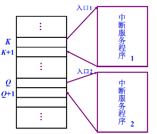

- CPU执行主程序，假设执行到第K条指令，某一个外部设备要向内存输入数据。外部设备就会通过中断请求线向CPU发出中断请求，CPU执行第K条指令结束的时候它就会去查询是否有中断请求，如果有，是否可以响应，如果可以响应，CPU就要中断现行程序的执行。
  - 保存中断程序的断点
  - 保存中断现场。有些寄存器的当前值
- 中断服务程序执行结束，根据保存的程序的断点就会回到第K+1条指令，向下执行，在执行程序的过程中如果执行到了第Q条指令外部设备又发出了中断请求继续向之前一样进行处理。

### IO中断的产生

- 什么是中断源：在主机的外部或内部，在CPU的外部或内部能够引发CPU发生中断的因素都叫做中断源。中断就是中断源产生。

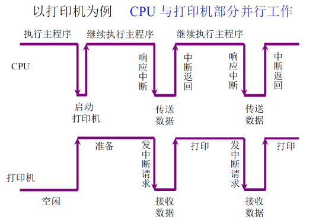

- CPU在执行主程序的过程中打印机在执行输出操作进行打印，打印机一旦要进行打印，CPU主程序中假如有一条打印命令，CPU通过打印命令来启动打印机。打印机开始进行打印前的准备，CPU继续执行原来的程序。打印机准备好后可以进行接收数据，可以进行打印。打印机会向CPU发出一个中断请求，CPU响应这个中断请求执行一个中断服务程序向打印机传输数据，打印机再接收数据，传送和接收这个过程结束后CPU中断返回继续执行原来的主程序，打印机把接收到的数据对外进行打印，打印结束后打印机的缓冲区空了，还可以继续接收新的数据，打印机就会向CPU再次发动中断请求，CPU响应这个中断请求，CPU和打印机之间再次进行数据交换，交换结束CPU继续执行原来的程序，打印机执行打印操作。
- 很多执行过程中打印机的工作和CPU的工作是并行的：
  - 如数据的准备阶段

### 程序中断方式的接口电路

1. 配置中断请求触发器和中断屏蔽触发器：
   - 由外部设备对中断请求标志进行设置，表示有中断请求。这个中断请求标志能否变成中断请求信号向CPU发出中断请求还要看这个中断请求标志是否会被屏蔽掉。
   - 中断屏蔽触发器：有时候计算机正在执行的程序或者正在执行的中断服务程序它的重要性要比当前设备提出的中断请求的重要性高，那么这个设备的中断请求信号就会被屏蔽。
2. 排队器：在同一个时刻，像CPU发出中断请求的可能有多个设备，这些设备的优先级是不一样的，如高速设备的优先级要高一点，若不及时响应高速设备中保存的数据就可能丢失。所以需要一个排队器来确定这些设备中的优先级最高的是哪一个设备。
3. 中断向量地址形成部件：如果要响应中断服务程序，CPU必须要知道中断服务程序的入口地址。
4. 程序中断方式接口电路的基本组成

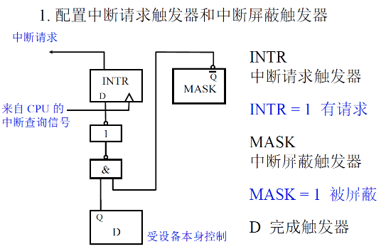

### IO中断处理过程

##### 1. CPU 响应中断的条件和时间 

1. 条件
   - 允许中断触发器 EINT = 1，否则为0；
   - 用 开中断 指令将 EINT 置 “1” ；
   - 用 关中断 指令将 EINT 置“ 0” 或硬件自动复位；
2. 时间
   - 当 D = 1（随机）且 MASK = 0 时；
     - 外部设备提出中断的时间是随机的，只要外部设备准备好了，接口就可能向CPU发出中断请求，但是CPU不能随时响应中断
   - 在一般机器的设计中都是在每条指令执行阶段的结束时，CPU 查询是否有中断请求，进行中断响应。通过查询信号，把每一个接口中有中断请求的那些接口的中断请求触发器置为1（将 INTR 置“1”）

##### 2. I/O 中断处理过程

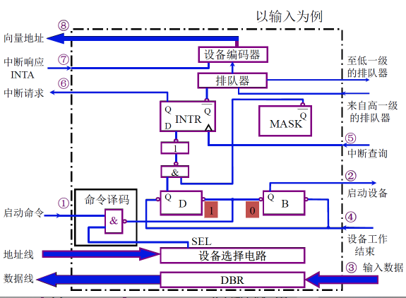

### 中断服务程序流程 

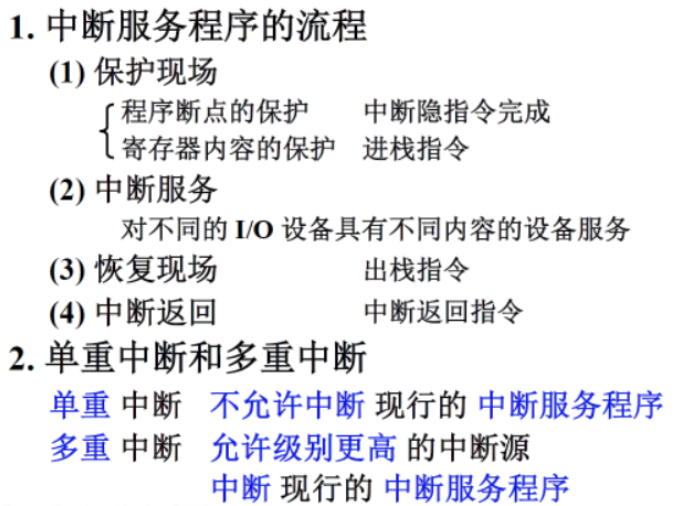

- 单重中断：CPU在执行中断服务程序的过程中，如果有了新的中断请求，不论其优先级有多高都不能中断现行的中断服务程序。
- 多重中断  / 中断嵌套：在中断服务程序执行过程中运行级别更高的中断源中断现行的中断程序。
  - CPU当前执行的程序就是一个中断服务程序，但是在执行中断服务程序当中来了优先级更高的中断服务请求，允许当前正在执行的中断服务程序再次被中断掉，CPU去处理更紧急的服务。

 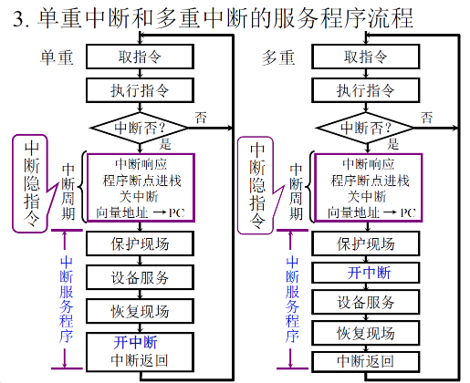

- 中断周期：是在一条指令解释的几个阶段当中的一个阶段。如，把一条指令的解释过程分成取指令、形成操作数的地址、取操作数、执行，执行之后就是中断周期。
- 中断隐指令并不是一条指令，但是也需要完成一系列的操作。
- 保护现场：在中断服务程序中我们要用到的那些寄存器的值我们要把它保存起来。可以压入到堆栈当中。
- 恢复现场：一系列的出栈指令。

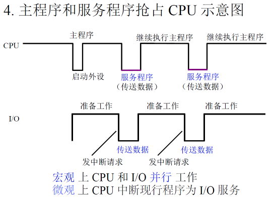

## DMA方式

- DMA(Direct Memory Access)：直接存储器访问

### 1.DMA方式的特点

- DMA和程序中断、程序查询两种方式的数据通路
  - 程序中断、程序查询两种方式的数据通路是相同的
  - 程序中断、程序查询两种方式即使做的是内存与外部设备之间进行信息交换，这个信息也要先进过CPU进行缓冲，再由CPU进行转存

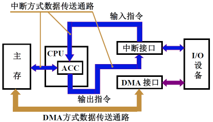

- DMA进一步的把CPU从数据传送这个过程中解放出来，进一步实现了数据传输的独立性
- 外部设备和内存之间可以通过DMA接口直接进行传送而不需要CPU进行转存

### 2.DMA与主存交换数据的三种方式

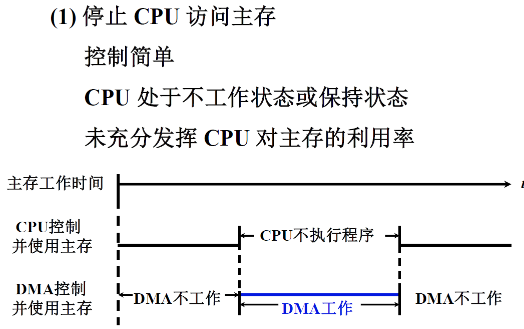

- 只要外部设备要和内存进行数据交换，在一块数据交换的过程中，从第一个数据开始，CPU就放弃了对总线的控制权，放弃了对内存的访问。总线的控制权和内存的访问权交给DMA接口。
  - 控制简单，适合大量的数据进行传输
  - 如果在CPU的指令缓冲器中有指令或者指令已经被取入到了Cache,CPU还可以继续工作，继续执行指令，只要执行指令的过程中不访问存储器即可。如果没有指令可以执行，CPU就保持当前的状态
  - 即使是一块数据进行传输，数据也是一个字一个字的在主存和外部设备之间进行传输，传输的间隔可能会比较大，这个时间会超过一个存储周期。在传输间隔这段时间里面，虽然DMA接口没有之间使用主存，它依然占用主存的访问权，CPU不能利用这段时间进行数据传输或访问主存。这就降低了CPU对主存的利用率

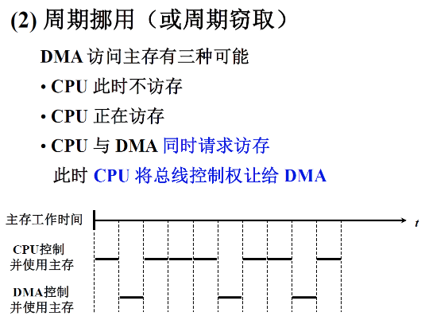

- 这里的周期指的是访存周期。如果DMA接口准备好了数据传输，那么它就申请建立总线的使用权。占用一个或几个内存访问周期进行数据的传输，在数据的传输间隔或DMA的准备阶段，DMA接口放弃对内存的使用权，放弃对总线的占用
- CPU正在访存：DMA只能等，不能进行强占

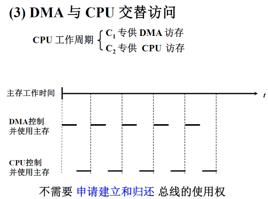

- 实用性不强
- 由于在固定的时间点存储器和IO总线它的使用权是固定的，就不需要DMA提出DMA申请，建立对总线的控制权和对内存的使用权。所以速度比较快。

### 3.DMA的工作过程

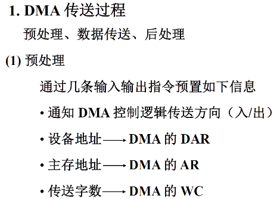

- 预处理：在数据进行传输之间进行相应的设置

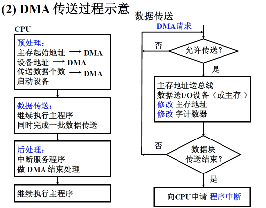

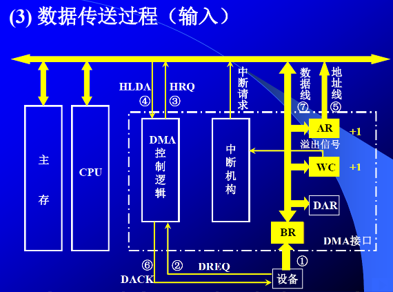

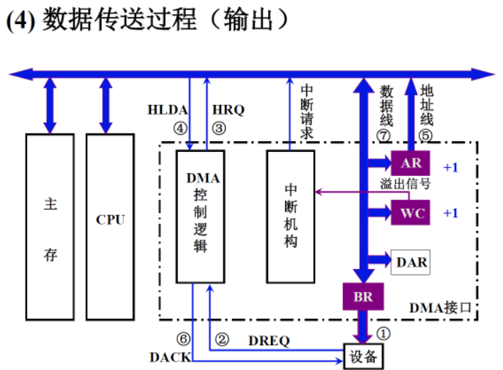

### 4.DMA接口与系统的连接方式

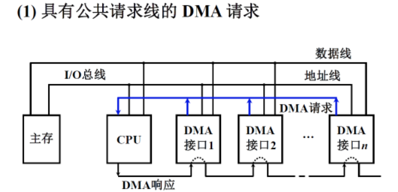

- CPU通过查询先对DMA接口一个一个的进行查询，越靠近CPU的优先级越高

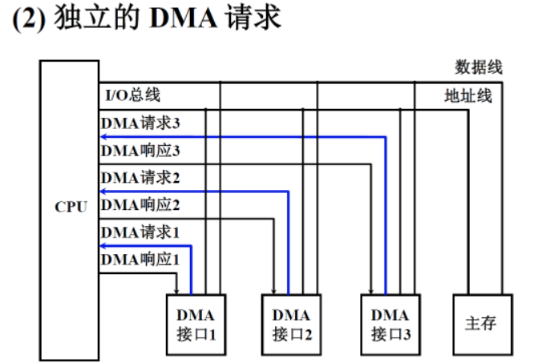

- 每一个接口都有独立的DMA请求信号和DMA响应信号

### 5.DMA 方式与程序中断方式的比较

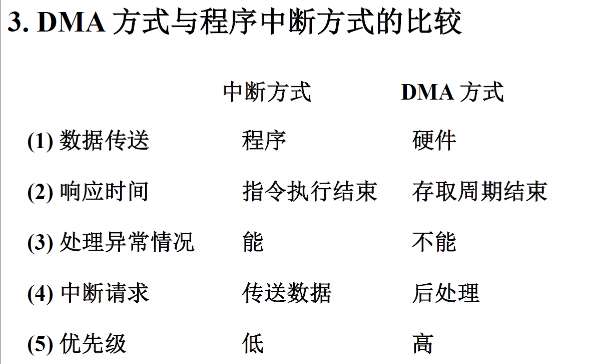

- 对于数据传送：中断方式需要CPU的参与，DMA不需要
- DMA是外部设备和主存直接进行数据交换
- 中断请求：中断方式通过中断请求执行中断服务程序来完成数据的传输。DMA方式后处理，它运行的中断主要是为了检查数据是否有错，还需不需要DMA进行传输，传输过程是否有错
- DMA方式通常连接的都是高速设备，所以DMA方式在IO和内存进行数据传输的方式下优先级会更高

## 练习

>1. I/O设备有哪些编址方式，各有何特点？

常用的I/0编址方式有两种：I/0与内存统一编址和I/0独立编址

- I/0与内存统一编址方式的I/0地址采用与主存单元地址完全一样的格式，I/0设备与主存占用同一个地址空间，CPU可像访问主存一样访问I/0设备，不需要安排专门的I/0指令。
- I/0独立编址方式时机器为I/0设备专门安排一套完全不同于主存地址格式的地址编码，此时I/0地址与主存地址是两个独立的空间，CPU需要通过专门的I/0指令来访问I/0地址空间。

>2. I/O设备与主机交换信息时，共有哪几种控制方式？简述它们的特点。

- 程序直接控制方式：也称查询方式，采用该方式，数据在CPU和外设间的传送完全靠计算机程序控制，CPU的操作和外围设备操作同步，硬件结构简单，但由于外部设备动作慢，浪费CPU时间多，系统效率低。
- 程序中断方式：外设备准备就绪后中断方式猪肚通知CPU，在CPU相应I/0设备的中断请求后，在暂停现行程序的执行，转为I/0设备服务可明显提高CPU的利用率，在一定程度上实现了主机和I/0设备的并行工作，但硬件结构负载，服务开销时间大
- DMA方式与中断方式一样，实现了主机和I/0设备的并行工作，由于DMA方式直接依靠硬件实现贮存与I/0设备之间的数据传送，传送期间不需要CPU程序干预，CPU可继续执行原来的程序，因此CPU利用率和系统效率比中断方式更高，但DMA方式的硬件结构更为复杂。

>3. 简述I/O接口的功能和基本组成。

- I/0接口功能
  1. 选址功能
  2. 传送指令功能
  3. 传送数据功能
  4. 反映I/0设备工作状态的功能
- I/0接口基本组成
  - 设备选择电路、命令寄存器和命令译码器、数据缓冲寄存器、设备状态标记触发器

>4. 说明中断向量地址和入口地址的区别和联系。

- 中断向量地址和入口地址的区别
  - 向量地址是硬件电路（向量编码器）产生的中断源的内存地址编号，中断入口地址是中断服务程序的首地址。
- 中断向量地址和入口地址的联系
  - 中断向量地址可理解为中断服务程序入口地址指示器（入口地址的地址），通过它访存可获得中断服务程序入口地址。（两种方法：在向量地址所指单元内放一条JUM指令；主存中设向量地址表。

>5. 比较単重中断和多重中断服务程序的处理流程，说明它们不同的原因。

- 单重中断：开中断指令设置在最后“中断返回”之前，意味着在整个中断服务处理过程中，不能再响应其他中断源的请求。
- 多重中断：开中断指令设置在“保护现场”之后，意味着保护现场之后，若有更高级别的中断请求，CPU也可以响应，即再次中断现行的服务程序，转至新的中断服务程序，这是单重中断和多重中断的主要区别。

>6. DMA方式有何特点？

- 由于主存和DMA接口之间有一条数据通路，因此主存和设备交换信息是，不通过CPU，也不需要CPU暂停现行程序为设备服务，省去了保护和恢复现场，因此工作速度比程序中断方式的高。

>7. 从5个方面比较程序中断方式和DMA方式的区别。

1. 程序中断方式的数据传送主要依赖软件，DMA主要依赖硬件。
2. 程序中断传送数据的基本单位为字或字节，DMA为数据块。
3. 程序中断方式时，CPU与I/0设备并行工作，现行程序与I/0传送串行进行；DMA方式时，CPU与I/0设备并行工作，现行程序与I/0传送并行进行。
4. 程序中断方式由于软件额外开销时间比较大，因此传输速度最慢；DMA方式基本由硬件实现传送，因此速度最快；
5. 程序中断方式适用于中、低速设备的I/0交换；DMA方式适用于高速设备的I/0交换；