# CPU的结构和功能

- 高级语言编写的程序必须经过编译程序和汇编程序的编译和汇编以后变成由机器语言构成的程序才能在计算机的硬件上执行
- 指令系统是计算机的软硬件交界面最重要的组成部分，由机器指令构成的机器语言程序要在计算机硬件上执行，每一条指令要由CPU从内存中取出分析、执行，并进行结果的写回

## 1.CPU的结构

> 先了解CPU的功能，然后再了解什么样的结构可以为CPU提供相应的功能

### CPU的功能

>CPU由控制器和运算器构组成

1. 控制器的功能
   - 取指令：把指令从内存单元中取出来
   - 分析指令：对指令的操作码部分进行解码，分析这条指令要完成什么功能，是指令集中的哪一条指令
   - 执行指令，发出各种操作命令：由这些操作命令去控制相应的部件去完成指令要求的操作，这些命令含有一定的先后顺序
   - 控制程序的输入和结果的输出
   - 总线管理：对总线的控制权和使用权进行管理
   - 处理异常情况和特殊请求
2. 运算器的功能
   - 实现算术运算和逻辑运算
3. 功能总结
   - 指令控制
   - 操作控制
   - 时间控制
   - 处理中断
   - 数据加工

### CPU的结构框图

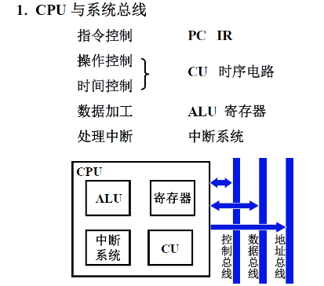

- CPU通过总线和计算机系统的其他部分进行通讯
  - 包括控制总线、数据总线和地址总线
  - 控制总线是双向的，由CPU向各个部件发出的控制命令；外部设备可以向CPU提出请求或者是外部设备的状态
  - 数据总线是双向的，CPU向外部设备或者是存储器写入数据，也可读入数据
  - 地址线是单向的，都是由CPU发出送给内存或者是外部设备的接口

- PC指出了要取出的指令的地址
- IR是指令寄存器，从内存单元中取出的指令被放入CPU内部的IR寄存器中
- CU：控制单元，由控制单元进行译码，译码后在给定的时刻给出给定的操作命令
- ALU：完成数据的加减乘除操作，包括算术运算和逻辑运算
- 寄存器：在运算过程中使用，如两个操作数可能都保存在寄存器中，运算的结果也需要输出到寄存器中
- 中断系统：处理中断服务程序

### CPU的寄存器

>不同的CPU，不同的指令集结构对CPU的寄存器的设置要求是不一样的

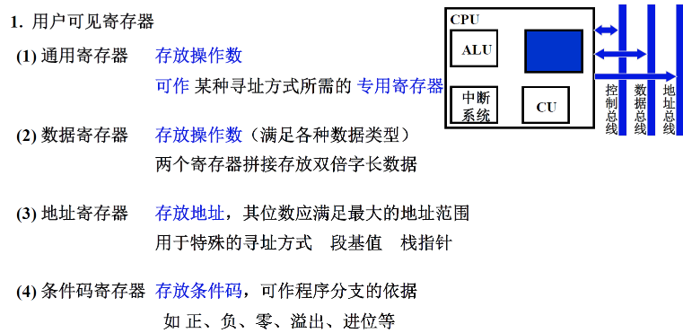

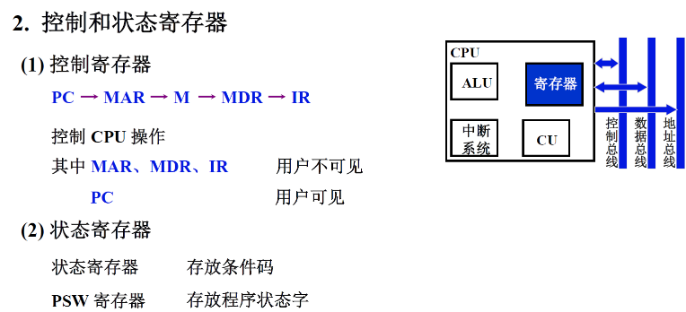

- 要从计算机的内存中取出一条指令
  - 从PC开始，PC把指令地址送给MAR(主存地址寄存器)，然后MAR再把它包含的地址传给M(主存储器)，并且控制单元发出读命令，读出的指令被放到MDR(主存数据寄存器)中，进一步放到IR中

- 状态寄存器：反映了指令执行结果的情况或者是计算机的软件、硬件状态

## 2.指令周期

- 控制单元要完成指令解释的全部过程

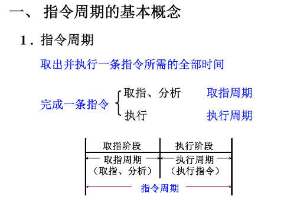

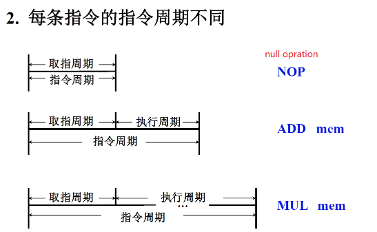

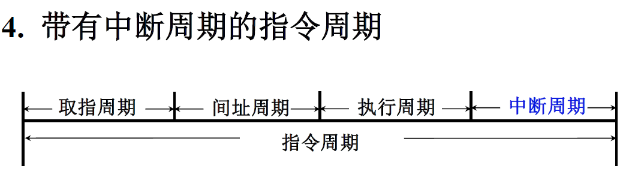

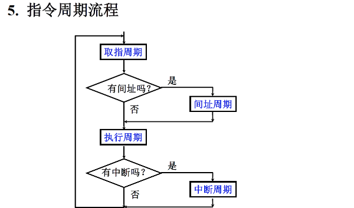

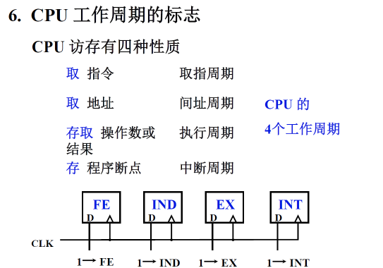

## 3.指令流水

- 流水线技术是现代处理器中最常用的，也是最有效的提高指令解释速度的方法

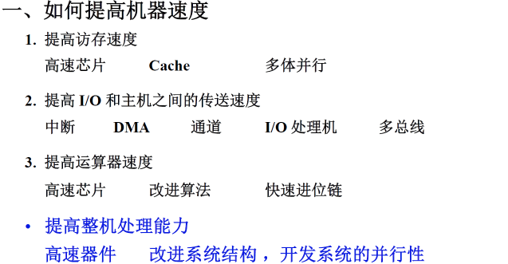

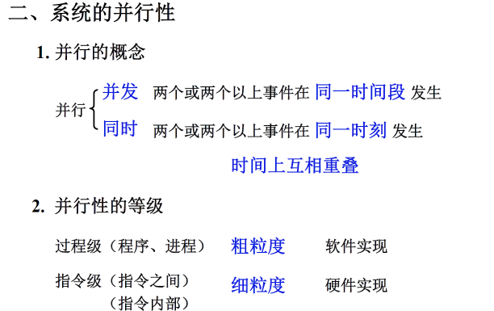

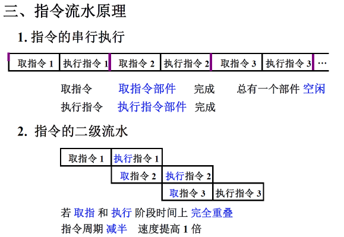

## 4.中断系统

- 中断系统的作用不仅仅是用在输入输出上面，它的应用非常广泛，可以用于程序调试或者是计算机系统中发送异常事件

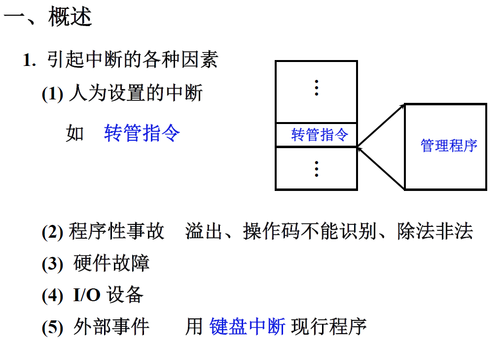

### 1.各中断源如何向 CPU 提出请求 

- 给每个中断源设置一个触发器，用这个触发器来标记这个中断源是否提出了中断请求

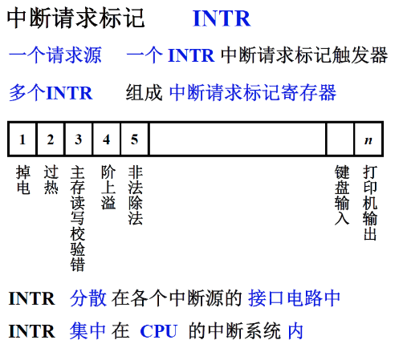

### 2.各中断源同时提出请求 怎么办 

- 响应对系统影响最大，最重要的那个中断源
- 根据中断源的优先级进行分级

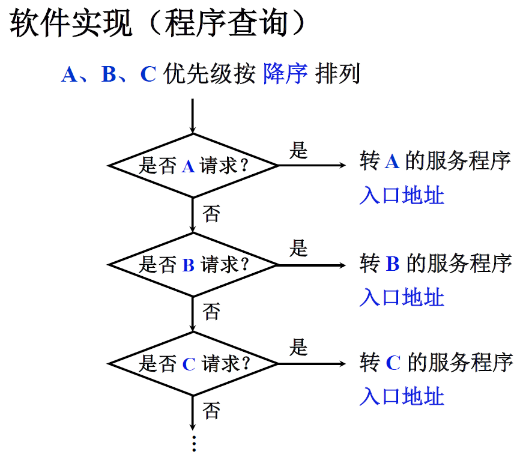

### 3.如何寻找入口地址 

- 第一种方法：硬件向量法。在排队输出的过程中，只有一根线是高电平，其他的都是低电平，高优先级的中断请求屏蔽掉低优先级的中断请求
- 第二种方法：软件查询法

### 4.如何保护现场 和恢复现场

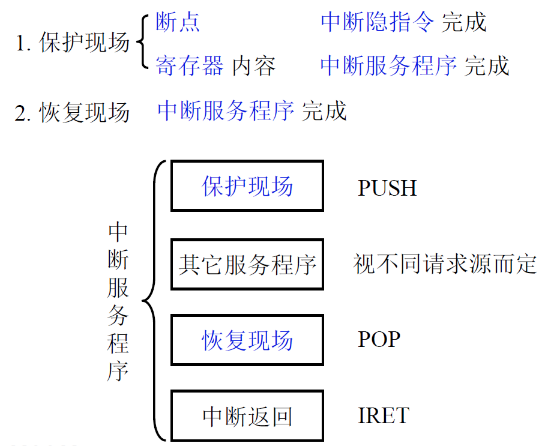

- 保护断点是由硬件来完成的
- 保护寄存器是由软件来完成的
- 保护现场：就是保护寄存器中的内容到堆栈中
- 恢复现场：就把寄存器的内容进行弹出

### 5.CPU 什么 条件、什么 时间、以什么 方式响应中断 

- 响应中断的条件：允许中断触发器 EINT 等于 1 的时候可以响应中断
- 响应中断的时间：

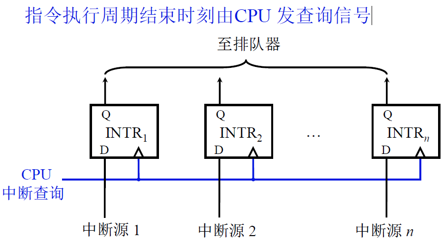

### 6.如何恢复现场，如何返回 

- 使用中断隐指令

>- **保护程序的断点**：断点存于特定地址（ 0 号地址）内断点进栈
>- **寻找服务程序入口地址**
>  - 向量地址PC（硬件向量法）
>  - 中断识别程序 入口地址MPC（软件查询法）
>- **硬件关中断**：避免在执行单重中断服务的过程中有新的中断源会打断当前正在执行的中断程序 
>  - INT中断标记置为零

### 7.处理中断的过程中又出现新的中断 怎么办 

- 对于单重中断的CPU来说，在进行中断服务的过程中，不允许有新的中断服务请求来打断当前正在执行的中断服务
- 即使是在多重中断中，也不允许优先级低的中断服务来打断正在执行的优先级高的中断服务请求
- 实现多重中断的条件

>- 提前设置开中断指令
>- 优先级别高的中断源有权中断优先级别低的中断源

# 作业

>1. CPU有哪些功能？画出其结构框图并简要说明每个部件的作用。

- CPU的主要功能是执行存放在主存储器中的程序即机器指令，CPU是由控制器和运算器组成的

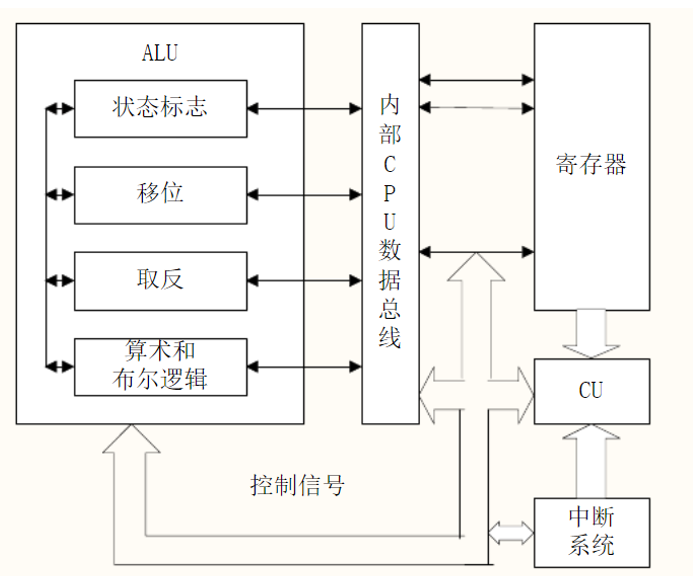

- ALU：实现算逻运算 
- 寄存器：存放操作数 
- CU：发出各种操作命令序列的控制部件 
- 中断系统：处理异常情况和特殊请求

>2. 什么是指令周期？指令周期是否有一个固定值？为什么？

- 指令周期：指取出并执行完一条指令所需的时间
- 由于计算机中各种指令执行所需的时间差异很大，因此为了提高CPU运行效率，即使在同步控制的机器中，不同指令的指令周期长度都是不一致的，也就是说指令周期对于不同的指令来说不是一个 固定值

>3. 画出指令周期的流程图，分别说明图中每个子周期的作用。

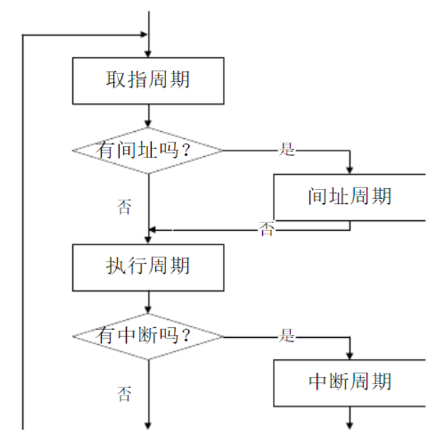

- 取指周期：取指令 
- 间址周期：取有效地址 
- 执行周期：取操作数（当指令为访存指令时） 
- 中断周期：保存程序断点

>4. 什么叫系统的并行性？粗粒度并行和细粒度并行有什么区别？

- 并行性：包含同时性和并发性。同时性指两个或两个以上的事件在同一时刻发生，并发性指两个或 多个事件在同一时间段发生。即在同一时刻或同一时间段内完成两个或两个以上性质相同或性质不 同的功能，只要在时间上存在相互重叠，就存在并行性
- 粗粒度并行是指多个处理机上分别运行多个进程，由多台处理机合作完成一个程序，一般算法实现
-  细粒度并行是指在处理机的指令级和操作级的并行性

>5. 什么是指令流水？画出指令二级流水和四级流水的示意图，它们中哪一个更能提高处理器速度，为什么？

- 指令流水：指将一条指令的执行过程分为n个操作时间大致相等的阶段，每个阶段由一个独立的功能部件来完成，这样n个部件可以同时执行n条指令的不同阶段，从而大大提高CPU的吞吐率
- 指令二级流水和四级流水示意图如下：

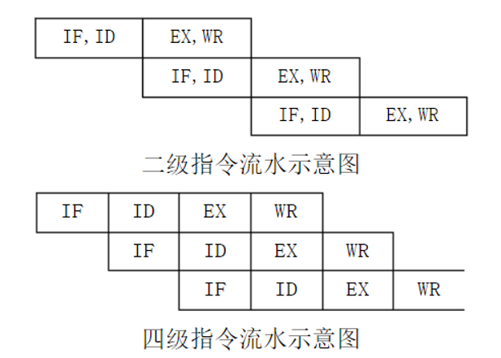

- 四级流水更能提高处理机的速度 
- IF、ID、EX、WR每个阶段耗时为t，则连续执行n条指令采用二级流水线时，耗时为：4t+（n1）2t=（2n+2）t采用四级流水线时，耗时为：4t+（n-1）t=（n+3）t在n〉1时，n+3<2n+2，可 见四级流水线耗时比二级流水线耗时短，因此更能提高处理机速度

>6. 举例说明流水线中的几种数据相关。

- 写后读相关 
- 读后写相关 
- 写后写相关

>7. 什么是中断？设计中断系统需考虑哪些主要问题？

- 中断：指当出现需要时，CPU暂时停止当前程序的执行转而执行处理新情况的程序和执行过程。即在程序运行过程中，系统出现了一个必须由CPU立即处理的情况，此时，CPU暂时中止程序的执行 转而处理这个新的情况的过程就叫做中断
- 设计中断系统需解决的问题： 

1. 各中断源如何向CPU提出中断请求 
2. 当对个中断源同时提出中断请求时，中断系统如何确定优先响应哪个中断源的请求 
3. CPU在什么条件、什么时候、以什么方式来响应中断 
4. CPU响应中断后如何保护现场 
5. CPU响应中断后，如何停止原程序的执行而转入中断服务程序的入口地址 
6. 中断处理结束后，CPU如何恢复现场，如何返回到原程序的间断处
7. 在中断处理过程中又出现了新的中断请求，CPU该如何处理

>8. 在中断系统中，INTR、INT、EINT这3个触发器各有何作用？

- INTR——中断请求触发器，用来登记中断源发出的随机性中断请求信号，以便为CPU查询中断及中断排队判优线路提供稳定的中断请求信号
- EINT——中断允许触发器，CPU中的中断总开关。当EINT=1时，表示允许中断（开中断），当 EINT=0时，表示禁止中断（关中断）。其状态可由开、关中断等指令设置
- INT——中断标记触发器，控制器时序系统中周期状态分配电路的一部分，表示中断周期标记。当 INT=1时，进入中断周期，执行中断隐指令的操作

>9. 什么是中断隐指令，有哪些功能？

- 中断隐指令：CPU响应中断之后，经过某些操作，转去执行中断服务程序
- 这些操作是由硬件直接实现的功能： 
  1. 保存断点 
  2. 暂不允许中断 
  3. 引出中断服务程序

>10. CPU在处理中断过程中，有几种方法找到中断服务程序的入口地址？举例说明。

- 硬件向量法 
- 软件查询法