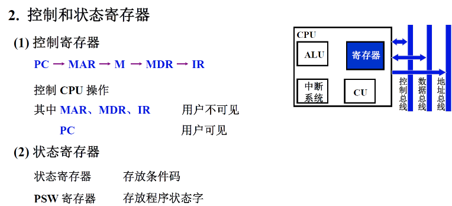
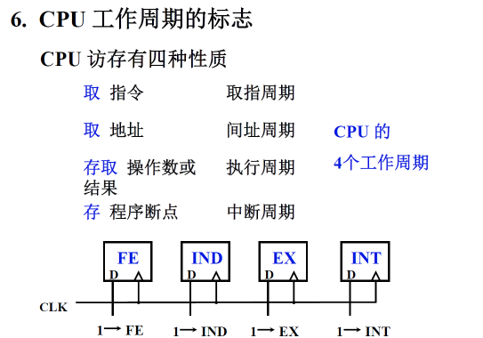
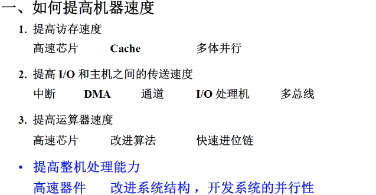
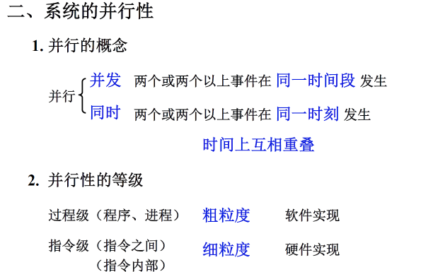

# CPU的结构和功能

- 高级语言编写的程序必须经过编译程序和汇编程序的编译和汇编以后变成由机器语言构成的程序才能在计算机的硬件上执行
- 指令系统是计算机的软硬件交界面最重要的组成部分，由机器指令构成的机器语言程序要在计算机硬件上执行，每一条指令要由CPU从内存中取出分析、执行，并进行结果的写回

## 1.CPU的结构

> 先了解CPU的功能，然后再了解什么样的结构可以为CPU提供相应的功能

### CPU的功能

>CPU由控制器和运算器构组成

1. 控制器的功能
   - 取指令：把指令从内存单元中取出来
   - 分析指令：对指令的操作码部分进行解码，分析这条指令要完成什么功能，是指令集中的哪一条指令
   - 执行指令，发出各种操作命令：由这些操作命令去控制相应的部件去完成指令要求的操作，这些命令含有一定的先后顺序
   - 控制程序的输入和结果的输出
   - 总线管理：对总线的控制权和使用权进行管理
   - 处理异常情况和特殊请求
2. 运算器的功能
   - 实现算术运算和逻辑运算
3. 功能总结
   - 指令控制
   - 操作控制
   - 时间控制
   - 处理中断
   - 数据加工

### CPU的结构框图

- CPU通过总线和计算机系统的其他部分进行通讯
  - 包括控制总线、数据总线和地址总线
  - 控制总线是双向的，由CPU向各个部件发出的控制命令；外部设备可以向CPU提出请求或者是外部设备的状态
  - 数据总线是双向的，CPU向外部设备或者是存储器写入数据，也可读入数据
  - 地址线是单向的，都是由CPU发出送给内存或者是外部设备的接口

- PC指出了要取出的指令的地址
- IR是指令寄存器，从内存单元中取出的指令被放入CPU内部的IR寄存器中
- CU：控制单元，由控制单元进行译码，译码后在给定的时刻给出给定的操作命令
- ALU：完成数据的加减乘除操作，包括算术运算和逻辑运算
- 寄存器：在运算过程中使用，如两个操作数可能都保存在寄存器中，运算的结果也需要输出到寄存器中
- 中断系统：处理中断服务程序

### CPU的寄存器

>不同的CPU，不同的指令集结构对CPU的寄存器的设置要求是不一样的

- 要从计算机的内存中取出一条指令
  - 从PC开始，PC把指令地址送给MAR(主存地址寄存器)，然后MAR再把它包含的地址传给M(主存储器)，并且控制单元发出读命令，读出的指令被放到MDR(主存数据寄存器)中，进一步放到IR中

- 状态寄存器：反映了指令执行结果的情况或者是计算机的软件、硬件状态

## 2.指令周期

- 控制单元要完成指令解释的全部过程

## 3.指令流水

- 流水线技术是现代处理器中最常用的，也是最有效的提高指令解释速度的方法

## 4.中断系统

# 作业

>1. CPU有哪些功能？画出其结构框图并简要说明每个部件的作用。

>2. 什么是指令周期？指令周期是否有一个固定值？为什么？

>3. 画出指令周期的流程图，分别说明图中每个子周期的作用。

>4. 什么叫系统的并行性？粗粒度并行和细粒度并行有什么区别？

>5. 什么是指令流水？画出指令二级流水和四级流水的示意图，它们中哪一个更能提高处理器速度，为什么？

>6. 举例说明流水线中的几种数据相关。

>7. 什么是中断？设计中断系统需考虑哪些主要问题？

>8. 在中断系统中，INTR、INT、EINT这3个触发器各有何作用？

>9. 什么是中断隐指令，有哪些功能？

>10. CPU在处理中断过程中，有几种方法找到中断服务程序的入口地址？举例说明。

