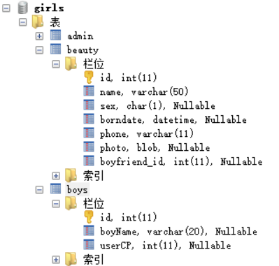
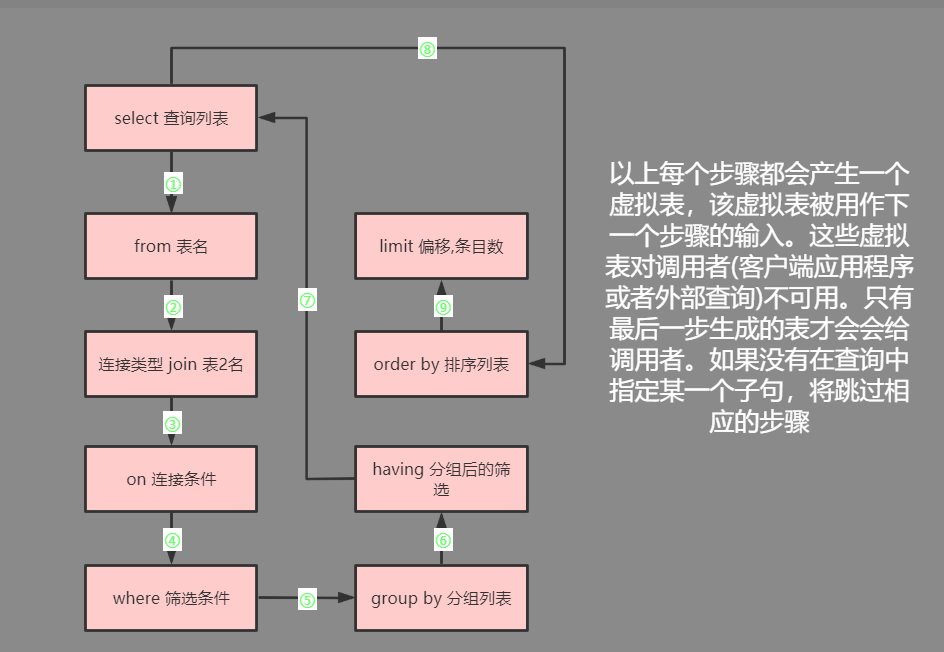

# 1.数据库了解

- 数据库的好处：
  1. 可以持久化数据到本地
  2. 结构化查询

## 1.1概念

- DB：数据库，存储数据的容器
- DBMS：数据库管理系统，又称为数据库软件或数据库产品，用于创建DB和管理DB中的数据
- SQL：结构化查询语言，用于和DBMS通信的语言，不是某个数据库软件特有的，而是所所有主流的数据库软件通用的语言

## 1.2存储数据的特点

1. 将数据放到表中，表再放到库中
2. 一个数据库中可以有多个表，每个表都有一个的名字，用来标识自己。表名具有唯一性
3. 表具有一些特性，这些特性定义了数据在表中如何存储，类似java中“类”的设计
4. 表由列组成，我们也称为字段。所有表都是由一个或多个列组成的，每一列类似java中的"属性"
5. 表中的数据是按行存储的，每一行类似于java中的"对象"

## 1.3格式化快捷键

- sqlyog中对SQL格式化：

>- F12 格式化当前行所在的SQL
>- Ctrl+F12 格式化选中的SQL
>- Shift+F12 格式化所有SQL

# 2.SQL92

>- data query language
>- 数据库查询语言


## 2.1基础查询

- 语法：

```mysql
# 类似于:System.out.printIn(打印东西)
select 查询列表 from 表名

# 特点：
 # 1. 查询列表可以是:表中的字段、常量值、表达式、函数
 # 2. 查询的结果是一个虚拟的表格
```

---

- 使用：

```mysql
# 使用指定数据库
use myemployees

# 1.查询表中的单个字段
select last_name from employees;

# 2.查询表中的多个字段
select first_name,last_name,email from employees;

# 3.1查询表中的所有字段方式一
select * from employees;

# 3.2查询表中的所有字段方式二
select 
`employee_id`,
`first_name`,
`last_name`,
`email`,
`phone_number`,
`job_id`,
`salary`,
`commission_pct`,
`manager_id`,
`department_id`,
`hiredate` 
from
employees ;

# 4.查询常量值
select 100;
select 'marry';

# 5.查询表达式
select 100 % 99;

# 6.查询函数:查询数据库的版本
select VERSION()

# 7.起别名
/*
①便于理解
②如果要查询的字段有重名的情况，使用别名可以区分开来
*/
# 方式一：as
select 100 % 99 as 余数;

# 方式二：省略as,加一个空格即可
select 100 % 98 余数

# 方式三：若别名中有特殊符号需要用单引号或双引号引起来
select 100 % 97 "余 数";
select 100 % 96 '余 数';

# 9.+的作用
/*
java中的+号：
①运算符，两个操作数都为数值型
②连接符，只要有一个操作数为字符串

mysgl中的+号：仅仅只有一个功能：运算符
select 100+90;    结果=190 ---> 两个操作数都为数值型，则做加法运算
select '123'+90;  结果=213 ---> 只要其中一方为字符型，试图将字符型数值转换成数值型如果转换成功，则继续做加法运算
select 'john'+90; 结果=90  ---> 如果转换失败，则将字符型数值转换成0
select null+10;   结果=10  ---> 只要其中一方为null,结果肯定为null
*/

# 查询员工名和姓连成一个字段,显示为姓名
select CONCAT(last_name,first_name) as 姓名 from employees;

# 10.连接字段有null的情况
/*
commission_pct字段有为null和不为null的情况
ifnull函数第一个参数是可能为null的参数，第二个参数是当参数为null时用指定值替换
若不用ifnull函数整个结果会因为拼接的是null而全部为null
*/
select CONCAT(first_name,IFNULL(`commission_pct`,0)) as 奖金率 from employees;
```

## 2.2条件查询

- 语法

```mysql
select 查询列表 from 表名 where 筛选条件
```

- 分类:

>1. 按条件表达式筛选：
>   - 条件运算符：>、< 、= 、!= 、<>、>=、<=
>
>2. 按逻辑表达式筛选：逻辑运算符
>
>  - 作用：用于连接条件表达式
>    - &&和and
>      - ||和or
>      - !和not
>
>3. 模糊查询
>   - like
>     - between and 
>     - in
>     - is null
>

### 2.2.1按条件表达式查询

```mysql
# 1.查询工资大于12000的员工信息
select * from employees where salary > 12000;

# 2.查询部门编号不等于90号的员工名和部门编号
select `first_name` 员工名,`department_id` 部门编号 from employees where `department_id` != 90;
select `first_name` 员工名,`department_id` 部门编号 from employees where `department_id` <> 90;
```

### 2.2.2按逻辑表达式查询

```mysql
# 1.查询工资在10000到20000之间的员工名、工资和奖金
select `first_name`,`salary`,`commission_pct` from employees where `salary` >= 10000 and `salary` <= 20000;

# 2.查询部门编号不是在90到110,或者工资高于15000的员工信息
select * from employees where `department_id` < 90 or `department_id` > 110 or `salary` > 15000;
select * from employees where not(`department_id` >= 90 and `department_id` <= 110) or `salary` > 15000;
```

### 2.2.3模糊查询

- like：一般和通配符搭配使用，可用于判断字符型或数值型
  - 通配符%：可表示任意多个字符，包含0个字符
  - 通配符_：可表示任意单个字符

```mysql
# 一、like   
# 1.1查询员工名中包含字符a的员工信息
select * from employees where `first_name` like '%a%';

# 1.2查询员工名中第二个字母为a,第四个字母为i的员工名和工资
select `first_name`,`salary` from employees where `first_name` like '_a_i%';

# 1.3查询员工姓中第二个字符为下划线_的员工信息
select * from employees where `last_name` like '_\_%';   -- 需要使用用\将_转义
```

---

- between XXX and YYY
  - 可以提高语句的简洁度
  - 包含临界值
  - 临界值不能颠倒

```mysql
# 二、between XXX and YYY --- 在...之间,实质就是>=XXX且<=YYY的区间
# 2.1查询员工编号在100到120之间的员工信息
select * from employees where `employee_id` between 100 and 120;
select * from employees where `employee_id` between 200 and 100; -- 查询失败
select * from employees where `employee_id` >= 100 and `employee_id` <= 120;
```

---

- in：判断某字段的值是否属于in列表中的某一项
  - 比使用or语句提高了语句的简洁度
  - in列表的值必须统一或兼容

```mysql
# 三、in
# 3.1查询员的工种编号是 PU_CLERK、SA_REP、IT_PROG中的一个的员工名和工种编号
select `first_name`,`job_id` from employees where `job_id` = 'PU_CLERK' or `job_id` = 'SA_REP' or `job_id` = 'IT_PROG';
select `first_name`,`job_id` from employees where `job_id` in('PU_CLERK','SA_REP','IT_PROG');
```

---

- is null：判断为null的值
- is not null：判断不为null的值
- 注意：=或<>不能用于判断null值

```mysql
# 四、is null
# 4.1查询没有奖金的员工名和奖金率
select `first_name`,`commission_pct` from employees where `commission_pct` is null;
select `first_name`,`commission_pct` from employees where `commission_pct` = null; -- 不能判断是否为null,判断为空必须用is null

# 4.2查询有奖金的员工名和奖金率
select `first_name`,`commission_pct` from employees where `commission_pct` is not null;
```

---

### 2.2.4安全null值

- <=>：既可以判断null值，也可以判断普通数值，但是可读性较低
- is null：只能判断null值，可读性较好

```mysql
# 五、<=>
# 5.1查询没有奖金的员工名和奖金率
select `first_name`,`commission_pct` from employees where `commission_pct` <=> null;

# 5.2查询工资为12000的员工名和工资
select `first_name`,`salary` from employees where `salary` <=> 12000;
```

## 测试1

```mysql
# 1.查询工资大于12000的员工姓名和工资
select 
  `first_name` 员工姓名,
  `salary` 月薪 
from
  employees 
where `salary` > 12000 ;

# 2.查询员工号为176的员工的姓名、部门号、月薪、奖金率和年薪
select 
  `first_name` as 姓名,
  `department_id` as 部门编号,
  `salary` as 月薪,
  `commission_pct` as 奖金率,
  `salary` * 12 * (1+ IFNULL(`commission_pct`, 0)) as 年薪 
from
  employees 
where `employee_id` = 176 ;

# 3.选择工资不在5000到12000的员工的姓名和工资
select 
  `first_name` 员工姓名,
  `salary` 月薪 
from
  employees 
where `salary` not between 5000 and 12000 ;

# 4.选择在20或50号部门工作的员工姓名和部门号
select 
  `first_name` 姓名,
  `department_id` 部门号 
from
  employees 
where `department_id` between 20 and 50 ;

# 5.选择公司中没有管理者的员工姓名以及job_id
select 
  `first_name` 姓名,
  `job_id` 工种编号 
from
  employees 
where `manager_id` is null ;

# 6.选择公司中有奖金的员工姓名,工资和奖金级别
select 
  `first_name` 姓名,
  `salary` 月薪,
  `commission_pct` 
from
  employees 
where `commission_pct` is not null ;

# 7.选择员工姓名的第三个字母是a的员工姓名
select 
  `first_name` 
from
  employees 
where `first_name` like '__a%' ;

# 8.选择员工中有字母a和e的员工姓名
select 
  `first_name` 姓名 
from
  employees 
where `first_name` like '%a%' 
  and `first_name` like '%e%' ;
```

## 2.3排序查询

- 语法

```mysql
select 查询列表 from 表名 [where 筛选条件] order by 排序列表 [asc | desc]
```

- 使用：asc是升序排列，desc是降序排列
  - order by子句支持单个字段，也支持多个字段，表达式，函数，别名
  - order by子句一般是放在查询语句的最后面，limit子句除外

```mysql
# 案例一:查询员工信息,安照工资从大到小的顺序排序
select * from employees order by `salary` desc;

# 查询员工信息,安照工资从小到大的顺序排序
select * from employees order by `salary` asc;
select * from employees order by `salary`; -- 系统默认就是升序排列

# 案例二:查询部门编号 > 90 的员工信息,按照入职时间的先后进行排序[添加了筛选条件]
select 
  * 
from
  employees 
where `department_id` >= 90 
order by `hiredate` asc ;

# 案例三:按年薪的高低显示员工的年薪和信息[按表达式排序]
select 
  *,`salary` * 12 * (1+ IFNULL(`commission_pct`, 0)) 年薪 
from
  employees 
order by `salary` * 12 * (1+ IFNULL(`commission_pct`, 0)) desc ;

# 案例四:按年薪的高低显示员工的年薪和信息[按别名排序]
select 
  *,`salary` * 12 * (1+ IFNULL(`commission_pct`, 0)) 年薪 
from
  employees 
order by 年薪 desc ;

#案例五:按照姓名的长度显示员工的姓名和工资[按函数排序]
select 
  LENGTH(`first_name`) 字节长度,
  `first_name`,
  `salary` 
from
  employees 
order by LENGTH(`first_name`) desc ;

# 案例六:查询员工信息,要求先按工资升序排序,再按员工编号降序排序
select * from employees order by `salary` asc,`employee_id` desc;
-- 上面这个案例的意思就是先对工资进行升序排列后再对工资相同的员工的员工编号进行降序排序,最后才为排序结果
```

## 测试2

```mysql
# 1.查询员工的姓名、部门号和年薪，按年薪降序,按姓名升序
select 
  `first_name` 姓名,
  `department_id` 部门号,
  `salary` * 12 * (1+ IFNULL(`commission_pct`, 0)) 年薪 
from
  employees 
order by 年薪 desc,
  `first_name` asc ;

# 2.选择工资不在8000到17000的员工的姓名和工资，按工资降序
select 
  `first_name` 姓名,
  `salary` 工资 
from
  employees 
where `salary` not between 8000 
  and 17000 
order by 工资 desc ;

# 3.查询邮箱中包含e的员工信息，并先按邮箱的字节数降序，再按部门号升序
select 
  * 
from
  employees 
where `email` like '%e%' 
order by LENGTH(`email`) desc,
  `department_id` asc ;
```


## 2.4单行函数

- 概念：类似于java的方法，将一组逻辑语句封装在方法体中，对外暴露方法名好处：

>1. 隐藏了实现细节
>2. 提高代码的重用性调用

- 语法

```mysql
select 函数名(实参列表) [from表];
```

- 特点：

>- ①叫什么（函数名）
>- ②干什么（函数功能）

- 分类：

>1. 单行函数：传入一个参数返回一个值
>   - 如concat，length，ifnull等
>2. 分组函数：传入一组参数返回一个值
>   - 功能：做统计使用，又称为统计函数、聚合函数、组函数

### 2.4.1字符函数 

```mysql
# 1.length 获取参数的字节个数
select LENGTH('mike');       -- 4
select LENGTH('张无忌nb');   -- 11 这里用的是UTF-8字符集,一个汉字占三个字节

# 2.concat 拼接字符串
# 姓_名的形式进行拼接
select CONCAT(`first_name`,'_',`last_name`) 姓_名 from employees;

# 3.upper、lower 大小写转换
select UPPER('mike') 大写;
select LOWER('MIKE') 小写;

# 示例:将姓变大写,名变小写并进行拼接
select CONCAT(UPPER(`last_name`),'_',LOWER(`first_name`)) 姓名 from employees;

# 4.substr/substring 截取字符
# 注意:数据库索引从1开始

# 截取从指定索引后的所有字符:截取飞翼
select SUBSTR('身无彩凤双飞翼',6) 飞翼;

# 截取从指定索引处指定字符长度的字符:截取彩凤
select SUBSTR('身无彩凤双飞翼',3,2) 彩凤;

# 姓名中首字符大写,其他字符小写,用'_'拼接显示
select CONCAT(UPPER(SUBSTR(`last_name`,1,1)),'_',LOWER(SUBSTR(`last_name`,2))) 结果 from employees;

# 5.instr 返回子串第一次出现时的索引,若没有则返回0
select INSTR('心有灵犀一点通','一点通') 索引;       -- 返回5
select INSTR('心一点通有灵犀一点通','一点通') 索引; -- 返回2

# 6.trim 取出字符的前后空格,默认去除空格
select TRIM('  蜡笔小新  ');                  -- 输出蜡笔小新
select TRIM('x' from 'xxxxxx蜡笔xx小新xxxx'); -- 输出蜡笔xx小新

# 7.lpad 左填充,用指定的字符实现填充指定的长度
select LPAD('小丸子',7,'爱你'); -- 爱你爱你小丸子
select LPAD('小丸子',2,'*');    -- 小丸

# 8.rpad 右填充,用指定的字符实现填充指定的长度
select RPAD('图图',10,'大耳朵'); 
select RPAD('图片',1,'大耳朵');  -- 图

# 9.replace 替换指定字符
select REPLACE('深深浅浅深深的脑海里','深深','浅浅') 替换函数; -- 浅浅浅浅浅浅的脑海里
```

### 2.4.2数学函数

```mysql
# 1.round 四舍五入
select ROUND(1.58); -- 2
select ROUND(1.52); -- 2
select ROUND(1.48); -- 1
select ROUND(-1.48); -- -1,先绝对值四舍五入后再加符号
# 小数点后保留2位小数
select ROUND(1.58,2) -- 1.58
select ROUND(1.587,2) -- 1.59
select ROUND(1.597,2) -- 1.60

# 2.ceil 向上取整,返回等于大于等于该参数的最小整数
select CEIL(1.01); -- 2
select CEIL(-1.01); -- -1

# floor 向下取整
select FLOOR(1.55); -- 1
select FLOOR(-1.55) -- -2

# 3.truncate 截断,小数点后保留1位小数
select TRUNCATE(1.55,1); -- 1.5
select TRUNCATE(-1.5555,1); -- -1.5

# 4.mode 取余
select MOD(10,3);
select 10%3;
select MOD(-10,3); -- -1
select MOD(-10,-3) -- -1,被除数是正余数就是正,被除数是负余数就是负
```

### 2.4.3日期函数


```mysql
# 1.now 返回当前系统日期+时间
select NOW();

# 2.curdata 返回当前系统日期,不包含时间
select CURDATE();

# 3.curtime 返回当前时间,不包含日期
select CURTIME();

# 4.可以获取指定的部分,年月日时分秒
select YEAR(NOW()) 年;
select MONTH(NOW()) 月;
select DAY(NOW()) 日;
select HOUR(NOW()) 时;
select MINUTE(NOW()) 分;
select SECOND(NOW()) 秒;

select YEAR('1999-9-9') 年; -- 1999
# 查询在1998年之后入职的员工信息
select * from employees where YEAR(`hiredate`) >= 1998; 

select MONTHNAME(NOW()) 月; -- 返回的月份以英文显示

# 5.str_to_date 将字符转通过指定的格式转换成日期
select STR_TO_DATE('1999-9-9','%Y-%c-%d') 日期;
# 查询特殊的日期格式 4-3 1992 年的员工信息
select * from employees where `hiredate` = STR_TO_DATE('4-3 1992','%c-%d %Y');

# 6.date_format 将日期转换成字符
# 以x年y月z日的格式输出日期
select DATE_FORMAT(NOW(),'%Y年%m月%d日'); --2020年07月10日
select DATE_FORMAT(NOW(),'%Y年%c月%d日'); --2020年7月10日

# 查询有奖金的员工名和入职日期(xx月/xx日 xx年)
select `last_name`,DATE_FORMAT(`hiredate`, '%m月/%d日 %Y年') 入职日期 
from
employees 
where `commission_pct` is not null ;
```

### 2.4.4其他函数

```mysql
# 查询当前数据库的版本号
select VERSION();

# 查询当前数据库
select DATABASE();

# 查询当前用户
select USER();
```

### 2.4.5流程控制函数

```mysql
# 1.if函数:if ... else 的效果
select IF(10>5,'大于','小于') 结果;

# 有奖金和没奖金的员工分别添加备注
select `last_name`,`commission_pct`,IF(`commission_pct` is null,'没奖金','有奖金') 备注 from employees;

# 2.case函数的使用一:类似于java中的switch case
/*
java中
switch(变量或表达式)
case常量1:语句1;break;
...
default:语句n;break；

mysql中
case 要判断的字段或表达式
when 常量1 then要显示的值1或语句1;
when 常量2 then要显示的值2或语句2;
else 要显示的值n或语句n;
end
*/

# 案例:查询员工的工资
/*
部门号=30,显示的工资为1.1倍
部门号=40,显示的工资为1.2倍
部门号=50,显示的工资为1.3倍
其他部门,显示的工资为原工资
*/
select salary 初始工资,department_id 部门号,
case department_id 
when 30 then salary*1.1
when 40 then salary*1.2
when 50 then salary*1.3
else salary
end as 实际工资
from 
employees;

# 2.case函数的使用二:类似于java中的多重if
/*
case
when条件1 then 要显示的值1或语句1
when条件2 then 要显示的值2或语句2
...
else           要显示的值n或语句n
end 

#案例：查询员工的工资的情况

如果工资>20000,显示A级别
如果工资>15000,显示B级别
如果工资>10000,显示c级别
否则,显示D级别
*/
select salary,
case 
when salary > 20000 then 'A'
when salary > 15000 then 'B'
when salary > 10000 then 'C'
else 'D'  
end as 工资级别
from employees;
```

### 单行函数练习

```mysql
# 1.显示系统时间（注：日期+时间）
select NOW();

# 2.查询员工号，姓名，工资，以及工资提高百分之20后的结果(new salary)
select `employee_id` 工号,`last_name` 姓名,`salary` 工资,`salary`*1.2 新工资 from employees;

# 3.将员工的姓名按首字母排序，并展示出姓名的长度(LENGTH)
select `last_name` 姓名,LENGTH(`last_name`) 长度,SUBSTR(`last_name`,1,1) 首字母 from employees order by 首字母 asc;

# 4.做一个查询，产生下面的结果
# King earns 24000 monthly but wants 72000
select CONCAT(`last_name`,' earn ',`salary`,' monthly but wants ',`salary`*3) as 内心独白
from employees where `salary` = 24000;
```

## 2.5分组/聚合函数

- 功能：用作统计使用，又称为聚合函数或统计函数或组函数
- 分类：sum求和、avg平均值、max最大值、min最小值、count计算个数
- 以上分组函数都忽略null值

```mysql
# 1.简单使用
select SUM(salary) from employees;
select AVG(salary) from employees;
select MIN(salary) from employees;
select MAX(salary) from employees;
select COUNT(salary) from employees;

select 
SUM(salary) 工资总和,
AVG(salary) 平均工资,
MIN(salary) 最小工资,
MAX(salary) 最大工资,
COUNT(salary) 领薪人数 
from employees;

/*
特点：
1、sum，avg一般用于处理数值型max，min，count可以处理任何类型
2、以上分组函数都忽略nul1值
3、可以和distinct搭配实现去重的运算
4、count函数的单独介绍一般使用count（*）用作统计行数
5、和分组函数一同查询的字段要求是group by后的字段
*/
select COUNT(*) from employees;
```

- 练习

```mysql
# 1.查询公司员工工资的最大值，最小值，平均值(保留两位小数)，总和
select 
MAX(`salary`) 工资最大值,
MIN(`salary`) 工资最小值,
ROUND(AVG(`salary`),2) 平均值,
SUM(`salary`) 总和 
from employees;

# 2.查询员工表中的最大入职时间和最小入职时间的相差天数(DIFFRENCE)
select
DATEDIFF(MAX(`hiredate`) , MIN(`hiredate`)) 相差天数
from employees;

select DATEDIFF(NOW(),'1999-09-29') 存活; -- 该函数计算现在日期和1999-9-29相差多少天

# 3.查询部门编号为90的员工个数
select
COUNT(*) 员工个数
from employees
where `department_id` = 90;
```

## 2.6分组查询


- 语法

```mysql
select 分组函数,列(要求出现在group by的后面)
from 表
[where筛选条件]
group by 分组的列表
[order by子句]

-- 注意: 查询列表必须特殊，要求是分组函数和group by后出现的字段
/*
特点：
1、分组查询中的筛选条件分为两类
           数据源                    位置              关键字
分组前筛选 原始表               group by子句的前面      where
分组后筛选 分组后的结果集       group by子句的后面      having
①分组函数做条件肯定是放在having子句中
②能用分组前筛选的，就优先考虑便用分组前筛选
*/
```

### 2.6.1简单使用

```mysql
# 1.查询每个工种的最高工资
select MAX(`salary`),`job_id`
from employees
group by `job_id`;

# 2.查询每个位置上的部门个数
select COUNT(*),`location_id`
from departments
group by `location_id`;
```

### 2.6.2分组前筛选

```mysql
-- 添加筛选条件:分组前的筛选
# 3.查询邮箱中包含a字符的,每个部门的平均工资
select AVG(`salary`),`department_id`
from employees
where `email` like '%a%'
group by `department_id`

# 4.查询有奖金的每个领导手下员工的最高工资
select MAX(`salary`),`manager_id`
from employees
where `commission_pct` is not null
group by `manager_id`;
```

### 2.6.3分组后筛选

```mysql
-- 添加复杂的筛选条件:分组后的筛选
# 5.哪个部门的员工个数 > 2
-- ①查询每个部门的员工个数
-- ②根据①的查询结果判断哪个部门的员工个数大于2
select COUNT(`employee_id`),`department_id`
from employees
group by `department_id`
having COUNT(`employee_id`) > 2;

# 6.查询每个工种有奖金的员工的最高工资>12000的工种编号和最高工资
select `job_id`,MAX(`salary`)
from employees
where `commission_pct` is not null
group by `job_id`
having MAX(`salary`) > 12000;

# 7.查询领导编号>102的每个领导手下的最低工资>5000的领导编号是哪个,以及其最低工资
select `manager_id`,MIN(`salary`)
from employees
where `manager_id` > 102
group by `manager_id`
having MIN(`salary`) > 5000;
```

### 2.6.4按函数分组

```mysql
# 按函数分组
# 8.按员工姓名的长度分组，查询每一组的员工个数，筛选员工个数>5的有哪些
select LENGTH(`last_name`) 姓名长度,COUNT(*)
from employees
group by LENGTH(`last_name`)
having COUNT(*) > 5;


-- group by 和 having 后支持别名
select LENGTH(`last_name`) 姓名长度,COUNT(*) 人数
from employees
group by 姓名长度
having 人数 > 5;
```

### 2.6.5按多个字段分组

```mysql
# 9.查询每个部门每个工种的员工的平均工资
select AVG(`salary`),`department_id`,`job_id`
from employees
group by `department_id`,`job_id`; -- 部门编号和工种编号都相同才会被分到一个小组
```

### 2.6.6添加排序

```mysql
# 10.查询每个部门每个工种的员工的平均工资,并按照工资的高低排序
select AVG(`salary`),`department_id`,`job_id`
from employees
group by `department_id`,`job_id`
order by AVG(`salary`) desc;
```

### 分组查询练习

```mysql
# 1.查询各job_id的员工工资的最大值，最小值，平均值，总和，并按job_id升序
select 
`job_id`,
MAX(`salary`) 最大,
MIN(`salary`) 最小,
AVG(`salary`) 平均,
SUM(`salary`) 总和
from employees
group by `job_id`
order by `job_id` asc;

# 2.查询员工最高工资和最低工资的差距(DIFFERENCE)
select
MAX(`salary`) - MIN(`salary`) 差距
from employees

# 3.查询各个管理者手下员工的最低工资，其中最低工资不能低于6000，没有管理者的员工不计算在内
select 
MIN(`salary`) 最低,manager_id
from employees
where manager_id is not  null
group by manager_id
having MIN(`salary`) >= 6000;

# 4.查询所有部门的编号，员工数量和工资平均值，并按平均工资降序
select 
`department_id`,COUNT(*),ROUND(AVG(`salary`),2)
from employees
group by `department_id`
order by AVG(`salary`) desc;

# 5.选择具有各个job-id的员工人数
select
`job_id`,COUNT(*)
from employees
group by `job_id`;
```

## 2.7连接查询



- 含义：又称多表查询，当查询的字段来自于多个表时，就会用到连接查询
- 笛卡尔乘积现象：表1有m行，表2有n行，结果=m*n行

>- 发生原因：没有有效的连接条件
>- 如何避免：添加有效的连接条件

```mysql
# 笛卡尔乘积现象
select `name`,`boyName` from beauty,boys;
```


```mysql
# 解决笛卡尔积现象,添加连接条件
select `name`,`boyName` from beauty,boys where beauty.`boyfriend_id` = boys.`id`;
```


### 2.7.1分类

- 按年代分类：

>- sql 92标准：仅支持内连接
>- sql 99标准 [推荐]：支持内连接+外连接（左外和右外）+交叉连接

- 按功能分类：

>- 内连接：
>  - 等值连接
>  - 非等值连接
>  - 自连接
>- 外连接：
>  - 左外连接
>  - 右外连接
>  - 全外连接
>- 交叉连接

### 2.7.2等值连接

```mysql
/*
1.多表等值连接的结果为多表的交集部分
2.n表连接，至少需要n-1个连接条件
3.多表的顺序没有要求
4.一般需要为表起别名
5.可以搭配前面介绍的所有子句使用，比如排序、分组、筛
*/

-- 解决笛卡尔积现象,添加连接条件
# 查询女神名和对应的男神名
select `name`,`boyName` from beauty,boys where beauty.`boyfriend_id` = boys.`id`;

# 查询员工名、工种号、工种名
select `last_name`,e.`job_id`,`job_title`
from employees as e,jobs as j
where e.`job_id` = j.`job_id`;

/*
为表起别名
①提高语句的简洁度
②区分多个重名的字段
注意：如果为表起了别名，则查询的字段就不能使用原来的表名去限定
*/

select 
`last_name`,employees.`job_id`,`job_title` -- 错误,为employees表起了别名就要用别名进行限定
from employees as e,jobs as j
where e.`job_id` = j.`job_id`;

-- 可以加筛选
# 1.查询有奖金的员工名、部门名
select
e.`last_name`,e.`department_id`,`commission_pct`
from employees e,departments d
where e.`department_id` = d.`department_id`
and `commission_pct` is not null;

# 2.查询城市名中第二个字符为o的部门名和城市名
select
`department_name`,`city`
from departments as d,locations as l
where d.`location_id` = l.`location_id`
and l.`city` like '_o%';

-- 可以加分组
# 1.查询每个城市的部门个数
select
l.`city` 城市,COUNT(`department_id`) 部门个数
from departments as d,locations as l
where d.`location_id` = l.`location_id`
group by l.`city`;

# 2.查询有奖金的每个部门的部门名和部门的领导编号和该部门的最低工资
select 
d.`department_name` 部门名,
d.`manager_id` 领导编号,
MIN(`salary`) 最低工资,
e.`commission_pct` 奖金
from departments as d,employees as e
where d.`department_id` = e.`department_id`
and e.`commission_pct` is not null
group by d.`department_name`,d.`manager_id`;

-- 可以加排序
# 1.查询每个工种的工种名和员工的个数，并且按员工个数降序
select 
j.`job_title`,COUNT(*)
from jobs as j,employees e
where e.`job_id` = j.`job_id`
group by j.`job_id`
order by COUNT(*) desc;

-- 实现三表连接
# 查询员工名、部门名和所在的城市
select
`last_name` 员工名,
`department_name` 部门名,
`city` 城市名
from departments d,employees e,locations l
where d.`location_id` = l.`location_id` 
and e.`department_id` = d.`department_id`;
```

### 2.7.3非等值连接


```mysql
# 查询员工的工资和工资级别
select 
  `salary`,
  `grade_level` 
from
  employees,
  job_grades j 
where `salary` between j.`lowest_sal` 
  and j.`highest_sal` ;
```

### 2.7.4自连接

```mysql
# 查询员工名和上级的名称
select 
e.`last_name` 员工名,
e.`employee_id` 员工号,
m.`last_name` 上级名,
m.`employee_id` 上级号
from employees e,employees m
where e.`manager_id` = m.`employee_id`;
```

## 测试3

```mysql
# 1.显示员工表的最大工资，工资平均值
select MAX(`salary`),AVG(`salary`) from employees;

# 2.查询员工表的employee_id，job_id，last_name，按department_id降序，salary升序
select 
`employee_id`,`job_id`,`last_name`,`salary`
from employees
order by `employee_id` desc,`salary` asc;

# 3.查询员工表的job_id包含a和e的，并且a在e的前面
select 
`job_id`
from employees
where `job_id` like '%a%e%';

/*已知表student，里面有id(学号)，name，gradeld(年级编号)
  已知表grade，里面有id(年级编号)，name(年级名)
  知表result，里面有id，score，studentNo(学号)
 */
# 4.要求查询姓名,年级名和成绩
select s.`name`,g.`name`,`score`
from student s,grade g,result r
where s.gradeId = g.graadeId and s.id = r.id;


# 5.显示当前日期,以及去前后空格,截取子字符串的函数
select TRIM(SUBSTR(NOW(),1,10))
```

## 小结

- 排序

```mysql
select 查询列表
from 表
where 筛选条件
order by 排序列表[asc|desc]
```

- 函数

```mysql
-- 一、概述
# 功能:类似于java中的方法
# 好处:提高重用性和隐藏实现细节
# 调用:select函数名(实参列表)

-- 二、单行函数
# 1、字符函数
concat   -- 连接
substr   -- 截取子串upper：变大写
lower    -- 变小写
replace  -- 替换
length   -- 获取字节长度trim:去前后空格
Ipad     -- 左填充rpad:右填充
instr    -- 获取子串第一次出现的索引

# 2、数学函数
ceil     -- 向上取整
round    -- 四舍五入
mod      -- 取模
floor    -- 向下职整
truncate -- 截断rand：获取随机数，返回0-1之间的小数
rand     -- 获取随机数，返回0-1之间的小数3、日期函数

# 3、日期函数
now          -- 返回当前日期+时间
year         -- 返回年
month        -- 返回月
day          -- 返回日
date_format  -- 将日期转换成字符curdate：返回当前日期
curdate      -- 返回当前日期
str_to_date  -- 将字符转换成日期
curtime      -- 返回当前时间
hour         -- 小时
minute       -- 分钟
second       -- 秒
datediff     -- 返回两个日期相差的天数
monthname    -- 以英文形式返回月

# 4、其他函数
version            -- 当前数据库服务器的版本
database           -- 当前打开的数据库
user               -- 当前用户
password()'字符')  -- 返回该字符的密码形式
md5('字符')        -- 返回该字符的md5加密形式

# 5、流程控制函数
if(条件表达式,表达式1,表达式2):如果条件表达式成立,返回表达式1,否则返回表达式2

-- case情况1
case变量或表达式或字段 
when 常量1 then 值1
when 常量2 then 值2
else 值n 
end

-- case情况2
case
when 条件1 then 值1
when 条件2 then 值2
else 值n 
end

# 5、分组函数
max 最大值
min最小值
sum和
avg平均值
count 计算个数  
-- count(字段):统计该字段非值的个数 
-- count(*):统计结果集的行数
-- sun和avg一般用于处理数值型
-- max,min,count可以处理任何数据类型
-- 以上分组函数都忽略null
-- 都可以搭配distinct使用，实现去重的统计
-- 和分组函数一同查询的字段，要求是group by后出现的字段
select sum (distinct 字段)from表;
```

- 分组函数

```mysql
select 分组函数,分组后的字段
from 表
[where筛选条件]
group by 分组的字段
[having 分组后的筛选]
[order by 排序列表]

-- 特点
使用关键字         筛选的表                        位置
where        原始表 group by 的前面               分组前筛选
having       分组后的结果 group by 的后面          分组后筛选
```

- 连接查询

```mysql
-- 当查询中涉及到了多个表的字段，需要使用多表连接
select 字段1,字段2
from 表1,表2...
-- 笛卡尔乘积：当查询多个表时，没有添加有效的连接条件，导致多个表所有行实现完全连接
-- 如何解决:添加有效的连接条件
```

- 等值连接

```mysql
select 查询列表
from 表1 别名,表2 别名
where 表1.key=表2.key
[and 筛选条件] 
[grouр by 分组字段]
[havin 分组后的筛选]
[order by 排序字段]

-- 特点:
1.一般为表起别名
2.多表的顺序可以调换
3.n表连接至少需要n-1个连接条件
4.等值连接的结果是多表的交集部分
```

## 练习

```mysql
# 显示所有员工的姓名，部门号和部门名称
select 
  `last_name` 员工名,
  e.`department_id` 部门号,
  `department_name` 部门名称
from
  employees e,
  departments d 
where e.`department_id` = d.`department_id` ;

# 查询90号部门员工的job_id和90号部门的location_id
select
e.`job_id`,d.`location_id`,e.`department_id`
from employees e,departments d
where e.`department_id` = d.`department_id` 
and e.`department_id` = 90;

# 选择所有有奖金的员工的last_name,department_name,location_id,city
select e.`last_name`,d.`department_id`,l.`location_id`,l.`city`
from employees e,departments d,locations l
where e.`department_id` = d.`department_id`
and d.`location_id` = l.`location_id`
and e.`commission_pct` is not null;

# 选择city在Toronto工作的员工的last_name , job_id , department_id, department_name
select e.`last_name`,e.`job_id`,e.`department_id`,d.`department_name`
from employees e,departments d,locations l
where e.`department_id` = d.`department_id` 
and d.`location_id` = l.`location_id`
and l.`city` = 'Toronto';

# 查询每个工种、每个部门的部门名、工种名和最低工资
select e.`job_id`,d.`department_name`,j.`job_title`, MIN(`salary`)
from employees e,departments d,jobs j
where e.`department_id` = d.`department_id`
and e.`job_id` = j.`job_id`
group by e.`job_id`,d.`department_name`,j.`job_title`;

# 查询每个国家下的部门个数大于2的国家编号
select `country_id`,COUNT(`department_id`)
from locations l,departments d
where l.`location_id` = d.`location_id`
group by l.`country_id`
having COUNT(`department_id`) > 2;
```

# 3.SQL99

```mysql
select 查询列表
from 表1 别名 
连接类型
join 表2 别名
on 连接条件
[where 筛选条件]
[group by 分组]
[having 筛选条件]
[order by 排序列表]

-- 分类：
1. 内连接  inner
2. 外连接:
    左外 left [outer]
    右外 right [outer]
    全外 full [outer]
3. 交叉连接: cross
```

## 3.1内连接

### 3.1.1等值连接

- 特点：

>1. 添加排序、分组、筛选
>2. inner可以省略
>3. 筛选条件放在where后面，连接条件放在on后面，提高分离性，便于阅读
>4. inner join连接和sql92语法中的等值连接效果是一样的，都是查询多表的交集

```mysql
-- 等值连接
# 查询员工名、部门名(调换位置)
select `last_name`,`department_name`
from 
employees e
inner join 
departments d
on e.`department_id` = d.`department_id`;


# 查询名字中包含e的员工名和工种名(筛选)
select `last_name`,`job_title`
from
employees e
inner join
jobs j
on e.`job_id` = j.`job_id`
where e.`last_name` like '%e%';


# 查询部门个数 > 3的城市名和部门个数,(分组+筛选)
select `city`,`department_id`,COUNT(*)
from departments d
inner join
locations l
on d.`location_id` = l.`location_id`
group by l.`city`
having COUNT(*) > 3;

# 查询哪个部门的部门员工个数 >3 的部门名和员工个数，并按个数降序(排序)
select d.`department_name`,COUNT(*)
from employees e
inner join 
departments d
on e.`department_id` = d.`department_id`
group by d.`department_id`
having COUNT(*) > 3
order by COUNT(*) desc;

# 查询员工名、部门名、工种名，并按部门名降序(三表连接)
select e.`last_name`,d.`department_name`,j.`job_title`
from employees e 
inner join departments d on e.`department_id` = d.`department_id`
inner join jobs j on e.`job_id` = j.`job_id`
order by `department_name` desc;
```

### 3.2.2非等值连接

```mysql
# 查询员工的工资级别
select `salary`,jg.`grade_level`
from employees e
inner join job_grades jg
on `salary` between jg.`lowest_sal` and jg.`highest_sal`;

# 查询工资级别的个数 >20 的个数，并且按工资级别降序
select `grade_level`,COUNT(*)
from employees e
inner join
job_grades jg
on e.`salary` between jg.`lowest_sal` and jg.`highest_sal`
group by jg.`grade_level`
order by jg.`grade_level` desc;
```

### 3.3.3自连接

```mysql
# 查询员工的名字、上级的名字
select e.`last_name` 员工,m.`last_name` 老板
from employees e
inner join employees m
on e.`manager_id` = m.`employee_id`;
```

## 3.2外连接

### 3.2.1左外

```mysql
/*
应用场景：用于查询一个表中有，另一个表没有的记录特点：
1、外连接的查询结果为主表中的所有记录
      如果从表中有和它匹配的，则显示匹配的值
      如果从表中没有和它匹配的，则显示null
      外连接查询结果=内连接结果+主表中有而从表没有的记录
2、左外连接，left join左边的是主表 
   右外连接，right join右边的是主表
3、左外和右外交换两个表的顺序，可以实现同样的效果
*/

#引入：查询男朋友不在男神表的的女神名
select g.name,b.*
from beauty g
left outer join boys b
on g.`boyfriend_id` = b.`id`
where b.`id` is null
```

### 3.2.2右外

```mysql
#引入：查询男朋友不在男神表的的女神名
select g.name,b.*
from boys b
right outer join beauty g
on g.`boyfriend_id` = b.`id`
where b.`id` is null
```

## 3.3子查询

- 出现在其他语句中的select语句，称为子查询或内查询外部的查询语句，称为主查询或外查询
- 分类 ------------------------- 如下：
- 按子查询出现的位置：

>- select后面：仅仅支持标量子查询
>- from后面：支持表子查询
>- where或having后面：:star:
>  - 标量子查询（单行）：:fist_right:
>  - 列子查询 （多行）：:fist_right:
>  - 行子查询
>- exists后面（相关子查询）
>  - 表子查询

- 按结果集的行列数不同：

>- 标量子查询（结果集只有一行一列）
>- 列子查询（结果集只有一列多行）
>- 行子查询（结果集有一行多列）
>- 表子查询（结果集一般为多行多列）

### 3.3.1标量子查询

1. 标量子查询（单行子查询）
2. 列子查询（多行子查询）
3. 行子查询（多列多行）
4. 特点：

>- ①子查询放在小括号内
>- ②子查询一般放在条件的右侧
>- ③标量子查询，一般搭配着单行操作符使用
>  - < 、>=、 <= 、=、<>、>
>- 列子查询，一般搭配着多行操作符使用
>  - in，any/some，all
>- ④子查询的优先级高于主查询，主查询要依赖子查询的结果

```mysql
-- 案例一:谁的工作比Abel高

# first.查询Abel的工资
select salary from employees where last_name = 'Abel';

# seond.查询员工信息中，需要满足salary > ①的结果
select * from employees 
where 
salary > (select salary from employees where last_name = 'Abel')

-- -------------------------------------------------------------------------------------------
-- 案例二: 返回job_id与141号员工相同，salary比143号员工多的员工姓名，job_id和工资

# 先查询141员工的job_id,再查询143员工的salary
select last_name,job_id,salary from employees 
where job_id = 
(select job_id from employees where employee_id = 141) 
and 
salary > 
(select salary from employees where employee_id = 143);

-- -------------------------------------------------------------------------------------------
-- 案例三:返回公司工资最少的员工的last_name，job_id和salary

# first.查询公司的最低工资
select MIN(salary) from employees;

# second.查询满足条件的员工信息
select last_name,job_id,salary from employees 
where salary = (select MIN(salary) from employees)

-- -------------------------------------------------------------------------------------------
-- 案例4：查询最低工资大于50号部门的最低工资的部门id和其最低工资

# first.查询50号部门的最低工资
select MIN(salary) from employees where department_id = 50;

# second.查询每个部门的最低工资
select MIN(salary),department_id from employees group by department_id;

# third.整合
select MIN(salary),department_id from employees group by department_id
having MIN(salary) > 
(
select MIN(salary) from employees where department_id = 50
)
```

### 3.3.2列子查询

- 也叫多行子查询
- 需要使用多行操作符


```mysql
# 案例一：返回location_id是1400或1700的部门中的所有员工姓名

-- 先查询location_id在1400或1700中的部门编号
select department_id from departments where location_id in(1400,1700)

select last_name from employees 
where department_id in 
(
select department_id from departments where location_id in(1400,1700)
)

-- -------------------------------------------------------------------------------------
#案例2：返回其它工种中比job_id为`IT_PROG`部门任一工资低的员工的员工号、姓名、job id以及salary

select salary,department_id from employees 
where salary < 
(
select MAX(salary) from employees where job_id = 'IT_PROG'
) 
and job_id <> 'IT_PROG'

-- -------------------------------------------------------------------------------------
#案例3：返回其它部门中比job_id为`IT_PROG`部门所有工资都低的员工 的员工号、姓名、job_id以及salary
select salary,department_id from employees 
where salary < 
(
select MIN(salary) from employees where job_id = 'IT_PROG'
) 
and job_id <> 'IT_PROG'
```

### 3.3.4from表子查询

- from后面：将表子查询充当一张表，并且必须起别名

```mysql
#案例：查询每个部门的平均工资的工资等级
-- 先查询每个部门的平均工资
select AVG(salary) from employees group by department_id;

select avg_dep.*,grade_level from
(select AVG(salary) avg_s,department_id from employees group by department_id) avg_dep
inner join job_grades g
on avg_dep.avg_s between g.`lowest_sal` and g.`highest_sal`;
```

## 3.4分页查询

- limit【offset】，size；
- offset要显示条目的起始索引（起始索引从0开始）
- size要显示的条目个数
- 特点：

>- ①limit语句放在查询语句的最后
>- ②公式：要显示的页数page，每页的条目数size select查询列表
>- `from 表 limit（page-1）*size，size`；

```mysql
# 案例一:查询前5条员工信息
select * from employees limit 0,5;
select * from employees limit 5;

# 案例二:查询第11-第25条
select * from employees limit 10,15;

# 案例3：有奖金的员工信息，并且工资较高的前10名显示出来
select * from employees where commission_pct is not null order by salary desc limit 10;
```

## 经典子查询案例

```mysql
# 1.查询工资最低的员工信息：last_name，salary
-- 先查最低工资是多少
select MIN(salary) from employees;

select * from employees where salary = (select MIN(salary) from employees)


# 2.查询平均工资最低的部门信息
-- frist:先查询各部门的平均工资
select department_id,AVG(salary) from employees group by department_id;

-- second:把frist的查询结果按照平均工资升序排列再取出第一条数据获得部门id
select department_id from employees group by department_id order by AVG(salary) asc limit 1;

-- final:查询部门信息
select * from departments where department_id = 
(select department_id from employees group by department_id order by AVG(salary) asc limit 1);


# 3.查询平均工资最低的部门信息和该部门的平均工资
-- first:获取到部门的平均工资
select  AVG(salary),department_id from employees
group by department_id
order by AVG(salary) asc 
limit 1;


-- second:将first的查询结果当作表和部门表连接
select d.*,avg_dp.ag 最低的平均工资 from departments d
right join 
(
select  AVG(salary) ag,department_id from employees
group by department_id
order by AVG(salary) asc 
limit 1
) avg_dp
on avg_dp.department_id = d.`department_id`


# 4.查询平均工资最高的job信息
-- 先查询平均工资最高的job
select job_id from employees group by job_id order by AVG(salary) desc limit 1;

-- 再查询job信息
select * from jobs where job_id = (select job_id from employees group by job_id order by AVG(salary) desc limit 1)


# 5.查询平均工资高于公司平均工资的部门有哪些？
-- 先查询公司的平均工资
select AVG(salary) 公司的 from employees;

-- 再查询部门的平均工资并添加筛选信息
select department_id,AVG(salary) 部门的 from employees group by department_id
having AVG(salary) > 
(
select AVG(salary) 公司的 from employees
);


# 6.查询出公司中所有manager的详细信息
-- 先查询所有manager的id
select distinct manager_id from employees where manager_id is not null;

-- 再查询详细信息
select * from (select distinct manager_id from employees where manager_id is not null) as m
left outer join employees e
on m.manager_id = e.`employee_id`;


# 7.各个部门中最高工资中最低的那个部门的最低工资是多少
-- 先查找部门中最高工资中最低的那个部门id
select department_id from employees group by department_id order by MAX(salary) asc limit 1;

-- 再找该部门的最低工资
select MIN(salary),department_id from employees where department_id = 
(select department_id from employees group by department_id order by MAX(salary) asc limit 1)

# 8.查询平均工资最高的部门的manager的详细信息：last_name，department_id，email，salary
-- 先查询平均工资最高的部门id
select department_id from employees group by department_id order by AVG(salary) desc limit 1;

-- 再查找该部门对应的manager的id
select distinct manager_id from employees where department_id = 
(select department_id from employees group by department_id order by AVG(salary) desc limit 1) and manager_id is not null;


-- 再查找该manager的信息
select last_name,department_id,email,salary from employees where employee_id = 
(select distinct manager_id from employees where department_id = 
(select department_id from employees group by department_id order by AVG(salary) desc limit 1) and manager_id is not null)
```

## 3.5联合查询

- union联合合并：将多条查询语句的结果合并成一个结果
- 应用场景：要查询的结果来自于多个表，且多个表没有直接的连接关系，但查询的信息一致时
- 特点：

>1. 要求多条查询语句的查询列数是一致的！
>2. 要求多条查询语句的查询的每一列的类型和顺序最好一致
>3. union关键字默认去重，如果使用union all可以包含重复项

```mysql
# 引入的案例:查询部门编号>90或邮箱包含a的员工信息
-- 一般查询的方式
select * from employees where department_id > 90 or email like '%a%';

-- 联合查询的方式
select * from employees where department_id > 90
union
select * from employees where email like '%a%'
```

# 4.查询的执行流程总览



# 5.SQL语言分类


