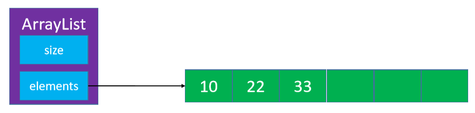

# 数组

数组是一种顺序存储的线性表，所有元素的内存地址是连续的


- 在很多编程语言中，数组都有个致命的缺点：无法动态修改容量
- 实际开发中，我们更希望数组的容量是可以动态改变的 

# 动态数组ArrayList



动态的添加删除数组元素

## 接口设计

```java
int size(); // 元素的数量 

boolean isEmpty(); // 是否为空 

boolean contains(E element); // 是否包含某个元素 

void add(E element); // 添加元素到最后面 

E get(int index); // 返回index位置对应的元素 

E set(int index, E element); // 设置index位置的元素 

void add(int index, E element); // 往index位置添加元素 

E remove(int index); // 删除index位置对应的元素 

int indexOf(E element); // 查看元素的位置 

void clear(); // 清除所有元素
```

## 基本结构

在Java中，成员变量会自动初始化，比如 :

- int 类型自动初始化为 0 

- 对象类型自动初始化为 null

```java
public class ArrayList<E> implements List<E>{

    static final int ELEMENT_NOT_FOUND = -1;
    private int size;
    private E[] elements;
    private static final int DEFAULT_CAPACITY = 10;

    public ArrayList(int capaticy) {
        capaticy = Math.max(capaticy, DEFAULT_CAPACITY);
        elements = (E[]) new Object[capaticy];
    }

    public ArrayList() {
        this(DEFAULT_CAPACITY);
    }

    public int size() {
        return size;
    }

    public boolean isEmpty() {
        return size == 0;
    }

    public boolean contains(E element) {
        return indexOf(element) != ELEMENT_NOT_FOUND;
    }

    //........................
}
```

## 添加元素到尾部

```java
public void add(E element) {
    add(size, element);
}
```

## 打印数组

- 重写 `toString `方法
-  在` toString` 方法中将元素拼接成字符串
-  字符串拼接建议使用 `StringBuilder`

```java
@Override
public String toString() {
    // size=3, [99, 88, 77]
    StringBuilder string = new StringBuilder();
    string.append("size=").append(size).append(", [");
    for (int i = 0; i < size; i++) {
        if (i != 0) {
            string.append(", ");
        }
        string.append(elements[i]);
    }
    string.append("]");
    return string.toString();
}
```

## 删除元素 

思考：最后一个元素如何处理？


```java
public E remove(int index) {
       /*
        * 最好：O(1)
        * 最坏：O(n)
        * 平均：O(n)
        */
    rangeCheck(index);

    E old = elements[index];
    for (int i = index + 1; i < size; i++) {
        elements[i - 1] = elements[i];
    }
    elements[--size] = null;
    trim();
    return old;
}
```

## 在index位置插入一个元素

```java
public void add(int index, E element) { 
   /*
	* 最好：O(1)
	* 最坏：O(n)
	* 平均：O(n)
	*/				
    rangeCheckForAdd(index);

    ensureCapacity(size + 1);

    for (int i = size; i > index; i--) {
        elements[i] = elements[i - 1];
    }
    elements[index] = element;
    size++;
} //size是数据规模
```

## 保证要有capacity的容量

```java
private void ensureCapacity(int capacity) {
    int oldCapacity = elements.length;
    if (oldCapacity >= capacity) return;

    // 新容量为旧容量的1.5倍
    int newCapacity = oldCapacity + (oldCapacity >> 1);
    E[] newElements = (E[]) new Object[newCapacity];
    for (int i = 0; i < size; i++) {
        newElements[i] = elements[i];
    }
    elements = newElements;

    System.out.println(oldCapacity + "扩容为" + newCapacity);
}
```

## 裁剪数组容量

```java
private void trim() {
    // 30
    int oldCapacity = elements.length;
    // 15
    int newCapacity = oldCapacity >> 1;
    if (size > (newCapacity) || oldCapacity <= DEFAULT_CAPACITY) return;

    // 剩余空间还很多
    E[] newElements = (E[]) new Object[newCapacity];
    for (int i = 0; i < size; i++) {
        newElements[i] = elements[i];
    }
    elements = newElements;

    System.out.println(oldCapacity + "缩容为" + newCapacity);
}
```

## 清除所有元素


申请是数组为对象数组，在清空时要把数组内容置为null，以消除对象地址，从而消灭数组对象

```java
public void clear() {
    for (int i = 0; i < size; i++) {
        elements[i] = null;
    }
    size = 0;
}
```

## 查看元素的索引

```java
public int indexOf(E element) {
    if (element == null) {
        for (int i = 0; i < size; i++) {
            if (elements[i] == null) return i;
        }
    } else {
        for (int i = 0; i < size; i++) {
            if (element.equals(elements[i])) return i;
        }
    }
    return ELEMENT_NOT_FOUND;
}
```

## 设置index位置的元素

```java
public E set(int index, E element) { // O(1)
    rangeCheck(index);

    E old = elements[index];
    elements[index] = element;
    return old;
}
```

## 合法性检查

```java
public void outOfBounds(int index) {
    throw new IndexOutOfBoundsException("Index:" + index + ", Size:" + size);
}

protected void rangeCheck(int index) {
    if (index < 0 || index >= size) {
        outOfBounds(index);
    }
}

protected void rangeCheckForAdd(int index) {
    if (index < 0 || index > size) {
        outOfBounds(index);
    }
}
```

