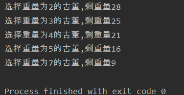
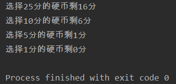
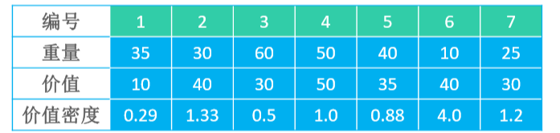
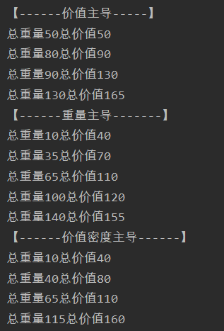

# 贪心（Greedy）

- 贪心策略，也称为贪婪策略 
- 每一步都采取当前状态下最优的选择（局部最优解），从而希望推导出全局最优解
- 贪心的应用 ：
  - 哈夫曼树 
  - 最小生成树算法：Prim、Kruskal 
  - 最短路径算法：Dijkstra

# 最优装载问题（加勒比海盗）

- 问题：

>- 在北美洲东南部，有一片神秘的海域，是海盗最活跃的加勒比海。有一天，海盗们截获了一艘装满各种各样古董的货船，每一件古董都价值连城，一旦打碎就失去了它的价值 
>- 海盗船的载重量为 W，每件古董的重量为 𝑤i，海盗们该如何把尽可能多数量的古董装上海盗船？ 比如 W 为 30，𝑤i 分别为 3、5、4、10、7、14、2、11

- 贪心策略：每一次都优先选择重量最小的古董 
  1. 选择重量为 2 的古董，剩重量 28 
  2.  选择重量为 3 的古董，剩重量 25 
  3.  选择重量为 4 的古董，剩重量 21 
  4.  选择重量为 5 的古董，剩重量 16 
  5.  选择重量为 7 的古董，剩重量 9 

- 最多能装载 5 个古董

```java
public class Pirate {
    public static void main(String[] args) {
        int weightAll = 30;
        int[] things = {3,5,4,10,7,14,2,11};
        Arrays.sort(things);
        int i = 0;
        while ((weightAll -= things[i]) > 0){
            System.out.println("选择重量为"+things[i]+"的古董,剩重量"+weightAll);
            i++;
        }
    }
}
```



# 零钱兑换其一

- 问题：

>假设有 25 分、10 分、5 分、1 分的硬币，现要找给客户 41 分的零钱，如何办到硬币个数最少？

- 贪心策略：每一次都优先选择面值最大的硬币 
  1.  选择 25 分的硬币，剩 16 分 
  2.  选择 10 分的硬币，剩 6 分 
  3.  选择 5 分的硬币，剩 1 分 
  4.  选择 1 分的硬币
- 最终的解是共 4 枚硬币：25 分、10 分、5 分、1 分

```java
public class Change {
    public static void main(String[] args) {
        int[] coins = {25,10,5,1};
        int change = 41;
        int i = 0;
        while (change > 0){
            //如果零钱的面值比硬币的面值小就拿一个稍微小点的硬币继续比较
            if (change < coins[i]) {
                i++;
                continue;
            }
            //当前硬币面值可以找
            change -= coins[i];
            System.out.println("选择"+coins[i]+"分的硬币剩"+ change+"分");
        }
    }
}
```



# 零钱兑换其二

- 问题：

>假设有 25 分、20 分、5 分、1 分的硬币，现要找给客户 41 分的零钱，如何办到硬币个数最少？

- 贪心策略：每一步都优先选择面值最大的硬币 
  1. 选择 25 分的硬币，剩 16 分 
  2.  选择 5 分的硬币，剩 11 分 
  3.  选择 5 分的硬币，剩 6 分 
  4.  选择 5 分的硬币，剩 1 分 
  5.  选择 1 分的硬币 
- 最终的解是 1 枚 25 分、3 枚 5 分、1 枚 1 分的硬币，共 5 枚硬币
- 实际上本题的最优解是：2 枚 20 分、1 枚 1 分的硬币，共 3 枚硬币

# 注意

- 贪心策略并不一定能得到全局最优解 
  - 因为一般没有测试所有可能的解，容易过早做决定，所以没法达到最佳解 
  - 贪图眼前局部的利益最大化，看不到长远未来，走一步看一步
- 优点：简单、高效、不需要穷举所有可能，通常作为其他算法的辅助算法来使用
-  缺点：鼠目寸光，不从整体上考虑其他可能，每次采取局部最优解，不会再回溯，因此很少情况会得到最优解

# 0-1背包

- 问题：

>- 有 n 件物品和一个最大承重为 W 的背包，每件物品的重量是 𝑤i、价值是 𝑣i 
>
>1. 在保证总重量不超过 W 的前提下，将哪几件物品装入背包，可以使得背包的总价值最大？ 
>2. 注意：每个物品只有 1 件，也就是每个物品只能选择 0 件或者 1 件，因此称为 0-1背包问题

-  如果采取贪心策略，有3个方案
  1. 价值主导：优先选择价值最高的物品放进背包 
  2.  重量主导：优先选择重量最轻的物品放进背包 
  3.  价值密度主导：优先选择价值密度最高的物品放进背包（价值密度 = 价值 ÷ 重量）

## 实例参考

- 假设背包最大承重150，7个物品如表格所示



1. 价值主导：放入背包的物品编号是 4、2、6、5，总重量 130，总价值 165
2. 重量主导：放入背包的物品编号是 6、7、2、1、5，总重量 140，总价155
3. 价值密度主导：放入背包的物品编号是 6、2、7、4、5，总重量 115，总价值 160

## 0-1背包 – 实现

- 物品类

```java
public class Goods {
    public int weight;
    public int value;
    public double density;
    public Goods(int weight, int value) {
        this.weight = weight;
        this.value = value;
        this.density = value * 1.0 / weight;
    }
}
```

- 具体实现

```java
public class Knapsack {
    public static void main(String[] args) {
        solve("------价值主导-----",(Goods g1, Goods g2)-> g2.value-g1.value);
        solve("------重量主导-------",(Goods g1, Goods g2)-> g1.weight-g2.weight);
        solve("------价值密度主导------", (Goods g1, Goods g2) -> Double.compare(g2.density, g1.density));
    }

    static void solve(String title,Comparator<Goods> comparator){
        Goods[] goods = {
            new Goods(35,10),
            new Goods(30,40),
            new Goods(60,30),
            new Goods(50,50),
            new Goods(40,35),
            new Goods(10,40),
            new Goods(25,30),
        };
        Arrays.sort(goods,comparator);
        int actualWeight = 0;
        int actualValue = 0;
        int i = 0;
        System.out.println("【"+title+"】");
        while ((actualWeight += goods[i].weight) <= 150){
            actualValue += goods[i].value;
            System.out.println("总重量"+actualWeight+"总价值"+actualValue);
            i++;
        }
    }
}
```

