# 动态规划（Dynamic Programming）

- 动态规划，简称DP ：是求解最优化问题的一种常用策略
- 通常的使用套路（一步一步优化） 
  1. 暴力递归（自顶向下，出现了重叠子问题） 
  2. 记忆化搜索（自顶向下） 
  3. 递推（自底向上）

## 常规步骤

- 动态规划中的“动态”可以理解为是“会变化的状态”

1. 定义状态（状态是原问题、子问题的解） 
   - 比如定义 dp(i) 的含义
2. 设置初始状态（边界） 
   - 比如设置 dp(0) 的值
3. 确定状态转移方程 
   - 比如确定 dp(i) 和 dp(i – 1) 的关系

## 一些相关概念

- 维基百科的解释 ：Dynamic Programming is a method for solving a complex problem by breaking it down into a collection of simpler subproblems, solving each of those subproblems just once, and storing their solutions. 
  1. 将复杂的原问题拆解成若干个简单的子问题
  2. 每个子问题仅仅解决1次，并保存它们的解 
  3. 最后推导出原问题的解
- 可以用动态规划来解决的问题，通常具备2个特点 
  - 最优子结构（最优化原理）：通过求解子问题的最优解，可以获得原问题的最优解
  - 无后效性
- 无后效性
  - 某阶段的状态一旦确定，则此后过程的演变不再受此前各状态及决策的影响（未来与过去无关） 
  - 在推导后面阶段的状态时，只关心前面阶段的具体状态值，不关心这个状态是怎么一步步推导出来的

## 无后效性

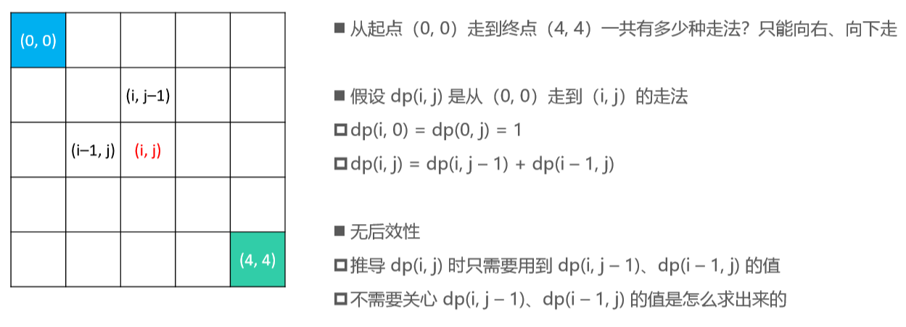

## 有后效性

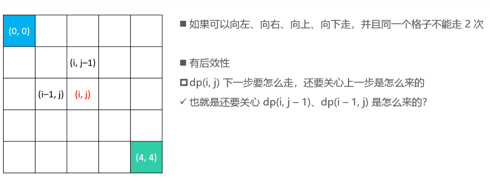

# 找零钱

- 假设有25分、20分、5分、1分的硬币，现要找给客户41分的零钱，如何办到硬币个数最少？ 
- 此前用贪心策略得到的并非是最优解（贪心得到的解是 5 枚硬币）
- 假设 dp(n) 是凑到 n 分需要的最少硬币个数 
  - 如果第 1 次选择了 25 分的硬币，那么 dp(n) = dp(n – 25) + 1 
  - 如果第 1 次选择了 20 分的硬币，那么 dp(n) = dp(n – 20) + 1 
  - 如果第 1 次选择了 5 分的硬币，那么 dp(n) = dp(n – 5) + 1 
  - 如果第 1 次选择了 1 分的硬币，那么 dp(n) = dp(n – 1) + 1 
  - 所以 dp(n) = min { dp(n – 25), dp(n – 20), dp(n – 5), dp(n – 1) } + 1

## 暴力递归

- 自顶向下的调用，出现了重叠子问题

```java
//明确函数的作用，找到凑齐n元所需要的最少硬币个数
static int coins1(int n) {
    //递归基：不合理情况
    if (n < 1) return Integer.MAX_VALUE;
    //递归基：能解决问题的答案
    if (n == 25 || n == 20 || n == 5 || n == 1) return 1;
    //选最少的硬币结果
    int min1 = Math.min(coins1(n - 25), coins1(n - 20));
    int min2 = Math.min(coins1(n - 5), coins1(n - 1));
    //最后还要加上第一次选取的硬币
    return Math.min(min1, min2) + 1;
}
```

- 类似于斐波那契数列的递归版，会有大量的重复计算，时间复杂度较高

## 记忆化搜索

- 自顶向下的调用

```java
static int coins2(int n) {
    if (n < 1) return -1;
    //dp[n]代表的是凑齐n元所需要的硬币个数
    //若n是41，根据数组下标，要dp[41]取出为41，数组大小为42
    int[] dp = new int[n + 1];
    int[] faces = {1, 5, 20, 25};
    for (int face : faces) {
        //如果要找的前比当前手里的硬币面值还小就退出
        if (n < face) break;
        dp[face] = 1;
    }
    //dp里面存储着可使用大小的面值零钱
    return coins2(n, dp);
}

static int coins2(int n, int[] dp) {
    if (n < 1) return Integer.MAX_VALUE;
    //把dp[n]的结果保存起来不用每次都重复计算
    if (dp[n] == 0) {
        int min1 = Math.min(coins2(n - 25, dp), coins2(n - 20, dp));
        int min2 = Math.min(coins2(n - 5, dp), coins2(n - 1, dp));
        dp[n] = Math.min(min1, min2) + 1;
    }
    return dp[n];
}
```

## 递推

- 自底向上，分别出1元钱到n元钱所需要的最少硬币个数
- 如果是1元钱可以先看0元钱需要多少枚硬币
- 如果是5元钱可以先看4元钱需要多少枚硬币

```java
static int coins3(int n) {
    if (n < 1) return -1;
    int[] dp = new int[n + 1];
    for (int i = 1; i <= n; i++) {
        int min = dp[i - 1];
        //如果是5元钱就看是直接找5元的硬币和之前4元钱所需要的硬币数谁最小就取谁，dp[0]在数组中默认为0，恰好可以利用
        if (i >= 5) min = Math.min(dp[i - 5], min);
        //这里的-5，-20，-25都是为了利用dp[0]=0的便利
        if (i >= 20) min = Math.min(dp[i - 20], min);
        if (i >= 25) min = Math.min(dp[i - 25], min);
        dp[i] = min + 1;
    }
    return dp[n];
}
```

## 思考题

- 请输出找零钱的具体方案（具体是用了哪些面值的硬币）

```java
static int coins4(int n) {
    if (n < 1) return -1;
    int[] dp = new int[n + 1];
    // faces[i]是凑够i分时最后那枚硬币的面值
    int[] faces = new int[dp.length];
    for (int i = 1; i <= n; i++) {
        int min = dp[i - 1];
        faces[i] = 1;

        if (i >= 5 && dp[i - 5] < min) {
            min = dp[i - 5];
            faces[i] = 5;
        }
        if (i >= 20 && dp[i - 20] < min) {
            min = dp[i - 20];
            faces[i] = 20;
        }
        if (i >= 25 && dp[i - 25] < min) {
            min = dp[i - 25];
            faces[i] = 25;
        }
        dp[i] = min + 1;
        print(faces, i);
    }
    //print(faces, n);
    return dp[n];
}

static void print(int[] faces, int n) {
    System.out.print("[" + n + "] = ");
    while (n > 0) {
        System.out.print(faces[n] + " ");
        n -= faces[n];
    }
    System.out.println();
}
```

##  通用实现

```java
static int coins5(int n, int[] faces) {
    if (n < 1 || faces == null || faces.length == 0) return -1;
    int[] dp = new int[n + 1];
    for (int i = 1; i <= n; i++) {
        int min = Integer.MAX_VALUE;
        for (int face : faces) {
            if (i < face) continue;
            int v = dp[i - face];
            if (v < 0 || v >= min) continue;
            min = v;
        }
        if (min == Integer.MAX_VALUE) {
            dp[i] = -1;
        } else {
            dp[i] = min + 1;
        }
    }
    return dp[n];
}
```

# 最大连续子序列和

>给定一个长度为 n 的整数序列，求它的最大连续子序列和 。
>
>比如-2, 1, -3, 4, -1, 2, 1, -5, 4 的最大连续子序列和是 4 + (–1) + 2 + 1 = 6

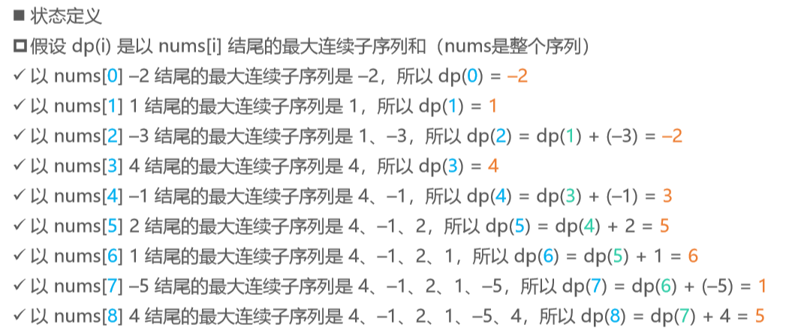

## 状态转移方程和初始状态

- 状态转移方程 
  - 如果 dp(i – 1) ≤ 0，那么 dp(i) = nums[i] 
  - 如果 dp(i – 1) > 0，那么 dp(i) = dp(i – 1) + nums[i]
- 初始状态 
  - dp(0) 的值是 nums[0]
- 最终的解 
  - 最大连续子序列和是所有 dp(i) 中的最大值 max { dp(i) }，i ∈ [0, nums.length) 

## 动态规划 – 实现

```java
static int maxSubArray1(int[] nums) {
    if (nums == null || nums.length == 0) return 0;
    //记录以num[x]结尾的最大子序列和
    int[] dp = new int[nums.length];
    //以num[0]结尾的最大子序列和是dp[0]
    dp[0] = nums[0];
    int maxSum = dp[0];
    //从前往后遍历整个序列
    for (int i = 1; i < dp.length; i++) {
        //拿到以 i-1 结尾的最大子序列和
        int prev = dp[i - 1];
        //如果小于等于，就说明加上前 i-1 个子序列和会更小或不变
        if (prev <= 0) {
            dp[i] = nums[i];
        } else {
            dp[i] = prev + nums[i];
        }
        maxSum = Math.max(dp[i], maxSum);
    }
    return maxSum;
}
```

## 动态规划 – 优化实现

- 上面的方法非常浪费数组空间，对于以第 i 个数结尾的大连续子序列的和我们只关心第 i-1 个数结尾的大连续子序列的和

```java
static int maxSubArray2(int[] nums) {
    if (nums == null || nums.length == 0) return 0;
    int dp = nums[0];
    int max = dp;
    for (int i = 1; i < nums.length; i++) {
        if (dp <= 0) {
            dp = nums[i];
        } else {
            dp = dp + nums[i];
        }
        max = Math.max(dp, max);
    }
    return max;
}
```

# 最长上升子序列（LIS）

>最长上升子序列（最长递增子序列，Longest Increasing Subsequence，LIS）
>
>给定一个无序的整数序列，求出它最长上升子序列的长度（要求严格上升） 
>
>比如 [10, 2, 2, 5, 1, 7, 101, 18] 的最长上升子序列是 [2, 5, 7, 101]、[2, 5, 7, 18]，长度是 4

## 动态规划 – 状态定义

- 假设数组是 nums， [10, 2, 2, 5, 1, 7, 101, 18] 

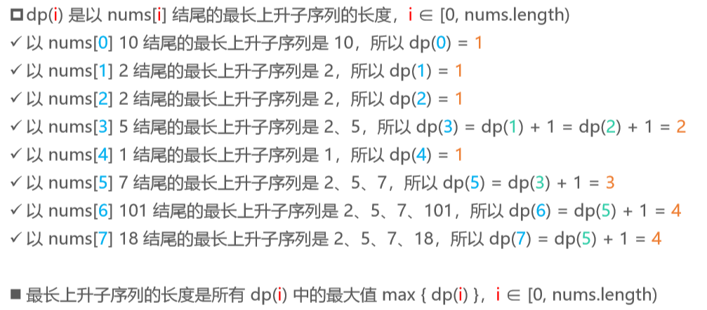

## 动态规划 – 状态转移方程

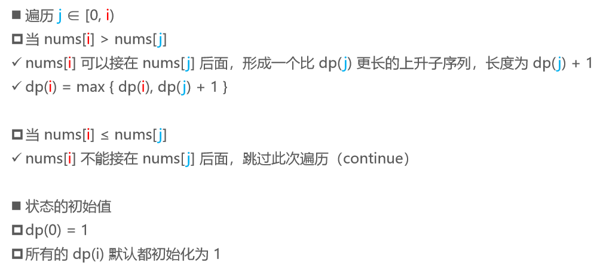

## 动态规划 – 实现

```java
static int lengthOfLIS1(int[] nums) {
    if (nums == null || nums.length == 0) return 0;
    int[] dp = new int[nums.length];
    int max = dp[0] = 1;
    for (int i = 1; i < dp.length; i++) {
        dp[i] = 1;
        for (int j = 0; j < i; j++) {
            if (nums[i] <= nums[j]) continue;
            dp[i] = Math.max(dp[i], dp[j] + 1);
        }
        max = Math.max(dp[i], max);
    }
    return max;
}
```

## 二分搜索 – 思路


- 把每个数字看做是一张扑克牌，从左到右按顺序处理每一个扑克牌 

- 将它压在（从左边数过来）第一个牌顶 ≥ 它的牌堆上面 
- 如果找不到牌顶 ≥ 它的牌堆，就在最右边新建一个牌堆，将它放入这个新牌堆中

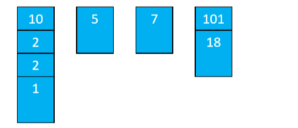

- 当处理完所有牌，最终牌堆的数量就是最长上升子序列的长度
- 思路（假设数组是 nums，也就是最初的牌数组） 
  - top[i] 是第 i 个牌堆的牌顶，len 是牌堆的数量，初始值为 0 
  - 遍历每一张牌 num 
    - 利用二分搜索找出 num 最终要放入的牌堆位置 index 
    - num 作为第 index 个牌堆的牌顶，top[index] = num 
    - 如果 index 等于 len，相当于新建一个牌堆，牌堆数量 +1，也就是 len++

## 普通实现

```java
static int lengthOfLIS2(int[] nums) {
    if (nums == null || nums.length == 0) return 0;
    // 牌堆的数量
    int len = 0;
    // 牌顶数组
    int[] top = new int[nums.length];
    // 遍历所有的牌
    for (int num : nums) {
        int j = 0;
        while (j < len) {
            // 找到一个>=num的牌顶
            if (top[j] >= num) {
                top[j] = num;
                break;
            }
            // 牌顶 < num
            j++;
        }
        if (j == len) { // 新建一个牌堆
            len++;
            //把num这张牌放在牌顶
            top[j] = num;
        }
    }
    return len;
}
```

## 二分搜索 – 实现

```java
static int lengthOfLIS3(int[] nums) {
    if (nums == null || nums.length == 0) return 0;
    // 牌堆的数量
    int len = 0;
    // 牌顶数组
    int[] top = new int[nums.length];
    // 遍历所有的牌
    for (int num : nums) {
        int begin = 0;
        int end = len;
        while (begin < end) {
            int mid = (begin + end) >> 1;
            if (num <= top[mid]) {
                end = mid;
            } else {
                begin = mid + 1;
            }
        }
        // 覆盖牌顶
        top[begin] = num;
        // 检查是否要新建一个牌堆
        if (begin == len) len++;
    }
    return len;
}
```

# 最长公共子序列（LCS）

>最长公共子序列（Longest Common Subsequence，LCS）


## 思路

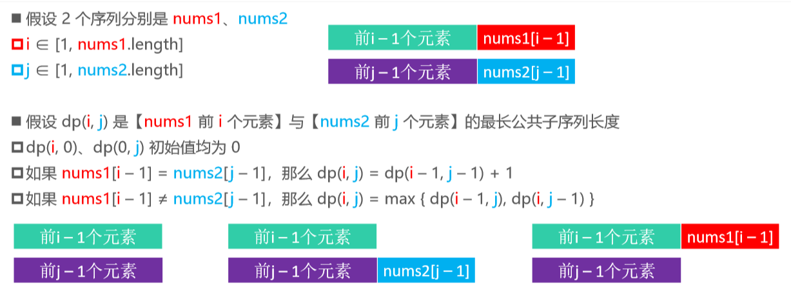

## 递归实现

```java
static int lcs1(int[] num1, int[]  num2){
    //排除非法情况
    if (num1 == null || num2 == null) return 0;
    if (num1.length == 0 || num2.length ==0) return 0;
    return lcs1(num1,num1.length,num2,num2.length);
}

//明确递归函数的作用：求nums1前i个元素和nums2前j个元素的最长公共子序列长度
static int lcs1(int[] num1, int len1, int[]num2, int len2){
    //递归基
    if (len1 == 0 || len2 == 0) return 0;
    if (num1[len1 - 1] == num2[len2 - 1]){
        return lcs1(num1,len1-1,num2,len2-1)+1;
    }else {
        return Math.max(lcs1(num1,len1-1,num2,len2),
                        lcs1(num1,len1,num2,len2-1));
    }
}
```

## 递归实现分析

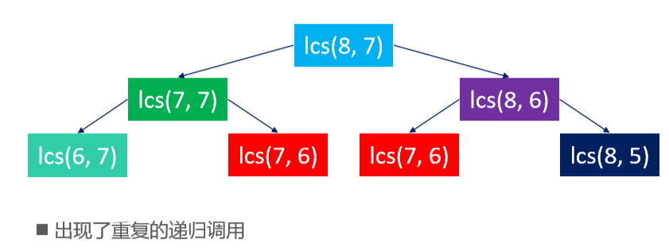

## 动态规划

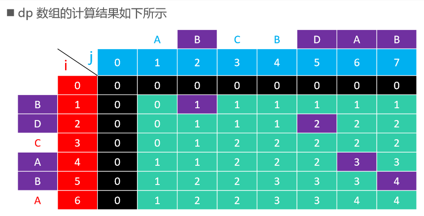

```javascript
static int lcs2(int[] num1, int[] num2){
    //排除非法情况
    if (num1 == null || num1.length == 0) return 0;
    if (num2 == null || num2.length == 0) return 0;
    //记录num1的前i个元素和num2的前j个元素间的最长公共子序列
    int[][] dp = new int[num1.length + 1][num2.length + 1];
    for (int i = 1; i <= num1.length; i++) {
        for (int j = 1; j <= num2.length; j++) {
            //如果第i个元素和第j个元素相同
            if (num1[i-1] == num2[j - 1]){
                dp[i][j] = dp[i-1][j-1]+1;
            }else {
                dp[i][j] = Math.max(dp[i-1][j],dp[i][j-1]);
            }
        }
    }
    //返回第num1的前num1.length个元素和num2的前num2.length个元素之前的最长公共子序列
    return dp[num1.length][num2.length];
}
```

- 缺点：每次都只用到两行数组，所以浪费很多空间

## 优化1 – 滚动数组

- 优化空间消耗

```java
static int lcs3(int[] nums1, int[] nums2) {
    if (nums1 == null || nums1.length == 0) return 0;
    if (nums2 == null || nums2.length == 0) return 0;
    int[][] dp = new int[2][nums2.length + 1];
    for (int i = 1; i <= nums1.length; i++) {
        int row = i & 1;
        int prevRow = (i - 1) & 1;
        for (int j = 1; j <= nums2.length; j++) {
            if (nums1[i - 1] == nums2[j - 1]) {
                dp[row][j] = dp[prevRow][j - 1] + 1;
            } else {
                dp[row][j] = Math.max(dp[prevRow][j], dp[row][j - 1]);
            }
        }
    }
    return dp[nums1.length & 1][nums2.length];
}
```

## 优化2 – 一维数组

- 优化空间消耗

```java
static int lcs4(int[] nums1, int[] nums2) {
    if (nums1 == null || nums1.length == 0) return 0;
    if (nums2 == null || nums2.length == 0) return 0;
    int[] dp = new int[nums2.length + 1];
    for (int i = 1; i <= nums1.length; i++) {
        int cur = 0;
        for (int j = 1; j <= nums2.length; j++) {
            int leftTop = cur;
            cur = dp[j];
            if (nums1[i - 1] == nums2[j - 1]) {
                dp[j] = leftTop + 1;
            } else {
                dp[j] = Math.max(dp[j], dp[j - 1]);
            }
        }
    }
    return dp[nums2.length];
}
```

# 最长公共子串

- 最长公共子串（Longest Common Substring） 
- 子串是连续的子序列
- 求两个字符串的最长公共子串长度 
- ABCBA 和 BABCA 的最长公共子串是 ABC，长度为 3

## 思路

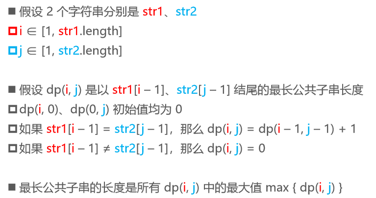

## 一般实现

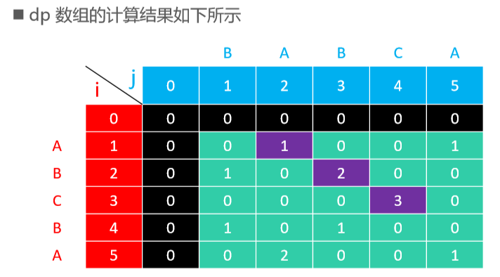

```java
static int lcs1(String str1, String str2) {
    if (str1 == null || str2 == null) return 0;
    char[] chars1 = str1.toCharArray();
    if (chars1.length == 0) return 0;
    char[] chars2 = str2.toCharArray();
    if (chars2.length == 0) return 0;
    int[][] dp = new int[chars1.length + 1][chars2.length + 1];
    int max = 0;
    for (int i = 1; i <= chars1.length; i++) {
        for (int j = 1; j <= chars2.length; j++) {
            if (chars1[i - 1] != chars2[j - 1]) continue;
            dp[i][j] = dp[i - 1][j - 1] + 1;
            max = Math.max(dp[i][j], max);
        }
    }
    return max;
}
```

##  一维数组实现

- 缩小空间，将dp数组的大小设置为最短的列大小

```java
static int lcs2(String str1, String str2) {
    if (str1 == null || str2 == null) return 0;
    char[] chars1 = str1.toCharArray();
    if (chars1.length == 0) return 0;
    char[] chars2 = str2.toCharArray();
    if (chars2.length == 0) return 0;
    char[] rowsChars = chars1, colsChars = chars2;
    if (chars1.length < chars2.length) {
        colsChars = chars1;
        rowsChars = chars2;
    }

    int[] dp = new int[colsChars.length + 1];
    int max = 0;
    for (int row = 1; row <= rowsChars.length; row++) {
        int cur = 0;
        for (int col = 1; col <= colsChars.length; col++) {
            //记录下一个数据的左上角元素子串的数量
            int leftTop = cur;
            cur = dp[col];
            if (chars1[row - 1] != chars2[col - 1]) {
                dp[col] = 0;
            } else {
                dp[col] = leftTop + 1;
                max = Math.max(dp[col], max);
            }
        }
    }
    return max;
}
```

# 0-1背包

- 有 n 件物品和一个最大承重为 W 的背包，每件物品的重量是 𝑤i、价值是 𝑣i 
- 在保证总重量不超过 W 的前提下，选择某些物品装入背包，背包的最大总价值是多少？ 
- 注意：每个物品只有 1 件，也就是每个物品只能选择 0 件或者 1 件
-  假设 values 是价值数组，weights 是重量数组 
  - 编号为 k 的物品，价值是 values[k]，重量是 weights[k]，k ∈ [0, n)

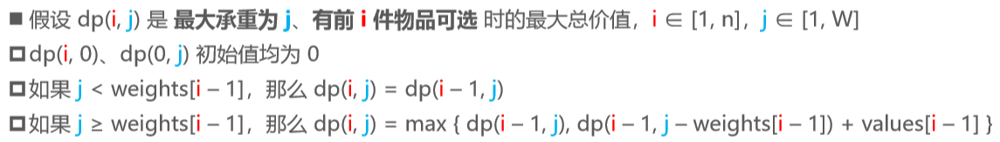

## 动态规划实现

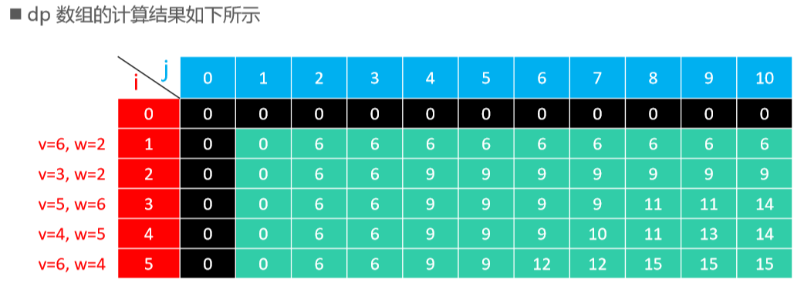

```java
static int maxValue1(int[] values, int[] weights, int capacity) {
    if (values == null || values.length == 0) return 0;
    if (weights == null || weights.length == 0) return 0;
    if (values.length != weights.length || capacity <= 0) return 0;
    int[][] dp = new int[values.length + 1][capacity + 1];
    for (int i = 1; i <= values.length; i++) {
        for (int j = 1; j <= capacity; j++) {
            if (j < weights[i - 1]) {
                dp[i][j] = dp[i - 1][j];
            } else {
                dp[i][j] = Math.max(
                    dp[i - 1][j], 
                    values[i - 1] + dp[i - 1][j - weights[i - 1]]);
            }
        }
    }
    return dp[values.length][capacity];
}
```

## 一维数组

- dp(i, j) 都是由 dp(i – 1, k) 推导出来的，也就是说，第 i 行的数据是由它的上一行第 i – 1 行推导出来的 
- 因此，可以使用一维数组来优化 
- 另外，由于 k ≤ j ，所以 j 的遍历应该由大到小，否则导致数据错乱

```java
static int maxValue2(int[] values, int[] weights, int capacity) {
    if (values == null || values.length == 0) return 0;
    if (weights == null || weights.length == 0) return 0;
    if (values.length != weights.length || capacity <= 0) return 0;
    int[] dp = new int[capacity + 1];
    for (int i = 1; i <= values.length; i++) {
        for (int j = capacity; j >= 1; j--) {
            if (j < weights[i - 1]) continue;
            dp[j] = Math.max(dp[j], values[i - 1] + dp[j - weights[i - 1]]);
        }
    }
    return dp[capacity];
}
```

## 一维数组优化

- 观察二维数组表，得出结论：j 的下界可以从 1 改为 weights[i – 1]

```java
static int maxValue3(int[] values, int[] weights, int capacity) {
    if (values == null || values.length == 0) return 0;
    if (weights == null || weights.length == 0) return 0;
    if (values.length != weights.length || capacity <= 0) return 0;
    int[] dp = new int[capacity + 1];
    for (int i = 1; i <= values.length; i++) {
        //只有容量大于等于最后一件物品的重量才考虑选或者不选
        for (int j = capacity; j >= weights[i - 1]; j--) {
            dp[j] = Math.max(dp[j], values[i - 1] + dp[j - weights[i - 1]]);
        }
    }
    return dp[capacity];
}
```

# 0-1背包 – 恰好装满 

- 有 n 件物品和一个最大承重为 W 的背包，每件物品的重量是 𝑤i、价值是 𝑣i 
- 在保证总重量恰好等于 W 的前提下，选择某些物品装入背包，背包的最大总价值是多少？ 
- 注意：每个物品只有 1 件，也就是每个物品只能选择 0 件或者 1 件

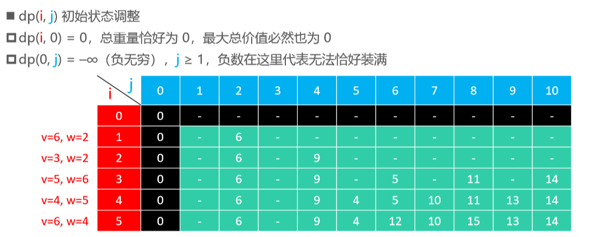

## 动态规划实现

- return 如果返回-1，代表没法刚好凑到capacity这个容量

```java
static int maxValueExactly(int[] values, int[] weights, int capacity) {
    if (values == null || values.length == 0) return 0;
    if (weights == null || weights.length == 0) return 0;
    if (values.length != weights.length || capacity <= 0) return 0;
    int[] dp = new int[capacity + 1];
    for (int j = 1; j <= capacity; j++) {
        dp[j] = Integer.MIN_VALUE;
    }
    for (int i = 1; i <= values.length; i++) {
        for (int j = capacity; j >= weights[i - 1]; j--) {
            dp[j] = Math.max(dp[j], values[i - 1] + dp[j - weights[i - 1]]);
        }
    }
    return dp[capacity] < 0 ? -1 : dp[capacity];
}
```

