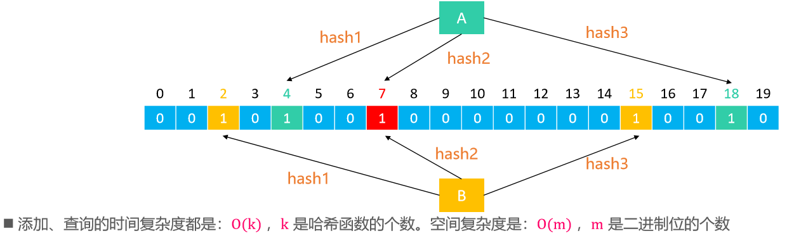
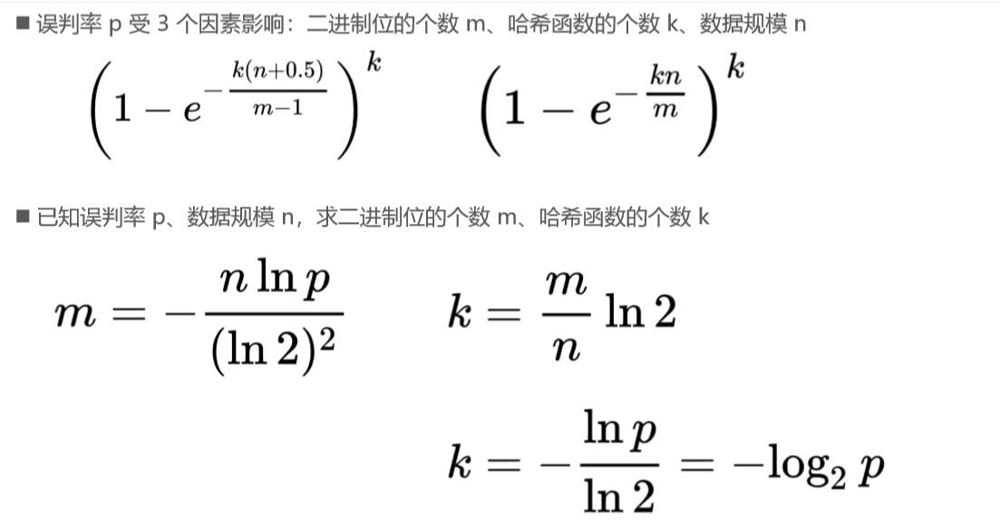

# 引言

- 如果要经常判断 1 个元素是否存在，你会怎么做？ 
  - 很容易想到使用哈希表（HashSet、HashMap），将元素作为 key 去查找 
  - 时间复杂度：O(1)，但是空间利用率不高，需要占用比较多的内存资源
- 如果需要编写一个网络爬虫去爬10亿个网站数据，为了避免爬到重复的网站，如何判断某个网站是否爬过？ 
  - 很显然，HashSet、HashMap 并不是非常好的选择
- 是否存在时间复杂度低、占用内存较少的方案？ 
  - 布隆过滤器（Bloom Filter）

# 布隆过滤器（Bloom Filter）

- 1970年由布隆提出。它是一个空间效率高的概率型数据结构，可以用来告诉你：一个元素一定不存在或者可能存在
- 优缺点 
  - 优点：空间效率和查询时间都远远超过一般的算法 
  - 缺点：有一定的误判率、删除困难
- 它实质上是一个很长的二进制向量和一系列随机映射函数（Hash函数）
- 常见应用 
  - 网页黑名单系统
  - 垃圾邮件过滤系统
  - 爬虫的网址判重系统
  - 解决缓存穿透问题

# 布隆过滤器的原理 

- 假设布隆过滤器由 20位二进制、 3 个哈希函数组成，每个元素经过哈希函数处理都能生成一个索引位置 
- 添加元素：将每一个哈希函数生成的索引位置都设为 1 
- 查询元素是否存在 
  - 如果有一个哈希函数生成的索引位置不为 1，就代表不存在（100%准确） 
  - 如果每一个哈希函数生成的索引位置都为 1，就代表存在（存在一定的误判率）。比如A的哈希函数的映射下索引位置为1，但索引位置的1是B生成的

# 布隆过滤器的误判率 

# 布隆过滤器的实现

