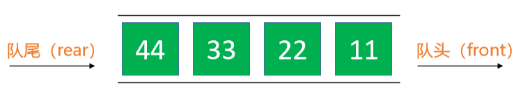
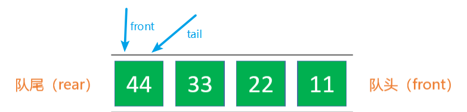

# 队列Queue

- 队列是一种特殊的线性表，只能在头尾两端进行操作 
  - 队尾（rear）：只能从队尾添加元素，一般叫做 enQueue，入队 
  - 队头（front）：只能从队头移除元素，一般叫做 deQueue，出队 
  - 先进先出的原则，First In First Out，FIFO



## 接口设计

```java
int size(); // 元素的数量 

boolean isEmpty(); // 是否为空 

void clear(); // 清空 

void enQueue(E element); // 入队

E deQueue(); // 出队 

E front(); // 获取队列的头元素
```

队列的内部实现是否可以直接利用以前学过的数据结构？ 

- 动态数组、链表 
- 优先使用双向链表，因为队列主要是往头尾操作元素

# 双端队列Deque

双端队列是能在头尾两端添加、删除的队列 

- 英文 deque 是 double ended queue 的简称

```java
int size(); // 元素的数量 

boolean isEmpty(); // 是否为空 
void clear(); // 清空 

void enQueueRear(E element); // 从队尾入队 

E deQueueFront(); // 从队头出队 

void enQueueFront(E element); // 从队头入队 

E deQueueRear(); // 从队尾出队 

E front(); // 获取队列的头元素 

E rear(); // 获取队列的尾元素
```

# 循环队列Circle Queue

- 其实队列底层也可以使用动态数组实现，并且各项接口也可以优化到 O(1) 的时间复杂度 
- 这个用数组实现并且优化之后的队列也叫做：循环队列
- 为了形象化的说明问题，我们如下图所示


1. 图中有两个指针(其实就是两个整数型变量，因为在这里有指示作用，所以这里理解为指针)front、rear,一个指示队头，一个指示队尾。
2. rear和front互相追赶着，这个追赶过程就是队列添加和删除的过程，如果rear追到head说明队列满了，如果front追到rear说明队列为空。
3. 我们把它掰弯，用的是求余，这样两个值就不会跑出最大范围，并且可以实现弯曲的效果，所以说对于循环队列我们必须给定容量capacity。

- 这其实是我们臆想的，反正我们要做的就是利用循环来解决空间浪费的问题。

# 思路

- 循环双端队列：可以进行两端添加、删除操作的循环队列
- 利用数组加一个front指针和一个tail指针即可完成



- `front`：表示队列队首，始终指向队列中的**第一个**元素（当队列空时，`front`指向索引为0的位置）
- `tail`：表示队列队尾，始终指向队列中的**最后一个**元素的**下一个位置**
- 元素入队，维护`tail`的位置，进行`(tail+1) % capacity`操作
- 元素出队，维护`front`的位置，进行`(front+1) % capacity`操作

# 图解

1. `b、c、d、e`进行入队操作


2. 元素`a`出队


- 现在元素`a`已经出队，`front`的位置指向了索引为`1`的位置，现在数组中所有的元素不再需要往前挪动一个位置
- 这一点和我们的数组队列（我们的数组队列需要元素出队，后面的元素都要往前挪动一个位置）完全不同，我们只需要改变一下`front`的指向就可以了，由之前的O(n)操作，变成了O(1)的操作

3. 再次进行元素`b`出队


4. 为什么叫做，循环队列？那么现在我们尝试一下，我们让元素`f、g`分别进行入队操作


5. 如果此时，我们再让一个元素`h`元素进行入队操作，那么`问题来了`我们的`tail`的位置该如何指向呢？示意图如下


- 根据我们之前说的，元素入队：维护`tail`的位置，进行`tail++`操作，而此时我们的`tail`已经指向了索引为`7`的位置，如果我们此时对`tail`进行`++`操作，显然不可能（数组越界）
- 此时队列并没有满，还剩两个位置（这是因为元素出队后，当前的空间，没有被后面的元素挤掉），可以把我们的数组想象成一个环状，那么索引`7`之后的位置就是索引`0`

6. 所以此时如果让元素`h`入队，那么我们的`tail`就指向了索引为`0`的位置


7. 假设现在又有新的元素`k`入队了，那么tail的位置等于`（tail + 1） % capacity `也就是`（0 + 1）% 8 `等于`1`就指向了索引为`1`的位置


- 那么问题来了，我们的循环队列还能不能在进行元素入队呢？我们来分析一下，从图中显示，我们还有一个索引为`1`的空的空间位置，也就是此时`tail`指向的位置
- 按照之前的逻辑，假设现在能放入一个新元素，我们的`tail`进行`(tail +1) % capacity`计算结果为`2`（如果元素成功入队，此时队列已经满了），此时我们会发现表示队首的`front`也指向了索引为`2`的位置
- 如果新元素成功入队的话，我们的`tail`也等于`2`，那么此时就成了 `tail == front` ，一开始我们提到过，当队列为空的`tail == front`，现在呢，如果队列为满时`tail`也等于`front`，那么我们就无法区分，队列为满时和队列为空时收的情况了
- 所以，在循环队列中，**我们总是浪费一个空间，来区分队列为满时和队列为空时的情况**，也就是当 `( tail + 1 ) % capacity == front`的时候，表示队列已经满了，当`front == tail`的时候，表示队列为空。


# 实现

```java
import java.util.Arrays;

//循环对列
@SuppressWarnings("unchecked")
public class CircleQueue<E> implements Queue<E> {
    //存储队首下标
    private int front;
    //存储队尾下标
    private int tail;
    //队列实际大小
    private int size;
    //队列数组
    private E[] queue;
    //默认数组容量
    private final static int DEFAULT_CAPACITY=10;

    CircleQueue(){
        queue= (E[]) new Object[DEFAULT_CAPACITY];
    }
    CircleQueue(int capacity){
        queue= (E[]) new Object[capacity];
    }

    @Override
    public int size() {
        return size;
    }

    @Override
    public boolean isEmpty() {
        return size==0;
    }

    @Override
    public void clear() {
        for (int i = 0; i < size; i++) {
            //从头开始删除
            queue[front]=null;
            front=(front+1)%queue.length;
        }
    }

    @Override
    public void enQueue(E element) {
        if (element==null) return;
        enSureCapacity();
        //tail指向的位置就是入队的空位
        queue[tail]= element;
        //tail移向下一个空位
        tail=(tail+1)%queue.length;
        size++;
    }

    @Override
    public E deQueue() {
        //先进先出
        E removing=queue[front];
        queue[front]=null;
        //队头指向下一个元素
        front=(front+1)%queue.length;
        size--;
        enSureCapacity();
        return removing;
    }

    @Override
    public E front() {
        return queue[front];
    }
    private void enSureCapacity(){
        
        int len=queue.length;
        //(tail+1)%len==front;
        //一般情况下tail指向最后一个空位时表示数组已满
        if (size+1==len){
            //扩容到原来的1.5倍
            int newCapacity=len+(len>>1);
            doExtend(newCapacity);
        }
        if ( (size<(len>>1)&&size>DEFAULT_CAPACITY)){
            //缩容为原来的2倍
            int newCapacity=len>>1;
            doExtend(newCapacity);
        }
    }

    public void doExtend(int newCapacity){
        int len=queue.length;
        E[] newQueue= (E[]) new Object[newCapacity];
        for (int i = 0; i < size; i++) {
            newQueue[i]=queue[front];
            front=(front+1)%len;
        }
        front=0;
        tail=size;
        queue=newQueue;
        System.out.println("由len="+len+"扩容为"+newCapacity);
    }

    @Override
    public String toString() {
        return "CircleQueue{" +
                "front=" + front +
                ", tail=" + tail +
                ", size=" + size +
                ", queue=" + Arrays.toString(queue) +
                '}';
    }
}
```

