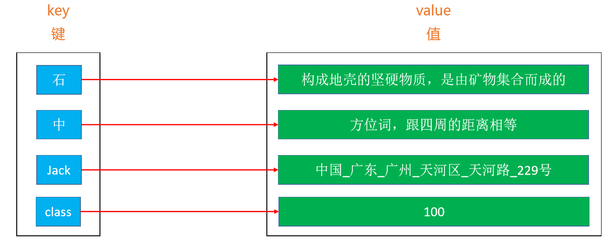

# 映射（Map）

- Map在有些编程语言中也叫做字典（dictionary）

- Map的每一个key是唯一的，把Map中的value去掉剩下的key就是一个Set

  

- 类似Set，Map可以直接利用之前学习的链表，二叉搜索树（AVL树，红黑树）等数据结构来实现。

# 映射的接口设计

```java
public interface Map<K, V> {
    int size();
    boolean isEmpty();
    void clear();
    V put(K key, V value); //添加元素
    V get(K key);
    V remove(K key);
    boolean containsKey(K key); //查找key是否存在
    boolean containsValue(V value); //查找value是否存在
    void traversal(Visitor<K, V> visitor); //元素遍历
	
    public static abstract class Visitor<K, V> {
        boolean stop;
        public abstract boolean visit(K key, V value);
    }
}
```

# 映射的实现

## 实现前的准备

```java
@SuppressWarnings({"unchecked", "unused"})
public class TreeMap<K, V> implements Map<K, V> {

    /*
	再用红黑树实现的逻辑实现TreeMap，把TreeMap当作一棵红黑树来实现
	 */

    //false代表红色结点，true代表黑色结点
    private static final boolean RED = false;
    private static final boolean BLACK = true;

    //字典的大小
    private int size;

    //万物之源的根节点
    private Node<K, V> root;

    //用来自定义自己的比较方法
    private Comparator<K> comparator;

    public TreeMap() {
        this(null);
    }

    public TreeMap(Comparator<K> comparator) {
        this.comparator = comparator;
    }

    //有自己存储键值对的结点
    private static class Node<K, V> {
        //存储键
        K key;
        //存储值
        V value;
        //默认结点颜色为红色
        boolean color = RED;
        //能够连接其左右孩子和父节点
        Node<K, V> left;
        Node<K, V> right;
        Node<K, V> parent;

        //每次创建的结点保证与父节点相连
        public Node(K key, V value, Node<K, V> parent) {
            this.key = key;
            this.value = value;
            this.parent = parent;
        }

        //判断自己是否为叶子结点
        public boolean isLeaf() {
            return left == null && right == null;
        }

        //判断自己是否有两个孩子
        public boolean hasTwoChildren() {
            return left != null && right != null;
        }

        //判断自己是否为左孩子
        public boolean isLeftChild() {
            return parent != null && this == parent.left;
        }

        //判断自己是否为右孩子
        public boolean isRightChild() {
            return parent != null && this == parent.right;
        }

        //知道自己的兄弟结点是谁
        public Node<K, V> sibling() {

            //如果自己是左孩子，那么父节点的右孩子必然是自己的兄弟
            if (isLeftChild()) {
                return parent.right;
            }

            //如果自己是右孩子，那么父节点的左孩子必然是自己的兄弟
            if (isRightChild()) {
                return parent.left;
            }

            return null;
        }
    }
    
    //将传入的结点染成传入的颜色
	private Node<K, V> color(Node<K, V> node, boolean color) {
		if (node == null) return null;
		node.color = color;
		return node;
	}
	//默认把传入的结点染成红色
	private Node<K, V> red(Node<K, V> node) {
		return color(node, RED);
	}
	//默认把传入的结点染成黑色
	private Node<K, V> black(Node<K, V> node) {
		return color(node, BLACK);
	}
	//得到传入结点的颜色
	private boolean colorOf(Node<K, V> node) {
		return node == null ? BLACK : node.color;
	}
	//判断传入的结点是否为黑色
	private boolean isBlack(Node<K, V> node) {
		return colorOf(node) == BLACK;
	}
	//判断传入的结点是否为红色
	private boolean isRed(Node<K, V> node) {
		return colorOf(node) == RED;
	}
```

## TreeMap接口实现

```java
//直接返回size即可
public int size() {
    return size;
}

public boolean isEmpty() {
    return size == 0;
}

public void clear() {
    //消除了根节点的指针域，所有的结点都会被回收
    root = null;
    size = 0;
}
```

### 添加—put(K key, V value)

```java
    /*
	往字典中放入对应的键和值，对于怎么把结点放入Tree中我们用key来比较
	 */
	@Override
	public V put(K key, V value) {
		//先检查数据合法性，key不能为空
		keyNotNullCheck(key);
		
		// 添加第一个节点
		if (root == null) {
			root = new Node<>(key, value, null);
			size++;

			// 新添加节点之后的处理
			afterPut(root);
			//在根节点之前没有旧的value可以返回
			return null;
		}
		
		// 添加的不是第一个节点
		// 找到父节点
		Node<K, V> parent = root;
		Node<K, V> node = root;
		int cmp = 0;
		do {
			//新结点的key从上往下进行比较
			cmp = compare(key, node.key);
			//备份它与之比较的这个结点，它必定成为其中一个与之比较的结点的孩子
			parent = node;

			//大于就放右边，小于就放左边，等于就用新的value覆盖key对应的旧value
			if (cmp > 0) {
				node = node.right;
			} else if (cmp < 0) {
				node = node.left;
			} else { // 相等：保存旧值，覆盖旧值，最后返回旧值
				node.key = key;
				V oldValue = node.value;
				node.value = value;
				return oldValue;
			}
			//只有与新结点比较的结点有了合适的儿子结点的空位，那么这个新结点退出比较且插入该结点中
		} while (node != null);

		// 根据比较结果看看插入到父节点的哪个位置，连接其父节点
		Node<K, V> newNode = new Node<>(key, value, parent);
		//父节点连接该新结点
		if (cmp > 0) {
			parent.right = newNode;
		} else {
			parent.left = newNode;
		}
		//添加成功数据+1
		size++;
		
		// 新添加节点之后的处理：调节平衡
		afterPut(newNode);
		//只要key不相同则不存在覆盖旧值的情况
		return null;
	}

//----------------------比较方法---------------------------------

	//要么实现比较器定义比较逻辑，要么实现Comparable接口重写Comparable方法定义比较逻辑
	private int compare(K e1, K e2) {
		if (comparator != null) {
			return comparator.compare(e1, e2);
		}
		return ((Comparable<K>)e1).compareTo(e2);
	}

//-------------------添加结点之后进行平衡修复--------------------

	private void afterPut(Node<K, V> node) {
		//先拿到刚刚的添加结点的父节点
		Node<K, V> parent = node.parent;

		// 添加的是根节点 或者 上溢到达了根节点，直接把父节点染黑即可
		if (parent == null) {
			black(node);
			return;
		}

		// 如果父节点是黑色，插入完全合理则直接返回
		if (isBlack(parent)) return;

		/*
		父节点是红色来到以下逻辑
		 */

		// 叔父节点
		Node<K, V> uncle = parent.sibling();
		// 祖父节点：染红
		Node<K, V> grand = red(parent.parent);
		if (isRed(uncle)) { // 叔父节点是红色【B树节点上溢】
			black(parent);
			black(uncle);
			// 把祖父节点当做是新添加的节点进行递归调用处理
			afterPut(grand);
			return;
		}

		// 叔父节点不是红色
		if (parent.isLeftChild()) { // L
			if (node.isLeftChild()) { // LL
				black(parent);
			} else { // LR
				black(node);
				rotateLeft(parent);
			}
			rotateRight(grand);
		} else { // R
			if (node.isLeftChild()) { // RL
				black(node);
				rotateRight(parent);
			} else { // RR
				black(parent);
			}
			rotateLeft(grand);
		}
	}
```

### 根据key返回对应的value—get(K key)

```java
@Override
public V get(K key) {
    //根据node的返回结果，该结点有可能为null,如果存在就返回value的值
    Node<K, V> node = node(key);
    return node != null ? node.value : null;
}

//------------------根据结点的key值找到该结点是谁---------------

private Node<K, V> node(K key) {
    //从根节点开始往下进行查找
    Node<K, V> node = root;

    //1.查找到了存储key的结点，返回该node
    //2.没有对应的结点，返回null
    while (node != null) {
        int cmp = compare(key, node.key);
        if (cmp == 0) return node;
        if (cmp > 0) {
            node = node.right;
        } else { // cmp < 0
            node = node.left;
        }
    }
    return null;
}
```

### 判断对应的key是否存在—containsKey(K key)

```java
@Override
public boolean containsKey(K key) {
    //只要node的查询返回不为空该node必然存在
    return node(key) != null;
}
```

### 判断对应的value是否存在—containsValue(V value)

```java
//因为value没有可比较性，所以只能通过遍历往下查找：使用层序遍历
@Override
public boolean containsValue(V value) {
    if (root == null) return false;

    //创建队列并将根元素入队
    Queue<Node<K, V>> queue = new LinkedList<>();
    queue.offer(root);

    while (!queue.isEmpty()) {
        //出队元素
        Node<K, V> node = queue.poll();

        //比较外面传入的value与当前结点的value，相等就直接返回
        if (valEquals(value, node.value)) return true;

        //左右子节点若不为空则入队
        if (node.left != null) {
            queue.offer(node.left);
        }

        if (node.right != null) {
            queue.offer(node.right);
        }
    }

    //对列都为空了还没有找到与value相等的值
    return false;
}

//--------------------比较：排除空指针异常-------------------------

private boolean valEquals(V v1, V v2) {
		//value的值可能为空的，必须先进行判断
		//如果v1的值为空那么判断v2是否为空；v1的值不为空才进行equals比较，避免出现空指针异常
		//return v1 == null ? v2 == null : v1.equals(v2);
    
		return Objects.equals(v1, v2);//系统自带的排空比较对象是否相等的方法，逻辑和上方的代码相同
	}
```

### 删除key对应的结点并返回该结点的value—remove(K key)

```java
@Override
public V remove(K key) {
    //根据key找到对应的node再删除
    return remove(node(key));
}

//---------------------删除对应的node结点-------------------------

private V remove(Node<K, V> node) {
    //结点都为空直接返回
    if (node == null) return null;

    //只要结点不为空，必然被删除，数据-1
    size--;
    //先备份旧value以供返回值需要
    V oldValue = node.value;

    if (node.hasTwoChildren()) { // 删除度为2的节点
        // 先找到后继节点s
        Node<K, V> s = successor(node);
        // 用后继节点的值覆盖度为2的节点的值
        node.key = s.key;
        node.value = s.value;
        // 删除后继节点
        node = s;
    }

    // 删除node节点（node的度必然是1或者0）
    Node<K, V> replacement = node.left != null ? node.left : node.right;

    if (replacement != null) { // 如果node是度为1的节点
        // 更改parent：父节点可以为null所以不用判断
        replacement.parent = node.parent;
        // 更改parent的left、right的指向
        if (node.parent == null) { // node是度为1的节点并且是根节点
            root = replacement;
        } else if (node == node.parent.left) {
            node.parent.left = replacement;
        } else { // node == node.parent.right
            node.parent.right = replacement;
        }

        // 删除节点之后的处理
        afterRemove(replacement);
    } else if (node.parent == null) { // 度为0的情况：node是叶子节点并且是根节点
        root = null;
    } else { // node是叶子节点，但不是根节点
        if (node == node.parent.left) {
            node.parent.left = null;
        } else { // node == node.parent.right
            node.parent.right = null;
        }

        // 删除节点之后的处理
        afterRemove(node);
    }
    //以上if->else if->else:依次执行，如果其中一个环节的到执行，其下面的环节不会被执行

    return oldValue;
}

//----------------------结点被删除之后的调整-----------------------

private void afterRemove(Node<K, V> node) {
		// 如果删除的节点是红色
		// 或者 用以取代删除节点的子节点是红色
		if (isRed(node)) {
			black(node);
			return;
		}
		
		Node<K, V> parent = node.parent;
		if (parent == null) return;
		
		// 删除的是黑色叶子节点【下溢】
		// 判断被删除的node是左还是右
		boolean left = parent.left == null || node.isLeftChild();
		Node<K, V> sibling = left ? parent.right : parent.left;
		if (left) { // 被删除的节点在左边，兄弟节点在右边
			if (isRed(sibling)) { // 兄弟节点是红色
				black(sibling);
				red(parent);
				rotateLeft(parent);
				// 更换兄弟
				sibling = parent.right;
			}
			
			// 兄弟节点必然是黑色
			if (isBlack(sibling.left) && isBlack(sibling.right)) {
				// 兄弟节点没有1个红色子节点，父节点要向下跟兄弟节点合并
				boolean parentBlack = isBlack(parent);
				black(parent);
				red(sibling);
				if (parentBlack) {
					afterRemove(parent);
				}
			} else { // 兄弟节点至少有1个红色子节点，向兄弟节点借元素
				// 兄弟节点的左边是黑色，兄弟要先旋转
				if (isBlack(sibling.right)) {
					rotateRight(sibling);
					sibling = parent.right;
				}
				
				color(sibling, colorOf(parent));
				black(sibling.right);
				black(parent);
				rotateLeft(parent);
			}
		} else { // 被删除的节点在右边，兄弟节点在左边
			if (isRed(sibling)) { // 兄弟节点是红色
				black(sibling);
				red(parent);
				rotateRight(parent);
				// 更换兄弟
				sibling = parent.left;
			}
			
			// 兄弟节点必然是黑色
			if (isBlack(sibling.left) && isBlack(sibling.right)) {
				// 兄弟节点没有1个红色子节点，父节点要向下跟兄弟节点合并
				boolean parentBlack = isBlack(parent);
				black(parent);
				red(sibling);
				if (parentBlack) {
					afterRemove(parent);
				}
			} else { // 兄弟节点至少有1个红色子节点，向兄弟节点借元素
				// 兄弟节点的左边是黑色，兄弟要先旋转
				if (isBlack(sibling.left)) {
					rotateLeft(sibling);
					sibling = parent.left;
				}
				
				color(sibling, colorOf(parent));
				black(sibling.left);
				black(parent);
				rotateRight(parent);
			}
		}
	}

//--------------------返回传入结点的前驱结点------------------------

	private Node<K, V> predecessor(Node<K, V> node) {
		if (node == null) return null;
		
		// 前驱节点在左子树当中（left.right.right.right....）
		Node<K, V> p = node.left;
		//只要左子树不为空一定可以在左子树找到该前驱结点
		if (p != null) {
			while (p.right != null) {
				p = p.right;
			}
			return p;
		}
		
		// 从父节点、祖父节点中寻找前驱节点，最多需要找到根结点
		while (node.parent != null && node == node.parent.left) {
			node = node.parent;
		}
		// ↑ 只要发现该结点是其父节点的右孩子或是其祖父结点的右孙子则找到前驱结点

		// node.parent == null
		// node == node.parent.right
		return node.parent;
	}
	
//--------------------返回传入结点的后继结点------------------------

	private Node<K, V> successor(Node<K, V> node) {
		if (node == null) return null;
		
		// 前驱节点在左子树当中（right.left.left.left....）
		Node<K, V> p = node.right;
		if (p != null) {
			while (p.left != null) {
				p = p.left;
			}
			return p;
		}
		
		// 从父节点、祖父节点中寻找前驱节点
		while (node.parent != null && node == node.parent.right) {
			node = node.parent;
		}

		return node.parent;
	}
```

### 默认使用中序遍历—traversal(Visitor<K, V> visitor)

```java
@Override
public void traversal(Visitor<K, V> visitor) {
    if (visitor == null) return;
    traversal(root, visitor);
}
//进行中序遍历数据有序，这样比较有意义
private void traversal(Node<K, V> node, Visitor<K, V> visitor) {
    //如果stop为空则结束当前状态下所有的递归调用
    if (node == null || visitor.stop) return;

    traversal(node.left, visitor);
    //如果stop为true则不需要再向外界传出key和value的值了
    if (visitor.stop) return;
    //把key和value的值向外界传递，哪里实现的Visitor对象就传到哪里
    visitor.visit(node.key, node.value);
    traversal(node.right, visitor);
}

//----------------Visitor这个方法在Map接口里面------------------------------
//只能通过抽象类的子类来创建或者使用匿名内部类的方式直接覆写方法
public static abstract class Visitor<K, V> {
		boolean stop;
		public abstract boolean visit(K key, V value);
	}
```

## 测试

```java
public class Main {
	//测试相同的key值value值是否别覆盖
	static void test1() {
		Map<String, Integer> map = new TreeMap<>();
		map.put("c", 2);
		map.put("a", 5);
		map.put("b", 6);
		map.put("a", 8);
		//测试中序遍历是否有序
		map.traversal(new Map.Visitor<String, Integer>() {
			public boolean visit(String key, Integer value) {
				System.out.println(key + "_" + value);
				return false;
			}
		});
	}
	
	/*
	统计一个文件夹里的文件数量，代码行数和单词数量
	 */
	static void test2() {
        
		FileInfo fileInfo = Files.read("D:\\用户\\桌面\\恋上数据结构与算法\\1.代码\\09-集合\\src", new String[]{"java"});

		System.out.println("文件数量：" + fileInfo.getFiles());
		System.out.println("代码行数：" + fileInfo.getLines());
		String[] words = fileInfo.words();
		System.out.println("单词数量：" + words.length);
		
		Map<String, Integer> map = new TreeMap<>();
		//取出words数组里的数据
		for (String word : words) {
			Integer count = map.get(word);
			//如果之前map中有该单词则数量加一，map储存这个单词和这个单词出现的次数
			count = (count == null) ? 1 : (count + 1);
			map.put(word, count);
		}
		
		map.traversal(new Map.Visitor<String, Integer>() {
			public boolean visit(String key, Integer value) {
				System.out.println(key + "_" + value);
				return false;
			}
		});
	}
}
```

# Map与Set

把Map的value去掉就是一个Set，可以利用Map来实现Set

## TreeSet的接口设计

```java
public interface Set<E> {
	int size();
	boolean isEmpty();
	void clear();
	boolean contains(E element);
	void add(E element);
	void remove(E element);
	void traversal(Visitor<E> visitor);
	
	public static abstract class Visitor<E> {
		boolean stop;
		public abstract boolean visit(E element);
	}
}
```

## 接口实现

```java
package set;
import map.Map;
import map.TreeMap;

public class TreeSet<E> implements Set<E> {
	//统一Map的key和TreeSet的泛型
	Map<E, Object> map = new TreeMap<>();

	@Override
	public int size() {
		return map.size();
	}

	@Override
	public boolean isEmpty() {
		return map.isEmpty();
	}

	@Override
	public void clear() {
		map.clear();
	}

	@Override
	public boolean contains(E element) {
		//只有Map中的key值存在则集合中的元素存在
		return map.containsKey(element);
	}

	@Override
	public void add(E element) {
		//value的值并不重要，重点是储存key的值
		map.put(element, null);
	}

	@Override
	public void remove(E element) {
		map.remove(element);
	}

	//这个遍历接口是Set中的实现
	@Override
	public void traversal(Visitor<E> visitor) {//传入Set类的Visitor对象
		//本质是调用TreeMap的遍历方法
		map.traversal(new Map.Visitor<E, Object>() {
			@Override
			public boolean visit(E key, Object value) {
                //把map中visitor遍历得到的key再返回给set中 
				return visitor.visit(key);
			}
		});
	}
}
```

## 测试

```java
public class Main {
    static void test3() {
        Set<String> set = new TreeSet<>();
        set.add("c");
        set.add("b");
        set.add("c");
        set.add("c");
        set.add("a");

        set.traversal(new Set.Visitor<String>() {
            public boolean visit(String element) {
                System.out.println(element);
                return false;
            }
        });
    }
}
```

# TreeMap分析 

- 时间复杂度（平均） 添加、删除、搜索：O(logn)
- 特点 
  - Key 必须具备可比较性 
  - 元素的分布是有顺序的
- 在实际应用中，很多时候的需求 
  - Map 中存储的元素不需要讲究顺序 
  - Map 中的 Key 不需要具备可比较性
- **不考虑顺序、不考虑 Key 的可比较性，Map 有更好的实现方案，平均时间复杂度可以达到 O(1) ，那就是采取哈希表来实现 Map**