# 常见算法的稳定性

堆排序、快速排序、希尔排序、直接选择排序不是稳定的排序算法，而基数排序、冒泡排序、直接插入排序、折半插入排序、归并排序是稳定的排序算法。

# 稳定性的意义

1. 如果只是简单的进行数字的排序，那么稳定性将毫无意义。
2. 如果排序的内容仅仅是一个复杂对象的某一个数字属性，那么稳定性依旧将毫无意义
3. 如果要排序的内容是一个复杂对象的多个数字属性，但是其原本的初始顺序毫无意义，那么稳定性依旧将毫无意义。
4. 除非要排序的内容是一个复杂对象的多个数字属性，且其原本的初始顺序存在意义，那么我们需要在二次排序的基础上保持原有排序的意义，才需要使用到稳定性的算法，例如要排序的内容是一组原本按照价格高低排序的对象，如今需要按照销量高低排序，使用稳定性算法，可以使得想同销量的对象依旧保持着价格高低的排序展现，只有销量不同的才会重新排序。（当然，如果需求不需要保持初始的排序意义，那么使用稳定性算法依旧将毫无意义）
5. 换句话说，以某种关键字的方式排序后，能不影响到其他关键字原来排序结果的方法就是稳定的，比如一开始按照价格高低排序结果为 a(10元，卖了5个) b(8元，卖了20个) c(6元，卖了20个) d(4元，卖了30个),则按照销量重拍后如果保持 d(30个,价格为4元) b(20个，价格为8元) c(20个，价格为6元) a(5个，价格为10元)，则说明该方法为稳定的，而如果出现c在b前，破坏了排序前b在c前的顺序，则说明这个方法是不稳定的

# 10大排序算法

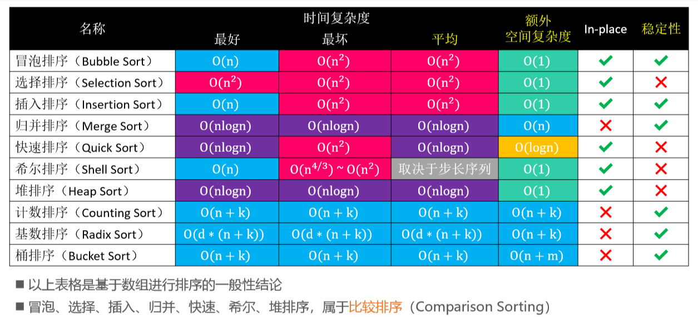

# 冒泡排序（Bubble Sort）

- 冒泡排序也叫做起泡排序
-  执行流程：
  1.  从头开始比较每一对相邻元素，如果第1个比第2个大，就交换它们的位置 
     - 执行完一轮后，最末尾那个元素就是最大的元素
  2.  忽略1中曾经找到的最大元素，重复执行步骤1，直到全部元素有序

## 基础

```java
static void sort1(int[] array){
    //外循环每循环一次就确定一个有序数，总的需要确定n-1个，剩下的一个自然有序了
    for (int i = 0; i < array.length-1; i++) {
        //两两比较，如果有两个数，需要比较一次；三个数需要比较两次
        //n个数第一次比较n-1次,第二次比较n-2次
        //i代表确定的有序数，有i个有序数就少比较i次
        for (int j = 0; j < array.length-1-i; j++) {
            //如果前一个数大于后一个数就交换
            if (array[j]>array[j+1]){
                int temp=array[j+1];
                array[j+1]=array[j];
                array[j]=temp;
            }
        }
    }
}
```

## 优化一

- 如果数据在循环结束之前已经有序了就提前终止循环

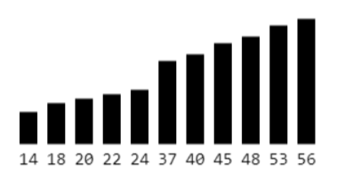

```java
static void sort2(int[] array){
        for (int i = 0; i < array.length - 1; i++) {
            //用来标记是否终止循环
            boolean start=true;
            for (int j = 0; j < array.length - 1 - i; j++) {
                if (array[j]>array[j+1]){
                    int temp=array[j+1];
                    array[j+1]=array[j];
                    array[j]=temp;
                    //只要内循环结束有数据交换就证明排序未完成
                    start=false;
                }
            }
            //反之，内循环里没有数据交换说明数据已经有序，可以退出
            if (start) break;
        }
    }
```

这种优化只对基本有序的数据排列有效，如果是大量无序，那么start标记可能一直都没有作用，还多了两个赋值操作，一个判断操作，还浪费空间

## 优化二

-  如果序列尾部已经局部有序，可以记录最后1次交换的位置，减少比较次数

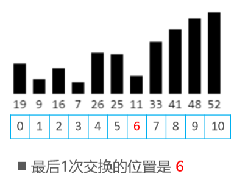

```java
  static void sort3(int[] array){
        int len=array.length;
        //ordered表示有序数数量
        for (int ordered = 0; ordered <len-1; ordered++) {
            //用来统计已经有序的有序数,默认为最好的情况，全都是排好序的
            int sortIndex=len;
            for (int j = 0; j < len - 1 - ordered; j++) {
                if (array[j]>array[j+1]){
                    int temp=array[j+1];
                    array[j+1]=array[j];
                    array[j]=temp;
                    //最后一次执行还有j个数无序
                    sortIndex=(len-j-2);
                }
            }
            //如果是最好的情况
            ordered=sortIndex;
        }
    }
```

但是这里要进行`sortIndex=(len-j-2);`两次减法操作，很耗性能，也不是最佳的解决办法

## 优化三

- 基于优化二的思路，从逆向开始循环，记录无序数的个数，从第二个开始进行与它前面的数的比较

```java
static void sort4(int[] array) {
        //disorder记录的是未排好序的数的数量
        for (int disorder = array.length-1; disorder >0 ; disorder--) {
            //记录每次循环后未排好序的数量
            int sortIndex=0;
            //每次只用循环访问到最后一个无序数,disorder之后的数已经有序了
            for (int begin = 1; begin <=disorder; begin++) {
                if (array[begin]<array[begin-1]){
                    int temp=array[begin];
                    array[begin-1]=array[begin];
                    array[begin]=temp;
                    //循环结束之后begin=无序数数量+1个有序数
                    sortIndex=begin;
                }
            }
            //end再进行减减操作就是未排序的数量
            disorder=sortIndex;
        }
    }
```

`sortIndex=begin;`操作和`disorder--`操作正好匹配，得到的正好就是无序数的数量

# 选择排序（Selection Sort）

执行流程 ：

1.  从序列中找出最大的那个元素，然后与最末尾的元素交换位置，执行完一轮后，最末尾的那个元素就是最大的元素
2.  忽略1中曾经找到的最大元素，重复执行步骤1

- 选择排序的交换次数要远远少于冒泡排序，平均性能优于冒泡排序 
-  最好、最坏、平均时间复杂度：`O(n2)`，空间复杂度：`O(1)`，属于不稳定排序
-  思考：选择排序是否还有优化的空间？ 
  - 使用堆来选择最大值 

## 基础

```java
static void sort1(int[] array){
    //数组长度
    int len=array.length;
    for (int i = 0; i < len-1; i++) {
        //记录每一轮比较后最大值的下标
        int maxIndex=0;
        //j从1开始
        for (int j = 1; j < len - i; j++) {
            //默认第一个数最大，与后面的数依次比较
            //为了使算法具有稳定性，大小相等时也要交换最大值下标
            if (array[maxIndex]<=array[j]){
                //记录每次比较后较大值的下标
                maxIndex=j;
            }
        }
        //比较结束后与无序数列的最后一个值交换位置
        int temp=array[maxIndex];
        array[maxIndex]=array[len-1-i];
        array[len-1-i]=temp;
    }
}
```

## 优化

- 从第二个数开始往前比较更好

```java
static void sort2(int[] array){
    //一开始整个数组都是无序的，disorder记录数组的最后一个无序数下标
    //10个数只需要交换9次就可以整体有序
    for (int disorder =array.length-1 ; disorder > 0 ; disorder--) {
        //记录一轮内循环后最后值的下标
        int maxIndex=0;
        //从第二个数比到最后一个数，遇到较大的数就记录其下标
        for (int begin = 1; begin <= disorder; begin++) {
            if (array[maxIndex]<array[begin]){
                //循环结束得到的就是最大值下标
                maxIndex=begin;
            }
        }
        //最大值交换到无序数列最后
        int temp=array[maxIndex];
        array[maxIndex]=array[disorder];
        array[disorder]=temp;
    }
}
```

# 堆排序（Heap Sort）

可以看做是对选择排序的优化，这是不稳定的排序

执行流程 

1.  对序列进行原地建堆`（heapify） `
2.  重复执行以下操作，直到堆的元素数量为 1 
   - ✓交换堆顶元素与尾元素 
   - ✓堆的元素数量减 1 
   - √对 0 位置进行 1 次 `siftDown `操作

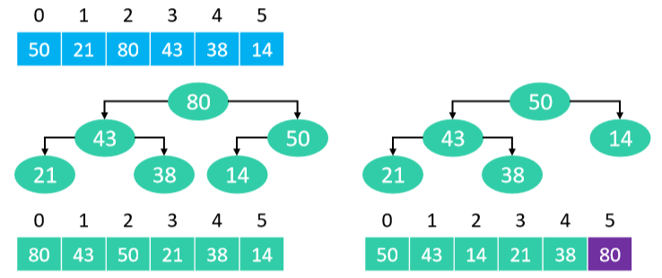

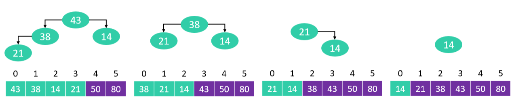

```java
public class HeapSort extends Sort {
    //堆的大小
    private int heapSize;
    @Override
    protected void sort() {
        //先进行原地建堆
        //初始化堆的大小
        heapSize=array.length;
        //采用自下而上的下溢,从最后一个非叶子结点开始
        for (int notLeaf = (heapSize>>1)-1; notLeaf >=0 ; notLeaf--) {
            siftDown(notLeaf);
        }

        //堆建好之后把堆顶元素依次与最后一个元素交换
        //起码得有两个元素才能进行交换
        while (heapSize>1){
            //把heapSize-1和heapSize--的操作合并
            swap(0,--heapSize);
            //对0位置进行siftDown（恢复堆的性质）
            siftDown(0);
        }
    }

    private void siftDown(int index){
        //先取出要下溢的元素
        int element=array[index];
        //明确只有非叶子结点才需要进行下溢
        //非叶子结点的数量
        int notLeaf=heapSize>>1;
        //下溢结点必须在非叶子结点的范围
        while (index<notLeaf){
            //取出左孩子节点的位置和元素
            int childIndex=(index<<1)+1;
            int maxChild=array[childIndex];
            //判断是否有右孩子
            int rightIndex=childIndex+1;
            if (rightIndex<heapSize&&compare(childIndex,rightIndex)<0){
                maxChild=array[rightIndex];
                childIndex=rightIndex;
            }
            //用的大孩子节点和父节点比价
            if (element>array[childIndex]) break;
            //用大的孩子节点覆盖父节点的值
            array[index]=maxChild;
            //index指针下移
            index=childIndex;
        }
        array[index]=element;
    }
}
```

# 插入排序（Insertion Sort）

- 插入排序非常类似于扑克牌的排序

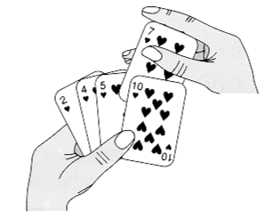

- 执行流程 :
  1. 在执行过程中，插入排序会将序列分为2部分 
     - 头部是已经排好序的，尾部是待排序的
  2. 从头开始扫描每一个元素 
     - 每当扫描到一个元素，就将它插入到头部合适的位置，使得头部数据依然保持有序

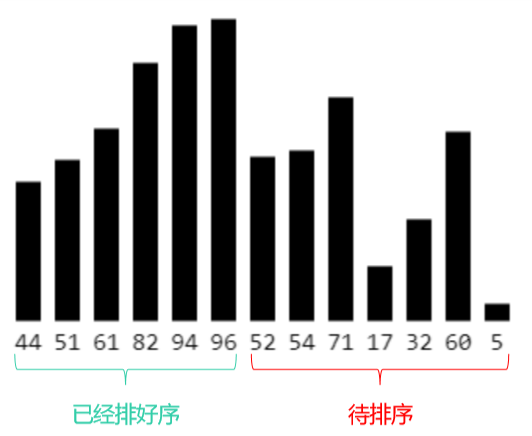

## 基础

```java
protected void sort1() {
    for (int begin = 1; begin < array.length; begin++) {
        //摸出第二张牌和手里的一张牌比较
        //再摸出第三张牌和前面的两张牌依次再比较
        for (int i = begin; i >0 ; i--) {
            //比前一张牌小就交换位置
            if (compare(i,i-1)<0){
                swap(i,i-1);
            }
        }
    }
```

## 优化一

**将交换改为挪动，逆序对越多优化越明显**

- 什么是逆序对？ 

  - 数组 <2,3,8,6,1> 的逆序对为：<2,1> <3,1> <8,1> <8,6> <6,1>，共5个逆序对

- 插入排序的时间复杂度与逆序对的数量成正比关系 

  - 逆序对的数量越多，插入排序的时间复杂度越高

    ```java
    9 8 7 6 5 4 3 2
    8 9 7 6 5 4 3 2
    7 8 9 6 5 4 3 2
    6 7 8 9 5 4 3 2
    5 6 7 8 9 4 3 2
    4 5 6 7 8 9 3 2
    3 4 5 6 7 8 9 2
    2 3 4 5 6 7 8 9
    ```

-  最坏、平均时间复杂度：`O(n2) `

- 最好时间复杂度：`O(n) `

- 空间复杂度：`O(1) `

- 属于稳定排序

- 当逆序对的数量极少时，插入排序的效率特别高 

  - 甚至速度比 `O (nlogn) `级别的快速排序还要快 

- 数据量不是特别大的时候，插入排序的效率也是非常好的


**挪动思路：**

1. 先将待插入的元素备份 
2.  头部有序数据中比待插入元素大的，都朝尾部方向挪动1个位置 
3.  将待插入元素放到最终的合适位置

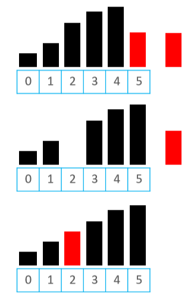

```java
protected void sort2(){
        for (int begin = 1; begin < array.length; begin++) {
            //先备份数据
            int save=array[begin];
            //备份数据的起始位置，也是最终位置
            int cur=begin;
            for (int j = begin; j >0 ; j--) {
                if (save<array[j-1]){
                    //往后挪动一位
                    array[j]=array[j-1];
                    //备份数据现在的实际位置
                    cur--;
                }else {
                    //begin前面都是有序的
                    //备份数据不比前面的数小就提前退出
                    break;
                }
            }
            //放回实际位置
            array[cur]=save;
        }
    }
```

**可以把for循环改成while循环**

```java
private void sort3(){
    for (int begin = 1; begin < array.length; begin++) {
        //取出待插入元素备份
        int save=array[begin];
        //待插入元素该插入的位置
        int cur=begin;
        while (cur>0&&save<array[cur-1]){
            array[cur]=array[cur-1];
            cur--;
        }
        array[cur]=save;
    }
```

## 优化二

利用二分搜索减少比较次数

- 假设在 [begin, end) 范围内搜索某个元素 v，mid == (begin + end) / 2 
-  如果 v < m，去 [begin, mid) 范围内二分搜索 
-  如果 v ≥ m，去 [mid + 1, end) 范围内二分搜索

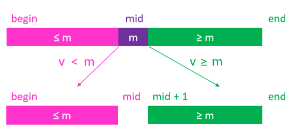

- 在元素 v 的插入过程中，可以先二分搜索出合适的插入位置，然后再将元素 v 插入

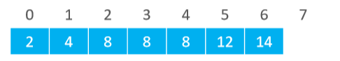

- 要求二分搜索返回的插入位置：第1个大于 v 的元素位置 
  - 如果 v 是 5，返回 2 
  - 如果 v 是 1，返回 0 
  - 如果 v 是 15，返回 7 
  - 如果 v 是 8，返回 5

```java
public class InsertionSort extends Sort{
    @Override
    protected void sort() {
        for (int begin = 1; begin < array.length; begin++) {
            //返回待插入元素应该插入的正确索引
            int insertIndex=search(begin);
            //备份待插入元素
            int insertElement=array[begin];
            //把[insertIndex，begin)里的元素都往后移动一位
            for (int i = begin-1; i >=insertIndex; i--) {
                array[i+1]=array[i];
            }
            //插入最终的合适位置
            array[insertIndex]=insertElement;
        }
    }

    /**
     * 利用二叉搜索算法,排好序的数左闭右开[0,index)
     * @param index 传入一个数组索引
     * @return 该元素应该插入的位置
     */
    private int search(int index){
        //[begin,end)
        int begin=0;
        int end=index;
        //要找到比传入元素第一个大的索引位置
        while (begin<end){
            int mid=(begin+end)>>1;
            if (compare(index,mid)<0){
                end=mid;
            }else {//大于等于零都往右边找
                begin=mid+1;
            }
        }
        //最终begin==end return[begin]也一样
        return end;
    }
}
```

## 实例

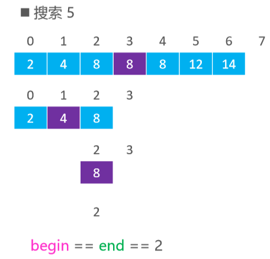

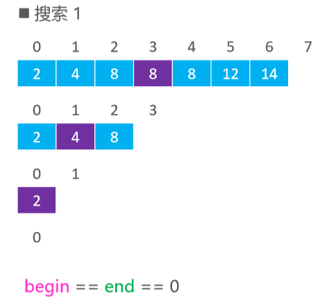

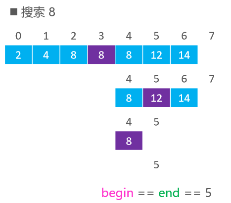

# 二分搜索（Binary Search）

- 假设在 [begin, end) 范围内搜索某个元素 v，mid == (begin + end) / 2 
-  如果 v < m，去 [begin, mid) 范围内二分搜索 
-  如果 v ≥ m，去 [mid + 1, end) 范围内二分搜索
-  如果 v == m，直接返回 mid

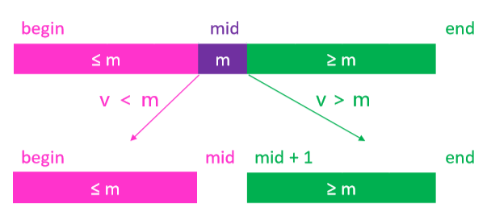

## 普通求解

```java
public class BinarySearch {
    //传入数组和元素，返回这个元素在数组中的下标
    public static int indexOf(int[] array,int element){
        //起点
        int begin=0;
        //终点
        int end=array.length;
        //搜索范围[begin,end)
        //end-begin==元素的总数
        //必须要至少两个数
        while (begin<end){
            //中点
            int mid=(end+begin)>>1;
            //从中间开始比较
            if (element<array[mid]){
                //begin的位置不变，end改变
                //[begin,mid)
                end=mid;
            }else if (element>array[mid]){
                //end的位置不变，begin改变
                //[mid+1,end)
                begin=mid+1;
            }else {
                //找到该元素
                return mid;
            }
        }
        //该元素不存在
        return -1;
    }
}
```

## 命中过程

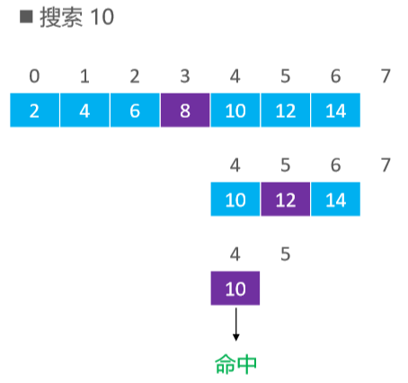

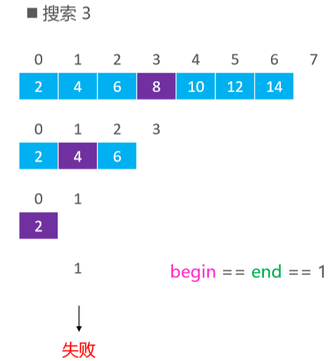

## 递归求解

```java
private int binarySearch(int[] array,int target){
    //一定要保证二分查找的数组有序
    Arrays.sort(array);
    return binarySearch( array,0,array.length,target);
}
    /**
     *
     * @param begin 起点
     * @param end 终点
     * @param target 目标值
     * @return 返回目标值在数组中的索引
     */
private int binarySearch(int[] array,int begin, int end,int target){
    //array.length是数组的边界,都到边界了还没有找到必然不存在
    if (begin >= end) return -1;
    int mid = (begin + end) >>1;
    if (target > array[mid]){
        return binarySearch(array,mid+1,end,target);
    }else if (target < array[mid]){
        return binarySearch(array,begin,mid,target);
    }else {
        return mid;
    }
}
```

# 归并排序（Merge Sort）

- 1945年由约翰·冯·诺伊曼`（John von Neumann）`首次提出
-  执行流程 
  1. 不断地将当前序列平均分割成2个子序列 
     - ✓直到不能再分割（序列中只剩1个元素） 
  2.  不断地将2个子序列合并成一个有序序列
     - ✓直到最终只剩下1个有序序列

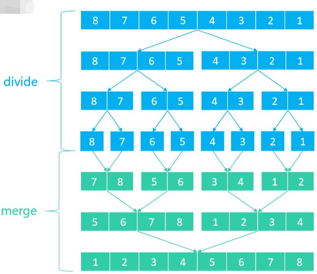

##  merge细节

- 需要 merge 的 2 组序列存在于同一个数组中，并且是挨在一起的

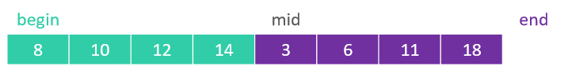

- 为了更好地完成 merge 操作，最好将其中 1 组序列备份出来，比如 [begin, mid)

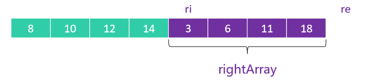

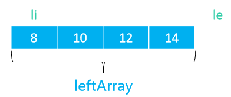

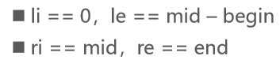

```java
public class MergeSort extends Sort {
    //备份左半边数组
    Integer[] leftArray=null;

    @Override
    protected void sort() {
        leftArray=new Integer[array.length>>1];
        //[0,array.length)
        sort(0,array.length);
    }

    private void sort(int begin,int end){
        //至少要两个数
        if (end-begin<2) return;
        //不断把数组分成两半:分divide
        int mid=(begin+end)>>1;
        //[begin,mid)
        sort(begin,mid);
        //[mid,end)
        sort(mid,end);
        //归并:分而治之
        merge(begin,mid,end);
    }

     /**
     * @param li 左边备份数组的开始索引,由于是新数组,索引默认从0开始
     * @param le 左边备份数组的长度
     * @param ri 原数组中右半部分的开始索引
     * @param re 原数组中右半部分的结束索引
     * @param ai 原数组指向原数组中可以覆盖的位置
     */
    private void merge(int begin,int mid,int end) {
        int li = 0, le = mid - begin;
        int ri = mid, re = end;
        int ai = begin;

        // 备份左边数组
        for (int i = li; i < le; i++) {
            leftArray[i] = array[begin + i];
        }

        // 如果左边备份数组还没有遍历结束
        while (li < le) {
            //如果右边数组提前遍历结束就直接把左边备份数组整体挪到原数组后可覆盖位置
            if (ri < re && array[ri]-leftArray[li] < 0) {
                array[ai++] = array[ri++];
            } else {
                array[ai++] = leftArray[li++];
            }
        }
    }
}
```

# 常见的递推式和复杂度

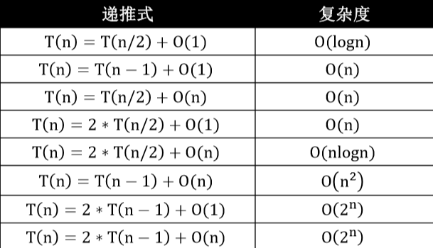

# 快速排序（Quick Sort）

- 1960年由查尔斯·安东尼·理查德·霍尔`（Charles Antony Richard Hoare，缩写为C. A. R. Hoare）`提出 
- 昵称为东尼·霍尔`（Tony Hoare） `

执行流程：

1.  从序列中选择一个轴点元素（pivot） 
   - ✓假设每次选择 0 位置的元素为轴点元素
2.  利用 pivot 将序列分割成 2 个子序列 
   - ✓将小于 pivot 的元素放在pivot前面（左侧）
   -  ✓将大于 pivot 的元素放在pivot后面（右侧） 
   - ✓等于pivot的元素放哪边都可以
3.  对子序列进行 ① ② 操作 
   - ✓直到不能再分割（子序列中只剩下1个元素）

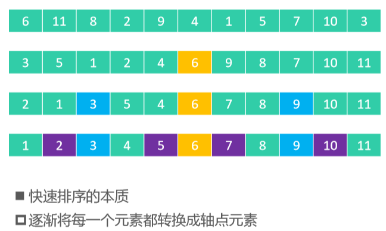

##  轴点构造

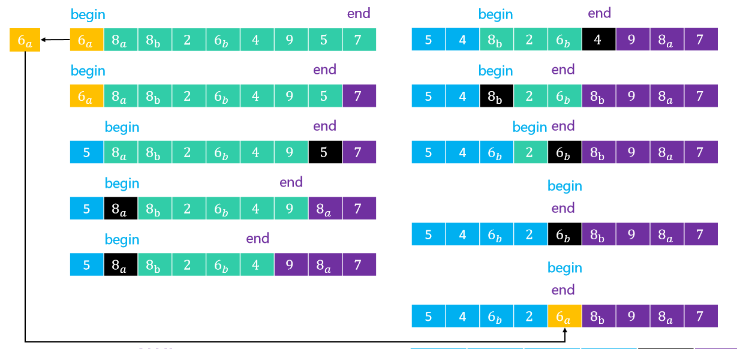

```java
public class QuickSort extends Sort {
    @Override
    protected void sort() {
        sort(0,array.length);
    }

    private void sort(int begin,int end){
        if (end-begin<2) return;

        //找到中轴元素的位置
        int mid=pivotIndex(begin,end);
        // 对子序列进行快速排序
        //[begin,mid)
        sort(begin,mid);
        //[mid+1,end)
        sort(mid+1,end);
    }

    /**
     * 构造出 [begin, end) 范围的轴点元素
     * @return 轴点元素的最终位置
     */
    private int pivotIndex(int begin,int end){
        //备份中轴元素
        int pivot=array[begin];
        //end指向最后一个元素
        end--;
        //找到
        while (begin < end){
            //先从右往左扫描进行比较
            while (begin < end){
                if (pivot < array[end]){
                    end--;
                }else {
                    array[begin++]=array[end];
                    break;
                }
            }
            //再从左往右扫描进行比较
            while (begin < end){
                if (pivot > array[begin]){
                    begin++;
                }else {
                    array[end--]=array[begin];
                    break;
                }
            }
        }
        //begin == end退出循环
        // 将轴点元素放入最终的位置
        array[end]=pivot;
        // 返回轴点元素的位置
        return end;
    }
}
```

## 时间复杂度

-  在轴点左右元素数量比较均匀的情况下，同时也是最好的情况 

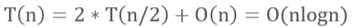

-  如果轴点左右元素数量极度不均匀，最坏情况 

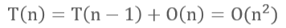

-  为了降低最坏情况的出现概率，一般采取的做法是 
  - 随机选择轴点元素
- 最好、平均时间复杂度：O(nlogn) 
-  最坏时间复杂度：O(n^2) 
-  由于递归调用的缘故，空间复杂度：O(logn) 
- 属于不稳定排序

## 优化

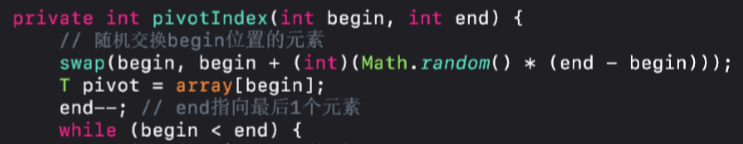

# 希尔排序（Shell Sort）

可以看出是对插入排序的优化

- 1959年由唐纳德·希尔（Donald Shell）提出
-  希尔排序把序列看作是一个矩阵，分成 𝑚 列，逐列进行排序 
  - m从某个整数逐渐减为1 
  - 当 𝑚 为1时，整个序列将完全有序
-  因此，希尔排序也被称为递减增量排序（Diminishing Increment Sort）
- 矩阵的列数取决于步长序列（step sequence） 
  - ✓比如，如果步长序列为{1,5,19,41,109,...}，就代表依次分成109列、41列、19列、5列、1列进行排序 
  - ✓不同的步长序列，执行效率也不同

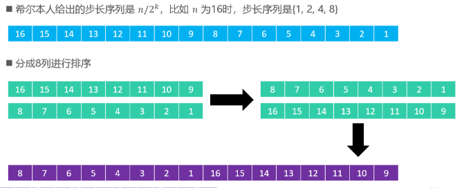

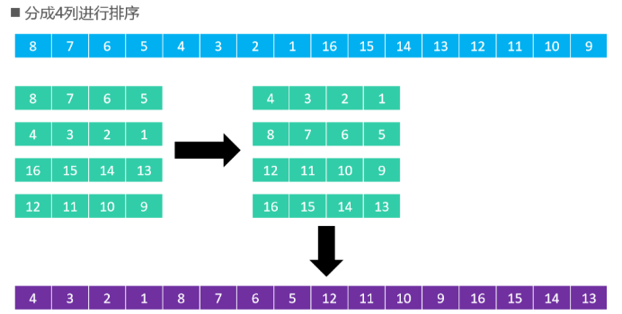

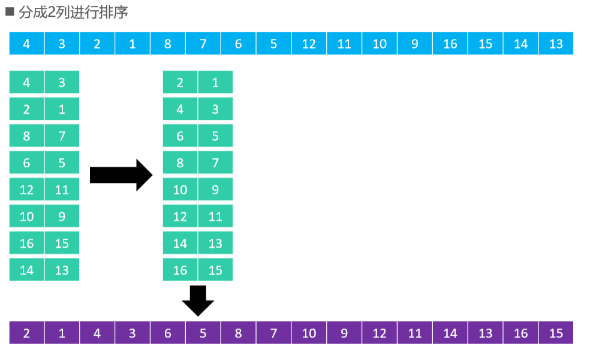

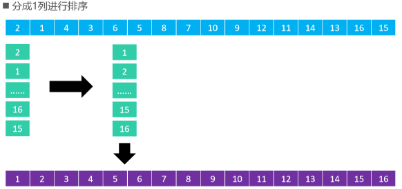

```java
public class ShellSort extends Sort {
    @Override
    protected void sort() {
        //储存步长的数组
        List<Integer> stepSequence=shellStepSequence();
        for (Integer step : stepSequence) {
            sort(step);
        }
    }

    //分成step列，分别对每列进行插入排序
    private void sort(int step){
        // col : 第几列，column的简称
        for (int col = 0; col < step; col++) { // 对第col列进行排序,有step列
            // 每列的元素索引顺序：col、col+step、col+2*step、col+3*step
            for (int begin = col + step; begin < array.length; begin += step) {
                int cur = begin;
                //从每列的第二个元素开始往前比较，接着从第三个元素往前比较...
                //array[cur]<array[cur-step]
                while (cur > col && compare(cur, cur - step) < 0) {
                    swap(cur, cur - step);
                    cur -= step;
                }
            }
        }
    }


    //1986年由Robert SedgeWick提出 计算步长的方法
    private List<Integer> sedgeWick_StepSequence(){
        List<Integer> stepSequence = new LinkedList<>();
        int k = 0, step = 0;
        while (true) {
            if (k % 2 == 0) {
                int pow = (int) Math.pow(2, k >> 1);
                step = 1 + 9 * (pow * pow - pow);
            } else {
                int pow1 = (int) Math.pow(2, (k - 1) >> 1);
                int pow2 = (int) Math.pow(2, (k + 1) >> 1);
                step = 1 + 8 * pow1 * pow2 - 6 * pow2;
            }
            if (step >= array.length) break;
            stepSequence.add(0, step);
            k++;
        }
        return stepSequence;
    }

    //由shell排序的作者提出的划分步长的方法
    private List<Integer> shellStepSequence() {
        List<Integer> stepSequence = new ArrayList<>();
        int step = array.length;
        //在整体数组长度上每次都除以2，直到1
        //step=step/2，数组总长度为16时，步长序列为{1,2,4,8}
        while ((step >>= 1) > 0) {
            stepSequence.add(step);
        }
        return stepSequence;
    }
}
```

# 计数排序（Counting Sort）

- 冒泡、选择、插入、归并、快速、希尔、堆排序，都是基于比较的排序
  - 平均时间复杂度目前最低是 `O(nlogn)`
- 计数排序、桶排序、基数排序，都不是基于比较的排序 
  - 它们是典型的用空间换时间，在某些时候，平均时间复杂度可以比 `O (nlogn) `更低
-  计数排序于1954年由Harold H. Seward提出，适合对一定范围内的整数进行排序
- 计数排序的核心思想 
  - 统计每个整数在序列中出现的次数，进而推导出每个整数在有序序列中的索引

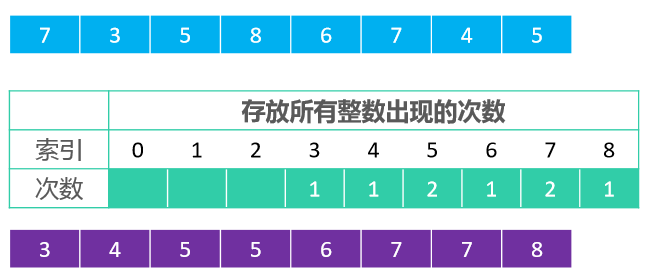

- 这个版本的实现存在以下问题 
  - 无法对负整数进行排序 
  - 极其浪费内存空间
  - 是个不稳定的排序 

## 基础

```java
 private void sort1(){
        //先找出数组中的最大值
        int max=array[0];
        for (int i = 1; i < array.length ; i++) {
            if (max<array[i]){
                max=array[i];
            }
        }
        //得到最大值后开辟新数组,新数组里默认储存的是0
        int[] countArray=new int[max+1];
        //统计array数组里每个数出现的次数
        for (int i = 0; i < array.length; i++) {
            //array数组里的元素被当作countArray数组里的索引
            countArray[array[i]]++;
        }

        //根据出现的整数次数，对array数组进行排序
        int index=0;
        for (int i = 0; i < countArray.length; i++) {
            //如果countArray数组存储空间里的值大于0，说明该索引值存在，即代表着array的值为该索引值
            while (countArray[i]-->0){
                //把countArray下有记录的索引按顺序移动到array中
                array[index++]=i;
            }
        }
    }
```

## 优化一

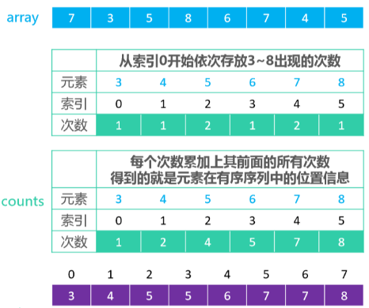

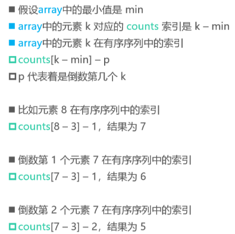

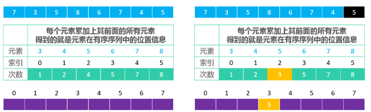


```java
public class CountingSort extends Sort<Integer> {
    @Override
    protected void sort() {
        //1.找出array数组中的最大值和最小值为开辟计数数组的空间作准备
        int max=array[0];
        int min=array[0];
        for (int begin = 1; begin < array.length; begin++) {
            if (max<array[begin]){
                max=array[begin];
            }
            if (min>array[begin]){
                min=array[begin];
            }
        }
        //2.开辟countArray数组空间
        int[] countArray=new int[max-min+1];

        //3.统计array数组中各数的出现次数储存到countArray数组中
        for (int begin = 0; begin < array.length; begin++) {
            countArray[array[begin]-min]++;
        }
        //4.对countArray数组中的计数进行累加
        for (int begin = 1; begin < countArray.length; begin++) {
            countArray[begin]+=countArray[begin-1];
        }
        //5.把有序数组储存到新数组中,从后往前扫描保证数据稳定性
        int[] newArray=new int[array.length];
        for (int begin = array.length-1; begin >=0; begin--) {
            //--a的含义为a先减1之后在覆盖掉a之前的值
           newArray[--countArray[array[begin]-min]]=array[begin];
        }
        //6.把新数组的数据深拷贝到array数组中
        for (int begin = 0; begin < array.length; begin++) {
            array[begin]=newArray[begin];
        }
    }
```

# 基数排序（Radix Sort）

- 基数排序非常适合用于整数排序（尤其是非负整数）
-  执行流程：依次对个位数、十位数、百位数、千位数、万位数...进行排序（从低位到高位）
- 个位数、十位数、百位数的取值范围都是固定的0~9，可以使用计数排序对它们进行排序

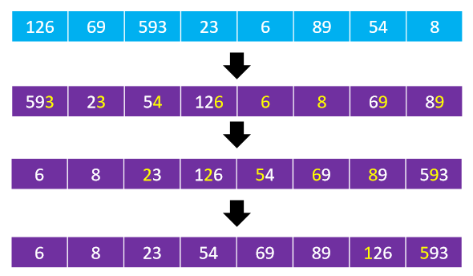

```java
public class RadixSort extends Sort<Integer> {
    @Override
    protected void sort() {
        //先找最大值
        int max=array[0];
        for (int begin = 1; begin < array.length; begin++) {
            if (max<array[begin]){
                max=array[begin];
            }
        }

        //例如593
        // 个位数: array[i] / 1 % 10 = 3
        // 十位数：array[i] / 10 % 10 = 9
        // 百位数：array[i] / 100 % 10 = 5
        // 千位数：array[i] / 1000 % 10 = ...
        
        //分别对数据的个位数，十位数，百位数...进行计数排序
        for (int divider = 1; divider <= max; divider++) {
            countSort(divider);
        }
    }

    private void countSort(int divider){
        //由于是对0-9之间的数进行排序，可以直接给定计数数组的空间大小
        int[] countArray=new int[10];
        //统计每个整数出现的次数
        for (int begin = 0; begin < array.length; begin++) {
            countArray[array[begin]/divider%10]++;
        }
        //依次累加前后计数出现的次数
        for (int begin = 1; begin < countArray.length; begin++) {
            countArray[begin]+=countArray[begin-1];
        }
        //从后往前遍历元素，将它放到有序数组中的合适位置
        int[] newArray=new int[array.length];
        for (int begin = array.length-1; begin >=0 ; begin--) {
            newArray[--countArray[array[begin]/divider%10]]=array[begin];
        }
        //将有序数组赋值到array
        for (int begin = 0; begin < array.length; begin++) {
            array[begin]=newArray[begin];
        }
    }
```

# 桶排序（Bucket Sort）

执行流程 

1. 创建一定数量的桶（比如用数组、链表作为桶） 
2.  按照一定的规则（不同类型的数据，规则不同），将序列中的元素均匀分配到对应的桶 
3.  分别对每个桶进行单独排序 
4.  将所有非空桶的元素合并成有序序列

- 元素在桶中的索引 （这个是根据自定义规则）
  - 元素值 * 元素数量

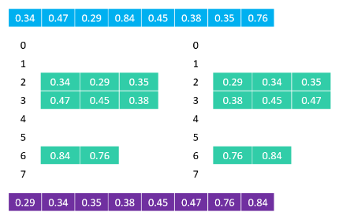


# 休眠排序

- 这只是一个搞笑的排序

```java
public class SortThread extends Thread {
    private int value;
    public SortThread(int value){
        this.value=value;
    }

    @Override
    public synchronized void run() {
        try {
            Thread.sleep(value);
            System.out.print(value+" ");
        } catch (InterruptedException e) {
            e.printStackTrace();
        }
    }

    public static void main(String[] args) {
        int[] array={20,50,40,10,60,80,100,90};
        for (int begin = 0; begin < array.length; begin++) {
            new SortThread(array[begin]).start();
        }
    }
}
```

# 主要父类Sort，整体框架整合版

```java
package sort;

import 测试.Student;

import java.text.DecimalFormat;

/**
 * 把排序会用到的公共方法构造在这个类中，避免重复代码
 */
@SuppressWarnings("unchecked")
//E extends Comparable<E>表示只能接收泛型为Comparable类型和Comparable类型的子类
public abstract class Sort<E extends Comparable<E>> implements Comparable<Sort<E>> {

    //接收外界传入的数组数据
    protected E[] array;
    //记录元素间的比较次数
    private int compareCount;
    //记录元素间的交换次数
    private int swapCount;
    //记录排序所用时间
    private long time;
    //格式化输出的内容，意思是保留两位小数
    private DecimalFormat fmt = new DecimalFormat("#.00");


    public void sort(E[] array){
        //检查数组合法性，只有一个数没得比
        if (array==null||array.length<2) return;

        this.array=array;
        //排序前记录开始时间
        long begin=System.currentTimeMillis();
        //调用子类的比较逻辑
        sort();
        //得到结束时间
        time=System.currentTimeMillis()-begin;

    }

    //需要用户自己实现比较逻辑，类似于模板方法
    protected abstract void sort();

    //根据元素索引比较大小
    protected int compare(int e1,int e2){
        //记录比较次数
        compareCount++;
        //array是泛型E，E继承了比较接口
        return array[e1].compareTo(array[e2]);
    }

    //元素间的自定义比较方法
    protected int compare(E e1,E e2){
        //记录比较次数
        compareCount++;
        //E extends Comparable<E>子类要自己实现compareTo方法
        return e1.compareTo(e2);
    }

    //元素间的交换方法,只需传入元素索引就交换位置
    protected void swap(int i1 , int i2){
        //记录交换次数
        swapCount++;

        E temp=array[i2];
        array[i2]=array[i1];
        array[i1]=temp;
    }

    //打印出排序的稳定性，消耗的时间，比较的次数和交换的次数
    @Override
    public String toString() {

        //通过反射获得比较方法所在的类名
        String name=getClass().getSimpleName();
        //time默认是ms，除以1000为秒
        String strTime="耗时："+(time/1000.0)+"s("+time+"ms)";
        String comCounts="比较："+numberFormat(compareCount)+"次";
        String swapCounts="交换："+numberFormat(swapCount)+"次";
        String stable="稳定性："+isStable();

        return "【"+name+"】"+"\n"
            +strTime +"\t"
            +comCounts +"\t"
            +swapCounts +"\t"
            +stable+"\t";
    }

    //对统计的比较次数作格式化处理，方便观察
    private String numberFormat(int number){
        //比较次数小于一万，直接返回，强转为字符串类型
        if (number<10000) return ""+number;

        //比较次数小于一亿，保留两位小数
        if (number<100000000) return ""+fmt.format(number/10000.0)+"万";
        //多余一亿,后面加一个小数点是为了让结果强转为小数类型
        return fmt.format(number/100000000.0)+"亿";
    }

    //Sort是一个抽象类，继承接口后可以选择实现，也可以选择不实现，需要手动实现
    //这是对于Sort类的比较方法，是对子类进行比较的逻辑
    @Override
    public int compareTo(Sort<E> eSort) {
        //先按照排序的时间制定大小
        int moreQuick= (int) (this.time-eSort.time);
        //如果不相等就直接返回结果
        if (moreQuick != 0) return moreQuick;

        //继续比较交换次数
        return this.swapCount-eSort.swapCount;
    }

    //对排序稳定性的判断,借助Student类进行判断
    private boolean isStable(){
        //先创建一个Student数组

        Student[] student=new Student[10];
        for (int i = 0; i < student.length ; i++) {
            //让学生们拥有同样的年龄，不同的分数
            student[i]=new Student(18,10*i);
        }
        //对学生对象进行一个排序，只比较年龄，如果稳定分数的顺序依旧是从低到高
        //对象数组转换为Interger类型吗？不是，编译时虚拟机会进行泛型擦除，并替换为限定类型，就是擦除去了泛型信息，最后在字节码中的类型变量的真正类型，无论何时定义一个泛型，相应的原始类型都会被自动提供，类型变量擦除，并使用其限定类型（无限定的变量用Object）替换。
        //<E extends Comparable>，那么原始类型就是Comparable，student也实现了Comparabl接口，所以不会报错
        sort((E[])student);
        for (int i = 1; i < student.length-1; i++) {
            //判断分数的顺序是否被打乱
            int soccer=student[i].soccer;
            //前一个兄弟的分数
            int prevSoccer=student[i-1].soccer;
            if (prevSoccer+10 != soccer) return false;
        }
        //如果遍历结束了同学们之间的分数都是相差10，那么必然稳定
        return true;
    }

}
```

## 冒泡排序

```java
package sort;
public class BubbleSort<E extends Comparable<E>> extends Sort<E> {

    @Override
    protected void sort() {
        //end:代表总的无序数，每次循环结束就少一个无序数
        for (int end = array.length-1; end > 0 ; end--) {
            //记录比较的终点
            int sortIndex=end;
            //从第二个数开始往前比较
            for (int begin = 1; begin <= end; begin++) {
                //进行大小比较，如果前面的数大就交换位置
                //因为Integer类已经实现了比较接口，所以我们无需再实现
                if (compare(begin,begin-1)<0){
                    swap(begin,begin-1);
                    //记录最后一次元素交换的位置
                    sortIndex=begin;
                }
            }
            //此时的end==所有未排序数+1个已经有序的数，与下一步end--相得益彰
            end=sortIndex;
        }
    }
}
```

## 选择排序

```java
package sort;

public class SelectionSort<E extends Comparable<E>> extends Sort<E> {

    @Override
    protected void sort() {
        //每次都选择最大的一个数与末尾无序数交换
        for (int end = array.length-1; end >0 ; end--) {
            //记录每轮比较最大值的下标
            int maxIndex=0;
            for (int begin = 1; begin <= end; begin++) {
                //如果相等继续往下找，避免破坏稳定性
                if (compare(maxIndex,begin)<0){
                    maxIndex=begin;
                }
            }
            //交换
            swap(maxIndex,end);
        }
    }
}

```

## 堆排序

```java
package sort;


public class HeapSort<E extends Comparable<E>> extends Sort<E> {

    //堆的大小
    private int heapSize;
    @Override
    protected void sort() {
        //先进行原地建堆，采用自下而上的下溢方法
        //初始化堆的大小
        heapSize=array.length;

        //从最后一个非叶子结点开始下溢
        for (int begin = (heapSize>>1)-1; begin >=0 ; begin--) {
            //不断的下溢
            siftDown(begin);
        }

        //堆建好之后堆顶元素最大，不断交换堆顶元素到数组末尾
        //堆中只有一个元素时退出
        while (heapSize>1){
            //每交换一次，堆的数量就减少一个
            swap(0,--heapSize);
            //此时的堆顶不一定最大，需要重新恢复堆
            siftDown(0);
        }
    }

    private void siftDown(int index) {
        //先取出要下溢的元素进行备份，跟他的左右孩子进行大小的比较
        E element = array[index];
        //非叶子结点的数量
        int notLeaf = heapSize >> 1;
        //下溢必须在非叶子结点的范围才有意义[0,notLeaf)
        while (index < notLeaf) {
            //二叉堆是完全二叉树的结构，非叶子结点必有左子树
            //暂时把一定存在的左子树当成最大子节点
            int maxIndex = (index << 1) + 1;
            E maxChild = array[maxIndex];
            //先在左子树和右子树之间进行一次比较，大的再和其父节点比
            int rightIndex = maxIndex + 1;
            //右子树若存在且大于其左兄弟就取代他的位置
            if (rightIndex < heapSize && compare(rightIndex, maxIndex) > 0) {
                maxIndex = rightIndex;
                maxChild = array[rightIndex];
            }

            //最后还是父节点比较大就直接退出了，位置无人能撼动
            if (compare(index, maxIndex) > 0) break;

            //没有退出，说明父节点该退位让贤了！
            array[index] = maxChild;
            //此时父节点沦为子民
            index = maxIndex;
        }
        //直到没有再下溢的空间了就老实待在自己该待的位置
        array[index]=element;
    }
}
```

## 插入排序

```java
package sort;

public class InsertionSort<E extends Comparable<E>> extends Sort<E> {

    @Override
    protected void sort() {
        //从摸第二张牌后就要插入在合适的位置
        for (int begin = 1; begin <array.length ; begin++) {
                //直接找到合适的插入位置
                int insertIndex=search(begin);
                //备份待插入元素
                E element=array[begin];
                //把[insertIndex,begin)的数都往后移动一个位置
                for (int i = begin-1; i >=insertIndex ; i--) {
                    //从待插入元素的前一个开始往后移动
                    array[i+1]=array[i];
                }
                //待插入元素归位
                array[insertIndex]=element;
            }

    }

    /**
     * 利用二叉搜索算法,排好序的数左闭右开[0,index)
     * @param index 传入一个数组索引
     * @return 该元素应该插入的位置
     */
    private int search(int index){
        //if (index<0||index>=array.length) return -1;

        //找到待插入元素最合适的插入位置，也就是有序序列中第一个比它大的数
        //[begin,end)
        int begin=0;
        int end=index;
        //end-begin恰好等于元素总数
        while (begin<end){
            //与中点比较
            int mid=(begin+end)>>1;
            //比中点数小朝左走
            if (compare(index,mid)<0){
                //修改比较区间为[begin,mid)
                end=mid;
            }else {//大于等于中点朝右走
                //修改区间为[min+1,end)
                begin=mid+1;
            }
        }
        //最终必然是begin==end退出循环
        return end;
    }
}

```

## 归并排序

```java
package sort;

@SuppressWarnings("unchecked")
public class MergeSort<E extends Comparable<E>> extends Sort<E> {
    //备份左半边数组
    private E[] leftArray;
    @Override
    protected void sort() {

        leftArray= (E[]) new Comparable[array.length>>1];
        //[0,array.length)
        sort(0,array.length);
    }

    //传入数组的头和尾长度
    private void sort(int begin,int end){
        //不断分隔数组，直到不能再分割
        if (end-begin<2) return;
        //分割中点
        int mid=(begin+end)>>1;
        //依次中点为界限分割为左右两个部分
        //[begin,mid)
        sort(begin,mid);
        //[mid,end)
        sort(mid,end);
        //归并：把分割后的元素两两合并
        merge(begin,mid,end);

    }

    //分割一个大数组为两个，两个小数组分为四个...，最后再反过来两两合并
    private void merge(int begin,int mid,int end){
        //左数组的起始和结束索引
        //le=mid-begin begin的位置随着递归调用并不一直是0
        int li=0,le=mid-begin;
        //右数组的起始和结束索引
        int ri=mid,re=end;
        //指示左右数组中的元素应该插入的最终位置
        int ai=begin;

        //备份左边数组
        for (int i = 0; i < le; i++) {
            leftArray[i]=array[begin+i];
        }

        // 如果左边还没有结束,那么整个过程就不会结束
        // 如果左边还没有结束
        while (li < le) {
            //如果右边提前结束就直接把左边数组整体挪过去
            if (ri < re && compare(array[ri], leftArray[li]) < 0) {
                array[ai++] = array[ri++];
            } else {
                array[ai++] = leftArray[li++];
            }
        }
    }
}
```

## 快速排序

```java
package sort;

public class QuickSort<E extends Comparable<E>> extends Sort<E>  {

    @Override
    protected void sort() {
        //排序范围[0,array.length)
        sort(0,array.length);
    }

    private void sort(int begin,int end){
        //排序数组少于两个数就结束
        if (end-begin<2) return;
        //找到中轴元素的轴点位置
        int mid=pivotIndex(begin,end);
        //继续找左半边部分的轴点[begin,mid)
        sort(begin,mid);
        //继续找右半边部分的轴点[mid+1,end)
        sort(mid+1,end);
    }

    //返回中轴元素索引
    private int pivotIndex(int begin,int end){
        //方法结束：左边都小于中轴元素，右边都大于中轴元素
        //1.备份中轴元素
        E pivot=array[begin];
        //2.end指向为空，先拿到最后一个元素
        end--;
        //不断从右往左扫描，从左往右扫描，不论怎么扫描比较都是建立在至少有两个元素的基础上
        while (begin<end){
            //3.先从右往左扫描与中轴元素比较
            while (begin<end){
                if (compare(pivot,array[end])<0){
                    //比中轴元素大继续从右向左扫描
                    end--;
                }else {
                    //否则把end元素移到最前面
                    array[begin++]=array[end];
                    //退出此循环，开始从左向右扫描
                    break;
                }
            }
            while (begin<end){
                if (compare(pivot,array[begin])>0){
                    //比中轴元素小继续从左向右扫描
                    begin++;
                }else {
                    //否则把begin元素移到到最后面
                    array[end--]=array[begin];
                    //退出此循环，开始从右往左扫描
                    break;
                }
            }
        }
        //begin==end整个循环退出
        //把轴点元素放到真正的轴点位置
        array[end]=pivot;
        //返回轴点元素的最终位置
        return end;
    }
}

```

## 希尔排序

```java
package sort;

import java.util.ArrayList;
import java.util.LinkedList;
import java.util.List;

public class ShellSort<E extends Comparable<E>> extends Sort<E> {

    @Override
    protected void sort() {
        //先要根据数组长度划分步长
        //储存步长的动态数组
        List<Integer> stepSequence =sedgeWick_StepSequence();
        //不断取出步长step，根据取出的步长把数组分为step列，对每列分别进行插入排序
        //foreach遍历-> 取出的数据类型 数据名 ： 数组名
        for (Integer step : stepSequence ) {
            sort(step);
        }
    }

    private void sort(int step){
        //把数组划分为step列进行插入排序，也就是说内部总的需要进行step次插入排序
        for (int column = 0; column < step; column++) {
            //每列的第一个元素索引为column，第二个元素索引为column+2*step，第三个为column+3*step...
            //从这里开始就是插入排序的思路代码，从第二个元素开始往前插，只不过相对0,1索引概念改变了
            for (int begin = column+step; begin < array.length ; begin=begin+step) {
                //一如既往的比较环节，两个数比较一次罢了，三个数比较两次罢了
                for (int i = begin; i >column ; i-=step) {
                    if (compare(i,i-step)<0){
                        swap(i,i-step);
                    }else {
                        break;
                    }
                }
                //可取代最后一个for循环
//                int cur = begin;
//                while (cur > column && compare(cur, cur - step) < 0) {
//                    swap(cur, cur - step);
//                    cur -= step;
//                }
            }
        }
    }

    //根据shell本人给出的划分步长的方法进行划分
    private List<Integer> shellStep(){
        List<Integer> stepSequence = new ArrayList<>();
        //不断的用数组长度除以2，直到除到本身为1
        //例如长度为16，步长即为{8,4,2,1}
        int step=array.length;
        //除以2之后直接赋值，再判断，执行条件更直观
        while ((step=step>>1)>=1){
            stepSequence .add(step);
        }
        return stepSequence ;
    }

    //1986年由Robert SedgeWick提出 计算步长的方法，据说更科学，其实也差不太多
    private List<Integer> sedgeWick_StepSequence(){
        List<Integer> stepSequence = new LinkedList<>();
        int k = 0, step = 0;
        while (true) {
            if (k % 2 == 0) {
                int pow = (int) Math.pow(2, k >> 1);
                step = 1 + 9 * (pow * pow - pow);
            } else {
                int pow1 = (int) Math.pow(2, (k - 1) >> 1);
                int pow2 = (int) Math.pow(2, (k + 1) >> 1);
                step = 1 + 8 * pow1 * pow2 - 6 * pow2;
            }
            if (step >= array.length) break;
            stepSequence.add(0, step);
            k++;
        }
        return stepSequence;
    }
}
```

## 测试

```java
package 测试;

import sort.*;
import tools.Integers;
import java.util.Arrays;


public class Main {
    public static void main(String[] args) {
        Integer[] array=Integers.random(1000,0,1000000);
        testSort(array,
                new BubbleSort<>(),
                new HeapSort<>(),
                new MergeSort<>(),
                new QuickSort<>(),
                new ShellSort<>(),
                new SelectionSort<>(),
                new InsertionSort<>(),
                new ShellSort2<>());
    }

    //测试多个排序算法的效率,参数可变,可传入多个
    @SafeVarargs
    static void testSort(Integer[] array, Sort<Integer>...sorts){
        //取出每一个Sort对象
        for (Sort<Integer> sort : sorts) {
            //先复制原数组，避免传入到下一个排序对象的时候数组已经是有序的情况
            Integer[] newArray = Integers.copy(array);
            sort.sort(newArray);
        }
        //对sorts数组进行内部排序
        Arrays.sort(sorts);
        for(Sort<Integer> sort : sorts){
            //打印出每个排序完成的Sort对象
            System.out.println(sort);
        }
    }
}

```

- 对1万个随机数进行排序的结果


- 对1百万个随机数进行排序的结果

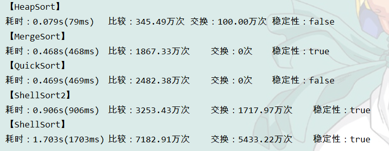

>更新：
>
>选择排序是不稳定排序
>
>如 10，5， 2.0， 1， 10， 2.00
>
>交换后2.00会跑到2.0的前面，而2.00和2.0比较时是默认2.0是较大者，所以不稳定