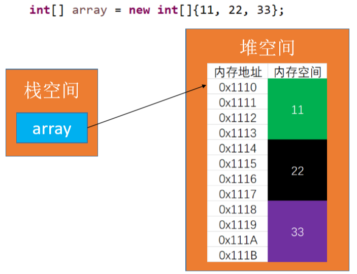
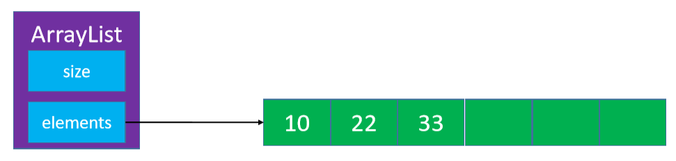
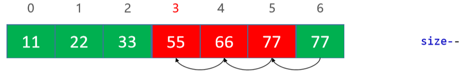
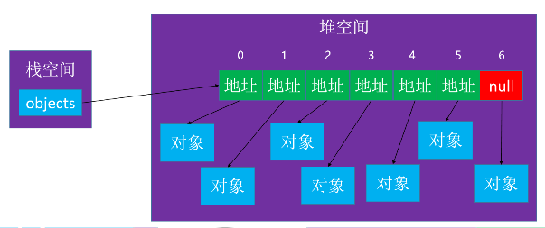

# 数组

数组是一种顺序存储的线性表，所有元素的内存地址是连续的



- 在很多编程语言中，数组都有个致命的缺点：无法动态修改容量
- 实际开发中，我们更希望数组的容量是可以动态改变的 

# 动态数组ArrayList



动态的添加删除数组元素

## 接口设计

```java
int size(); // 元素的数量 

boolean isEmpty(); // 是否为空 

boolean contains(E element); // 是否包含某个元素 

void add(E element); // 添加元素到最后面 

E get(int index); // 返回index位置对应的元素 

E set(int index, E element); // 设置index位置的元素 

void add(int index, E element); // 往index位置添加元素 

E remove(int index); // 删除index位置对应的元素 

int indexOf(E element); // 查看元素的位置 

void clear(); // 清除所有元素
```

## 设计

在Java中，成员变量会自动初始化，比如 :

- int 类型自动初始化为 0 

- 对象类型自动初始化为 null

```java
@SuppressWarnings("unchecked")
public class ArrayList<E> implements Array<E> {

    //泛型数组
    E[] dynamicArray=null;
    //数组的使用大小
    private int size=0;
    //数组的默认容量
    private static final int DEFAULT_CAPACITY=10;
    //为了方便根据元素indexOf方法用一个变量来存储找到的index
    private int location;
    //构造函数1，使用默认大小创建数组
    ArrayList(){
        dynamicArray= (E[]) new Object[DEFAULT_CAPACITY];
    }
    //构造函数2，由外界规定数组大小
    ArrayList(int capacity){
        arrayList= (E[]) new Object[capacity];
    }
    @Override
    public int size() {
        return size;
    }

    @Override
    public boolean isEmpty() {
        return size==0;
    }

    @Override
    public boolean contains(E element) {
        for (int i = 0; i < size; i++) {
            if (dynamicArray[i]==element){
                //只要确定传入的元素是存在数组中的就顺便记录其数组下标
                location=i;
                return true;
            }
        }
        return false;
    }

    @Override
    public E get(int index) {
        rangOfCheck(index);
        //在索引合法的情况下直接从数组取值
        return dynamicArray[index];
    }

    @Override
    public E set(int index, E element) {
        rangOfCheck(index);
        return dynamicArray[index]=element;
    }

    @Override
    public int indexOf(E element) {
        //先判断该元素是否存在
        if (contains(element)){
            return location;
        }
        //这个元素不存在
        return -1;
    }
    ...
```

## 添加- add(E element)

```java
@Override
public void add(E element) {
    if (element==null) return;
    //添加前要判断数组是否还有容量
    ensureCapacity();
    dynamicArray[size]=element;
    size++;
}
```

## 打印数组

- 重写 `toString `方法
-  在` toString` 方法中将元素拼接成字符串
-  字符串拼接建议使用 `StringBuilder`

```java
@Override
public String toString() {
    StringBuilder builder=new StringBuilder();
    //先拼接数组使用大小
    builder.append("[usedSize=").append(size).append("], ");
    //再拼接数组里的数据
    builder.append("dynamicArray=[");
    for (int i = 0; i < size; i++) {
        if (i!=0){
            builder.append(",");
        }
        builder.append(dynamicArray[i]);
    }
    builder.append("], ");
    //剩余数组空间
    builder.append("[restSize=").append(dynamicArray.length-size).append("]");
    return builder.toString();
}
```

## 删除元素 

思考：最后一个元素如何处理？



```java
@Override
public E remove(int index) {
    rangOfCheck(index);
    E removing=dynamicArray[index];
    //如果是删除最后一个元素
    if (index==size-1){
        dynamicArray[index]=null;
        size--;
        return removing;
    }
    //不是最后一个元素，index后所有元素都得向前移动一个位置
    for (int i = index; i < size-1; i++) {
        dynamicArray[i]=dynamicArray[i+1];
    }
    //原来的最后一个元素清空
    dynamicArray[size-1]=null;
    size--;
    return removing;
}
```

## 添加元素 - add(int index, E element)

```java
@Override
public void add(int index, E element) {
    rangOfCheckForAdd(index);
    ensureCapacity();
    //添加元素在最后的情况
    if (index==size){
        dynamicArray[size]=element;
        size++;
        return;
    }
    //不是最后的情况,index后所有元素向后移动一个位置
    for (int i = size; i > index; i--) {
        dynamicArray[i]=dynamicArray[i-1];
    }
    dynamicArray[index]=element;
    size++;
}
```

## 如何扩容

```java
//扩容数组，一般情况下是扩容到原来的1.5倍效率最高
private void ensureCapacity(){
    //数组空间已经使用完了
    if (size==dynamicArray.length){   
        int oldCapacity=size;
        //运算符的原本顺序是从左到右，所以记得打括号
        int newCapacity=size+(size>>1);
        E[] newArray= (E[]) new Object[newCapacity];
        //把数据转移到新数组中
        for (int i = 0; i < size; i++) {
            newArray[i]=dynamicArray[i];
        }
        //旧数组的引用指向新数组完成扩容
        dynamicArray=newArray;
        System.out.println("从"+oldCapacity+"扩容为"+newCapacity);
    }
}
```

## 优化数组容量

增加了一个缩容操作

```java
private void ensureCapacity(){
    //是否执行更新数组操作
    boolean update=false;
    int oldCapacity=dynamicArray.length;
    int newCapacity=0;
    //数组容量不够的情况
    if (size==oldCapacity){
        newCapacity=size+(size>>1);
        update=true;
    }
    //数组使用空间小于一半且大于默认容量
    else if (size<(oldCapacity>>1)&&size>DEFAULT_CAPACITY){
        newCapacity=oldCapacity>>1;
        update=true;
    }
    //update为true才执行更新操作
    if (update){
        //把旧数组元素全都移动到新数组里
        E[] newArray= (E[]) new Object[newCapacity];
        for (int i = 0; i < size; i++) {
            newArray[i]=dynamicArray[i];
        }
        dynamicArray=newArray;
        System.out.println("容量从"+oldCapacity+"变为"+newCapacity);
    }
```

## 内存管理细节



申请是数组为对象数组，在清空时要把数组内容置为null，以消除对象地址，从而消灭数组对象

```java
@Override
public void clear() {
    if (size==0) return;
    for (int i = 0; i < size; i++) {
        dynamicArray[i]=null;
    }
    size=0;
}
```

## 其他

```java
//确保外界传入的index合法
private void rangOfCheck(int index){
    if (index<0||index>=size){
        throw new IndexOutOfBoundsException("数组有效范围="+0+"---"+(size-1));
    }
}
//按规定下标添加index可以等于size
private void rangOfCheckForAdd(int index){
    if (index<0||index>size){
        throw new IndexOutOfBoundsException("数组添加有效范围="+0+"---"+size);
    }
}
```

