# 递归（Recursion）

- 递归：函数（方法）直接或间接调用自身。是一种常用的编程技巧

## 递归现象

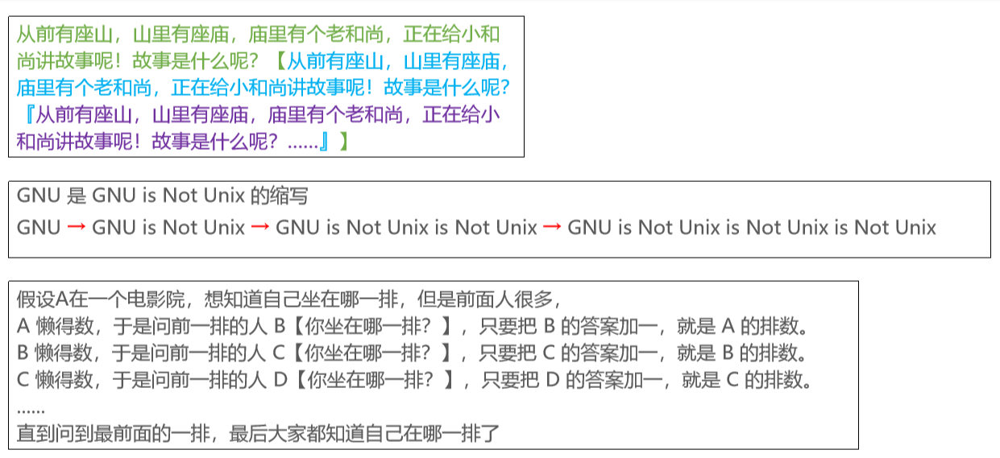

## 函数的调用过程

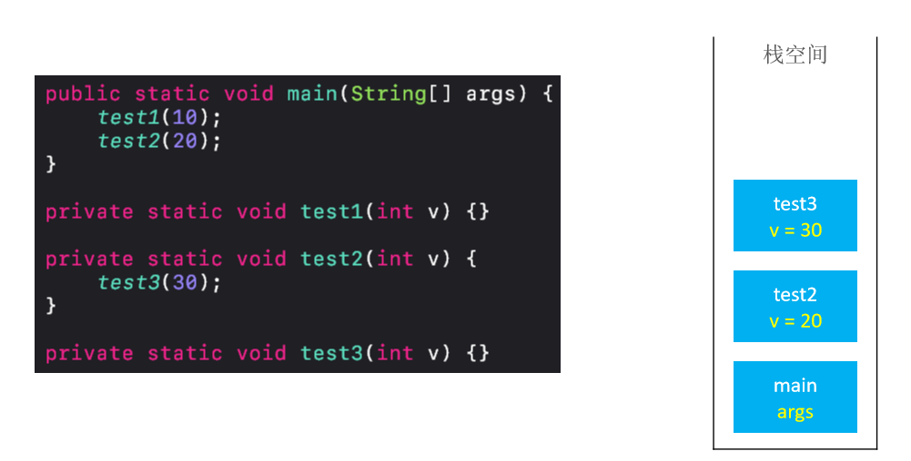

---

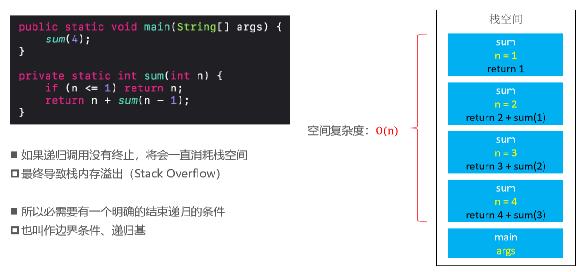

- 调用函数会压栈，return会弹栈。

## 函数的递归调用过程

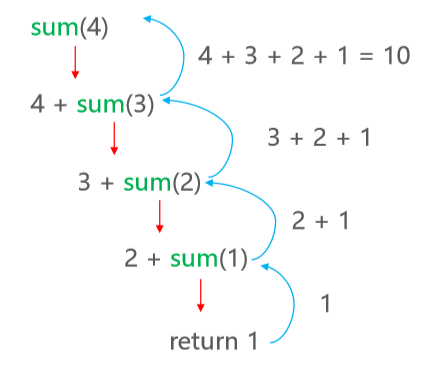

## 实例分析

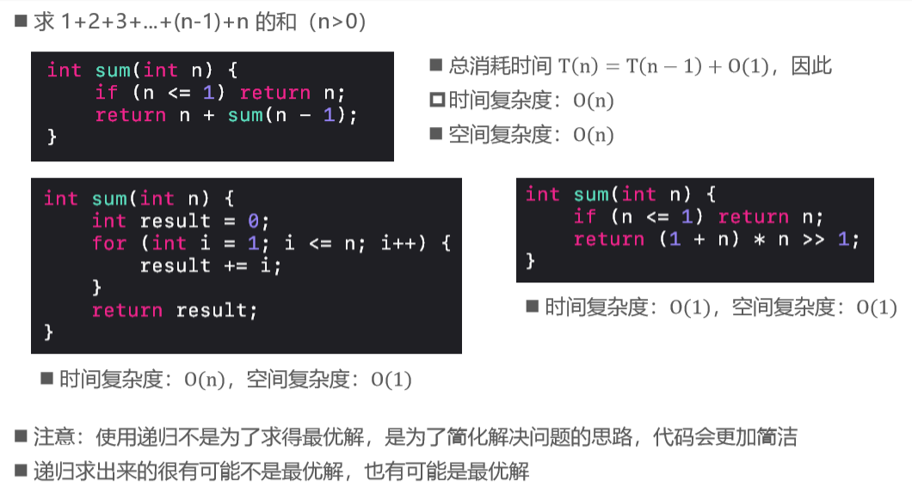

## 递归的基本思想

- 拆解问题：
  - 把规模大的问题变成规模较小的同类型问题 
  - 规模较小的问题又不断变成规模更小的问题 
  - 规模小到一定程度可以直接得出它的解

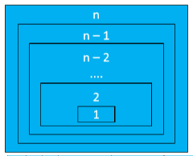

- 求解 ：
  - 由最小规模问题的解得出较大规模问题的解 
  - 由较大规模问题的解不断得出规模更大问题的解 
  - 最后得出原来问题的解

- 凡是可以利用上述思想解决问题的，都可以尝试使用递归 
  - 很多链表、二叉树相关的问题都可以使用递归来解决 
  - 因为链表、二叉树本身就是递归的结构（链表中包含链表，二叉树中包含二叉树）

## 递归的使用套路

1. 明确函数的功能 ：
   - 先不要去思考里面代码怎么写，首先搞清楚这个函数的干嘛用的，能完成什么功能？
2. 明确原问题与子问题的关系 ：
   - 寻找 f(n) 与 f(n – 1) 的关系；也可能是f(n) 与 f(n – 2)的关系
3. 明确递归基（边界条件） ：
   - 递归的过程中，子问题的规模在不断减小，当小到一定程度时可以直接得出它的解 
   - 寻找递归基，相当于是思考：问题规模小到什么程度可以直接得出解？

## 斐波那契数列

- 斐波那契数列：1、1、2、3、5、8、13、21、34、…… 
- F(1)=1，F(2)=1, F(n)=F(n-1)+F(n-2)（n≥3） 
- 编写一个函数求第 n 项斐波那契数

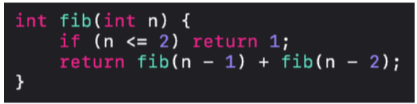

- 根据递推式 T n = T n − 1 + T(n − 2) + O(1)，可得知时间复杂度：O (2^n) 
- 空间复杂度：O(n) 
- 递归调用的空间复杂度 = 递归深度 * 每次调用所需的辅助空间

## fib函数的调用过程

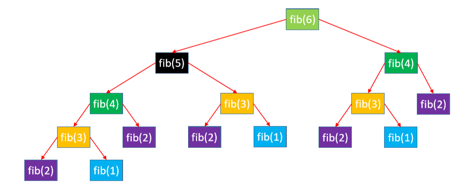

- 出现了特别多的重复计算 

- 这是一种“自顶向下”的调用过程
- 调用的顺序和树的前序遍历一样，返回的顺序和树的后序遍历一样

## 斐波那契函数实现

### fib0初始 – 暴力递归

```java
int fib0(int n) {
    if (n <= 2) return 1;
    return fib0(n - 1) + fib0(n - 2);
}
```

### fib优化1 – 记忆化 

- 用数组存放计算过的结果，避免重复计算

```java
int fib1(int n) {
    if (n <= 2) return 1;
    //舍弃数组0的位置
    int[] array = new int[n + 1];
    array[1] = array[2] = 1;
    return fib1(n, array);
}

int fib1(int n, int[] array) {
    if (array[n] == 0) {
        array[n] = fib1(n - 1, array) + fib1(n - 2, array);
    }
    return array[n];
}
```

- 时间复杂度：O(n)，空间复杂度：O(n)

### fib优化2 – 去除递归

```java
int fib2(int n) {
    if (n <= 2) return 1;
    int[] array = new int[n + 1];
    array[1] = array[2] = 1;
    for (int i = 3; i <= n; i++) {
        array[i] = array[i - 1] + array[i - 2];
    }
    return array[n];
}
```

- 时间复杂度：O(n)，空间复杂度：O(n) 
- 这是一种“自底向上”的计算过程

### fib优化3 – 滚动数组

- 由于每次运算只需要用到数组中的 2 个元素，所以可以使用滚动数组来优化

```java
int fib3(int n) {
    if (n <= 2) return 1;
    int[] array = new int[2];
    array[0] = array[1] = 1;
    for (int i = 3; i <= n; i++) {
        array[i % 2] = array[(i - 1) % 2] + array[(i - 2) % 2];
    }
    return array[n % 2];
}
```

### fib优化4 – 位运算取代模运算

- 乘、除、模运算效率较低，建议用其他方式取代

>* 4 % 2 = 0  0b100 & 0b001 = 0
>* 3 % 2 = 1  0b011 & 0b001 = 1
>* 5 % 2 = 1  0b101 & 0b001 = 1
>* 6 % 2 = 0  0b110 & 0b001 = 0

```java
int fib4(int n) {
    if (n <= 2) return 1;
    int[] array = new int[2];
    array[0] = array[1] = 1;
    for (int i = 3; i <= n; i++) {
        array[i & 1] = array[(i - 1) & 1] + array[(i - 2) & 1];
    }
    return array[n & 1];
}
```

### fib优化5 – 只用两个变量

```java
int fib5(int n){
    if (n <= 2) return 1;
    int first = 1;
    int second = 1;
    for (int i = 3; i <= n; i++) {
        second = first + second;
        first = second - first;
    }
    return second;
}
```

- 时间复杂度：O(n)，空间复杂度：O(1)

### fib优化6 – 特征方程

- 斐波那契数列有个线性代数解法：特征方程

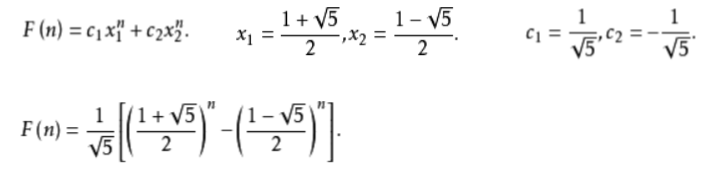

```java
int fib6(int n){
    if (n <= 2) return 1;
    double c =Math.sqrt(5);
    return (int) ((Math.pow((1 + c) / 2, n) - Math.pow((1 - c) / 2, n)) / c);
}
```

## 上楼梯（跳台阶）

- 楼梯有 n 阶台阶，上楼可以一步上 1 阶，也可以一步上 2 阶，走完 n 阶台阶共有多少种不同的走法？ 
- 假设 n 阶台阶有 f(n) 种走法，第 1 步有 2 种走法 
  - 如果上 1 阶，那就还剩 n – 1 阶，共 f(n – 1) 种走法 
  - 如果上 2 阶，那就还剩 n – 2 阶，共 f(n – 2) 种走法
  - 所以 f(n) = f(n – 1) + f(n – 2) 

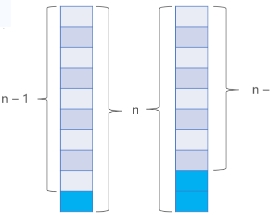

```java
int climbStairs(int n) {
    if (n <= 2) return n;
    return climbStairs(n - 1) + climbStairs(n - 2);
}
```

- 优化过程和斐波那契函数思路一致

##  汉诺塔（Hanoi）

- 编程实现把 A 的 n 个盘子移动到 C（盘子编号是 [1, n] ） 
  - 每次只能移动1个盘子 
  - 大盘子只能放在小盘子下面

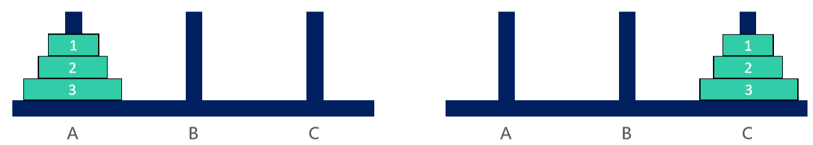

### 1个盘子

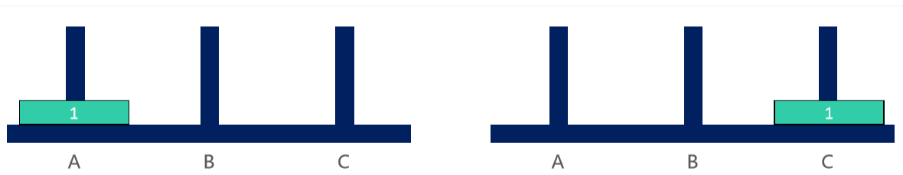

### 2个盘子

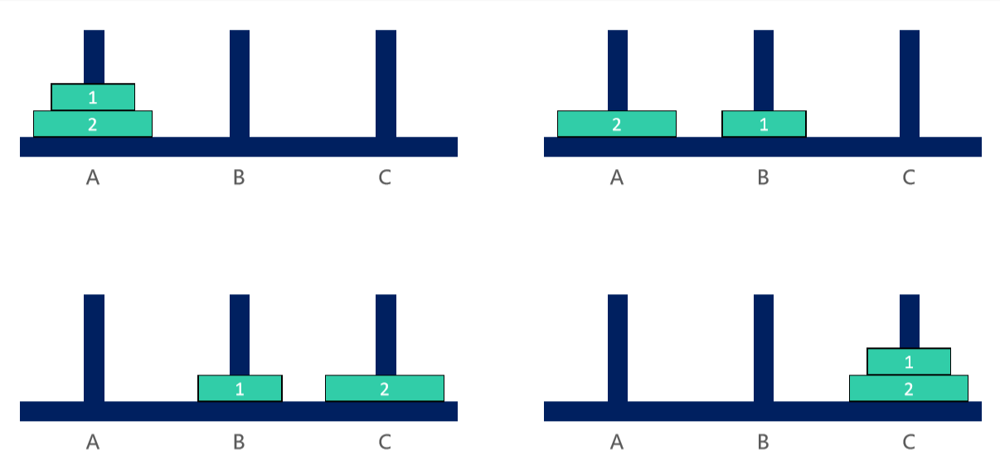

### 3个盘子


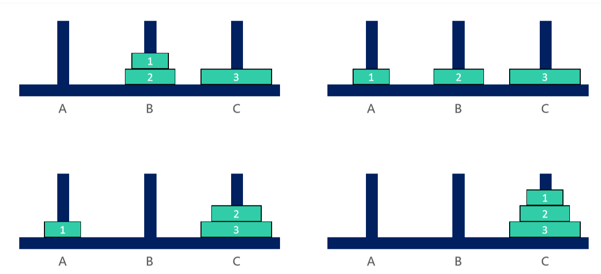

### 汉诺塔 – 思路

- 其实分 2 种情况讨论即可 
  - 当 n == 1时，直接将盘子从 A 移动到 C 
  - 当 n > 1时，可以拆分成3大步骤
    1. 将 n – 1 个盘子从 A 移动到 B 
    2. 将编号为 n 的盘子从 A 移动到 C 
    3. 将 n – 1 个盘子从 B 移动到 C 
- 步骤 ① ③ 明显是个递归调用

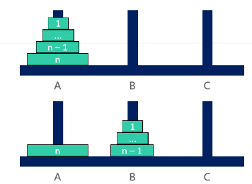

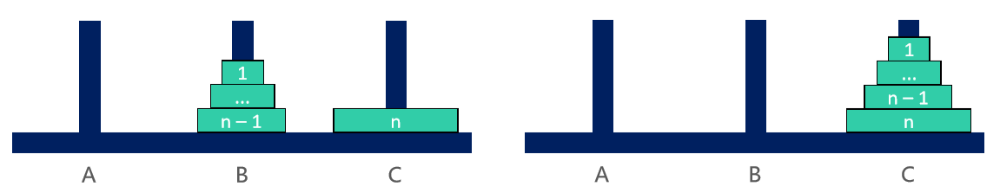

```java
/**
 * 将 n 个碟子从 p1 挪动到 p3
 * @param p2 中间的柱子
 */
void hanoi(int n, String p1, String p2, String p3) {
    if (n == 1) {
        move(n, p1, p3);
        return;
    }
    //把n-1个碟子从p1移动到了p2
    hanoi(n - 1, p1, p3, p2);
    move(n, p1, p3);
    //把n-1个碟子从p2移动到了p3
    hanoi(n - 1, p2, p1, p3);
} 

void move(int no, String from, String to) {
    System.out.println("将" + no + "号盘子从" + from + "移动到" + to);
}
```

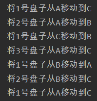

## 递归转非递归

- 递归调用的过程中，会将每一次调用的参数、局部变量都保存在了对应的栈帧（Stack Frame）中

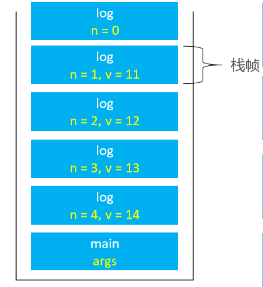

```java
static void log1(int n) {
    if (n < 1) return;
    log(n - 1);
    int v = n + 10;
    System.out.println(v);
}
```

- 若递归调用深度较大，会占用比较多的栈空间，甚至会导致栈溢出 
- 在有些时候，递归会存在大量的重复计算，性能非常差 ，这时可以考虑将递归转为非递归
  - （递归100%可以转换成非递归）

- 递归转非递归的万能方法 
  - 自己维护一个栈，来保存参数、局部变量 
  - 但是空间复杂度依然没有得到优化

```java
static class Frame {
    //保存每次函数调用的变量和结果
    int n;
    int v;
    Frame(int n, int v) {
        this.n = n;
        this.v = v;
    }
}

static void log2(int n) {
    Stack<Frame> frames = new Stack<>();
    while (n > 0) {
        frames.push(new Frame(n, n + 10));
        n--;
    }
    while (!frames.isEmpty()) {
        Frame frame = frames.pop();
        System.out.println(frame.v);
    }
}
```

- 在某些时候，也可以重复使用一组相同的变量来保存每个栈帧的内容

```java
static void log3(int n) {
    for (int i = 0; i <= n; i++) {
        System.out.println(n+10);
    }
}
```

- 这里重复使用变量 i 保存原来栈帧中的参数 
- 空间复杂度从 O n 降到了 O(1)

## 尾调用（Tail Call） 

- 尾调用：一个函数的最后一个动作是调用函数 
- 如果最后一个动作是调用自身，称为尾递归（Tail Recursion），是尾调用的特殊情况

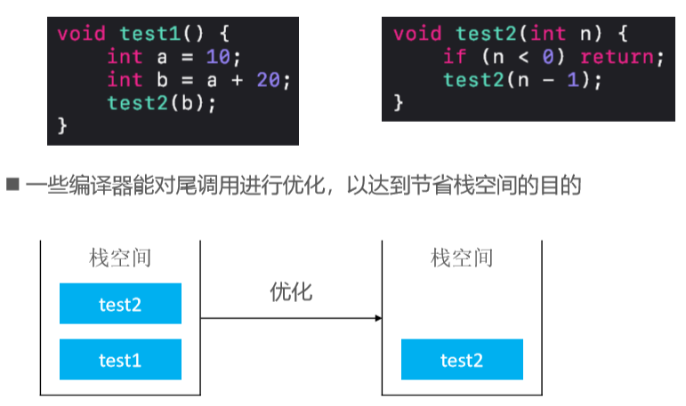

- 下面代码不是尾调用

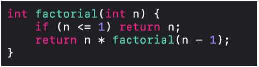

- 因为它最后1个动作是乘法

## 尾调用优化（Tail Call Optimization）

- 尾调用优化也叫做尾调用消除（Tail Call Elimination） 

- 如果当前栈帧上的局部变量等内容都不需要用了，当前栈帧经过适当的改变后可以直接当作被尾调用的函数的栈帧 使用，然后程序可以 jump 到被尾调用的函数代码 

- 生成栈帧改变代码与 jump 的过程称作尾调用消除或尾调用优化 
- 尾调用优化让位于尾位置的函数调用跟 goto 语句性能一样高
- 消除尾递归里的尾调用比消除一般的尾调用容易很多 
  - 比如Java虚拟机（JVM）会消除尾递归里的尾调用，但不会消除一般的尾调用（因为改变不了栈帧） 
  - 因此尾递归优化相对比较普遍，平时的递归代码可以考虑尽量使用尾递归的形式

### 尾递归示例1 – 阶乘

- 求 n 的阶乘 1*2*3*...*(n-1)*n （n>0）

```java
static int factorial(int n){
    if (n <=2) return n;
    return n * factorial(n-1);
}
```

- 尾递归：

```java
static int factorial(int n){
    return factorial(n , 1);
}

static int factorial(int n , int result){
    if (n <=1) return result;
    return factorial(n-1, n * result);
}
```

### 尾递归示例2 – 斐波那契数列

```java
int fib0(int n) {
    if (n <= 2) return 1;
    return fib0(n - 1) + fib0(n - 2);
}
```

- 尾递归：

```java
int fib(int n) {
    return fib(3,1,1);
}

int fib(int n , int first, int second){
    if (n <= 1) return first;
    return fib0(n-1, second, first+second);
}
```

