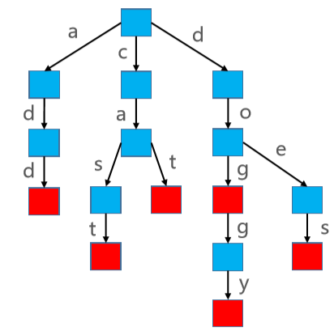
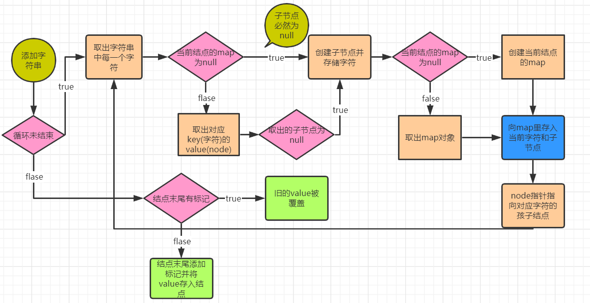
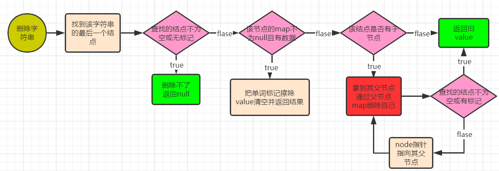
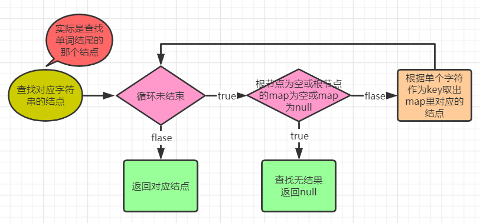

# 前缀树


## 接口

```java
public interface Trie<V> {

    int size();
    boolean isEmpty();
    void clear();
    boolean contains(String key);
    V add(String key, V value);
    V remove(String key);
    boolean startsWith(String prefix);

}
```

- Trie 也叫做字典树、前缀树（Prefix Tree）、单词查找树 
- Trie 搜索字符串的效率主要跟字符串的长度有关
- 假设使用 Trie 存储 cat、dog、doggy、does、cast、add 六个单词



```java
public class PrefixTree<V> implements Trie<V> {

    private int size;
    //以根节点为中心进行操作
    private Node<V> root;

    private static class Node<V> {
        Node<V> parent;
        
        //用哈希表存储存储孩子结点(value)和连线上的字符(key)
        HashMap<Character, Node<V>> childrenMap;
        Character character;
        V value;
        //是否为单词的结尾（是否为一个完整的单词）
        boolean word; 
        
        public Node(Node<V> parent) {
            this.parent = parent;
        }
    }
    
    //----------------------接口实现------------------------
}
```

## 部分接口实现

```java
@Override
public int size() {
    return size;
}

@Override
public boolean isEmpty() {
    return size == 0;
}

@Override
public void clear() {
    size = 0;
    root = null;
}

//判断key:单词是否存在
@Override
public boolean contains(String key) {
    Node<V> node = getNodeByKey(key);
    return node != null && node.word;
}

//判断前缀是否存在
@Override
public boolean startsWith(String prefix) {
    return getNodeByKey(prefix) != null;
}

//取出key对应的value
public V get(String key) {
    Node<V> node = getNodeByKey(key);
    return node != null && node.word ? node.value : null;
}
```

## 添加



```java
//返回的是被覆盖的旧value
@Override
public V add(String key, V value) {
    keyCheck(key);

    // 创建根节点
    if (root == null) {
        root = new Node<>(null);
    }

    Node<V> node = root;
    int len = key.length();
    for (int i = 0; i < len; i++) {
        char c = key.charAt(i);
        boolean emptyChildren = node.childrenMap == null;
        Node<V> childNode = emptyChildren ? null : node.childrenMap.get(c);
        //哈希表为空则必然没有孩子结点
        if (childNode == null) {
            //创建孩子结点
            childNode = new Node<>(node);
            childNode.character = c;
            //哈希表为空就初始化
            node.childrenMap = emptyChildren ? new HashMap<>() : node.childrenMap;
            //哈希表中存储与孩子结点的连线上为字符串和对应的孩子结点
            node.childrenMap.put(c, childNode);
        }
        //从孩子结点开始又继续往下初始化结点和数据
        node = childNode;
    }

    if (node.word) { // 已经存在这个单词
        V oldValue = node.value;
        //在单词结尾处用新值覆盖旧值
        node.value = value;
        return oldValue;
    }

    // 做标记，新增一个单词
    node.word = true;
    node.value = value;
    size++;
    return null;
}
```

## 删除



```java
@Override
public V remove(String key) {
    // 找到最后一个节点
    Node<V> node = getNodeByKey(key);
    // 如果不是单词结尾，不用作任何处理
    if (node == null || !node.word) return null;
    size--;
    V oldValue = node.value;

    // 如果还有子节点
    if (node.childrenMap != null && !node.childrenMap.isEmpty()) {
        node.word = false;
        node.value = null;
        return oldValue;
    }

    // 如果没有子节点就把key和结点删除
    Node<V> parent = null;
    while ((parent = node.parent) != null) {
        parent.childrenMap.remove(node.character);
        if (parent.word || !parent.childrenMap.isEmpty()) break;
        node = parent;
    }
    return oldValue;
}
```

## 查找key对应的结点



```java
private Node<V> getNodeByKey(String key) {
    keyCheck(key);

    //从根节点开始
    Node<V> node = root;
    int len = key.length();
    //依次取出字符串中的字符
    for (int i = 0; i < len; i++) {
        //只要不满足其中一项就说明这个字符串不存在
        if (node == null || node.childrenMap == null || node.childrenMap.isEmpty()) return null;
        char c = key.charAt(i);
        //取出字符对应的结点，即下一个结点
        node = node.childrenMap.get(c);
    }

    //返回最终的结点
    return node;
}
```

## 检查key的合法性

```java
private void keyCheck(String key) {
    if (key == null || key.length() == 0) {
        throw new IllegalArgumentException("key must not be empty");
    }
}
```

## 总结

- Trie 的优点：搜索前缀的效率主要跟前缀的长度有关，效率高
- Trie 的缺点：需要耗费大量的内存，因此还有待改进

