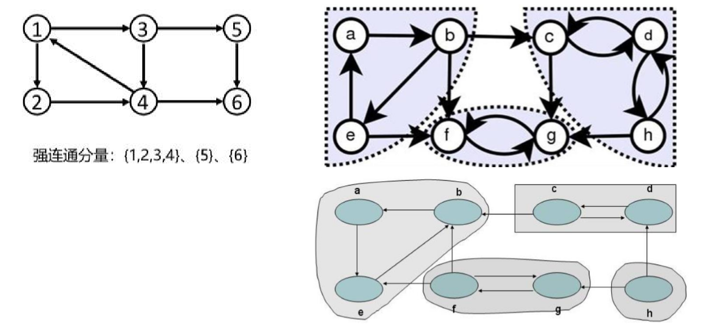

# 图（Graph）

- 图由顶点（vertex）和边（edge）组成，通常表示为 G = (V, E) 
  - G表示一个图，V是顶点集，E是边集 
  - 顶点集V有穷且非空
  - 任意两个顶点之间都可以用边来表示它们之间的关系，边集E可以是空的


- 图结构的应用极其广泛 
  - 社交网络 
  - 地图导航 
  - 游戏开发 
  - ......


## 有向图（Directed Graph）

- 有向图的边是有明确方向的


- 有向无环图（Directed Acyclic Graph，简称 DAG） 
  - 如果一个有向图，从任意顶点出发无法经过若干条边回到该顶点，那么它就是一个有向无环图


## 出度和入度


- 出度、入度适用于有向图

- 出度（Out-degree） 
  - 一个顶点的出度为 x，是指有 x 条边以该顶点为起点 
  - 顶点11的出度是3
- 入度（In-degree） 
  - 一个顶点的入度为 x，是指有 x 条边以该顶点为终点 
  - 顶点11的入度是2

## 无向图（Undirected Graph）

- 无向图的边是无方向的


-  效果类似于下面的有向图


## 混合图（Mixed Graph）

- 混合图的边可能是无向的，也可能是有向的


## 简单图和多重图

- 平行边 ：
  - 在无向图中，关联一对顶点的无向边如果多于1条，则称这些边为平行边 
  - 在有向图中，关联一对顶点的有向边如果多于1条，并且它们的的方向相同，则称这些边为平行边

- 简单图（Simple Graph） 
  - 既没有平行边也不没有自环的图 


- 多重图（Multigraph） 
  - 有平行边或者有自环的图


## 无向完全图（Undirected Complete Graph）

- 无向完全图的任意两个顶点之间都存在边 
- n 个顶点的无向完全图有 n(n − 1)/2 条边 
  -  n − 1 + n − 2 + n − 3 + ⋯+ 3 + 2 + 1


## 有向完全图（Directed Complete Graph）

- 有向完全图的任意两个顶点之间都存在方向相反的两条边 
- n 个顶点的有向完全图有 n(n − 1) 条边


- 稠密图（Dense Graph）：边数接近于或等于完全图 
- 稀疏图（Sparse Graph）：边数远远少于完全图
  - 这两种图的说法是一个相对的概念

## 有权图（Weighted Graph）

- 有权图的边可以拥有权值（Weight）


## 连通图（Connected Graph）

- 如果顶点 x 和 y 之间存在可相互抵达的路径（直接或间接的路径），则称 x 和 y 是连通的
-  如果无向图 G 中任意2个顶点都是连通的，则称G为连通图


## 连通分量（Connected Component） 

- 连通分量：无向图的极大连通子图 
  - 连通图只有一个连通分量，即其自身；非连通的无向图有多个连通分量 
- 下面的无向图有3个连通分量：


## 强连通图（Strongly Connected Graph）

- 如果有向图 G 中任意2个顶点都是连通的，则称G为强连通图


## 强连通分量（Strongly Connected Component

- 强连通分量：有向图的极大强连通子图 
  - 强连通图只有一个强连通分量，即其自身；非强连通的有向图有多个强连通分量



## 图的实现方案

- 图有2种常见的实现方案 
  - 邻接矩阵（Adjacency Matrix）
  - 邻接表（Adjacency List）

## 邻接矩阵（Adjacency Matrix）

- 邻接矩阵的存储方式 
  - 一维数组存放顶点信息 
  - 二维数组存放边信息
- 邻接矩阵比较适合稠密图，不然会比较浪费内存


## 邻接矩阵 – 有权图


## 邻接表（Adjacency List）


## 邻接表 – 有权图


# 图的基础接口

```java
public interface Graph<V,E> {

    int edgesSize(); //边的总数

    int verticesSize(); //顶点的总数

    void addVertex(V v); //添加一个顶点

    void addEdge(V from, V to); //添加一条边

    void addEdge(V from, V to, E weight); //添加一条带权值的边

    void removeVertex(V v); //删除一个顶点

    void removeEdge(V from, V to); //删除一条边

    void bfs(V begin); //广度优先遍历

    void dfs(V begin); //深度优先遍历
    
    List<V> topologicalSort(); //拓扑排序
}
```

# 接口实现

```java
@SuppressWarnings("unchecked")
public class ListGraph<V,E> implements Graph<V,E> {
    //一个顶点对应一个顶点结点，图中所有的顶点数量
    private Map<V, Vertex<V, E>> verticesMap = new HashMap<>();
    //一条边对应一个边结点，图中所有的边数量，每条边对应两个顶点，必然是不会重复的
    private Set<Edge<V, E>> edgesSet = new HashSet<>();
    /*
    定义图的顶点
     */
    private static class Vertex<V,E>{
        //.................
    }

    /*
    定义图的边信息
     */
    private static class Edge<V,E>{
        //..............
    }
    //......................
}
```

## 顶点的定义

```java
private static class Vertex<V,E>{
    //顶点上存储一个值
    V value;

    //存储该顶点的入度边和出度边
    Set<Edge<V,E>> inEdges = new HashSet<>();
    Set<Edge<V,E>> outEdges = new HashSet<>();

    Vertex(V value){
        this.value=value;
    }
    /*
    规定顶点的哈希值和如何判断顶点相等
    */
    @Override
    public int hashCode() {
        //在哈希表中的索引
        return value == null ? 0 : value.hashCode();
    }

    @Override
    public boolean equals(Object obj) {
        //只要顶点上存储的值相等我们则认为是同一个顶点
        Vertex<V,E> vertex =null;
        if (obj instanceof Vertex){
            vertex = (Vertex<V, E>) obj;
        }
        return vertex != null && (Objects.equals(value,vertex.value));
    }

    @Override
    public String toString() {
        return value == null ? "null" : value.toString();
    }
}
```

## 边的定义

```java
private static class Edge<V,E>{
    //边的起点和终点
    Vertex<V,E> from;
    Vertex<V,E> to;
    //边上的权值
    E weight;

    public Edge(Vertex<V, E> from, Vertex<V, E> to) {
        this.from = from;
        this.to = to;
    }

    /*
    规定边的哈希值和如何判断边相等
    */
    @Override
    public int hashCode() {
        return from.hashCode() * 31 + to.hashCode();
    }

    @Override
    public boolean equals(Object obj) {
        //只要两条边的起点和终点相同我们则认为是同一条边
        Edge<V,E> edge = null;
        if (obj instanceof Edge){
            edge = (Edge<V, E>) obj;
        }
        return edge != null && (from.equals(edge.from) && to.equals(edge.to));
    }

    @Override
    public String toString() {
        return "Edge{" +
            "from=" + from +
            ", to=" + to +
            ", weight=" + weight +
            '}';
    }
}
```

## 部分接口实现

```java
@Override
public int edgesSize() {
    return edgesSet.size();
}

@Override
public int verticesSize() {
    return verticesMap.size();
}

/*
顶点被单独创建必然是孤立的，不用维护它的出度边和入度边
*/
@Override
public void addVertex(V v) {
    //如果顶点已经存在则不在创建
    if (verticesMap.containsKey(v)) return;

    //创建新的顶点放入顶点哈希表中
    verticesMap.put(v,new Vertex<>(v));
}

@Override
public void addEdge(V from, V to) {
    //添加无权边
    addEdge(from,to,null);
}
```

## 添加边(包含顶点)

```java
@Override
public void addEdge(V from, V to, E weight) {
    //先判断该边的起点是否存在,由键取出值
    Vertex<V,E> fromVertex = verticesMap.get(from);
    if (fromVertex == null){
        //不存在则创建
        fromVertex = new Vertex<>(from);
        //存入哈希表
        verticesMap.put(from,fromVertex);
    }

    //判断终点是否存在
    Vertex<V,E> toVertex = verticesMap.get(to);
    if (toVertex == null){
        toVertex = new Vertex<>(to);
        verticesMap.put(to,toVertex);
    }

    //创建一条边来连接起点和终点
    Edge<V,E> edge = new Edge<>(fromVertex,toVertex);
    //添加权值
    edge.weight=weight;
    //若之前起点和终点有边连接则删除他们之间旧的边
    if (fromVertex.outEdges.remove(edge)){
        toVertex.outEdges.remove(edge);
    }
    //在两顶点之间添加新创建的这条边
    fromVertex.outEdges.add(edge);
    toVertex.inEdges.add(edge);
    //整个图的边加1
    edgesSet.add(edge);
}
```

## 打印图

```java
public void print() {
    System.out.println("[顶点]-------------------");
    verticesMap.forEach((V v, Vertex<V, E> vertex) -> {
        System.out.println(v);
        System.out.println("out-----------");
        System.out.println(vertex.outEdges);
        System.out.println("in-----------");
        System.out.println(vertex.inEdges);
    });

    System.out.println("[边]-------------------");
    edgesSet.forEach(System.out::println);
}
```

## 删除边

```java
@Override
public void removeEdge(V from, V to) {
    //先判断这条边是否存在,即相应的起点和终点是否存在
    Vertex<V,E> fromVertex = verticesMap.get(from);
    //起点都没有，边必然不存在
    if (fromVertex == null) return;

    //判断边的终点是否存在
    Vertex<V,E> toVertex = verticesMap.get(to);
    if (toVertex == null) return;

    //创建一条新的边是为了删除与顶点记录的边中相同的边，只是为了更好的删除
    Edge<V,E> edge = new Edge<>(fromVertex,toVertex);
    //删除与这个顶点关联的这条边
    if (fromVertex.outEdges.remove(edge)){
        toVertex.inEdges.remove(edge);
        //图记录的边数也要更新
        edgesSet.remove(edge);
    }
}
```

## 删除顶点

```java
 @Override
    public void removeVertex(V v) {
        //直接在存储顶点信息的map中删除,删除返回的是value
        Vertex<V,E> vertex = verticesMap.remove(v);
        //如果返回的结点不存在，说明没这个顶点
        if (vertex == null) return;

        //如果这个顶点存在，删除与它关联的所有出度边
        Iterator<Edge<V,E>> iteratorOut = vertex.outEdges.iterator();
        while (iteratorOut.hasNext()){
            //取出与当前结点关联的出度边
            Edge<V,E> edge = iteratorOut.next();
            //这条边不仅要斩断和当前被删除结点的联系，还要删除另一个与之连接的结点的联系
            edge.to.inEdges.remove(edge);
            //将当前遍历到的元素edge从集合vertex.outEdges中删除
            iteratorOut.remove();
            //图的总边数减1
            edgesSet.remove(edge);
        }

        //再删除与它关联的所有入度边
        Iterator<Edge<V,E>> iteratorIn = vertex.inEdges.iterator();
        while (iteratorIn.hasNext()){
            Edge<V,E> edge = iteratorIn.next();
            edge.from.outEdges.remove(edge);
            iteratorIn.remove();
            edgesSet.remove(edge);
        }
    }
```

# 图的遍历

-  图的遍历 ：
  - 从图中某一顶点出发访问图中其余顶点，且每一个顶点仅被访问一次
- 图有2种常见的遍历方式（有向图、无向图都适用）
  - 广度优先搜索（Breadth First Search，BFS），又称为宽度优先搜索、横向优先搜索
  - 深度优先搜索（Depth First Search，DFS）
- 发明“深度优先搜索”算法的2位科学家在1986年共同获得计算机领域的最高奖：图灵奖

## 广度优先搜索（Breadth First Search）

- 之前所学的二叉树层序遍历就是一种广度优先搜索


- 上一层和下一层通过一根线可达


## 广度优先搜索 – 思路

- 使用对列，类似如二叉树层序遍历的思想


## 广度优先搜索 – 实现

```java
@Override
    public void bfs(V begin) {
        //先判断遍历的起点是否真实存在图中
        Vertex<V,E> beginVertex = verticesMap.get(begin);
        if (beginVertex == null) return;

        //记录已经被遍历过的顶点
        Set<Vertex<V,E>> visitedVertex = new HashSet<>();
        //将遍历到的每一个结点入队
        Queue<Vertex<V,E>> queue = new LinkedList<>();
        queue.offer(beginVertex);
        //记录，表示已经遍历过了
        visitedVertex.add(beginVertex);
        while (!queue.isEmpty()){
            Vertex<V,E> vertex = queue.poll();
            //打印出被遍历的顶点
            System.out.println(vertex.value);
            //从当前顶点开始遍历它的出度边
            for (Edge<V,E> edge : vertex.outEdges) {
                //如果与这条边相连的终点已经被遍历过了，就跳过该顶点
                if (visitedVertex.contains(edge.to)) continue;
                //另一头的顶点入队
                queue.offer(edge.to);
                //添加被访问的结点集合
                visitedVertex.add(edge.to);
            }
        }
    }
```

## 深度优先搜索（Depth First Search）

- 之前所学的二叉树前序遍历就是一种深度优先搜索


## 深度优先搜索 – 递归实现

```java
@Override
public void dfs(V begin) {
    //先判断遍历的起点是否真实存在图中
    Vertex<V,E> beginVertex = verticesMap.get(begin);
    if (beginVertex == null) return;
    dfs(beginVertex,new HashSet<>());
}
private void dfs(Vertex<V,E> vertex,Set<Vertex<V,E>> visitedVertices){
    //打印当前被访问的结点
    System.out.println(vertex.value);
    //记录被访问过的结点
    visitedVertices.add(vertex);

    //遍历当前访问结点的每一条出度边
    for (Edge<V,E> edge : vertex.outEdges) {
        if (visitedVertices.contains(edge.to)) continue;
        dfs(edge.to,visitedVertices);
    }
}
```

## 深度优先搜索 – 非递归思路


1. 设1为起点，访问1，1出栈，1和3入栈；
2. 访问3，3出栈，3和7入栈
3. 访问7，7出栈，回退到3，没有未被访问的结点可以入栈

## 深度优先搜索 – 非递归实现

```java
@Override
public void dfs(V begin) {
    //先判断起点是否存在
    Vertex<V,E> beginVertex = verticesMap.get(begin);
    if (beginVertex == null) return;

    //记录被遍历过的结点
    Set<Vertex<V,E>> visitedVertices = new HashSet<>();
    //初始化栈空间
    Stack<Vertex<V,E>> stack = new Stack<>();

    //先访问起点
    stack.push(beginVertex);
    System.out.println(beginVertex.value);
    //添加访问记录
    visitedVertices.add(beginVertex);

    while (!stack.isEmpty()){
        //已经访问过的出栈，没访问过的入栈
        Vertex<V,E> vertex = stack.pop();
        for (Edge<V,E> edge : vertex.outEdges) {
            //如果边的终点被访问过就直接跳过这轮循环
            if (visitedVertices.contains(edge.to)) continue;
            //当前起点和终点入栈
            stack.push(edge.from);
            stack.push(edge.to);
            System.out.println(edge.to.value);
            //添加访问记录
            visitedVertices.add(edge.to);
            //访问结点后就跳出for循环
            break;
        }
    }
}
```

## 增强遍历接口

- 问题：在进行BFS或DFS遍历时，外界只能拿到最终的遍历结果，不能自由的控制遍历的范围，所以需要增强遍历接口

```java
//---------原接口--------------
void bfs(V begin); //广度优先遍历
void dfs(V begin); //深度优先遍历

//------------修改-------------
void bfs(V begin, VertexVisitor<V> visitor); //广度优先遍历

void dfs(V begin, VertexVisitor<V> visitor); //深度优先遍历

public interface VertexVisitor<V> { //顶点访问器
    boolean visit(V v);
}
```

- 实现

```java
@Override
public void bfs(V begin, VertexVisitor<V> visitor) {
    if (visitor == null) return;
    Vertex<V, E> beginVertex = verticesMap.get(begin);
    if (beginVertex == null) return;

    Set<Vertex<V, E>> visitedVertices = new HashSet<>();
    Queue<Vertex<V, E>> queue = new LinkedList<>();
    queue.offer(beginVertex);
    visitedVertices.add(beginVertex);

    while (!queue.isEmpty()) {
        Vertex<V, E> vertex = queue.poll();
        //访问处
        if (visitor.visit(vertex.value)) return;

        for (Edge<V, E> edge : vertex.outEdges) {
            if (visitedVertices.contains(edge.to)) continue;
            queue.offer(edge.to);
            visitedVertices.add(edge.to);
        }
    }
}
```

```java
@Override
public void dfs(V begin, VertexVisitor<V> visitor) {
    if (visitor == null) return;
    Vertex<V, E> beginVertex = verticesMap.get(begin);
    if (beginVertex == null) return;

    Set<Vertex<V, E>> visitedVertices = new HashSet<>();
    Stack<Vertex<V, E>> stack = new Stack<>();

    // 先访问起点
    stack.push(beginVertex);
    visitedVertices.add(beginVertex);
    if (visitor.visit(begin)) return;

    while (!stack.isEmpty()) {
        Vertex<V, E> vertex = stack.pop();

        for (Edge<V, E> edge : vertex.outEdges) {
            //访问处
            if (visitedVertices.contains(edge.to)) continue;

            stack.push(edge.from);
            stack.push(edge.to);
            visitedVertices.add(edge.to);
            if (visitor.visit(edge.to.value)) return;

            break;
        }
    }
}
```

# AOV网（Activity On Vertex Network）

- 一项大的工程常被分为多个小的子工程
  - 子工程之间可能存在一定的先后顺序，即某些子工程必须在其他的一些子工程完成后才能开始
- 在现代化管理中，人们常用有向图来描述和分析一项工程的计划和实施过程，子工程被称为活动（Activity） 
  - 以顶点表示活动、有向边表示活动之间的先后关系，这样的图简称为 AOV 网
- 标准的AOV网必须是一个有向无环图（Directed Acyclic Graph，简称 DAG）


# 拓扑排序（Topological Sort）

- 前驱活动：有向边起点的活动称为终点的前驱活动 
  - 只有当一个活动的前驱全部都完成后，这个活动才能进行
-  后继活动：有向边终点的活动称为起点的后继活动


- 什么是拓扑排序？ 
  - 将 AOV 网中所有活动排成一个序列，使得每个活动的前驱活动都排在该活动的前面 
  - 比如上图的拓扑排序结果是：A、B、C、D、E、F 或者 A、B、D、C、E、F （结果并不一定是唯一的）

## 拓扑排序 – 思路

- 可以使用卡恩算法（Kahn于1962年提出）完成拓扑排序 
  - 假设 List 是存放拓扑排序结果的列表 
    1.  **把所有入度为 0 的顶点放入 L 中，然后把这些顶点从图中去掉** 
    2. **重复操作1，直到找不到入度为 0 的顶点** 
  - 如果此时 List  中的元素个数和顶点总数相同，说明拓扑排序完成 
  - 如果此时 List  中的元素个数少于顶点总数，说明原图中存在环，无法进行拓扑排序


## 拓扑排序 – 实现

```java
@Override
public List<V> topologicalSort() {
    //存放拓扑排序结果的列表
    List<V> list = new ArrayList<>();
    //初始化队列
    Queue<Vertex<V,E>> queue = new LinkedList<>();
    //用哈希表存储结点和结点对应的入度
    Map<Vertex<V,E>,Integer> vertexAndInDegreesMap = new HashMap<>();
    //初始化，将入度为0的结点都放入对列
    verticesMap.forEach((V v, Vertex<V, E> vertex) -> {
        int in = vertex.inEdges.size();
        if (in == 0) {
            queue.offer(vertex);
        } else {
            //将入度不为0的全部放入哈希表中，结点和其入度形成对应关系
            vertexAndInDegreesMap.put(vertex, in);
        }
    });

    while (!queue.isEmpty()){
        //出队并将结果放入排序结果列表
        Vertex<V,E> vertex = queue.poll();
        list.add(vertex.value);

        //访问当前结点的所有出度边
        for (Edge<V,E> edge : vertex.outEdges) {
            //该结点的出度边的入度减一，模拟被该结点被删除的场景
            int inDegreeOfOutEdge = vertexAndInDegreesMap.get(edge.to)-1;
            if (inDegreeOfOutEdge == 0){
                //如果入度为0就加入对列
                queue.offer(edge.to);
            }else {
                //否则更新这条出度边的入度数据
                vertexAndInDegreesMap.put(edge.to,inDegreeOfOutEdge);
            }
        }
    }
    //拓扑排序后的结果
    return list;
}
```

