# 抽象图


```java
public abstract class Graph<V, E> {
    //比较边的权值
    protected WeightManager<E> weightManager;

    public Graph() {}

    public Graph(WeightManager<E> weightManager) {
        this.weightManager = weightManager;
    }

    public abstract int edgesSize();
    public abstract int verticesSize();

    public abstract void addVertex(V v);
    public abstract void addEdge(V from, V to);
    public abstract void addEdge(V from, V to, E weight);

    public abstract void removeVertex(V v);
    public abstract void removeEdge(V from, V to);

    public abstract void bfs(V begin, VertexVisitor<V> visitor);
    public abstract void dfs(V begin, VertexVisitor<V> visitor);

    public abstract Set<EdgeInfo<V, E>> mst();

    public abstract List<V> topologicalSort();

    //public abstract Map<V, E> shortestPath(V begin);//Dijkstra的实现一接口
    public abstract Map<V, PathInfo<V, E>> shortestPath(V begin);//Dijkstra的实现二接口

    public abstract Map<V, Map<V, PathInfo<V, E>>> shortestPath();

    //由外界自己规定边的权值的比较方式
    public interface WeightManager<E> {
        int compare(E w1, E w2);
        E add(E w1, E w2);
        E zero();
    }

    public interface VertexVisitor<V> {
        boolean visit(V v);
    }

    //路径信号，用于Dijkstra的实现二接口
    public static class PathInfo<V, E> {
        protected E weight;
        protected List<EdgeInfo<V, E>> edgeInfos = new LinkedList<>();
        public PathInfo() {}
        public PathInfo(E weight) {
            this.weight = weight;
        }
        public E getWeight() {
            return weight;
        }
        public void setWeight(E weight) {
            this.weight = weight;
        }
        public List<EdgeInfo<V, E>> getEdgeInfos() {
            return edgeInfos;
        }
        public void setEdgeInfos(List<EdgeInfo<V, E>> edgeInfos) {
            this.edgeInfos = edgeInfos;
        }
        @Override
        public String toString() {
            return "PathInfo [weight=" + weight + ", edgeInfos=" + edgeInfos + "]";
        }
    }

    //对外界公开透明的边
    public static class EdgeInfo<V, E> {
        //只需要公开顶点上的value和边的权值即可，这些信息都是从外界传入的，而一些底层的设计细节则不需要公开暴露
        private V from;
        private V to;
        private E weight;
        public EdgeInfo(V from, V to, E weight) {
            this.from = from;
            this.to = to;
            this.weight = weight;
        }
        public V getFrom() {
            return from;
        }
        public void setFrom(V from) {
            this.from = from;
        }
        public V getTo() {
            return to;
        }
        public void setTo(V to) {
            this.to = to;
        }
        public E getWeight() {
            return weight;
        }
        public void setWeight(E weight) {
            this.weight = weight;
        }
        @Override
        public String toString() {
            return "EdgeInfo [from=" + from + ", to=" + to + ", weight=" + weight + "]";
        }
    }
}
```

## 部分框架

```java
@SuppressWarnings("unchecked")
public class ListGraph<V, E> extends Graph<V, E> {
    public ListGraph() {}
    public ListGraph(WeightManager<E> weightManager) {
        super(weightManager);
    }

    private Map<V, Vertex<V, E>> verticesMap = new HashMap<>();
    private Set<Edge<V, E>> edgesMap = new HashSet<>();
    private Comparator<Edge<V, E>> edgeComparator = (Edge<V, E> e1, Edge<V, E> e2) -> {
        return weightManager.compare(e1.weight, e2.weight);
    };

    private static class Vertex<V, E> {
        V value;
        Set<Edge<V, E>> inEdges = new HashSet<>();
        Set<Edge<V, E>> outEdges = new HashSet<>();
        Vertex(V value) {
            this.value = value;
        }
        @Override
        public boolean equals(Object obj) {
            return Objects.equals(value, ((Vertex<V, E>)obj).value);
        }
        @Override
        public int hashCode() {
            return value == null ? 0 : value.hashCode();
        }
        @Override
        public String toString() {
            return value == null ? "null" : value.toString();
        }
    }

    private static class Edge<V, E> {
        Vertex<V, E> from;
        Vertex<V, E> to;
        E weight;

        Edge(Vertex<V, E> from, Vertex<V, E> to) {
            this.from = from;
            this.to = to;
        }

        EdgeInfo<V, E> info() {
            return new EdgeInfo<>(from.value, to.value, weight);
        }

        @Override
        public boolean equals(Object obj) {
            Edge<V, E> edge = (Edge<V, E>) obj;
            return Objects.equals(from, edge.from) && Objects.equals(to, edge.to);
        }
        @Override
        public int hashCode() {
            return from.hashCode() * 31 + to.hashCode();
        }

        @Override
        public String toString() {
            return "Edge [from=" + from + ", to=" + to + ", weight=" + weight + "]";
        }
    }

    public void print() {
        //--------------------
    }

    @Override
    public int edgesSize() {
        //-------------
    }

    @Override
    public int verticesSize() {
        //-------------
    }

    @Override
    public void addVertex(V v) {
        //------------------
    }

    @Override
    public void addEdge(V from, V to) {
        //-------------
    }

    @Override
    public void addEdge(V from, V to, E weight) {
        //----------------------
    }

    @Override
    public void removeEdge(V from, V to) {
        //------------------------
    }

    @Override
    public void removeVertex(V v) {
        //--------------------------
    }

    @Override
    public void bfs(V begin, VertexVisitor<V> visitor) {
        //----------------------
    }

    @Override
    public void dfs(V begin, VertexVisitor<V> visitor) {
        //----------------------
    }

    @Override
    public List<V> topologicalSort() {
        //----------------------------
    }

    @Override
    public Set<EdgeInfo<V, E>> mst() {
        return Math.random() > 0.5 ? prim() : kruskal();
    }

    private Set<EdgeInfo<V, E>> prim() {
        //------------------------
    }

    private Set<EdgeInfo<V, E>> kruskal() {
        //--------------------------
    }


    @Override
    public Map<V, PathInfo<V, E>> shortestPath(V begin) {
        return bellmanFord(begin);
    }

    @SuppressWarnings("unused")
    private Map<V, PathInfo<V, E>> bellmanFord(V begin) {
        //----------------------
    }


    private boolean relax(Edge<V, E> edge, PathInfo<V, E> fromPath, Map<V, PathInfo<V, E>> paths) {
        //-----------------------------
    }

    /*
	返回的是顶点到终点V和它们之间的路径信息
	 */
    private Map<V, PathInfo<V, E>> dijkstra(V begin) {
        //---------------------------
    }

    /**
	 * 松弛
	 * @param edge 需要进行松弛的边
	 * @param fromPath edge的from的最短路径信息
	 * @param paths 存放着其他点（对于dijkstra来说，就是还没有离开桌面的点）的最短路径信息
	 */
    private void relaxForDijkstra(Edge<V, E> edge, PathInfo<V, E> fromPath, Map<Vertex<V, E>, PathInfo<V, E>> paths) {

        //-------------------------
    }

    /**
	 * 从paths中挑一个最小的路径出来
	 * @param paths
	 * @return
	 */
    private Entry<Vertex<V, E>, PathInfo<V, E>> getMinPath(Map<Vertex<V, E>, PathInfo<V, E>> paths) {

        //------------------------------

    }

    @Override
    public Map<V, Map<V, PathInfo<V, E>>> shortestPath() {
        Map<V, Map<V, PathInfo<V, E>>> paths = new HashMap<>();
        // 初始化
        for (Edge<V, E> edge : edgesMap) {
            Map<V, PathInfo<V, E>> map = paths.get(edge.from.value);
            if (map == null) {
                map = new HashMap<>();
                paths.put(edge.from.value, map);
            }

            PathInfo<V, E> pathInfo = new PathInfo<>(edge.weight);
            pathInfo.edgeInfos.add(edge.info());
            map.put(edge.to.value, pathInfo);
        }

        verticesMap.forEach((V v2, Vertex<V, E> vertex2) -> {
            verticesMap.forEach((V v1, Vertex<V, E> vertex1) -> {
                verticesMap.forEach((V v3, Vertex<V, E> vertex3) -> {
                    if (v1.equals(v2) || v2.equals(v3) || v1.equals(v3)) return;

                    // v1 -> v2
                    PathInfo<V, E> path12 = getPathInfo(v1, v2, paths);
                    if (path12 == null) return;

                    // v2 -> v3
                    PathInfo<V, E> path23 = getPathInfo(v2, v3, paths);
                    if (path23 == null) return;

                    // v1 -> v3 
                    PathInfo<V, E> path13 = getPathInfo(v1, v3, paths);

                    E newWeight = weightManager.add(path12.weight, path23.weight);
                    if (path13 != null && weightManager.compare(newWeight, path13.weight) >= 0) return;

                    if (path13 == null) {
                        path13 = new PathInfo<V, E>();
                        paths.get(v1).put(v3, path13);
                    } else {
                        path13.edgeInfos.clear();
                    }

                    path13.weight = newWeight;
                    path13.edgeInfos.addAll(path12.edgeInfos);
                    path13.edgeInfos.addAll(path23.edgeInfos);
                });
            });
        });

        return paths;
    }

    private PathInfo<V, E> getPathInfo(V from, V to, Map<V, Map<V, PathInfo<V, E>>> paths) {
        Map<V, PathInfo<V, E>> map = paths.get(from);
        return map == null ? null : map.get(to);
    }
}
```

## 测试数据

```java
package kl;

public class Data {
    public static final Object[][] BFS_01 = {
        {"A", "B"}, {"A", "F"},
        {"B", "C"}, {"B", "I"}, {"B", "G"}, 
        {"C", "I"}, {"C", "D"},
        {"D", "I"}, {"D", "G"}, {"D", "E"}, {"D", "H"},   	
        {"E", "H"}, {"E", "F"},
        {"F", "G"},
        {"G", "H"},
    };

    public static final Object[][] BFS_02 = {
        {0, 1}, {0, 4},
        {1, 2},
        {2, 0}, {2, 4}, {2, 5},
        {3, 1}, 
        {4, 6}, {4, 7},
        {5, 3}, {5, 7},
        {6, 2}, {6, 7}
    };

    public static final Object[][] BFS_03 = {
        {0, 2}, {0, 3},
        {1, 2}, {1, 3}, {1, 6},
        {2, 4},
        {3, 7}, 
        {4, 6},
        {5, 6},
        {6, 7}
    };

    public static final Object[][] BFS_04 = {
        {1, 2}, {1, 3}, {1, 5},
        {2, 0},
        {3, 5}, 
        {5, 6}, {5, 7},
        {6, 2},
        {7, 6}
    };

    public static final Object[][] DFS_01 = {
        {0, 1},
        {1, 3}, {1, 5}, {1, 6}, {1, 2},
        {2, 4},
        {3, 7}
    };

    public static final Object[][] DFS_02 = {
        {"a", "b"}, {"a", "e"},
        {"b", "e"},
        {"c", "b"},
        {"d", "a"},
        {"e", "c"}, {"e", "f"},
        {"f", "c"}
    };

    public static final Object[][] TOPO = {
        {0, 2},
        {1, 0},
        {2, 5}, {2, 6},
        {3, 1}, {3, 5}, {3, 7},
        {5, 7},
        {6, 4},
        {7, 6}
    };

    public static final Object[][] NO_WEIGHT2 = {
        {0, 3}, 
        {1, 3}, {1, 6},
        {2, 1}, 
        {3, 5}, 
        {6, 2}, {6, 5},
        {4, 7}
    };

    public static final Object[][] NO_WEIGHT3 = {
        {0, 1}, {0, 2},
        {1, 2}, {1, 5},
        {2, 4}, {2, 5},
        {5, 6}, {7, 6},
        {3}
    };

    public static final Object[][] MST_01 = {
        {0, 2, 2}, {0, 4, 7},
        {1, 2, 3}, {1, 5, 1}, {1, 6, 7},
        {2, 4, 4}, {2, 5, 3}, {2, 6, 6},
        {3, 7, 9},
        {4, 6, 8},
        {5, 6, 4}, {5, 7, 5}
    };

    public static final Object[][] MST_02 = {
        {"A", "B", 17}, {"A", "F", 1}, {"A", "E", 16},
        {"B", "C", 6}, {"B", "D", 5}, {"B", "F", 11},
        {"C", "D", 10}, 
        {"D", "E", 4}, {"D", "F", 14},
        {"E", "F", 33}
    };

    public static final Object[][] WEIGHT3 = {
        {"广州", "佛山", 100}, {"广州", "珠海", 200}, {"广州", "肇庆", 200},
        {"佛山", "珠海", 50}, {"佛山", "深圳", 150}, 
        {"肇庆", "珠海", 100}, {"肇庆", "南宁", 150},
        {"珠海", "南宁", 350}, {"珠海", "深圳", 100}, 
        {"南宁", "香港", 500}, {"南宁", "深圳", 400}, 
        {"深圳", "香港", 150}
    };

    public static final Object[][] SP = {
        {"A", "B", 10}, {"A", "D", 30}, {"A", "E", 100}, 
        {"B", "C", 50}, 
        {"C", "E", 10}, 
        {"D", "C", 20}, {"D", "E", 60}
    };

    public static final Object[][] BF_SP = {
        {"A", "B", 10}, {"A", "E", 8}, 
        {"B", "C", 8}, {"B", "E", -5}, 
        {"D", "C", 2}, {"D", "F", 6},
        {"E", "D", 7}, {"E", "F", 3}
    };

    public static final Object[][] WEIGHT5 = {
        {0, 14, 1}, {0, 4, 8},
        {1, 2, 9},
        {2, 3, 6}, {2, 5, 9},
        {3, 17, 1}, {3, 10, 4},
        {4, 5, 2}, {4, 8, 2},
        {5, 6, 6}, {5, 8, 1}, {5, 9, 4},
        {6, 9, 8},
        {7, 11, 4},
        {8, 9, 1}, {8, 11, 2}, {8, 12, 7},
        {9, 10, 7}, {9, 13, 4},
        {10, 13, 2},
        {11, 12, 7}, {11, 15, 4},
        {12, 13, 2}, {12, 16, 2},
        {13, 16, 7},
        {15, 16, 7}, {15, 17, 7},
        {16, 17, 2}
    };

    public static final Object[][] NEGATIVE_WEIGHT1 = {
        {"A", "B", -1}, {"A", "C", 4}, 
        {"B", "C", 3}, {"B", "D", 2}, {"B", "E", 2},
        {"D", "B", 1}, {"D", "C", 5}, 
        {"E", "D", -3}
    };

    /**
	 * 有负权环
	 */
    public static final Object[][] NEGATIVE_WEIGHT2 = {
        {0, 1, 1}, 
        {1, 2, 7},
        {1, 0, -2}
    };
}

```

## 在Main函数中解析数据

```java
public class Main {

    static Graph.WeightManager<Double> weightManager = new Graph.WeightManager<Double>() {
        public int compare(Double w1, Double w2) {
            return w1.compareTo(w2);
        }

        public Double add(Double w1, Double w2) {
            return w1 + w2;
        }

        @Override
        public Double zero() {
            return 0.0;
        }
    };
    
//---------------------------------------------------------------------------------------
    
    /**
	 * 有向图
	 */
    private static Graph<Object, Double> directedGraph(Object[][] data) {
        Graph<Object, Double> graph = new ListGraph<>(weightManager);
        for (Object[] edge : data) {
            if (edge.length == 1) {
                graph.addVertex(edge[0]);
            } else if (edge.length == 2) {
                graph.addEdge(edge[0], edge[1]);
            } else if (edge.length == 3) {
                double weight = Double.parseDouble(edge[2].toString());
                graph.addEdge(edge[0], edge[1], weight);
            }
        }
        return graph;
    }

    /**
	 * 无向图
	 */
    private static Graph<Object, Double> undirectedGraph(Object[][] data) {
        Graph<Object, Double> graph = new ListGraph<>(weightManager);
        for (Object[] edge : data) {
            if (edge.length == 1) {
                graph.addVertex(edge[0]);
            } else if (edge.length == 2) {
                graph.addEdge(edge[0], edge[1]);
                graph.addEdge(edge[1], edge[0]);
            } else if (edge.length == 3) {
                double weight = Double.parseDouble(edge[2].toString());
                graph.addEdge(edge[0], edge[1], weight);
                graph.addEdge(edge[1], edge[0], weight);
            }
        }
        return graph;
    }
}
```

# 生成树（Spanning Tree）

- 生成树（Spanning Tree），也称为支撑树 
- 连通图的极小连通子图，它含有图中全部的 n 个顶点，恰好只有 n – 1 条边
  - 连通图是无向的，强连通图是有向的

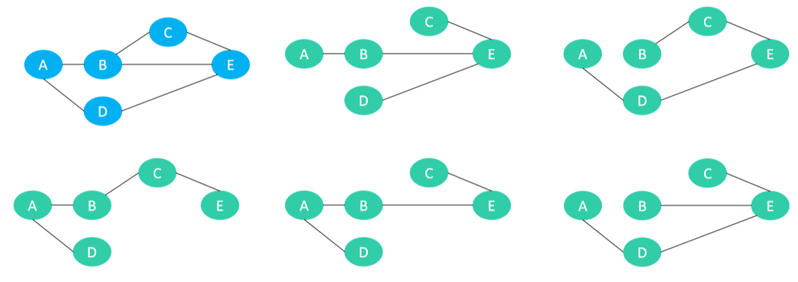

- 一个图可以有不同的生成树

## 最小生成树（Minimum Spanning Tree）

-  最小生成树（Minimum Spanning Tree，简称MST） 
  - 也称为最小权重生成树（Minimum Weight Spanning Tree）、最小支撑树 
  - 是所有生成树中，总权值最小的那棵 
  - 适用于有权的连通图（无向）

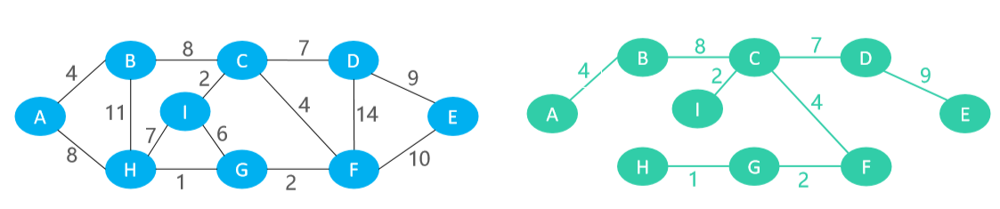

- 最小生成树在许多领域都有重要的作用，例如
  - 要在 n 个城市之间铺设光缆，使它们都可以通信 
  - 铺设光缆的费用很高，且各个城市之间因为距离不同等因素，铺设光缆的费用也不同，如何使铺设光缆的总费用最低？这时就可以采用最小生成树进行计算
-  如果图的每一条边的权值都互不相同，那么最小生成树将只有一个，否则可能会有多个最小生成树
- 求最小生成树的2个经典算法 
  - Prim（普里姆算法） 
  - Kruskal（克鲁斯克尔算法）

## 切分定理

- 切分（Cut）：把图中的节点分为两部分，称为一个切分
- 下图有个切分 C = (S, T)，S = {A, B, D}，T = {C, E}

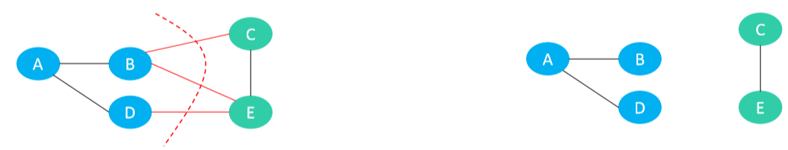

- 横切边（Crossing Edge）：如果一个边的两个顶点，分别属于切分的两部分，这个边称为横切边 
  - 比如上图的边 BC、BE、DE 就是横切边
- 切分定理：给定任意切分，横切边中权值最小的边必然属于最小生成树

# Prim算法 – 执行过程

- 假设 G = (V，E) 是有权的连通图（无向），A 是 G 中最小生成树的边集 
- 算法从 S = { u0 }（u0 ∈ V），A = { } 开始，重复执行下述操作，直到 S = V 为止 
- 找到切分 C = (S，V – S) 的最小横切边 (u0，v0) 并入集合 A，同时将 v0 并入集合 S

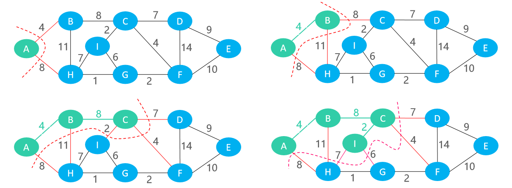

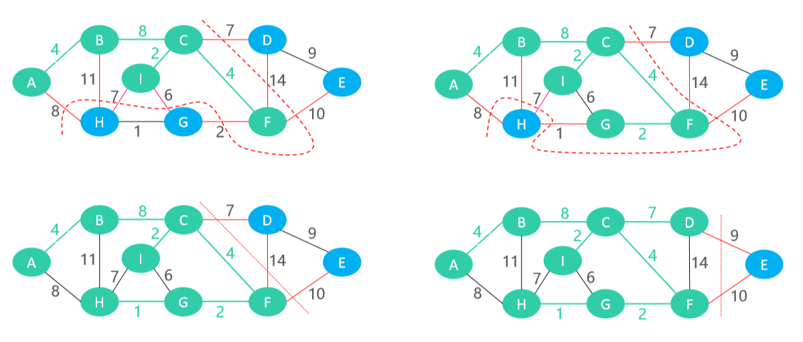


# Prim算法 – 实现

```java
private Set<EdgeInfo<V, E>> prim() {
    //取出顶点哈希表中的所有顶点并封装到迭代器中
    Iterator<Vertex<V, E>> it = verticesMap.values().iterator();
    //判断迭代器是否为空
    if (!it.hasNext()) return null;
    //取出迭代器中的第一个顶点
    Vertex<V, E> vertex = it.next();
    //储存边的信息(起点和终点上存储的value和边的权值)
    Set<EdgeInfo<V, E>> edgeInfos = new HashSet<>();
    //记录下已经进行一次添加到小顶堆操作的顶点
    Set<Vertex<V, E>> addedVertices = new HashSet<>();
    addedVertices.add(vertex);
    //将当前顶点的所有出度边按照比较规则构造成小顶堆
    MinHeap<Edge<V, E>> heap = new MinHeap<>(vertex.outEdges, edgeComparator);
    //图中总的顶点数量
    int verticesSize = verticesMap.size();
    //堆空了或者被添加过的顶点已经等于图中的结点数量，说明最小生成图构建完成
    while (!heap.isEmpty() && addedVertices.size() < verticesSize) {
        //把小堆顶堆顶元素删除，并得到这条权值最小的边
        Edge<V, E> edge = heap.remove();
        //先判断这条边的终点是否已经被添加过了
        if (addedVertices.contains(edge.to)) continue;
        //把边的信息过滤分解加入到边信息集合中
        edgeInfos.add(edge.info());
        //先把当前的目标顶点添加到已访问集合中
        addedVertices.add(edge.to);
        //对目标顶点的所有出度边进行小顶堆的构造，继续取出权值最小边
        heap.addAll(edge.to.outEdges);
    }
    //返回最小生成树的所有边信息
    return edgeInfos;
}
```

- 比较器

```java
private Comparator<Edge<V, E>> edgeComparator = (Edge<V, E> e1, Edge<V, E> e2) -> {
    //weightManager由外界自定义
    return weightManager.compare(e1.weight, e2.weight);
};
```

## 关键实现

- 使用了小顶堆来找一个顶点所有出度边中权值最小的边

```java
package kl;
import java.util.Collection;
import java.util.Comparator;

/**
 * 二叉堆（最小堆）
 */
@SuppressWarnings("unchecked")
public class MinHeap<E> {
    private int size;
    private Comparator<E> comparator;
    private int compare(E e1, E e2) {
        return comparator != null ? comparator.compare(e1, e2) 
            : ((Comparable<E>)e1).compareTo(e2);
    }
    private E[] elements;
    private static final int DEFAULT_CAPACITY = 10;

    public MinHeap(Collection<E> elements, Comparator<E> comparator) {
        this.comparator = comparator;

        size = elements == null ? 0 : elements.size();
        if (size == 0) {
            this.elements = (E[]) new Object[DEFAULT_CAPACITY];
        } else {
            int capacity = Math.max(size, DEFAULT_CAPACITY);
            this.elements = (E[]) new Object[capacity];
            int i = 0;
            for (E element : elements) {
                this.elements[i++] = element;
            }
            heapify();
        }
    }

    public MinHeap(E[] elements, Comparator<E> comparator)  {
        this.comparator = comparator;

        if (elements == null || elements.length == 0) {
            this.elements = (E[]) new Object[DEFAULT_CAPACITY];
        } else {
            size = elements.length;
            int capacity = Math.max(elements.length, DEFAULT_CAPACITY);
            this.elements = (E[]) new Object[capacity];
            for (int i = 0; i < elements.length; i++) {
                this.elements[i] = elements[i];
            }
            heapify();
        }
    }

    public MinHeap(Collection<E> elements)  {
        this(elements, null);
    }

    public MinHeap(E[] elements)  {
        this(elements, null);
    }

    public MinHeap(Comparator<E> comparator) {
        this.comparator = comparator;
        this.elements = (E[]) new Object[DEFAULT_CAPACITY];
    }

    public MinHeap() {
        this.elements = (E[]) new Object[DEFAULT_CAPACITY];
    }


    public int size() {
        return size;
    }

    public boolean isEmpty() {
        return size == 0;
    }

    public void addAll(Collection<E> elements) {
        if (elements == null) return;
        for (E element : elements) {
            add(element);
        }
    }

    public void addAll(E[] elements) {
        if (elements == null) return;
        for (E element : elements) {
            add(element);
        }
    }

    public void clear() {
        for (int i = 0; i < size; i++) {
            elements[i] = null;
        }
        size = 0;
    }

    public void add(E element) {
        elementNotNullCheck(element);
        ensureCapacity(size + 1);
        elements[size++] = element;
        siftUp(size - 1);
    }

    public E get() {
        emptyCheck();
        return elements[0];
    }

    public E remove() {
        emptyCheck();

        int lastIndex = --size;
        E root = elements[0];
        elements[0] = elements[lastIndex];
        elements[lastIndex] = null;

        siftDown(0);
        return root;
    }

    public E replace(E element) {
        elementNotNullCheck(element);

        E root = null;
        if (size == 0) {
            elements[0] = element;
            size++;
        } else {
            root = elements[0];
            elements[0] = element;
            siftDown(0);
        }
        return root;
    }

    /**
	 * 批量建堆
	 */
    protected void heapify() {
        // 自下而上的下滤
        for (int i = (size >> 1) - 1; i >= 0; i--) {
            siftDown(i);
        }
    }

    /*
	 * 让index位置的元素下滤
	 */
    private void siftDown(int index) {
        E element = elements[index];
        int half = size >> 1;
        // 第一个叶子节点的索引 == 非叶子节点的数量
        // index < 第一个叶子节点的索引
        // 必须保证index位置是非叶子节点
        while (index < half) { 
            // index的节点有2种情况
            // 1.只有左子节点
            // 2.同时有左右子节点

            // 默认为左子节点跟它进行比较
            int childIndex = (index << 1) + 1;
            E child = elements[childIndex];

            // 右子节点
            int rightIndex = childIndex + 1;

            // 选出左右子节点最小的那个
            if (rightIndex < size && compare(elements[rightIndex], child) < 0) {
                child = elements[childIndex = rightIndex];
            }

            if (compare(element, child) <= 0) break;

            // 将子节点存放到index位置
            elements[index] = child;
            // 重新设置index
            index = childIndex;
        }
        elements[index] = element;
    }

    /*
	 * 让index位置的元素上滤
	 */
    private void siftUp(int index) {
        E element = elements[index];
        while (index > 0) {
            int parentIndex = (index - 1) >> 1;
            E parent = elements[parentIndex];
            if (compare(element, parent) >= 0) break;

            // 将父元素存储在index位置
            elements[index] = parent;

            // 重新赋值index
            index = parentIndex;
        }
        elements[index] = element;
    }

    private void ensureCapacity(int capacity) {
        int oldCapacity = elements.length;
        if (oldCapacity >= capacity) return;

        // 新容量为旧容量的1.5倍
        int newCapacity = oldCapacity + (oldCapacity >> 1);
        E[] newElements = (E[]) new Object[newCapacity];
        for (int i = 0; i < size; i++) {
            newElements[i] = elements[i];
        }
        elements = newElements;
    }

    private void emptyCheck() {
        if (size == 0) {
            throw new IndexOutOfBoundsException("Heap is empty");
        }
    }

    private void elementNotNullCheck(E element) {
        if (element == null) {
            throw new IllegalArgumentException("element must not be null");
        }
    }
}
```

# Kruskal算法 – 执行过程

- 按照边的权重顺序（从小到大）将边加入生成树中，直到生成树中含有V – 1 条边为止（ V 是顶点数量） 
  - 若加入该边会与生成树形成环，则不加入该边 
  - 从第3条边开始，可能会与生成树形成环 

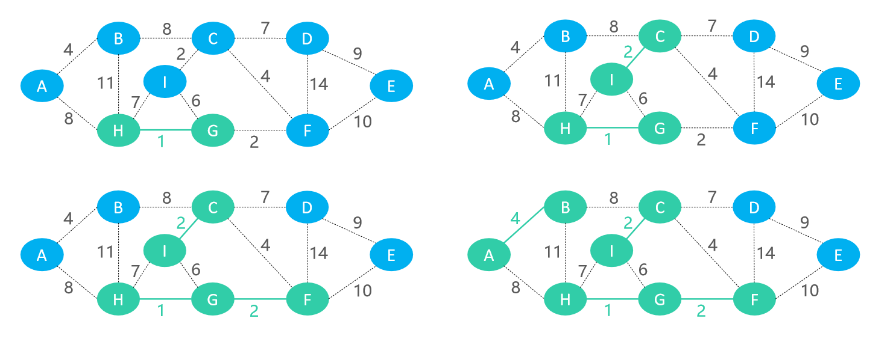

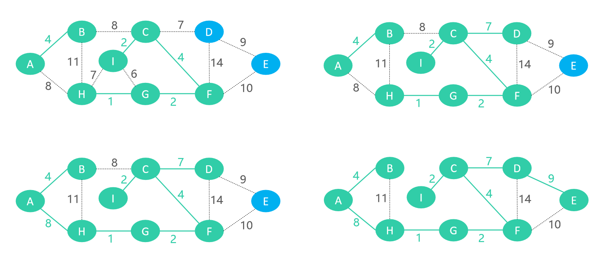


# Kruskal算法 – 实现

```java
private Set<EdgeInfo<V, E>> kruskal() {
    //n个顶点需要n-1条边
    int edgeSize = verticesMap.size() - 1;
    //如果没有顶点就直接结束
    if (edgeSize == -1) return null;
    //存储边信息的集合
    Set<EdgeInfo<V, E>> edgeInfos = new HashSet<>();
    //先通过最小堆将当前图中所有的边进行小顶堆化
    MinHeap<Edge<V, E>> heap = new MinHeap<>(edgesMap, edgeComparator);
    //使用并查集
    UnionFind<Vertex<V, E>> uf = new UnionFind<>();
    //先初始化并查集，每个顶点都单独为一个集合
    verticesMap.forEach((V v, Vertex<V, E> vertex) -> {
        uf.makeSet(vertex);
    });
    //当堆为空或者已经得到n-1条边了就返回边信息集合
    while (!heap.isEmpty() && edgeInfos.size() < edgeSize) {
        //得到最小的边
        Edge<V, E> edge = heap.remove(); 
        //判断这条边的起点和终点是否在同一集合中
        if (uf.isSame(edge.from, edge.to)) continue; 
        //将被选中的边进行信息提取并存储到边信息集合中
        edgeInfos.add(edge.info());
        //将这条边的起点和终点纳入一个集合中
        uf.union(edge.from, edge.to);
    }
    //返回边的信息集合
    return edgeInfos;
}
```

## 关键实现

- 利用并查集的特性避开了在找最小边的过程中出现环的情况，使每次选择的边都是堆中最小却又不和被选中的其他边构成环状图

```java
public class UnionFind<V> {
    private Map<V, Node<V>> nodes = new HashMap<>();

    public void makeSet(V v) {
        if (nodes.containsKey(v)) return;
        nodes.put(v, new Node<>(v));
    }

    /**
	 * 找出v的根节点
	 */
    private Node<V> findNode(V v) {
        Node<V> node = nodes.get(v);
        if (node == null) return null;
        while (!Objects.equals(node.value, node.parent.value)) {
            node.parent = node.parent.parent;
            node = node.parent;
        }
        return node;
    }

    public V find(V v) {
        Node<V> node = findNode(v);
        return node == null ? null : node.value;
    }

    public void union(V v1, V v2) {
        Node<V> p1 = findNode(v1);
        Node<V> p2 = findNode(v2);
        if (p1 == null || p2 == null) return;
        if (Objects.equals(p1.value, p2.value)) return;

        if (p1.rank < p2.rank) {
            p1.parent = p2;
        } else if (p1.rank > p2.rank) {
            p2.parent = p1;
        } else {
            p1.parent = p2;
            p2.rank += 1;
        }
    }

    public boolean isSame(V v1, V v2) {
        return Objects.equals(find(v1), find(v2));
    }

    private static class Node<V> {
        V value;
        Node<V> parent = this;
        int rank = 1;
        Node(V value) {
            this.value = value;
        }
    }
}

```

# 最短路径（Shortest Path）

- 最短路径是指两顶点之间权值之和最小的路径（有向图、无向图均适用，不能有负权环）

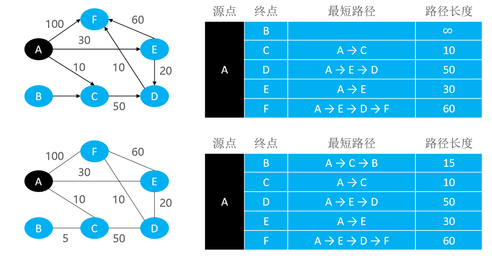

## 最短路径 – 无权图

- 无权图相当于是全部边权值为1的有权图

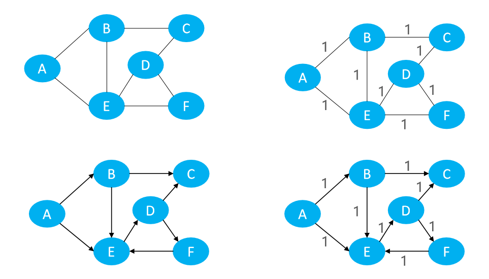

## 最短路径 – 负权边

- 有负权边，但没有负权环时，存在最短路径

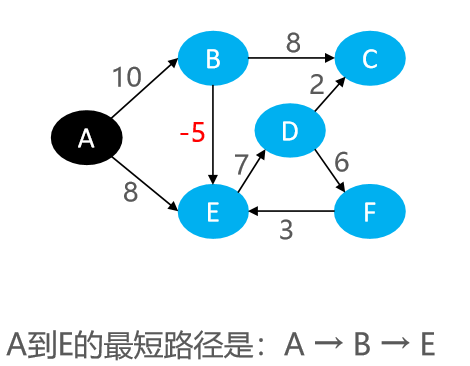

## 最短路径 – 负权环

- 有负权环时，不存在最短路径

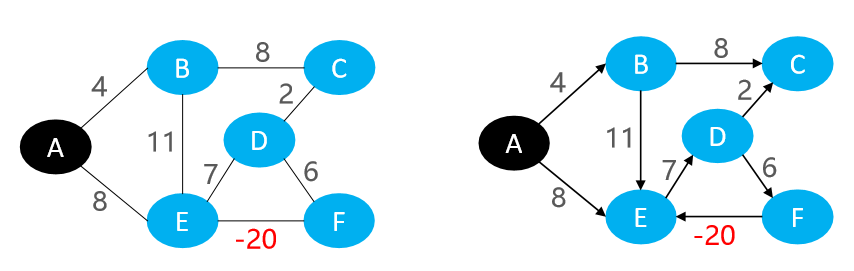

- 通过负权环， A到E的路径可以无限短 
- A → E → D → F → E → D → F → E → D → F → E → D → F → E → ......

## 最短路径算法介绍

- 最短路径的典型应用之一：路径规划问题
- 求解最短路径的3个经典算法 
  - 单源最短路径算法 
    - Dijkstra（迪杰斯特拉算法） 
    - Bellman-Ford（贝尔曼-福特算法）
  - 多源最短路径算法 
    - Floyd（弗洛伊德算法）

# Dijkstra

-  Dijkstra 属于单源最短路径算法，用于计算一个顶点到其他所有顶点的最短路径 

- 使用前提：不能有负权边 
- 时间复杂度：可优化至 O (ElogV )，E 是边数量，V 是节点数量
- 由荷兰的科学家 Edsger Wybe Dijkstra 发明，曾在1972年获得图灵奖

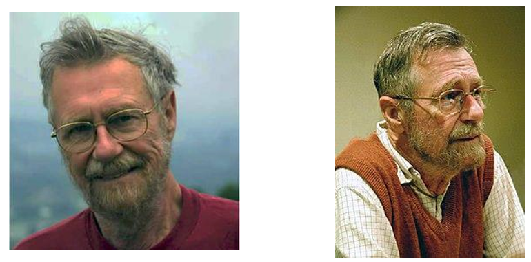

## Dijkstra – 等价思考

- Dijkstra 的原理其实跟生活中的一些自然现象完全一样 
  - 把每1个顶点想象成是1块小石头 
  - 每1条边想象成是1条绳子，每一条绳子都连接着2块小石头，边的权值就是绳子的长度 
  - 将小石头和绳子平放在一张桌子上（下图是一张俯视图，图中黄颜色的是桌子）

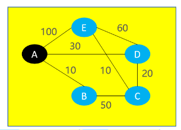

- 接下来想象一下，手拽着小石头A，慢慢地向上提起来，远离桌面 
  - B、D、C、E会依次离开桌面 
  - 最后绷直的绳子就是A到其他小石头的最短路径

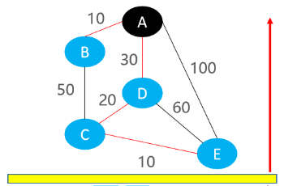

- 有一个很关键的信息：后离开桌面的小石头都是被先离开桌面的小石头拉起来的

## Dijkstra – 执行过程


- 绿色：已经“离开桌面” ，已经确定了最终的最短路径
- 红色：更新了最短路径信息

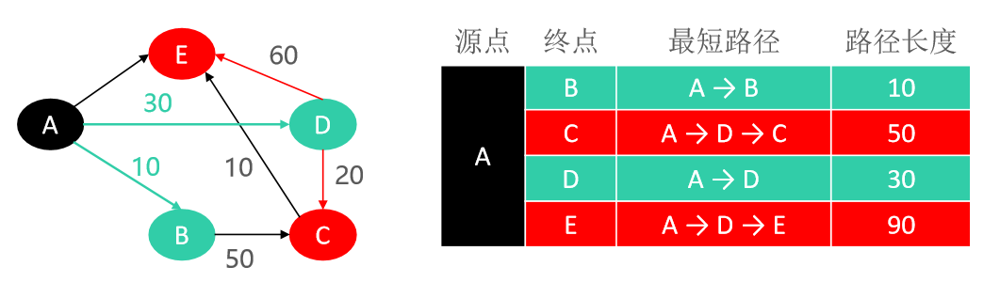

- 松弛操作（Relaxation）：更新2个顶点之间的最短路径 
  - 这里一般是指：更新源点到另一个点的最短路径 
  - 松弛操作的意义：尝试找出更短的最短路径
- 确定A到D的最短路径后，对DC、DE边进行松弛操作，更新了A到C、A到E的最短路径

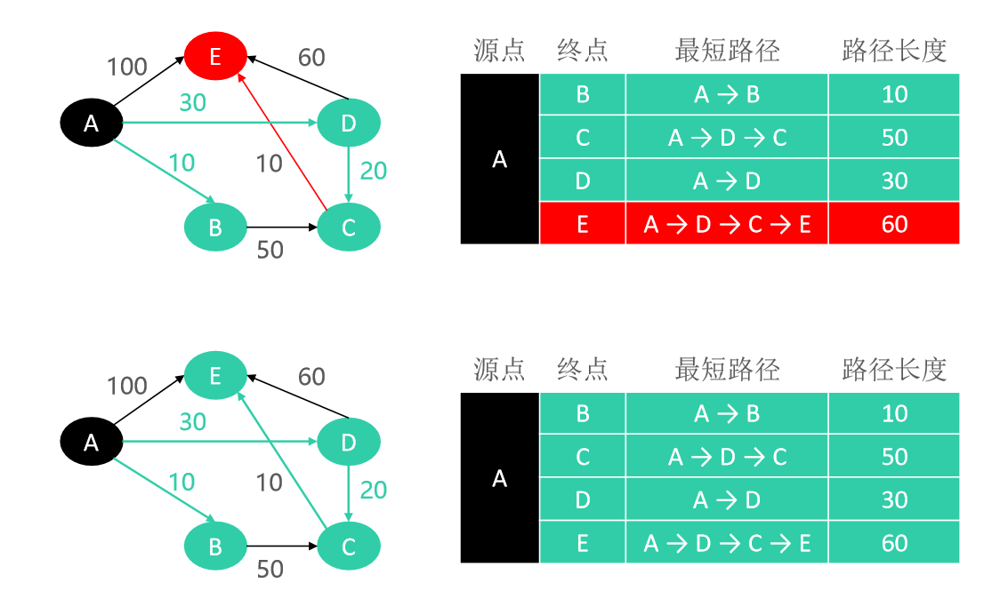

## Dijkstra – 实现一

- **返回终点和对应的路径长度**

```java
@Override
public Map<V, E> shortestPath(V begin) {
    //从顶点表出取出begin作为起点
    Vertex<V, E> beginVertex = verticesMap.get(begin);
    //若beginVertex不存在说明起点不存在,则最短路径不存在
    if (beginVertex == null) return null;

    //记录被提起来的顶点
    Map<V, E> selectedPaths = new HashMap<>();
    //从起点到其他顶点之间的路径
    Map<Vertex<V, E>, E> paths = new HashMap<>();
    // 初始化paths:将起点的所有出度边和对应权值放入表中作为初始的可达最短路径
    for (Edge<V, E> edge : beginVertex.outEdges) {
        paths.put(edge.to, edge.weight);
    }

    //不断的从paths中取出顶点进行最短路径更新
    while (!paths.isEmpty()) {
        //选择当前已经被提起顶点的最短路径
        Entry<Vertex<V, E>, E> minPath = getMinPath(paths);
        // minVertex离开桌面
        Vertex<V, E> minVertex = minPath.getKey();
        //将顶点上的value和路径的权值放入已经用于标记已经被选择过的集合中
        selectedPaths.put(minVertex.value, minPath.getValue());
        //把已经选择过的顶点key删除
        paths.remove(minVertex);
        // 对它的minVertex的outEdges进行松弛操作
        for (Edge<V, E> edge : minVertex.outEdges) {
            // 如果edge.to已经离开桌面，就没必要进行松弛操作
            if (selectedPaths.containsKey(edge.to.value)) continue;
            // 新的可选择的最短路径：beginVertex到edge.from的最短路径 + edge.weight
            E newWeight = weightManager.add(minPath.getValue(), edge.weight);
            // 以前的最短路径：beginVertex到edge.to的最短路径
            E oldWeight = paths.get(edge.to);
            if (oldWeight == null || weightManager.compare(newWeight, oldWeight) < 0) {
                paths.put(edge.to, newWeight);
            }
        }
    }
    //删除表中的起点，起点是一开始就默认的，不需要记录，这里重复添加了
    selectedPaths.remove(begin);
    return selectedPaths;
}
```

- **传入不同的可达路径，选择出最短的一条**

```java
private Entry<Vertex<V, E>, E> getMinPath(Map<Vertex<V, E>, E> paths) {
    //把当前被提起的顶点的所有出度边封装到迭代器中方便遍历操作
    Iterator<Entry<Vertex<V, E>, E>> it = paths.entrySet().iterator();
    //取出迭代器中的第一条路径默认为最短路径，paths不为空，第一次取值必然不为null
    Entry<Vertex<V, E>, E> minEntry = it.next();
    //接下来的取值可能为空，需要判断
    while (it.hasNext()) {
        Entry<Vertex<V, E>, E> entry = it.next();
        if (weightManager.compare(entry.getValue(), minEntry.getValue()) < 0) {
            //更新最短路径
            minEntry = entry;
        }
    }
    return minEntry;
}
```

- **测试**

```java
static void testSp() {
    Graph<Object, Double> graph = directedGraph(Data.SP);
    Map<Object, Double> sp =graph.shortestPath("A");
    if (sp == null) return;
    sp.forEach((Object v,Double w) -> {
        System.out.println(v + " - " + w);
    });
}
```

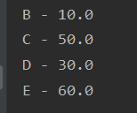

## Dijkstra – 实现二

- **不仅要返回终点和对应的路径长度，还要返回经过的具体路径**

```java
@Override
public Map<V, PathInfo<V, E>> shortestPath(V begin) {
    return dijkstra(begin);
}
```

```java
private Map<V, PathInfo<V, E>> dijkstra(V begin) {
    //从图中的所有顶点中取出规定的顶点并判断是否存在
    Vertex<V, E> beginVertex = verticesMap.get(begin);
    if (beginVertex == null) return null;

    //记录已经被选择，也就是已经离开桌面的顶点和路径信息
    Map<V, PathInfo<V, E>> selectedPaths = new HashMap<>();
    //一开始起点可直达的路径信息
    Map<Vertex<V, E>, PathInfo<V, E>> paths = new HashMap<>();
    //paths.put(beginVertex, new PathInfo<>(weightManager.zero()));
    // 初始化paths
    for (Edge<V, E> edge : beginVertex.outEdges) {
        PathInfo<V, E> path = new PathInfo<>();
        path.weight = edge.weight;
        path.edgeInfos.add(edge.info());
        paths.put(edge.to, path);
    }

    while (!paths.isEmpty()) {
        Entry<Vertex<V, E>, PathInfo<V, E>> minPath = getMinPath(paths);
        // minVertex离开桌面
        Vertex<V, E> minVertex = minPath.getKey();
        PathInfo<V, E> minPathInfo = minPath.getValue();
        selectedPaths.put(minVertex.value, minPathInfo);
        paths.remove(minVertex);
        // 对它的minVertex的outEdges进行松弛操作
        for (Edge<V, E> edge : minVertex.outEdges) {
            // 如果edge.to已经离开桌面，就没必要进行松弛操作
            if (selectedPaths.containsKey(edge.to.value)) continue;
            relaxForDijkstra(edge, minPathInfo, paths);
        }
    }

    selectedPaths.remove(begin);
    return selectedPaths;
}
```

- **松弛操作**

```java
    /**
	 * 松弛
	 * @param edge 需要进行松弛的边
	 * @param fromPath edge的from的最短路径信息
	 * @param paths 存放着其他点（对于dijkstra来说，就是还没有离开桌面的点）的最短路径信息
	 */
private void relaxForDijkstra(Edge<V, E> edge, PathInfo<V, E> fromPath, Map<Vertex<V, E>, PathInfo<V, E>> paths) {
    // 新的可选择的最短路径：beginVertex到edge.from的最短路径 + edge.weight
    E newWeight = weightManager.add(fromPath.weight, edge.weight);
    // 以前的最短路径：beginVertex到edge.to的最短路径
    PathInfo<V, E> oldPath = paths.get(edge.to);
    if (oldPath != null && weightManager.compare(newWeight, oldPath.weight) >= 0) return;

    if (oldPath == null) {
        oldPath = new PathInfo<>();
        paths.put(edge.to, oldPath);
    } else {
        oldPath.edgeInfos.clear();
    }

    oldPath.weight = newWeight;
    oldPath.edgeInfos.addAll(fromPath.edgeInfos);
    oldPath.edgeInfos.add(edge.info());
}
```

- **从paths中挑一个最小的路径出来**

```java
private Entry<Vertex<V, E>, PathInfo<V, E>> getMinPath(Map<Vertex<V, E>, PathInfo<V, E>> paths) {
    Iterator<Entry<Vertex<V, E>, PathInfo<V, E>>> it = paths.entrySet().iterator();
    Entry<Vertex<V, E>, PathInfo<V, E>> minPath = it.next();
    while (it.hasNext()) {
        Entry<Vertex<V, E>, PathInfo<V, E>> entry = it.next();
        if (weightManager.compare(entry.getValue().weight, minPath.getValue().weight) < 0) {
            minPath = entry;
        }
    }
    return minPath;
}
```

- **测试**

```java
static void testSp() {
    Graph<Object, Double> graph = directedGraph(Data.SP);
    Map<Object, Graph.PathInfo<Object, Double>> sp = graph.shortestPath("A");
    //Map<Object, Double> sp =graph.shortestPath("A");
    if (sp == null) return;
    sp.forEach((Object v, Graph.PathInfo<Object, Double> path) -> {
        System.out.println(v + " - " + path);
    });
}
```

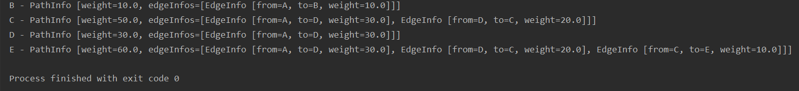

# Bellman-Ford

-  Bellman-Ford 也属于单源最短路径算法，支持负权边，还能检测出是否有负权环 
- 算法原理：对所有的边进行 V – 1 次松弛操作（ V 是节点数量），得到所有可能的最短路径 时间复杂度：O EV ，E 是边数量，V 是节点数量
- 下图的最好情况是恰好从左到右的顺序对边进行松弛操作 
  - 对所有边仅需进行 1 次松弛操作就能计算出A到达其他所有顶点的最短路径

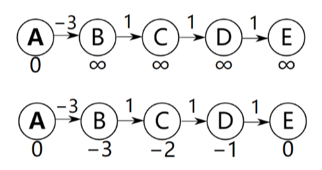

- 最坏情况是恰好每次都从右到左的顺序对边进行松弛操作 
  - 对所有边需进行 V – 1 次松弛操作才能计算出A到达其他所有顶点的最短路径

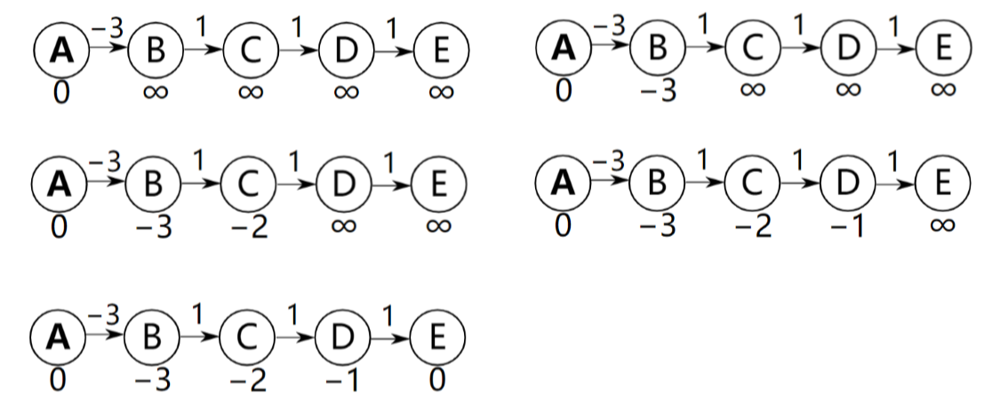

## Bellman-Ford – 实例

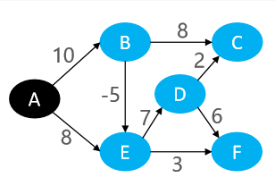

- 一共8条边 
- 假设每次松弛操作的顺序是：DC、DF、BC、ED、EF、BE、AE、AB

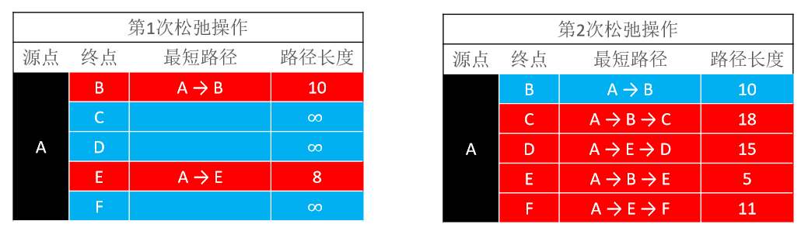

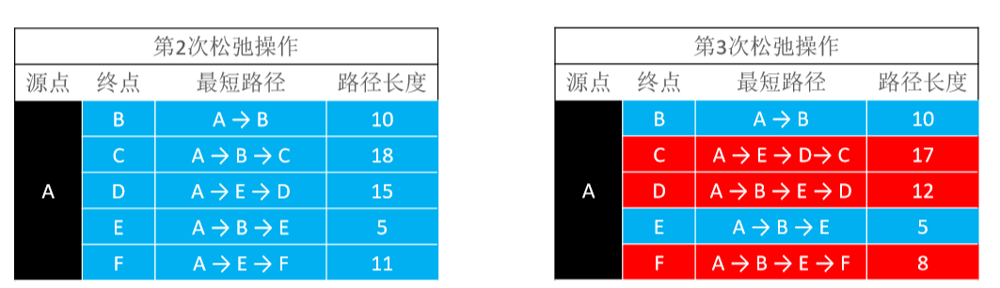

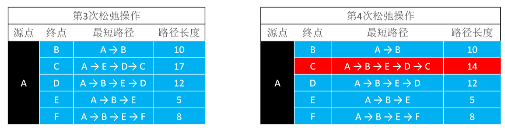

- 不难分析出，经过4次松弛操作之后，已经计算出了A到其他所有顶点的最短路径

## Bellman-Ford – 实现

```java
@Override
public Map<V, PathInfo<V, E>> shortestPath(V begin) {
    return bellmanFord(begin);
}
```

```java
private Map<V, PathInfo<V, E>> bellmanFord(V begin) {
    Vertex<V, E> beginVertex = verticesMap.get(begin);
    if (beginVertex == null) return null;

    Map<V, PathInfo<V, E>> selectedPaths = new HashMap<>();
    selectedPaths.put(begin, new PathInfo<>(weightManager.zero()));

    int count = verticesMap.size() - 1;
    for (int i = 0; i < count; i++) { // v - 1 次
        for (Edge<V, E> edge : edgesMap) {
            PathInfo<V, E> fromPath = selectedPaths.get(edge.from.value);
            if (fromPath == null) continue;
            relax(edge, fromPath, selectedPaths);
        }
    }

    //执行 v 次还可以松弛就必然有负权环
    for (Edge<V, E> edge : edgesMap) {
        PathInfo<V, E> fromPath = selectedPaths.get(edge.from.value);
        if (fromPath == null) continue;
        if (relax(edge, fromPath, selectedPaths)) {
            System.out.println("有负权环");
            return null;
        }
    }

    selectedPaths.remove(begin);
    return selectedPaths;
}
```

- **松弛操作**

```java
private boolean relax(Edge<V, E> edge, PathInfo<V, E> fromPath, Map<V, PathInfo<V, E>> paths) {
		// 新的可选择的最短路径：beginVertex到edge.from的最短路径 + edge.weight
		E newWeight = weightManager.add(fromPath.weight, edge.weight);
		// 以前的最短路径：beginVertex到edge.to的最短路径
		PathInfo<V, E> oldPath = paths.get(edge.to.value);
		if (oldPath != null && weightManager.compare(newWeight, oldPath.weight) >= 0) return false;
		
		if (oldPath == null) {
			oldPath = new PathInfo<>();
			paths.put(edge.to.value, oldPath);
		} else {
			oldPath.edgeInfos.clear();
		}

		oldPath.weight = newWeight;
		oldPath.edgeInfos.addAll(fromPath.edgeInfos);
		oldPath.edgeInfos.add(edge.info());
		
		return true;
	}
```

# Floyd

- Floyd 属于多源最短路径算法，能够求出任意2个顶点之间的最短路径，支持负权边 
- 时间复杂度：O(V^3)，效率比执行 V 次 Dijkstra 算法要好（ V 是顶点数量）
- 算法原理：从任意顶点 i 到任意顶点 j 的最短路径不外乎两种可能 
  1. 直接从 i 到 j 
  2. 从 i 经过若干个顶点到 j 
- 假设 dist(i，j) 为顶点 i 到顶点 j 的最短路径的距离，对于每一个顶点 k，检查 dist(i，k) + dist(k，j)＜dist(i，j) 是否成立 
  - 如果成立，证明从 i 到 k 再到 j 的路径比 i 直接到 j 的路径短，设置 dist(i，j) = dist(i，k) + dist(k，j) 
  - 当我们遍历完所有结点 k，dist(i，j) 中记录的便是 i 到 j 的最短路径的距离

```java
@Override
public Map<V, Map<V, PathInfo<V, E>>> shortestPath() {
    Map<V, Map<V, PathInfo<V, E>>> paths = new HashMap<>();
    // 初始化
    for (Edge<V, E> edge : edgesMap) {
        Map<V, PathInfo<V, E>> map = paths.get(edge.from.value);
        if (map == null) {
            map = new HashMap<>();
            paths.put(edge.from.value, map);
        }
        PathInfo<V, E> pathInfo = new PathInfo<>(edge.weight);
        pathInfo.edgeInfos.add(edge.info());
        map.put(edge.to.value, pathInfo);
    }

    verticesMap.forEach((V v2, Vertex<V, E> vertex2) -> {
        verticesMap.forEach((V v1, Vertex<V, E> vertex1) -> {
            verticesMap.forEach((V v3, Vertex<V, E> vertex3) -> {
                if (v1.equals(v2) || v2.equals(v3) || v1.equals(v3)) return;

                // v1 -> v2
                PathInfo<V, E> path12 = getPathInfo(v1, v2, paths);
                if (path12 == null) return;

                // v2 -> v3
                PathInfo<V, E> path23 = getPathInfo(v2, v3, paths);
                if (path23 == null) return;

                // v1 -> v3 
                PathInfo<V, E> path13 = getPathInfo(v1, v3, paths);

                E newWeight = weightManager.add(path12.weight, path23.weight);
                if (path13 != null && weightManager.compare(newWeight, path13.weight) >= 0) return;

                if (path13 == null) {
                    path13 = new PathInfo<V, E>();
                    paths.get(v1).put(v3, path13);
                } else {
                    path13.edgeInfos.clear();
                }

                path13.weight = newWeight;
                path13.edgeInfos.addAll(path12.edgeInfos);
                path13.edgeInfos.addAll(path23.edgeInfos);
            });
        });
    });

    return paths;
}

//-------------------------------------------------------

private PathInfo<V, E> getPathInfo(V from, V to, Map<V, Map<V, PathInfo<V, E>>> paths) {
    Map<V, PathInfo<V, E>> map = paths.get(from);
    return map == null ? null : map.get(to);
}
```

- Lambal表达式里的return只会跳出当前循环，不会结束整个方法
- **测试**

```java
static void testMultiSp() {
    Graph<Object, Double> graph = directedGraph(Data.NEGATIVE_WEIGHT1);
    Map<Object, Map<Object, Graph.PathInfo<Object, Double>>> sp = graph.shortestPath();
    sp.forEach((Object from, Map<Object, Graph.PathInfo<Object, Double>> paths) -> {
        System.out.println(from + "---------------------");
        paths.forEach((Object to, Graph.PathInfo<Object, Double> path) -> {
            System.out.println(to + " - " + path);
        });
    });
}
```

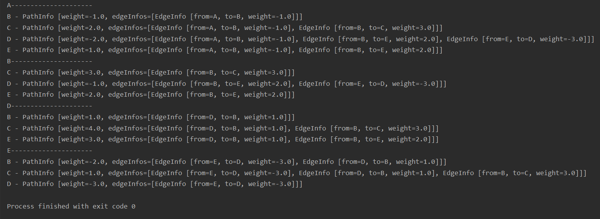