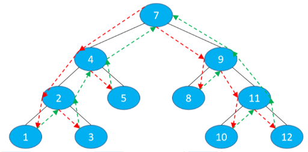
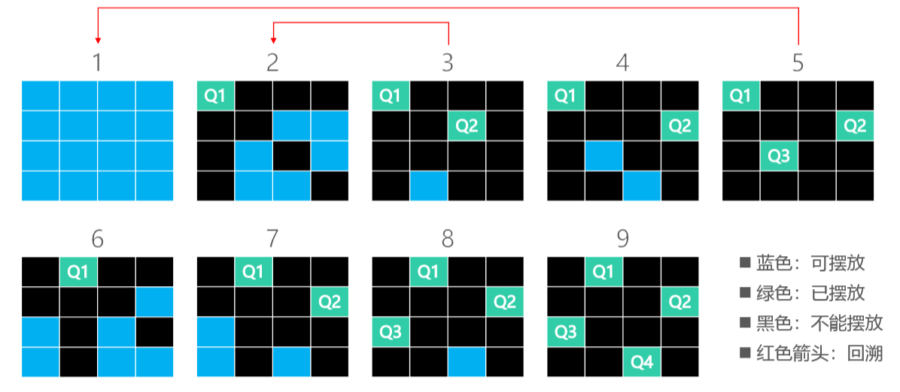

# 回溯（Back Tracking）

- 回溯可以理解为：通过选择不同的岔路口来通往目的地（找到想要的结果） 
- 每一步都选择一条路出发，能进则进，不能进则退回上一步（回溯），换一条路再试 
-  树、图的深度优先搜索（DFS）、八皇后、走迷宫都是典型的回溯应用



- 不难看出来，回溯很适合使用递归

# 八皇后问题（Eight Queens） 

- 八皇后问题是一个古老而著名的问题 

- 在8x8格的国际象棋上摆放八个皇后，使其不能互相攻击：任意两个皇后都不能处于同一行、同一列、同一斜线上 
  - 请问有多少种摆法？


# 四皇后 – 回溯法

- 在解决八皇后问题之前，可以先缩小数据规模，看看如何解决四皇后问题



# 四皇后 – 剪枝（Pruning）


# 八皇后问题的解决思路

-  思路一：暴力出奇迹 
  - 从 64 个格子中选出任意 8 个格子摆放皇后，检查每一种摆法的可行性 
  - 
- 思路二：根据题意减小暴力程度 
  - 很显然，每一行只能放一个皇后，所以共有 8^8 种摆法（16777216 种），检查每一种摆法的可行性
- 思路三：回溯法 
  - 回溯 + 剪枝

## 八皇后 – 回溯法1


## 八皇后 – 回溯法2


## 八皇后 – 回溯法3


## 八皇后实现

- 也可用于n皇后

```java
public class Queens {

    public static void main(String[] args) {
        new Queens().placeQueens(4);
    }

    //数组索引是行号，数组元素是列号
    int[] cols;

    //一共有多少种摆法
    int ways;

    void placeQueens(int n) {
        if (n < 1) return;
        //n个皇后有n行n列
        cols = new int[n];
        //从第0行开始摆放
        place(0);
        System.out.println(n + "皇后一共有" + ways + "种摆法");
    }
    //------------------------------------
}
```

### 摆放

- 从第row行开始摆放皇后

```java
void place(int row) {
    //从0行开始依次找寻合适的位置摆放皇后直到cols.length行结束
    if (row == cols.length) {
        ways++;
        show();
        return;
    }
    //遍历当前行的所有列，查找合适的摆放位置
    for (int col = 0; col < cols.length; col++) {
        //判断(row,col)位置下的摆放是否符合规则
        if (isValid(row, col)) {
            // 在第row行第col列摆放皇后
            cols[row] = col;
            //继续把皇后放在row+1行合适的位置
            place(row + 1);
        }
    }
}
```

### 剪枝

- 判断第row行第col列是否可以摆放皇后

```java
boolean isValid(int row, int col) {
    //遍历该行之前的所有行，包括该行
    for (int i = 0; i < row; i++) {
        // 第col列已经有皇后
        if (cols[i] == col) {
            System.out.println("[" + row + "][" + col + "]=false");
            return false;
        }
        // 第i行的皇后跟第row行第col列格子处在同一斜线上
        if (row - i == Math.abs(col - cols[i])) {
            System.out.println("[" + row + "][" + col + "]=false");
            return false;
        }
    }
    System.out.println("[" + row + "][" + col + "]=true");
    return true;
}
```

### 展示

```java
void show() {
    for (int i : cols) {
        for (int col = 0; col < cols.length; col++) {
            if (i == col) {
                System.out.print("1 ");
            } else {
                System.out.print("0 ");
            }
        }
        System.out.println();
    }
    System.out.println("------------------------------");
}
```


## 八皇后优化一

- 优化成员变量
- 优化对角线

- 左上角 -> 右下角的对角线索引：row – col + 7 
- 右上角 -> 左下角的对角线索引：row + col


```java
public class Queens2 {

    public static void main(String[] args) {
        new Queens2().placeQueens(4);
    }

    //数组索引是行号，数组元素是列号
    int[] queens;

    //标记着某一列是否有皇后
    boolean[] cols;

    //标记着某一斜线上是否有皇后（左上角 -> 右下角）
    boolean[] leftTop;

    //标记着某一斜线上是否有皇后（右上角 -> 左下角）
    boolean[] rightTop;

    //一共有多少种摆法
    int ways;

    void placeQueens(int n) {
        if (n < 1) return;
        //用来记录摆放的位置
        queens = new int[n];
        //记录已经摆放皇后的列
        cols = new boolean[n];
        //n个皇后总共有2n-1条对角线
        leftTop = new boolean[(n << 1) - 1];
        rightTop = new boolean[leftTop.length];
        place(0);
        System.out.println(n + "皇后一共有" + ways + "种摆法");
    }

    //-----------------------------------
}
```

### 摆放

- 从第row行开始摆放皇后

```java
void place(int row) {
    if (row == cols.length) {
        ways++;
        show();
        return;
    }

    //判断当前行的每一列是否有皇后
    for (int col = 0; col < cols.length; col++) {
        if (cols[col]) continue; //true：该列有皇后
        int ltIndex = row - col + cols.length - 1; //左上角 -> 右下角的对角线索引
        if (leftTop[ltIndex]) continue; 
        int rtIndex = row +col; //右上角 -> 左下角的对角线索引
        if (rightTop[rtIndex]) continue;

        queens[row] = col;
        cols[col] = true;
        leftTop[ltIndex] = true;
        rightTop[rtIndex] = true;
        place(row + 1);

        //恢复现场
        cols[col] = false;
        leftTop[ltIndex] = false;
        rightTop[rtIndex] = false;
    }
}
```

### 展示

```java
void show() {
    for (int row = 0; row < cols.length; row++) {
        for (int col = 0; col < cols.length; col++) {
            if (queens[row] == col) {
                System.out.print("1 ");
            } else {
                System.out.print("0 ");
            }
        }
        System.out.println();
    }
    System.out.println("-----------------------------");
}
```

# 八皇后优化二

- 通过位运算优化
- 仅限于8皇后以内的摆放，这跟申请的数组空间大小有关

>将列定义为byte类型，因为1个byte字节有8位2进制数，刚好满足8皇后的要求
>
>将对角线定义为short类型，是因为short为2个字节大小，为16位，也满足2*8-1的要求
>
>直接用二进制的每一位来代表是否可以摆放皇后

```java
public class Queens3 {

    public static void main(String[] args) {
        new Queens3().place8Queens();
    }

    //数组索引是行号，数组元素是列号
    int[] queens;

    //标记着某一列是否有皇后
    byte cols;

    //标记着某一斜线上是否有皇后（左上角 -> 右下角）
    short leftTop;

    //标记着某一斜线上是否有皇后（右上角 -> 左下角）
    short rightTop;

    //一共有多少种摆法
    int ways;

    void place8Queens() {
        queens = new int[8];
        place(0);
        System.out.println("8皇后一共有" + ways + "种摆法");
    }

    //------------------------------------------
}
```

### 摆放 

- 从第row行开始摆放皇后

>// 01111101 n
>//&11111011  ~00000100
>// 01111001

```java
void place(int row) {
    if (row == 8) {
        ways++;
        show();
        return;
    }

    for (int col = 0; col < 8; col++) {
        int cv = 1 << col; //1向右移动col位
        if ((cols & cv) != 0) continue;

        int lv = 1 << (row - col + 7);
        if ((leftTop & lv) != 0) continue;

        int rv = 1 << (row + col);
        if ((rightTop & rv) != 0) continue;

        queens[row] = col;
        cols |= cv;
        leftTop |= lv;
        rightTop |= rv;
        place(row + 1);
        cols &= ~cv;
        leftTop &= ~lv;
        rightTop &= ~rv;
    }
}
```

### 展示

```java
void show() {
    for (int row = 0; row < 8; row++) {
        for (int col = 0; col < 8; col++) {
            if (queens[row] == col) {
                System.out.print("1 ");
            } else {
                System.out.print("0 ");
            }
        }
        System.out.println();
    }
    System.out.println("------------------------------");
}
```

