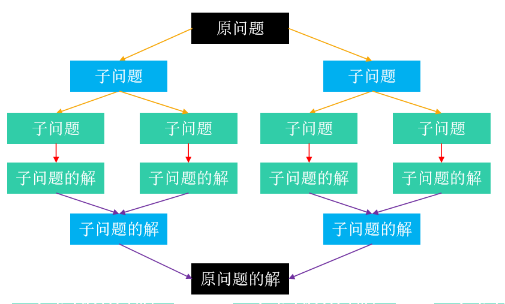
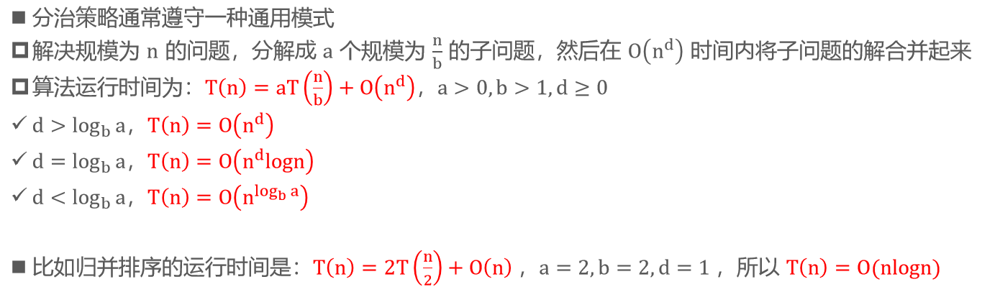
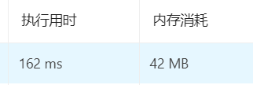
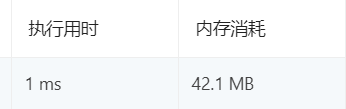

# 分治（Divide And Conquer）

- 分治，也就是分而治之。它的一般步骤是 
  1. 将原问题分解成若干个规模较小的子问题（子问题和原问题的结构一样，只是规模不一样）
  2. 子问题又不断分解成规模更小的子问题，直到不能再分解（直到可以轻易计算出子问题的解） 
  3. 利用子问题的解推导出原问题的解
- 因此，分治策略非常适合用递归 
- 需要注意的是：子问题之间是相互独立的



- 分治的应用 
  - 快速排序 
  - 归并排序 
  - Karatsuba算法（大数乘法）

# 主定理（Master Theorem）



# 最大连续子序列和

>给定一个长度为 n 的整数序列，求它的最大连续子序列和 
>
>比如 –2、1、–3、4、–1、2、1、–5、4 的最大连续子序列和是 4 + (–1) + 2 + 1 = 6

- 这道题也属于最大切片问题（最大区段，Greatest Slice）
- 概念区分：子串、子数组、子区间必须是连续的，子序列是可以不连续的

## 解法1 – 暴力出奇迹

- 穷举出所有可能的连续子序列，并计算出它们的和，最后取它们中的最大值

```java
static int maxSubArray(int[] nums) {
    if (nums == null || nums.length == 0) return 0;
    int max = Integer.MIN_VALUE;
    for (int i = 0; i < nums.length; i++) {
        int sum = 0;
        for (int j = i; j < nums.length; j++) {
            sum += nums[j];
            max = Math.max(max, sum);
        }
    }
    return max;
}
```



## 解法2 – 分治

- 将序列均匀地分割成 2 个子序列 
  - [begin , end) = [begin , mid) + [mid , end)，mid = (begin + end) >> 1
- 假设 [begin , end) 的最大连续子序列和是 S[i , j) ，那么它有 3 种可能
  - [i , j) 存在于 [begin , mid) 中，同时 S[i , j) 也是 [begin , mid) 的最大连续子序列和 
  - [i , j) 存在于 [mid , end) 中，同时 S[i , j) 也是 [mid , end) 的最大连续子序列和 
  - [i , j) 一部分存在于 [begin , mid) 中，另一部分存在于 [mid , end) 中
    - [i , j) = [i , mid) + [mid , j)
    - S[i , mid) = max { S[k , mid) }，begin ≤ k ＜ mid 
    - S[mid , j) = max { S[mid , k) }，mid ＜ k ≤ end


```java
public class Solution {
    public static void main(String[] args) {
        int[] array = {-2,1,-3,4,-1,2,1,-5,4};
        System.out.println(maxSubArray(array));

    }

    static int maxSubArray(int[] nums) {
        if (nums == null || nums.length == 0) return 0;
        return maxSubArray(nums, 0, nums.length);
    }

    static int maxSubArray(int[] nums, int begin, int end){
        if (end - begin <= 1) return nums[begin];
        int mid = (begin + end) >> 1;
        int leftMax = Integer.MIN_VALUE;
        int leftSum = 0;
        //求mid往左的最大子序列和
        //[begin,mid),mid取不到
        for (int i = mid-1;i >= begin; i--) {
            leftSum += nums[i];
            leftMax = Math.max(leftMax,leftSum);
        }
        int rightMax = Integer.MIN_VALUE;
        int rightSum = 0;
        //求mid往右的最大子序列和
        //[mid,end),end取不到
        for (int i = mid; i < end ; i++) {
            rightSum += nums[i];
            rightMax = Math.max(rightMax,rightSum);
        }
        return Math.max(leftMax+rightMax,
                        Math.max(maxSubArray(nums,begin,mid),maxSubArray(nums,mid,end)));
    }
}
```



