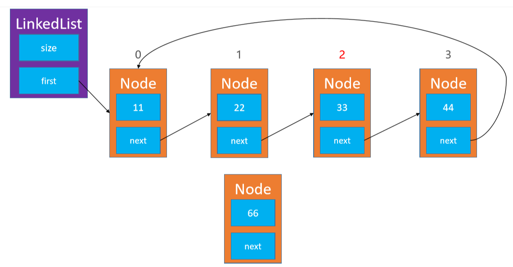
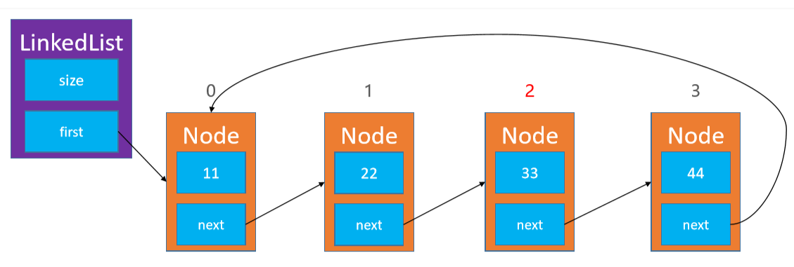

# 链表Linked List

- 动态数组有个明显的缺点 
  - 可能会造成内存空间的大量浪费 
- 能否用到多少就申请多少内存？ 
  - 链表可以办到这一点 
  - 链表是一种链式存储的线性表，所有元素的内存地址不一定是连续的


## 单向链表

指针只有一个方向


### 接口

和动态数组差不多，我就按动态数组的接口实现了

```java
int size(); // 元素的数量

boolean isEmpty(); // 是否为空

boolean contains(E element); // 是否包含某个元素

void add(E element); // 添加元素到最后面

E get(int index); // 返回index位置对应的元素

E set(int index, E element); // 设置index位置的元素

void add(int index, E element); // 往index位置添加元素

E remove(int index); // 删除index位置对应的元素

int indexOf(E element); // 查看元素的位置

void clear(); // 清除所有元素
```

比较简单，没啥好说的

```java

public class SingleList<E> implements List<E> {
    //链表实际长度
    private int size;
    //链表头结点
    private Node<E> head;
    //满足indexOf方法再添加一个定位属性
    private int location=0;

    static class Node<E>{
        //数据域
        private E element;
        //指针域
        private Node<E> next=null;

        Node(E element,Node<E> next){
            this.element=element;
            this.next=next;
        }
    }


    @Override
    public int size() {
        return size;
    }

    @Override
    public boolean isEmpty() {
        return size==0;
    }

    @Override
    public boolean contains(E element) {
        if (element==null) return false;
        Node<E> node=head;
        for (int i = 0; i < size; i++) {
            if (node.element==element){
                location=i;
                return true;
            }
            node=node.next;
        }
        return false;
    }

    @Override
    public void add(E element) {
        if (element==null) return;
        //添加第一个结点
        if (head==null){
            head=new Node<>(element,null);
            size++;
            return;
        }
        //添加第二、三...个结点
        Node<E> node=head;
        //从头结点的指针域往下找空位插入结点
        while (node.next!=null){
            node=node.next;
        }
        //node.next==null的情况
        node.next=new Node<>(element,null);
        size++;
    }

    @Override
    public E get(int index) {
        return nodeBack(index).element;
    }

    @Override
    public E set(int index, E element) {
        Node<E> node=nodeBack(index);
        E e=node.element;
        node.element=element;
        return e;
    }

    @Override
    public void add(int index, E element) {
        //index可以等于size
        rangOfCheckForAdd(index);
        //往头结点插入
        if (index==0){
           head=new Node<>(element,head);
           size++;
           return;
        }
        //往其他结点插入,先找到被插结点的前一个结点
        Node<E> prev=nodeBack(index-1);
        //被插结点
        Node<E> willMove=prev.next;
        //准备结点插入
        prev.next=new Node<>(element,willMove);
        size++;
    }

    @Override
    public E remove(int index) {
        rangOfCheck(index);
        if (head==null) return null;
        Node<E> removing=head;
        //特殊情况：删除头结点
        if (index==0){
            head=head.next;
            size--;
            return removing.element;
        }
        //其他情况：先取得要删除结点的前一个结点
        Node<E> prev=nodeBack(index-1);
        //得到要删除的结点
        removing=prev.next;
        //用被删除结点的前一个结点指向它的后一个结点
        prev.next=removing.next;
        size--;
        return removing.element;
    }

    @Override
    public int indexOf(E element) {
        if (contains(element)) return location;
        return -1;
    }

    @Override
    public void clear() {
        head=null;
        size=0;
    }

    @Override
    public String toString() {
        StringBuilder builder=new StringBuilder();
        Node<E> node=head;
        builder.append("[size=").append(size).append("], ");
        builder.append("List=[");
        for (int i = 0; i < size; i++) {
            if (i!=0){
                builder.append(",");
            }
            builder.append(node.element);
            node=node.next;
        }
        builder.append("]");
        return builder.toString();
    }

    //根据index返回对应结点
    private Node<E> nodeBack(int index){
        rangOfCheck(index);
        Node<E> node=head;
        for (int i = 0; i < index; i++) {
            node=node.next;
        }
        return node;
    }

    //确保外界传入的index合法
    private void rangOfCheck(int index){
        if (index<0||index>size){
            throw new IndexOutOfBoundsException("链表有效范围="+0+"---"+(size-1));
        }
    }
    //按规定下标添加index可以等于size
    private void rangOfCheckForAdd(int index){
        if (index<0||index>size){
            throw new IndexOutOfBoundsException("链表添加有效范围="+0+"---"+size);
        }
    }

}
```

### 反转链表


#### 递归

递归重点：缩小问题规模，问题规模为0和1时条件成立，那么问题规模为n和n+1时也成立


```java
    public void reverseList()
    {
        head=reverseList(head);
    } 
    //反转链表：递归
    private Node<E> reverseList(Node<E> node){
        //明确递归基:没有头结点或只有一个头结点就直接返回该结点
        if (node==null||node.next==null) return node;
        //减少问题规模：假如只有两个结点
        //返回值是第二个结点，此时指针的方向并没有改变
        Node<E> newHead=reverseList(node.next);
        //临时结点，方便对调这两个结点指针指向
        Node<E> temp=node.next;
        //第一个结点指针域置空
        node.next=null;
        //第二个结点连接第一个结点
        temp.next=node;
        //返回头结点的地址
        return newHead;
    }
```

#### 迭代


```java
    //反转链表：迭代
    private Node<E> reverseList(Node<E> node){
        if (node==null||node.next==null) return null;
        //当前结点的前一个结点
        Node<E> prev=null;
        //起码有两个结点
        while (node!=null){
            //先取得当前结点的后一个结点
            Node<E> next=node.next;
            //当前结点指向它的前一个结点
            node.next=prev;
            //把该结点标记为下一结点的前一个结点
            prev=node;
            //继续往下一个结点遍历反转
            //prev结点成为局部反转后的新头结点
            node=next;
        }
        //node.next==null,prev成为新的全局头结点
        return prev;
    }
```

## 双向链表


### 设计

```java
//链表长度
    private int size;
    //头指针：指向第一个结点
    private Node<E> head;
    //尾指针：指向最后一个结点
    private Node<E> tail;

    static class Node<E>{
        //数据域
        private E element;
        //储存下一个结点的指针域
        private Node<E> next;
        //储存上一个结点的指针域
        private Node<E> prev;
        //构造函数：每次创建结点后就自动连接起前后结点
        Node(E element,Node<E> next,Node<E> prev){
            this.element=element;
            this.next=next;
            this.prev=prev;
        }

        @Override
        public String toString() {
            StringBuilder builder=new StringBuilder();
            if (prev!=null){
                builder.append(prev.element).append("_");
            }else {
                builder.append("null_");
            }
            builder.append(element).append("_");
            if (next != null) {
                builder.append(next.element);
            } else {
                builder.append("null");
            }
            return builder.toString();
        }
    }
```

### 添加add(E element)

只有一个元素时


```java
 public void add(E element) {
        if (element==null) return;
        //添加第一个结点
        if (head==null){
            head=new Node<>(element,null,null);
            tail=head;
            size++;
            return;
        }
        //添加第二、三...结点
        Node<E> node=head;
        //从头结点开始寻找空位
        while (node.next!=null){
            node=node.next;
        }
        //找到空位:新结点的prev也连接上一个结点
        Node<E> newNode=new Node<>(element,null,node);
        //空位结点的next储存新结点
        node.next=newNode;
        //尾指针指向该结点
        tail=newNode;
        size++;
    }
```

### add(int index, E element)


```java
public void add(int index, E element) {
        if (element==null) return;
        rangOfCheckForAdd(index);
        //往头结点插入,如果是空链表
        if (head==null) {
            add(element);
            return;
        }
        //往尾部插入
        if (index==size) {
            add(element);
            return;
        }
        //往其他局部插入，先找到被插入结点
        Node<E> move=nodeBack(index);
        //通过move找到他之前的结点
        Node<E> prevOfMove=move.prev;
        //初步连接
        Node<E> newNode=new Node<>(element,move,prevOfMove);
        //改变prevOfMove的next指向
        //若是头结点的prev可能为空
        if (prevOfMove!=null){
        prevOfMove.next=newNode;
        }else {
            //成为新的头结点
            head=newNode;
        }
        //改变move的prev指向
        move.prev=newNode;
        size++;
    }
```

### 删除remove(int index)


```java
public E remove(int index) {
    rangOfCheck(index);
    //先找到被删除结点
    Node<E> move=nodeBack(index);
    Node<E> prevOfMove=move.prev;
    Node<E> nextOfMove=move.next;

    //只要改变move指针的前后结点指向，这个指针就消失了
    //如果删除的是头结点
    if (prevOfMove==null){
        head=nextOfMove;
    }else {//不是头结点
        prevOfMove.next=nextOfMove;
    }
    //如果是尾结点
    if (nextOfMove==null){
        tail=prevOfMove;
    }else {//不是尾结点
        nextOfMove.prev=prevOfMove;
    }
    size--;
    return move.element;
}
```

### 整体打印

```java
@Override
    public String toString() {
        StringBuilder builder=new StringBuilder();
        builder.append("[size=").append(size).append("], ");
        builder.append("LinkList=[");
        Node<E> node=head;
        for (int i = 0; i < size; i++) {
            if (i!=0){
                builder.append(", ");
            }
            builder.append(node);
            node=node.next;
        }
        builder.append("]");
        return builder.toString();
    }

```

## 双向链表 vs 单向链表


## 双向链表 vs 动态数组


## 单向循环链表


### add()

只有1个节点


### add(int index, E element)



###  remove(int index)




## 双向循环链表


### add()


###  add(int index, E element)


###  remove(int index)


###  约瑟夫问题（Josephus Problem）


