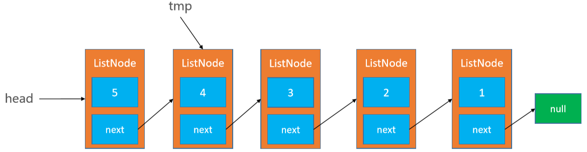
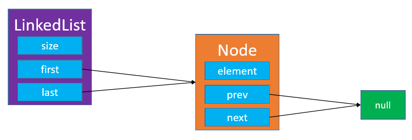

# 链表Linked List

- 动态数组有个明显的缺点 
  - 可能会造成内存空间的大量浪费 
- 能否用到多少就申请多少内存？ 
  - 链表可以办到这一点 
  - 链表是一种链式存储的线性表，所有元素的内存地址不一定是连续的


## 合法性检查

```java
public void outOfBounds(int index) {
    throw new IndexOutOfBoundsException("Index:" + index + ", Size:" + size);
}

protected void rangeCheck(int index) {
    if (index < 0 || index >= size) {
        outOfBounds(index);
    }
}

protected void rangeCheckForAdd(int index) {
    if (index < 0 || index > size) {
        outOfBounds(index);
    }
}
```

## 单向链表

指针只有一个方向


### 接口

和动态数组差不多，我就按动态数组的接口实现了

```java
int size(); // 元素的数量

boolean isEmpty(); // 是否为空

boolean contains(E element); // 是否包含某个元素

void add(E element); // 添加元素到最后面

E get(int index); // 返回index位置对应的元素

E set(int index, E element); // 设置index位置的元素

void add(int index, E element); // 往index位置添加元素

E remove(int index); // 删除index位置对应的元素

int indexOf(E element); // 查看元素的位置

void clear(); // 清除所有元素
```

### 基本结构

```java
public class SingleLinkedList<E> implements List<E>{

    static final int ELEMENT_NOT_FOUND = -1;
    private int size;
    private Node<E> head;

    private static class Node<E> {
        E element;
        Node<E> next;
        public Node(E element, Node<E> next) {
            this.element = element;
            this.next = next;
        }
    }

    //........................
}
```

### 清除所有元素

```java
public void clear() {
    size = 0;
    head = null;
}
```

### 获取index位置的元素

```java
public E get(int index) {
        /*
		 * 最好：O(1)
		 * 最坏：O(n)
		 * 平均：O(n)
		 */
    return getNode(index).element;
}
```

### 设置index位置的元素

```java
public E set(int index, E element) {
        /*
		 * 最好：O(1)
		 * 最坏：O(n)
		 * 平均：O(n)
		 */
    Node<E> node = getNode(index);
    E old = node.element;
    node.element = element;
    return old;
}
```

### 添加元素到尾部

```java
public void add(E element) {
    add(size, element);
}
```

### 在index位置插入一个元素

```java
public void add(int index, E element) {
    /*
		 * 最好：O(1)
		 * 最坏：O(n)
		 * 平均：O(n)
		 */
    rangeCheckForAdd(index);

    if (index == 0) {
        head = new Node<>(element, head);
    } else {
        Node<E> prev = getNode(index - 1);
        prev.next = new Node<>(element, prev.next);
    }
    size++;
}
```

### 删除index位置的元素

```java
@Override
public E remove(int index) {
        /*
		 * 最好：O(1)
		 * 最坏：O(n)
		 * 平均：O(n)
		 */
    rangeCheck(index);

    Node<E> node = head;
    if (index == 0) {
        head = head.next;
    } else {
        Node<E> prev = getNode(index - 1);
        node = prev.next;
        prev.next = node.next;
    }
    size--;
    return node.element;
}
```

### 查看元素的索引

```java
public int indexOf(E element) {
    if (element == null) {
        Node<E> node = head;
        for (int i = 0; i < size; i++) {
            if (node.element == null) return i;

            node = node.next;
        }
    } else {
        Node<E> node = head;
        for (int i = 0; i < size; i++) {
            if (element.equals(node.element)) return i;

            node = node.next;
        }
    }
    return ELEMENT_NOT_FOUND;
}
```

### 获取index位置对应的节点对象

```java
private Node<E> getNode(int index) {
    rangeCheck(index);

    Node<E> node = head;
    for (int i = 0; i < index; i++) {
        node = node.next;
    }
    return node;
}
```

### 整体打印

```java
public String toString() {
    StringBuilder string = new StringBuilder();
    string.append("size=").append(size).append(", [");
    Node<E> node = head;
    for (int i = 0; i < size; i++) {
        if (i != 0) {
            string.append(", ");
        }

        string.append(node.element);

        node = node.next;
    }
    string.append("]");
    return string.toString();
}
```

### 反转链表


#### 递归

递归重点：缩小问题规模，问题规模为0和1时条件成立，那么问题规模为n和n+1时也成立


```java
    public void reverseList()
    {
        head=reverseList(head);
    } 
    //反转链表：递归
    private Node<E> reverseList(Node<E> node){
        //明确递归基:没有头结点或只有一个头结点就直接返回该结点
        if (node==null||node.next==null) return node;
        //减少问题规模：假如只有两个结点
        //返回值是第二个结点，此时指针的方向并没有改变
        Node<E> newHead=reverseList(node.next);
        //临时结点，方便对调这两个结点指针指向
        Node<E> temp=node.next;
        //第一个结点指针域置空
        node.next=null;
        //第二个结点连接第一个结点
        temp.next=node;
        //返回头结点的地址
        return newHead;
    }
```

#### 迭代





```java
    //反转链表：迭代
    private Node<E> reverseList(Node<E> node){
        if (node==null||node.next==null) return null;
        //当前结点的前一个结点
        Node<E> prev=null;
        //起码有两个结点
        while (node!=null){
            //先取得当前结点的后一个结点
            Node<E> next=node.next;
            //当前结点指向它的前一个结点
            node.next=prev;
            //把该结点标记为下一结点的前一个结点
            prev=node;
            //继续往下一个结点遍历反转
            //prev结点成为局部反转后的新头结点
            node=next;
        }
        //node.next==null,prev成为新的全局头结点
        return prev;
    }
```

## 单向链表虚拟头结点的方式

- 头结点不存储数据，只存放结点的指针，头结点中保存的指针指向链表的第一个结点

### 添加

```java
public void add(int index, E element) {
    rangeCheckForAdd(index);

    Node<E> prev = index == 0 ? head : getNode(index - 1);
    prev.next = new Node<>(element, prev.next);

    size++;
}
```

### 删除

```java
public E remove(int index) {
    rangeCheck(index);

    Node<E> prev = index == 0 ? head : getNode(index - 1);
    Node<E> node = prev.next;
    prev.next = node.next;

    size--;
    return node.element;
}
```


## 双向链表


### 基本结构

```java
public class LinkedList<E> implements List<E>{
    static final int ELEMENT_NOT_FOUND = -1;
    private int size;
    private Node<E> head;
    private Node<E> tail;

    private static class Node<E> {
        E element;
        Node<E> prev;
        Node<E> next;
        public Node(Node<E> prev, E element, Node<E> next) {
            this.prev = prev;
            this.element = element;
            this.next = next;
        }

        /*
        结点的打印规则
        */
        @Override
        public String toString() {
            StringBuilder sb = new StringBuilder();

            if (prev != null) {
                sb.append(prev.element);
            } else {
                sb.append("null");
            }

            sb.append("_").append(element).append("_");

            if (next != null) {
                sb.append(next.element);
            } else {
                sb.append("null");
            }

            return sb.toString();
        }
    }

    public int size() {
        return size;
    }

    public boolean isEmpty() {
        return size == 0;
    }

    public boolean contains(E element) {
        return indexOf(element) != ELEMENT_NOT_FOUND;
    }

    //........................
}
```

### 清除所有元素

```java
public void clear() {
    size = 0;
    head = null;
    tail = null;
}
```

### 获取index位置的元素

```java
public E get(int index) {
    return getNode(index).element;
}
```

### 设置index位置的元素

```java
public E set(int index, E element) {
    Node<E> node = getNode(index);
    E old = node.element;
    node.element = element;
    return old;
}
```

### 添加元素到尾部

只有一个元素时



```java
public void add(E element) {
    add(size, element);
}
```

### 在index位置插入一个元素


- 需要注意的是index可以等于size

```java
public void add(int index, E element) {
    rangeCheckForAdd(index);

    // index == 0 && size == 0
    if (index == size) { // 往最后面添加元素
        Node<E> oldTail = tail;
        tail = new Node<>(oldTail, element, null);
        if (oldTail == null) { // 这是链表添加的第一个元素
            head = tail;
        } else {
            oldTail.next = tail;
        }
    } else {
        Node<E> next = getNode(index);
        Node<E> prev = next.prev; 
        Node<E> node = new Node<>(prev, element, next);
        next.prev = node;

        if (prev == null) { // index == 0
            head = node;
        } else {
            prev.next = node;
        }
    }

    size++;
}
```

### 删除index位置的元素


```java
public E remove(int index) {

    Node<E> node = getNode(index);
    Node<E> prev = node.prev;
    Node<E> next = node.next;

    if (prev == null) { // 说明index == 0，是头结点
        head = next;
    } else {
        prev.next = next;
    }

    if (next == null) { // 说明index == size - 1，是尾结点
        tail = prev;
    } else {
        next.prev = prev;
    }

    size--;
    return node.element;
}
```

### 查看元素的索引

```java
public int indexOf(E element) {
    if (element == null) {
        Node<E> node = head;
        for (int i = 0; i < size; i++) {
            if (node.element == null) return i;
            node = node.next;
        }
    } else {
        Node<E> node = head;
        for (int i = 0; i < size; i++) {
            if (element.equals(node.element)) return i;

            node = node.next;
        }
    }
    return ELEMENT_NOT_FOUND;
}
```

### 获取index位置对应的节点对象

```java
private Node<E> getNode(int index) {
    rangeCheck(index);

    if (index < (size >> 1)) {
        Node<E> node = head;
        for (int i = 0; i < index; i++) {
            node = node.next;
        }
        return node;
    } else {
        Node<E> node = tail;
        for (int i = size - 1; i > index; i--) {
            node = node.prev;
        }
        return node;
    }
}
```

### 整体打印

```java
public String toString() {
    StringBuilder string = new StringBuilder();
    string.append("size=").append(size).append(", [");
    Node<E> node = head;
    for (int i = 0; i < size; i++) {
        if (i != 0) {
            string.append(", ");
        }

        string.append(node);

        node = node.next;
    }
    string.append("]");
    return string.toString();
}
```

## 双向链表 vs 单向链表


## 双向链表 vs 动态数组


## 单向循环链表


### add()

只有1个节点


### add(int index, E element)


###  remove(int index)


## 双向循环链表


### add()


###  add(int index, E element)


###  remove(int index)


###  约瑟夫问题（Josephus Problem）


