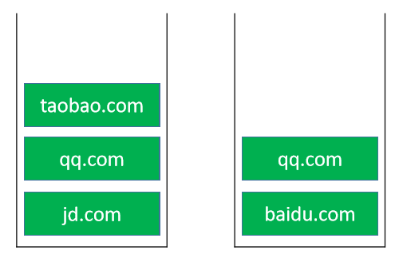

# 栈Stack

- 栈是一种特殊的线性表，只能在一端进行操作 
  - 往栈中添加元素的操作，一般叫做 push，入栈 
  - 从栈中移除元素的操作，一般叫做 pop，出栈（只能移除栈顶元素，也叫做：弹出栈顶元素） 
  - 后进先出的原则，Last In First Out，LIFO
- 注意：这里说的“栈”与内存中的“栈空间”是两个不同的概念


# 接口设计

```java
int size(); // 元素的数量 

boolean isEmpty(); // 是否为空 

void push(E element); // 入栈 

E pop(); // 出栈 

E top(); // 获取栈顶元素 

void clear(); // 清空
```

栈的内部实现是否可以直接利用以前学过的数据结构？ 

- 动态数组、链表

# 实现

1. 可以使用动态数组实现
2. 可以使用链表实现

```java
public class MyStack<E> implements Stack<E> {

    private LinkList<E> list=new LinkList<>();
    @Override
    public int size() {
        return list.size();
    }

    @Override
    public boolean isEmpty() {
        return list.isEmpty();
    }

    @Override
    public void push(E element) {
        list.add(element);
    }

    @Override
    public E pop() {
        return list.remove(size()-1);
    }

    @Override
    public E top() {
        return list.get(size()-1);
    }

    @Override
    public void clear() {
        list.clear();
    }
}

```

# 栈的应用 

 浏览器的前进和后退



- 输入 `jd.com `
-  输入 `qq.com`  
- 输入 `baidu.com `
-  后退 
-  后退 
-  前进 
-  输入 `taobao.com`
-  类似的应用场景 
  - 软件的撤销（Undo）、恢复（Redo）功能

