# B树

### 一、B树性质

#### 1、初识B树

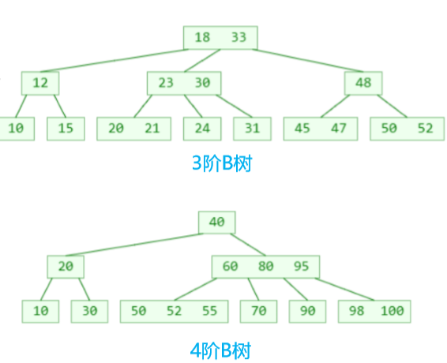

- B树是一种平衡的`多路`搜索树，多用于文件系统，数据库的实现。
- B树特点：
  - 一个节点可以存储超过`2`个元素，可以拥有超过`2`个子节点。
  - 拥有二叉树的一些性质。
  - 平衡，每个节点的所有子树高度一致。
  - 比较矮。

#### 2、m阶B树的性质（m >= 2）

- 假设一个节点存储的元素个数为x

  - 根节点个数：`1 <= x <= m-1`，三阶B树`根节点`数大于等于`1`并且小于等于`2`。

  - 非根节点：`(m / 2)(向上取整) - 1 <= x <= m - 1`

  - 如果有子节点，子节点个数 y = x + 1

    - 根节点：`2 <= y <= m`

    - 非根节点：`(m / 2)(向上取整) <= y <= m`

      

#### 3、B树 VS 二叉搜索树

- 将`二叉搜索树`的节点合并，可以成为`B树`。

- 多代（父和子）节点合并，可以获得一个超级节点（类似3阶B树中的18和33节点，23和30节点）。

  - `2代`合并的`超级节点`，最多拥有`4`个子节点（至少是`4阶B树`）。

  - `3代`合并的`超级节点`，最多拥有`8`个子节点（至少是`8阶B树`）。

  - n代合并的超级节点，最多拥有2^n个子节点（至少是2^n阶B树）。

    

- 将18和33合并，23和30合并，20和21合并，45和47合并，50和52合并。即将一个B树变为二叉搜索树

  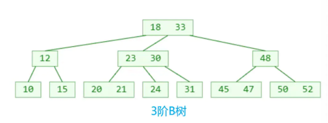

### 二、B树的操作

#### 1、搜索

- 先在节点内部`从小到大`搜索元素。

- 如果命中，搜索结束。

- 如果未命中，再去对应的子节点中搜索元素，重复步骤1

  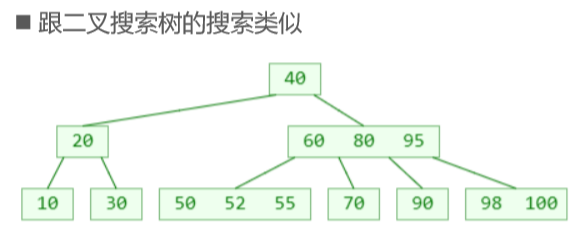

- 假设搜索`72`，首先在`根节点`做比较，`72`大于`40`，所以接着在`根节点`的`右子树`搜索，`72`大于`60`小于`80`，继续在`60`和`80`之间的子树寻找，因为`72`大于`70`，所以需要继续往`70`的`右子树`寻找，但是`右子树`为空，所以得出结论`72`不在该`B树`上。

#### 2、添加

- 新添加的元素必定是添加到叶子节点

  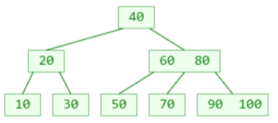

- 假设插入55，首先在根节点做比较，55大于40，所以接着在根节点的右子树搜索，55小于60，继续在60的左子树寻找，55大于50，所以将55插入在节点50的右侧。

  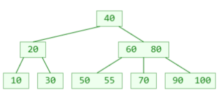

- 假设插入`95`，首先在`根节点`做比较，`95`大于`40`，所以接着在`根节点`的`右子树`搜索，`95`大于`80`，继续在`80`的`右子树`寻找，`95`大于`90`小于`100`，所以将`95`插入在节点`90`和`100`的中间。

  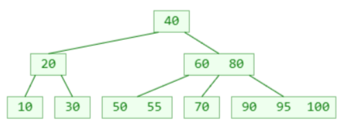

#### 3、上溢

- r如上图所示，假设再插入98呢？（假设这是一颗4阶B树）
  - 最右下角的叶子节点的元素个数将超过限制。
  - 这种现象可以称之为：`上溢（overflow）`。

#### 4、上溢的解决

- 假设5阶B树

  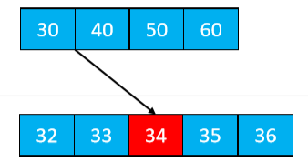

- 上溢节点的元素个数必然等于`m（5）`。

- 假设上溢节点最`中间元素`的位置为`k（3）`。

- 将`k`位置的元素`向上`与父节点`合并`。

- 将[0,k-1]和[k+1,m-1]位置的元素分裂成2个子节点，这2个子节点的元素个数，必然都不会低于最低限制（m / 2(向下取整) - 1）

  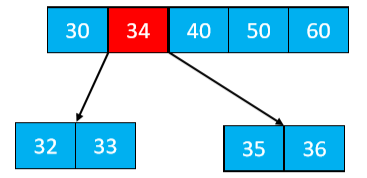

- 一次分裂完毕后，有可能导致父节点上溢，依然按照上述方法解决。

  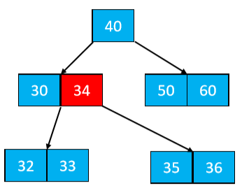

- 最极端的情况，有可能一致分裂到`根节点`。

- 添加元素导致的上溢，是唯一一种可能导致B树`长高`的操作。

#### 5、添加导致上溢的例子

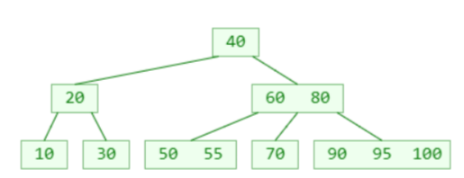

- 插入98

  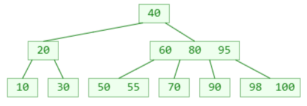

- `98`大于`根节点`，继续往`根节点`右子树比较，`98`大于`60`和`80`，继续往`80`右子树比较，`98`大于`90`，`95`，小于`100`，所以将`98`插入在`95`和`100`中间。

- 插入`98`之后，`90 95 98 100`节点溢出，需要`上溢`，将中间元素`95或98`向上与父节点`合并`，将`90，98，100`节点分裂成`2`个子节点。

- 插入52

  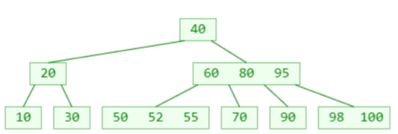

- 插入54

  

#### 6、删除

- 假如需要删除的元素在叶子节点中，那么直接删除即可。

  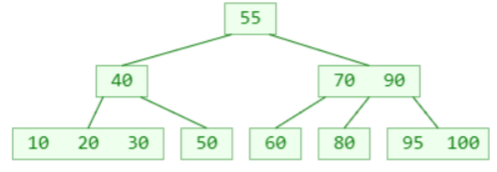

- 删除30

  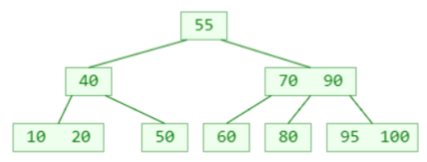

- 假如需要删除的元素在非叶子节点中。

  - 先找到前驱或后继元素，`覆盖`所需删除元素的值。
  - 再把前驱或后继元素删除。

- 删除60

  

- 60的前驱为55，将55从54和55节点中删除，并将55覆盖60。

  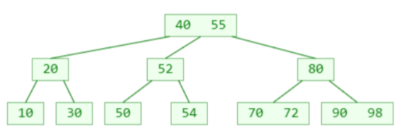

- 非叶子节点的前驱或后继元素，必定在叶子节点中。

  - 所以这里的删除前驱或后继元素，就是最开始提到的情况：删除的元素在叶子节点中。
  - 真正的删除元素都发生在叶子节点中。

#### 7、下溢

- 假设一颗`5阶B树`，删除`22`。
- 叶子节点被删除一个元素后，元素个数可能会低于最低限制`（>= m/2(向下取整) - 1）`。
- 这种现象称为：`下溢（underflow）`。

#### 8、下溢的解决

- 下溢节点的元素数量必然等于`(m/2(向下取整) - 2)`。

- 如果下溢节点临近的兄弟节点，有至少m/2(向下取整)个元素，可以向其借一个元素。

  

- 绿色节点在删除一个元素后，节点元素个数低于最低限制`（>= m/2(向下取整) - 1）`。

  - 为了使树继续满足B树的要求，需要对绿色节点进行`下溢`操作。
- 将父节点的元素`b`插入到下溢节点的`0`位置（最小位置）。
  - 用兄弟节点的元素`a`（最大的元素）替代父节点的元素`b`。
  - 这种操作其实就是：`旋转`。
  - 注意子节点`d`也需要调整。

- 如果下溢节点临近的兄弟节点，只有`（>= m/2(向下取整) - 1）`个元素。
  - 将父节点的元素b挪下来跟左右子节点进行`合并`。
  - 合并后的节点元素个数等于`m/2(向下取整) + m/2(向下取整) - 2`，不超过`m-1`。
  - 这个操作可能会导致父节点下溢，依然按照上述方法解决，下溢现象可能会一直往上传播。
- 添加元素导致的下溢，是唯一一种可能导致B树`变矮`的操作。