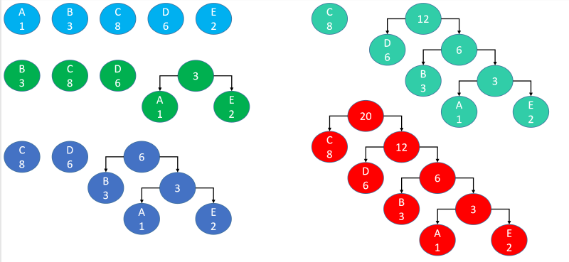
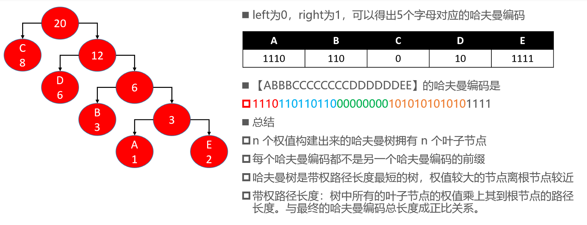

# 哈夫曼编码（Huffman Coding）

- 哈夫曼编码，又称为霍夫曼编码，它是现代压缩算法的基础
- 假设要把字符串【ABBBCCCCCCCCDDDDDDEE】转成二进制编码进行传输 
- 可以转成ASCII编码（65~69，1000001~1000101），但是有点冗长，如果希望编码更短呢？
- 可以先约定5个字母对应的二进制

- 如果使用哈夫曼编码，可以压缩至41个二进制位，约为原来长度的68.3%

# 哈夫曼树

- 先计算出每个字母的出现频率（权值，这里直接用出现次数），【ABBBCCCCCCCCDDDDDDEE】

- 利用这些权值，构建一棵哈夫曼树（又称为霍夫曼树、最优二叉树）
- 如何构建一棵哈夫曼树？（假设有 n 个权值） 
  1. 以权值作为根节点构建 n 棵二叉树，组成森林
  2. 在森林中选出 2 个根节点最小的树合并，作为一棵新树的左右子树，且新树的根节点为其左右子树根节点之和
  3. 从森林中删除刚才选取的 2 棵树，并将新树加入森林 
  4. 重复 2、3 步骤，直到森林只剩一棵树为止，该树即为哈夫曼树

# 构建哈夫曼树

# 构建哈夫曼编码

