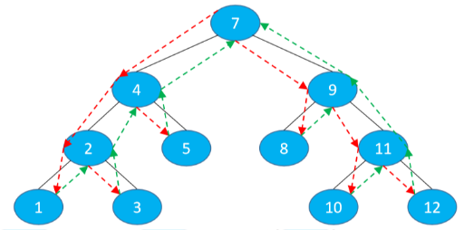
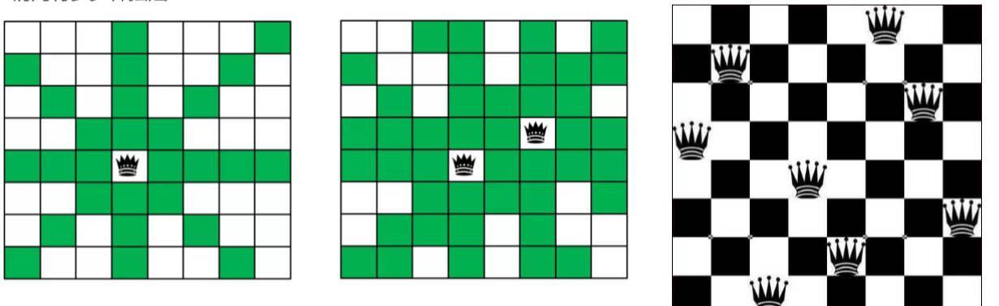
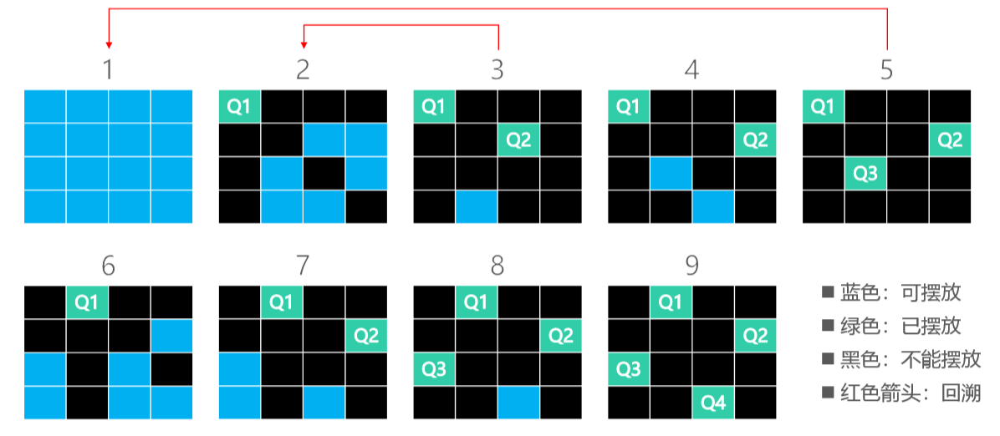
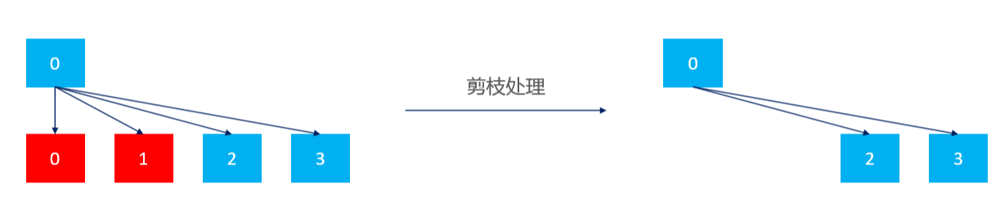
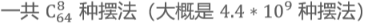
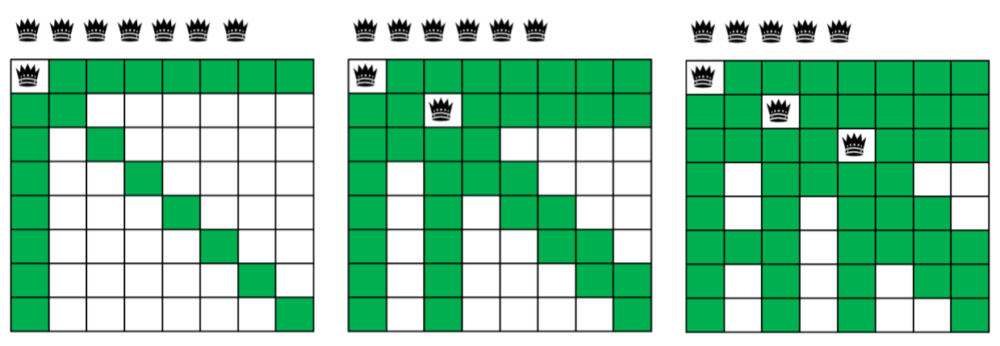
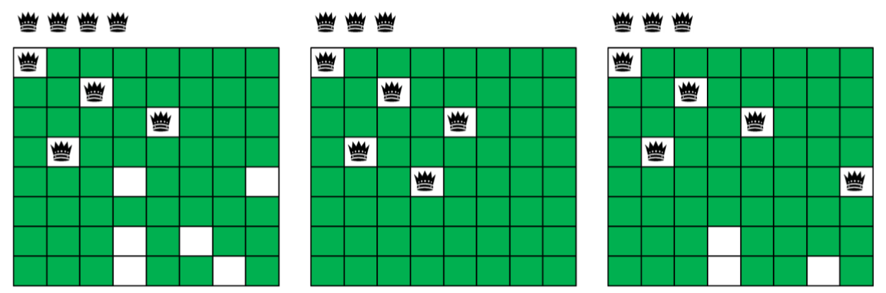
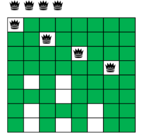

# 回溯（Back Tracking）

- 回溯可以理解为：通过选择不同的岔路口来通往目的地（找到想要的结果） 
- 每一步都选择一条路出发，能进则进，不能进则退回上一步（回溯），换一条路再试 
-  树、图的深度优先搜索（DFS）、八皇后、走迷宫都是典型的回溯应用

- 不难看出来，回溯很适合使用递归

# 八皇后问题（Eight Queens） 

- 八皇后问题是一个古老而著名的问题 

- 在8x8格的国际象棋上摆放八个皇后，使其不能互相攻击：任意两个皇后都不能处于同一行、同一列、同一斜线上 
  - 请问有多少种摆法？

# 四皇后 – 回溯法

- 在解决八皇后问题之前，可以先缩小数据规模，看看如何解决四皇后问题

# 四皇后 – 剪枝（Pruning）

# 八皇后问题的解决思路

-  思路一：暴力出奇迹 
  - 从 64 个格子中选出任意 8 个格子摆放皇后，检查每一种摆法的可行性 
  - 
- 思路二：根据题意减小暴力程度 
  - 很显然，每一行只能放一个皇后，所以共有 8^8 种摆法（16777216 种），检查每一种摆法的可行性
- 思路三：回溯法 
  - 回溯 + 剪枝

## 八皇后 – 回溯法1

## 八皇后 – 回溯法2

## 八皇后 – 回溯法3

## 八皇后实现 – 合法性检查

