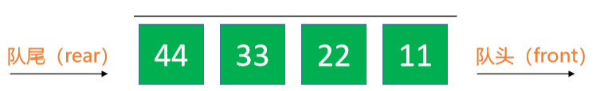

# 队列Queue

- 队列是一种特殊的线性表，只能在头尾两端进行操作 
  - 队尾（rear）：只能从队尾添加元素，一般叫做 enQueue，入队 
  - 队头（front）：只能从队头移除元素，一般叫做 deQueue，出队 
  - 先进先出的原则，First In First Out，FIFO



## 队列的接口设计

```java
int size(); // 元素的数量 

boolean isEmpty(); // 是否为空 

void clear(); // 清空 

void enQueue(E element); // 入队

E deQueue(); // 出队 

E front(); // 获取队列的头元素
```

队列的内部实现是否可以直接利用以前学过的数据结构？ 

- 动态数组、链表 
- 优先使用双向链表，因为队列主要是往头尾操作元素


# 双端队列Deque

双端队列是能在头尾两端添加、删除的队列 

- 英文 deque 是 double ended queue 的简称

```java
int size(); // 元素的数量 

boolean isEmpty(); // 是否为空 
void clear(); // 清空 

void enQueueRear(E element); // 从队尾入队 

E deQueueFront(); // 从队头出队 

void enQueueFront(E element); // 从队头入队 

E deQueueRear(); // 从队尾出队 

E front(); // 获取队列的头元素 

E rear(); // 获取队列的尾元素
```

# 循环队列Circle Queue

- 其实队列底层也可以使用动态数组实现，并且各项接口也可以优化到 O(1) 的时间复杂度 

- 这个用数组实现并且优化之后的队列也叫做：循环队列

## 循环双端队列

- 循环双端队列：可以进行两端添加、删除操作的循环队列
- 利用数组加一个front指针和一个tail指针即可完成

```java
package 对列;

import java.util.Arrays;

//循环对列
@SuppressWarnings("unchecked")
public class CircleQueue<E> implements Queue<E> {
    //存储队首下标
    private int front;
    //存储队尾下标
    private int tail;
    //队列实际大小
    private int size;
    //队列数组
    private E[] queue;
    //默认数组容量
    private final static int DEFAULT_CAPACITY=10;

    CircleQueue(){
        queue= (E[]) new Object[DEFAULT_CAPACITY];
    }
    CircleQueue(int capacity){
        queue= (E[]) new Object[capacity];
    }

    @Override
    public int size() {
        return size;
    }

    @Override
    public boolean isEmpty() {
        return size==0;
    }

    @Override
    public void clear() {
        for (int i = 0; i < size; i++) {
            //从头开始删除
            queue[front]=null;
            front=(front+1)%queue.length;
        }
    }

    @Override
    public void enQueue(E element) {
        if (element==null) return;
        enSureCapacity();
        //tail指向的位置就是入队的空位
        queue[tail]= element;
        //tail移向下一个空位
        tail=(tail+1)%queue.length;
        size++;
    }

    @Override
    public E deQueue() {
        //先进先出
        E removing=queue[front];
        queue[front]=null;
        //队头指向下一个元素
        front=(front+1)%queue.length;
        size--;
        enSureCapacity();
        return removing;
    }

    @Override
    public E front() {
        return queue[front];
    }
    private void enSureCapacity(){
        
        int len=queue.length;
        //(tail+1)%len==front;
        //一般情况下tail指向最后一个空位时表示数组已满
        if (size+1==len){
            //扩容到原来的1.5倍
            int newCapacity=len+(len>>1);
            doExtend(newCapacity);
        }
        if ( (size<(len>>1)&&size>DEFAULT_CAPACITY)){
            //缩容为原来的2倍
            int newCapacity=len>>1;
            doExtend(newCapacity);
        }
    }

    public void doExtend(int newCapacity){
        int len=queue.length;
        E[] newQueue= (E[]) new Object[newCapacity];
        for (int i = 0; i < size; i++) {
            newQueue[i]=queue[front];
            front=(front+1)%len;
        }
        front=0;
        tail=size;
        queue=newQueue;
        System.out.println("由len="+len+"扩容为"+newCapacity);
    }

    @Override
    public String toString() {
        return "CircleQueue{" +
                "front=" + front +
                ", tail=" + tail +
                ", size=" + size +
                ", queue=" + Arrays.toString(queue) +
                '}';
    }
}
```

