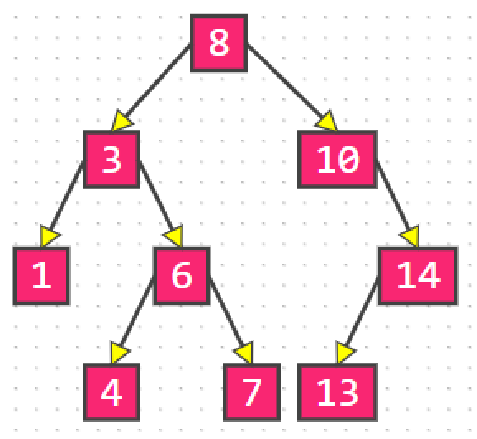
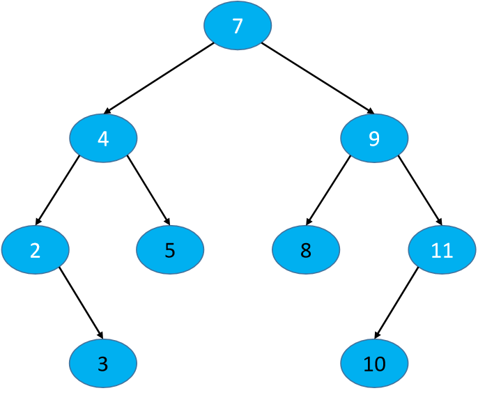
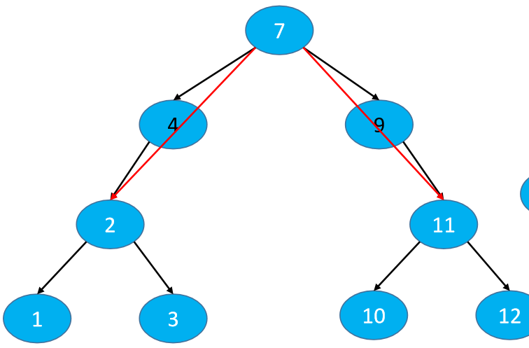
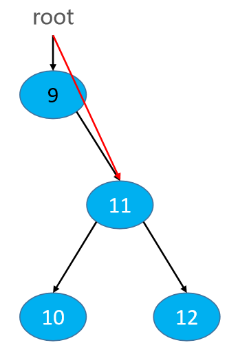
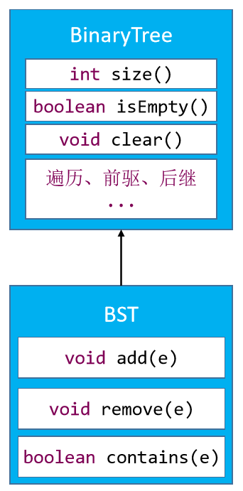

# 树

- 节点：根节点、父节点、子节点、兄弟节点 

- 一棵树可以没有任何节点，称为空树 
-  一棵树可以只有 1 个节点，也就是只有根节点 
-  子树、左子树、右子树
- 节点的度（degree）：子树的个数 
-  树的度：所有节点度中的最大值 
- 叶子节点（leaf）：度为 0 的节点 
-  非叶子节点：度不为 0 的节

## 基本概念

- 层数（level）：根节点在第 1 层，根节点的子节点在第 2 层，以此类推（有些说法也从第 0 层开始计算）
-  节点的深度（depth）：从根节点到当前节点的唯一路径上的节点总数
-  节点的高度（height）：从当前节点到最远叶子节点的路径上的节点总数
- 树的深度：所有节点深度中的最大值
-  树的高度：所有节点高度中的最大值
- 树的深度 等于树的高度

## 有序树/无序树/森林

- 有序树 
  - 树中任意节点的子节点之间有顺序关系
- 无序树 
  - 树中任意节点的子节点之间没有顺序关系 也称为“自由树”
- 森林 
  - 由 m（m ≥ 0）棵互不相交的树组成的集

## 二叉树Binary Tree

二叉树的特点 

- 每个节点的度最大为 2（最多拥有 2 棵子树） 
- 左子树和右子树是有顺序的 
- 即使某节点只有一棵子树，也要区分左右子

## 二叉树的性质

- 非空二叉树的第 i 层，最多有 `2i − 1` 个节点（ i ≥ 1 ）
- 在高度为 h 的二叉树上最多有 `2h − 1` 个结点（ h ≥ 1 ）
- 对于任何一棵非空二叉树，如果叶子节点个数为 `n0`，度为 2 的节点个数为 `n2`，则有: `n0 = n2 + 1`
  - 假设度为 1 的节点个数为`n1`，那么二叉树的节点总数` n = n0 + n1 + n2 `
  - ` n0 = n2 + 1`

## 真二叉树Proper Binary Tree

真二叉树：所有节点的度都要么为 0，要么为 2

## 满二叉树Full Binary Tree

 满二叉树：最后一层节点的度都为 0，其他节点的度都为 2

- 在同样高度的二叉树中，满二叉树的叶子节点数量最多、总节点数量最多

-  满二叉树一定是真二叉树，真二叉树不一定是满二叉树

- 假设满二叉树的高度为 h（ h ≥ 1 ），那么 

  - 第 i 层的节点数量：` 2i − 1`

  - 叶子节点数量：` 2h − 1`

  - 总节点数量 n 

    - $$
      n = 2^h − 1 = 2^0 + 2^1 + 2^2 + ⋯+ 2^h
      $$

    - `h = log2(n + 1)`

## 完全二叉树Complete Binary Tree

- 完全二叉树：对节点从上至下、左至右开始编号，其所有编号都能与相同高度的满二叉树中的编号对应
- 叶子节点只会出现最后 2 层，最后 1 层的叶子结点都靠左对齐 
-  完全二叉树从根结点至倒数第 2 层是一棵满二叉树 
-  满二叉树一定是完全二叉树，完全二叉树不一定是满二叉树

## 完全二叉树的性质

- 度为 1 的节点只有左子树
-  度为 1 的节点要么是 1 个，要么是 0 个
- 同样节点数量的二叉树，完全二叉树的高度最小
-  假设完全二叉树的高度为 h（ h ≥ 1 ），那么 
  - 至少有 2^(h − 1) 个节点 （ 2^0 + 2^1 + 2^2 + ⋯+ 2^(h−2) + 1 ） 
  - 最多有 2^h − 1 个节点（ 2^0 + 2^1 + 2^2 + ⋯+ 2^h，满二叉树 ） 
  - 总节点数量为 n 
    -  `2^(h − 1) ≤ n < 2h `
    -  `h − 1 ≤ log2n < h `
    - `h = floor( log2n ) + 1 `
    - floor 是向下取整，另外，ceiling 是向上取整

## 面试题

- 如果一棵完全二叉树有 768 个节点，求叶子节点的个数 
  - 假设叶子节点个数为 `n0`，度为 1 的节点个数为 `n1`，度为 2 的节点个数为 `n2 `
  - 总结点个数 `n = n0 + n1 + n2`，而且 `n0 = n2 + 1`
  -  `n = 2n0 + n1 – 1`
  - 完全二叉树的 `n1 `要么为 0，要么为 1 
    - `n1`为1时，`n = 2n0`，n 必然是偶数 
    - 叶子节点个数` n0 = n / 2`，非叶子节点个数 `n1 + n2 = n / 2`
    -  `n1`为0时，`n = 2n0 – 1`，n 必然是奇数 
  - 叶子节点个数` n0 = (n + 1) / 2`，非叶子节点个数 `n1 + n2 = (n – 1) / 2`叶子节点个数 `n0 = floor( (n + 1) / 2 ) `= `ceiling( n / 2 ) `
  - 非叶子节点个数 `n1 + n2 = floor( n / 2 ) = ceiling( (n – 1) / 2 ) `
  - 因此叶子节点个数为 384

# 二叉搜索树的概念

- 二叉搜索树是二叉树的一种，是应用非常广泛的一种二叉树，英文简称为` BST `
  - 又被称为：二叉查找树、二叉排序树 
  - 任意一个节点的值都大于其左子树所有节点的值 
  - 任意一个节点的值都小于其右子树所有节点的值 
  - 它的左右子树也是一棵二叉搜索树
- 二叉搜索树可以大大提高搜索数据的效率
-  二叉搜索树存储的元素必须具备可比较性 
  - 比如 int、double 等 
  - 如果是自定义类型，需要指定比较方式 
  - 不允许为 null



# 接口设计

```java
public interface Tree<E>{
    int size() ;// 元素的数量

    boolean isEmpty(); // 是否为空

    void clear();// 清空所有元素

    void add(E element); // 添加元素

    void remove(E element); // 删除元素

    boolean contains(E element);// 是否包含某元素
}
```

**需要注意的是：**

对于我们现在使用的二叉树来说，它的元素没有索引的概念 ，因为二叉树的插入和删除都是动态的

# 基本属性

```java
@SuppressWarnings("unchecked")
public class BST<E> implements Tree<E>, BinaryTreeInfo {
    //二叉树的大小
    private int size;
    //根节点
    private Node<E> root;
    //比较器，可由外界自定义比较方法
    private Comparator<E> comparator;

    //两个构造方法:可以传构造器，也可以不传
    BinaryTree(Comparator<E> comparator){
        this.comparator=comparator;
    }
    BinaryTree(){
        this(null);
    }

    //结点类
    static class Node<E>{
        //指针域：父节点，左孩子，右孩子
        private Node<E> parent;
        private Node<E> left;
        private Node<E> right;
        //数据域
        private E element;
        Node(E element,Node<E> parent){
            this.element=element;
            this.parent=parent;
        }
        
        //结点自己的方法
        //是否是度为0的叶子结点
        private boolean isLeaf(){
            return left==null&&right==null;
        }
        //是否是度为2的父节点
        private boolean hasTwoChildren(){
            return left!=null&&right!=null;
        }
        
        //是否是左孩子
        public boolean isLeftChild() {
			return parent != null && this == parent.left;
		}
		
        //是否是右孩子
		public boolean isRightChild() {
			return parent != null && this == parent.right;
		}
    }

    @Override
    public int size() {
        return size;
    }

    @Override
    public boolean isEmpty() {
        return size==0;
    }

    @Override
    public void clear() {
        root=null;
        size=0;
    }
```


# 添加结点


**添加步骤：**

1. 找到父节点 parent 
2. 创建新节点 node 

3. `parent.left = node 或者 parent.right = node`

- 遇到值相等的元素该如何处理？ 
  - 建议覆盖旧的值

```java
@Override
public void add(E element) {
        //如果添加的数据为空直接返回
        if (element==null) return;
        //第一次添加的数据肯定是作为根节点
        if (root==null){
            //根节点的父节点必为空
            root=new Node<E>(element,null);
            //树开始有了第一个数据
            size++;
        }
        //进行到这里必然有了根节点
        Node<E> node=root;
        //以后添加的数据都要和根节点进行大小比较
        int result=0;
        //根据Node类的构造函数，添加一个节点需要有一个父节点
        Node<E> parent=root;
        //开始从根节点往下找合适的位置添加
        while (node!=null){
            //由result的正负判断该往左还是往右添加
            result=compare(element,node.element);
            //当前遍历到的结点就为parent结点
            parent=node;
            if (result>0){//往右子树继续比较
                node=node.right;
            }else if (result<0){//往左子树继续比较
                node=node.left;
            }else {//添加的值和该结点的值相等直接覆盖旧值
                node.element=element;
                //直接结束函数
                return;
            }
        }
        //循环退出:node==null的情况,但node的parent不等于null
        if (result>0){
            parent.right=new Node<E>(element,parent);
        }else{
            parent.left=new Node<E>(element,parent);
        }//值相等的情况已经被覆盖了，所以没有第三种情况

        //增加一个新成员
        size++;
    }
```

## 元素的比较方案设计

1. 允许外界传入一个 Comparator 自定义比较方案
2. 如果没有传入 Comparator，强制认定元素实现了 Comparable 接口

```java
private int compare(E e1,E e2){
        //若外界传入了比较器则就用自定义的
        if (comparator!=null){
            return comparator.compare(e1,e2);
        }
        //若没有传入则用系统自带的或者在类里重写的比较方法
        return ((Comparable<E>)e1).compareTo(e2);
    }
```

# 遍历二叉树

用递归比较简单，递归可以使代码更加的简洁优雅。

递归主要的作用是把大的问题规模划分为小的问题规模再求解

## 前序遍历

```java
   //前序遍历结点：递归
    private void preOrder(Node<E> node){
        //递归基:结点不存在返回null;
        if (node==null) return;
        //存在，打印出来
        System.out.print(node.element+" , ");
        //递归左子树
        preOrder(node.left);
        //递归右子树
        preOrder(node.right);
    }
    //涉及到参数为结点的方法都要封装单独调用
    public void preOrder(){
        //不论什么遍历，给根节点就可以
        preOrder(root);
    }
```


从根节点开始遍历，先打印根节点6，之后调用`node.left`又会打印当前的左结点5，一直往下打印2，直到`2.left=null`后返回到该结点2，之后调用`2.right=null`，又继续回溯到`5.right=null`，以此类推

## 中序遍历

```java
private void inOrder(Node<E> node){
        //递归基:结点不存在返回null;
        if (node==null) return;
        //递归左子树
        preOrder(node.left);
        //存在，打印出来
        System.out.print(node.element+" , ");
        //递归右子树
        preOrder(node.right);
    }
    public void inOrder(){
        //不论什么遍历，给根节点就可以
        inOrder(root);
    }
```

## 后序遍历

```java
private void postOrder(Node<E> node){
        //递归基:结点不存在返回null;
        if (node==null) return;
        //递归左子树
        preOrder(node.left);
        //递归右子树
        preOrder(node.right);
        //存在，打印出来
        System.out.print(node.element+" , ");
    }
    public void postOrder(){
        //不论什么遍历，给根节点就可以
        inOrder(root);
    }
```

## 层序遍历

```java
//层序遍历使用对列，不会破坏树的结点引用，所以不用传参数了
    public void levelOrder(){
        if (root==null) return;
        //LinkedList实现了Queue的接口，是Queue的子类
        Queue<Node<E>> queue=new LinkedList<>();
        //根节点不为空：入队
        queue.offer(root);
        while (!queue.isEmpty()){
            //出队，拿到父结点
            Node<E> parent=queue.poll();
            //处理数据
            System.out.print(parent.element+" , ");
            //该父结点的左结点不为空就入队
            if (parent.left!=null){
                queue.offer(parent.left);
            }
            //该父结点的右结点不为空就入队
            if (parent.right!=null){
                queue.offer(parent.right);
            }
        }
    }
```


## 增强遍历接口

允许外界遍历二叉树的元素，之前的遍历操作我们都写得太死了，外界只能看到最终的打印结果，不能操作数据，控制打印的范围，这是很不理想的

以中序遍历为例：

```java
/访问者
    static abstract class Visitor<E>{
        //判断访问是否终止,true时停止访问
        boolean isStop;
        //访问方法
        public abstract boolean visit(E element);
    }
    private void inOrder(Node<E> node,Visitor<E> visitor){
        //递归基:结点不存在或外界需要停止时返回;
        if (node==null||visitor.isStop) return;
        //递归左子树
        inOrder(node.left,visitor);
        //用于结束递归调用,一直返回到根节点，无需再对右子树进行递归
        if (visitor.isStop) return;
        //访问者访问
        visitor.isStop=visitor.visit(node.element);
        //递归右子树
        inOrder(node.right,visitor);
    }
    public void inOrder(Visitor<E> visitor){
        //不论什么遍历，给根节点就可以
        inOrder(root,visitor);
    }
```

Main函数调用

```java
 tree.inOrder(new BinaryTree.Visitor<Integer>() {
            @Override
            public boolean visit(Integer element) {
                System.out.print(element+" ,.. ");
                //遍历到结点是7的时候终止
                return element == 7;
            }
        });
```


# 前驱节点predecessor


- 前驱节点：中序遍历时的前一个节点 
  - 如果是二叉搜索树，前驱节点就是前一个比它小的节点
- 情况一：`node.left != null `
  - 举例：3、5、7、10
  - ` predecessor = node.left.right.right.right... `
  - 终止条件：right 为 null
- 情况二：`node.left == null && node.parent != null `
  - 举例：2、4、6、8、15、20
  - `predecessor = node.parent.parent.parent... `
  - 终止条件：node 在 parent 的右子树中
- 情况三：`node.left == null && node.parent == null`
  - 那就没有前驱节点 
  - 举例：没有左子树的根结点


```java
   //找前驱结点
   private Node<E> predecessor(Node<E> node){
        if (node==null) return null;
        //找左子树
        Node<E> leftTree=node.left;
        //如果左子树不为空
        if (leftTree!=null){
            //一直找到右孩子为空的结点
            while (leftTree.right!=null){
                leftTree=leftTree.right;
            }
            //返回的就是左子树的最大值
            return leftTree;
        }

        //左子树为空的情况：1.没有左子树的根节点
        if(node.parent==null) return null;
        //2.没有左子树的其他结点：这类结点有父节点
        //父节点不等于空且这个结点还是其父节点的左子树就不满足，继续往上找
        while (node.parent!=null&&node==node.parent.left){
            node=node.parent;
        }
        //2.1.父节点为空会退出，即中序遍历的第一个数返回null
        //2.2找到了把该结点当作右子树的父节点或祖父结点
        return node.parent;
    }
```

方法调用：

```java
public E  predecessor(E element){
        Node<E> node=predecessor(nodeBack(element));
        //避免空指针异常
        if (node==null) return null;
        return node.element;
    }
```

# 返回结点

```java
    //根据传入的元素返回对应结点
    private Node<E> nodeBack(E element){
        if (element==null) return null;
        //从根节点开始比较
        Node<E> node=root;
        //比较结果
        int result=0;
        while (node!=null){
            result=compare(element,node.element);
            //运气最好的情况放在第一个
            if (result==0) return node;
            else if (result>0){//往根节点右边移动进行下一轮比较
                node=node.right;
            }
            else {//往根节点左边移动进行下一轮比较
                node=node.left;
            }
        }
        //node已经为null,说明和整棵树比较结束都没有结果
        return null;
    }
```

# 后继节点successor


- 后继节点：中序遍历时的后一个节点 
  - 如果是二叉搜索树，后继节点就是后一个比它大的结点
-  `node.right != null `
  - 举例：3、5、7、10、15
  - ` successor = node.right.left.left.left... `
  - 终止条件：left 为 null
- `node.right == null && node.parent != null `
  - 举例：2、4、6、8、20
  - `successor = node.parent.parent.parent... `
  - 终止条件：node 在 parent 的左子树中
- `node.right == null && node.parent == null `
  - 那就没有前驱节点 
  - 举例：没有右子树的根节

```java
 public E successor(E element){
        Node<E> node=successor(nodeBack(element));
        if (node==null) return null;
        return node.element;
    }

    private Node<E> successor(Node<E> node){
        if (node==null) return null;
        //先找到该结点的右子树
        Node<E> rightTree=node.right;
        //右子树不为空的情况
        if (rightTree!=null){
            //一直往右子树的左边找到尽头
            while (rightTree.left!=null){
                rightTree=rightTree.left;
            }
            return rightTree;
        }
        //右子树为空的情况
        //1.没有右子树的根节点
        if (node.parent==null) return null;
        //2.没有右子树的非根节点
        //和前序遍历相反
        while (node.parent!=null&&node==node.parent.right){
            node=node.parent;
        }
        return node.parent;
    }
```

# 二叉树的高度

```java
    //二叉树的高度:借助层序遍历
    public int heightOfTree(){
        if (root==null) return 0;
        Queue<Node<E>> queue=new LinkedList<>();
        queue.offer(root);
        //二叉树的高度
        int height=0;
        //层序遍历每一层的结点数
        int size=1;
        while (!queue.isEmpty()){
            Node<E> node=queue.poll();
            //每次出队就减少一个对列结点
            size--;
            //左右孩子入队
            if (node.left!=null){
                queue.offer(node.left);
            }
            if (node.right!=null){
                queue.offer(node.right);
            }
            //size==0时必然为当前层的结点全部出队
            if (size==0){
                //有几层就有多高
                height++;
                //拿到下一层结点的数量
                size=queue.size();
            }
        }
        return height;
    }
```

## 递归求高度

只要问题规模为0或1的情况成立，那么所有条件都成立

```java
//递归求高度
    private int height(Node<E> node){
        //递归基
        if (node==null) return 0;
        //缩小问题规模
        //1.假设该二叉树只有一个根节点
        //2.假设有一左一右两棵子树
        //针对1,2先找左子树的高度肯定为1或2
        int heightOfLeft=height(node.left)+1;
        int heightOfRight=height(node.right)+1;
        return Math.max(heightOfLeft,heightOfRight);
    }
    public int height(){
        return height(root);
    }
```

# 是否为完成二叉树

```java
//判断是否为完全二叉树
    public boolean isCompleteBinaryTree(){
        if (root==null) return false;
        Queue<Node<E>> queue=new LinkedList<>();
        queue.offer(root);
        boolean isLeaf=false;
        while (!queue.isEmpty()){
            //根节点先出队
            Node<E> node=queue.poll();
            //isLeaf为true时必须为叶子结点
            //应该是叶子却不满足叶子的条件返回false,这样有利于遍历完二叉树
            if (isLeaf&&!node.isLeaf()){
                return false;
            }
            //度为2时左右结点入队
            if (node.hasTwoChildren()){
                queue.offer(node.left);
                queue.offer(node.right);
            }
            //度为1的情况
            //无左有右直接返回false
            else if (node.left==null&&node.right!=null){
                return false;
            }
            //有左无右成立：入队
            else if (node.left!=null&&node.right==null){
                queue.offer(node.left);
            }else {//还剩度为0的情况：那就必为叶子结点
                isLeaf=true;
            }
        }
        return true;
    }
```

# 删除结点

**叶子结点：直接删除：** 



- 为左叶子
  - `node == node.parent.left`
  - `node.parent.left = null`
- 为右叶子
  - `node == node.parent.right `
  - ` node.parent.right = null`
- 既为根也为叶子
  - `node.parent == null `
  - ` root = null`

**度为1的结点：用子节点替代原节点的位置：**






- child 是 `node.left` 或者 child 是 `node.right`
- 用 child 替代 node 的位置 

1. 如果 node 是左子结点
   - `child.parent = node.parent `
   - `node.parent.left = child`
2. 如果 node 是右子结点
   - `child.parent = node.parent `
   - `node.parent.right = child`
3. 如果 node 是根节点 
   - `root = child `
   - `child.parent = null`

**度为2的结点：**

举例：先删除 5、再删除 4

1. 先用前驱或者后继结点的值覆盖原结点的值
2. 然后删除相应的前驱或后继结点

- 如果一个节点的度为 2，那么它的前驱、后继节点的度只可能是 1 和 0

```java
    @Override
    public void remove(E element) {
        //根据这个接口看出是传入删除的元素，删除元素的实质就是删除该元素所在结点位置
        //先找元素所在结点再删除
        remove(nodeBack(element));
    }
    private void remove(Node<E> node){
        if (node==null) return;

        //删除叶子结点：度为0，直接删除
        if (node.isLeaf()){
            //只有一个根结点
            if (node.parent==null) {
                root=null;
                return;
            }
            //是父结点的左孩子
            if (node==node.parent.left) {
                node.parent.left=null;
                return;
            }//是父结点的右孩子
            if (node==node.parent.right) {
                node.parent.right=null;
            }
        }

        //删除度为1的结点：用其子结点代替原结点的位置
        if (node.hasOneChild()){
            Node<E> child=null;
            //不是是其左孩子就是其右孩子
            if (node.left!=null){
                child=node.left;
            }else{
                child=node.right;
            }
            //有左子树或右子树的根节点
            if (node.parent==null){
                root=child;
                child.parent=null;
                size--;
                return;
            }
            //有左子树或右子树的非根节点
            child.parent=node.parent;
            if (node==node.parent.left){
                node.parent.left=child;
            }else if (node==node.parent.right){
                node.parent.right=child;
            }
            size--;
            return;
        }
        //删除度为2的结点
        if (node.hasTwoChildren()){
            //找其前驱或后继结点
            Node<E> replace=successor(node);
            //把后继结点的值赋给被删除结点
            node.element=replace.element;
            //再删除其后继结点
            //如果一个节点的度为 2，那么它的前驱、后继节点的度只可能是1和0
            remove(replace);
        }
    }
```

# 重构代码



`BST`是二叉搜索树，是二叉树的一种，那么就应该把与二叉树相同的部分抽离出来，这样有利于代码的整洁和重构

1. `BST`树特有的就是添加，删除，和判断元素是否包含的方法，其他的属性都是二叉树共有的
2. 把二叉树中的私有方法改为受保护型让`BST`树能够继承使用