# 红黑树

## 一、红黑树（Red Black Tree）

### 1、初识红黑树


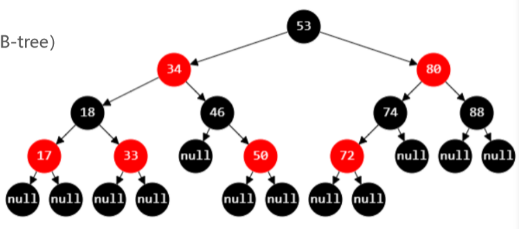


- 红黑树也是一种自平衡的二叉搜索树，也曾叫做平衡二叉B树。
- 红黑树必须满足以下5条性质：
  1. 节点是`RED`或者`BLACK`
  2. 根节点是`BLACK`
  3. 叶子节点（外部节点，空节点）都是`BLACK`
  4. RED节点的子节点都是BLACK
     - `RED`节点的`parent`都是`BLACK`
     - 从根节点到叶子节点的所有路径上不能有`2`个连续的`RED`节点
  5. 从任意节点到叶子节点的所有路径都包含相同数目的`BLACK`节点。
- 在添加和删除后，让树依然满足以上`5`条性质，就可以保证平衡。

### 2、红黑树的等价变化

判断这是否为一棵红黑树：


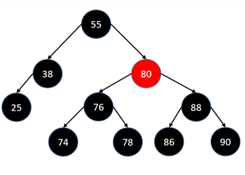

这并不是一棵红黑树，在38这个结点的右边应该再有一个黑色结点才为红黑树，违反了第五点，可补全每一个空结点计数判断。

## 等价变化

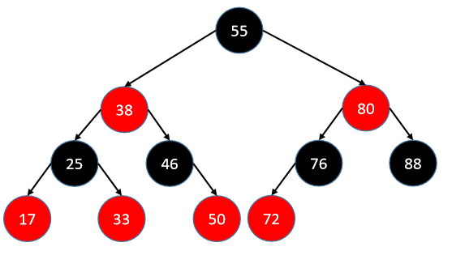

- 红黑树可完全等价于4阶B树

- 我们将红黑树的红色节点上移靠近父节点。

  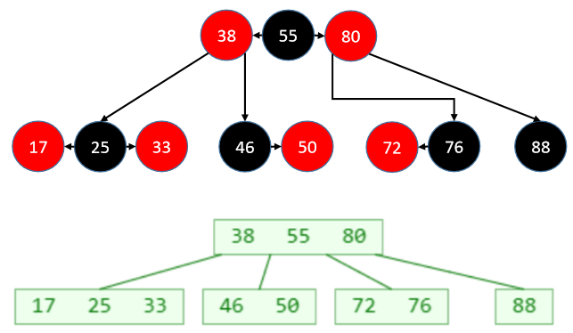

- `红黑树`和`4阶B树`具有等价性。

- `BLACK`节点与它的`RED`子节点融合在一起，形成`1`个B树节点。

- 红黑树的`BLACK`节点数与`4阶B树`的节点总个数`相等`。

### 3、红黑树 vs 2-3-4树

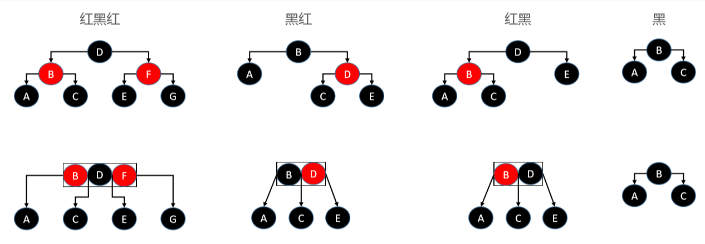


- 如果上图最底层的`BLACK`节点不存在，那么整颗B树只有`一个`节点，而且是`超级节点`。

### 4、红黑树节点关系

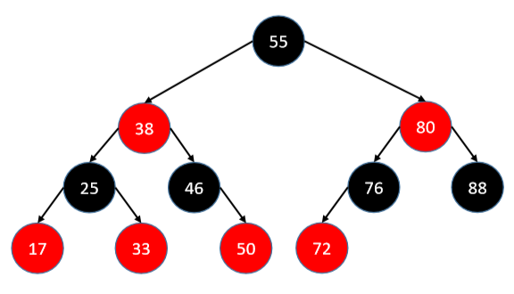


- 父节点（parent）
  - `55`是`38`和`80`的`父节点`，`38`是`25`和`46`的`父节点`。
- 兄弟节点（sibling）
  - `25`和`46`是`兄弟节点`，`76`和`88`是`兄弟节点`。
- 叔父节点（parent的兄弟节点）
  - `25`和`46`的`叔父节点`是`80`。
- 祖父节点（parent的父节点）
  - `25`的`祖父节点`是`55`。

## 二、红黑树的实现

### 1、构造方法

- 除了构造函数，还提供一些辅助函数，在之后会使用。

```java
// 红黑树继承于二叉平衡搜索树，这里只列出红黑树特有的属性。
public class RBTree<E> extends BBST<E> {
    private static final boolean RED = false;
    private static final boolean BLACK = true;
	
    @Override
    protected Node<E> createNode(E element, Node<E> parent) {
        return new RBNode<>(element, parent);
    }

    // 构造一个红黑节点，默认为红色
    private static class RBNode<E> extends Node<E> {
        boolean color = RED; //
        public RBNode(E element, Node<E> parent) {
            super(element, parent);
        }
    }
	
    // 节点染色
    private Node<E> color(Node<E> node, boolean color) {
        if (node == null) return node;
        ((RBNode<E>)node).color = color;
        return node;
    }
	
    // 将节点染为红色
    private Node<E> red(Node<E> node) {
        return color(node, RED);
    }
	
    // 将节点染为黑色
    private Node<E> black(Node<E> node) {
        return color(node, BLACK);
    }
	
    // 节点的颜色
    private boolean colorOf(Node<E> node) {
        return node == null ? BLACK : ((RBNode<E>)node).color;
    }
	
    // 是否为黑色节点
    private boolean isBlack(Node<E> node) {
        return colorOf(node) == BLACK;
    }
	
    // 是否为红色节点
    private boolean isRed(Node<E> node) {
        return colorOf(node) == RED;
    }
    
    public boolean isLeftChild() {
        return parent != null && this == parent.left;
    }
		
    public boolean isRightChild() {
        return parent != null && this == parent.right;
    }
	
    // 获取兄弟节点	
    public Node<E> sibling() {
        if (isLeftChild()) {
            return parent.right;
        }
			
        if (isRightChild()) {
            return parent.left;
        }
        return null;
    }
}
```

### 2、添加

- 通过之前的学习，我们知道：

  - B树中，`新元素`必定是添加到`叶子节点`中。
  - `4阶B树`所有节点的元素个数`x`，都符合`1 <= x <= 3`。

- 建议新添加的节点默认为`RED`，这样能够让红黑树的性质尽快满足（初识红黑树中的5条性质，除了性质4不一定满足）。

- 如果添加的是根节点，染成BLACK即可。

  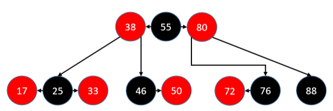

- 因为`新元素`必定是添加到`叶子节点`中，所以`红黑树`的添加一共有`12`种情况，分为`17`的`左右`，`33`的`左右`，`46`的`左`，`50`的`左右`，`72`的`左右`，`76`的`右`，`88`的`左右`。

- 其中`4`种是`parent为BLACK`的情况，有`8`种是`parent为RED`的情况。

#### 2.1 parent为BLACK

- 有`4`种情况满足红黑树的性质4：`parent为BLACK`。

- 并且同样也满足4阶B树的性质，因此不用做任何额外处理。

  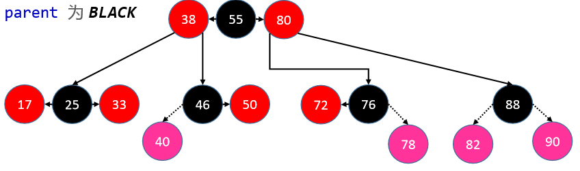

#### 2.2 parent为RED（Double Red）

- 这`8`种情况需要在添加之后修复红黑树。

- 其中有4种属于B树节点上溢的情况。（一个4阶B树存储【1,3】个结点，多了就上溢）

  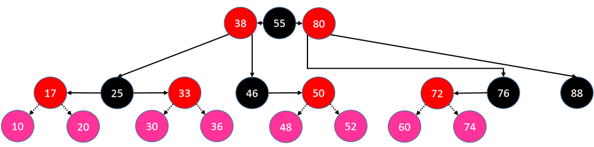

#### 2.2.1 添加-修复性质(针对第4点)-LL\RR


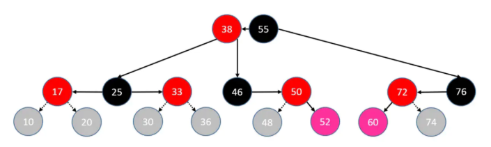


- 首先看`52`和`60`，这两种情况分别属于`RR`和`LL`。

- 判定条件：`uncle`不是`RED`。(空结点默认为黑色)

- 操作步骤：

  1. `parent`染成`BLACK`，`grand`染成`RED`。

  2. grand进行单旋操作。

     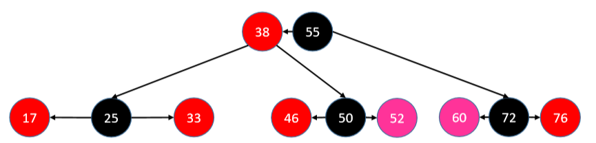

#### 2.2.2 添加-修复性质4-LR\RL

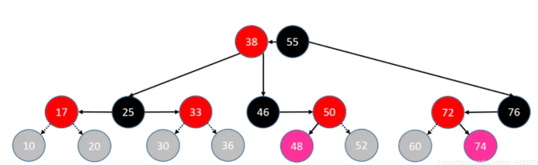


- 看`48`和`74`，这两种情况属于`LR`和`RL`。

- 判定条件：`uncle`不是RED。

- 操作步骤：

  1. `自己`染成`BLACK`，`grand`染成`RED`。

  2. 进行`双旋`操作。

  3. 如果是`LR`，`parent`左旋转，`grand`右旋转。

  4. 如果是RL，parent右旋转，grand左旋转。

     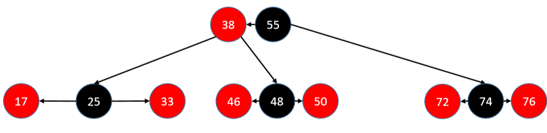

#### 2.2.3 添加-修复性质4-上溢-LL

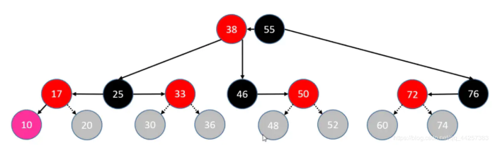


- 现在我们来添加`10`，`10`添加之后会导致上溢，这种情况属于`LL`。
- 判定条件：`uncle`是`RED`。
- 操作步骤：
  1. `parent`，`uncle`染成`BLACK`，成为独立节点。
  2. `grand`向上合并，染成`RED`，当作是新添加的节点进行处理。
  3. `grand`向上合并时，可能继续发生`上溢`，若`上溢`持续到`根节点`，只需将`根节点`染成`BLACK`。
- LL的情况不需要旋转，只需要染色。

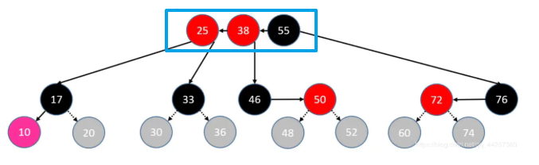

#### 2.2.4 添加-修复性质4-上溢-RR

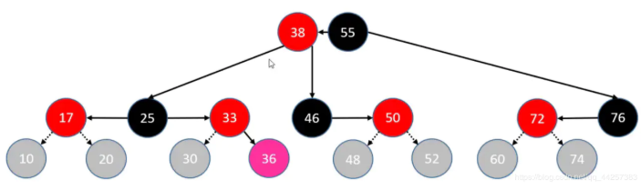


- 判定条件：`uncle`是`RED`。
- 操作步骤：
  1. `parent`，`uncle`染成`BLACK`，成为独立节点。
  2. `grand`向上合并，染成`RED`，当作是新添加的节点进行处理。

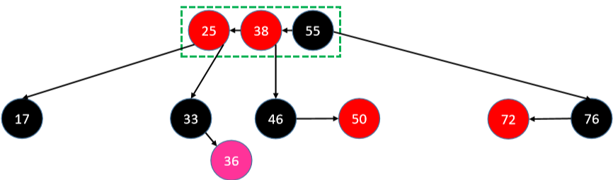


#### 2.2.5 添加-修复性质4-上溢-LR

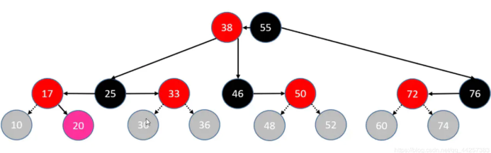


- 判定条件：`uncle`是`RED`。

- 操作步骤：

  1. `parent`，`uncle`染成`BLACK`，成为独立节点。

  2. grand向上合并，染成RED，当作是新添加的节点进行处理。

     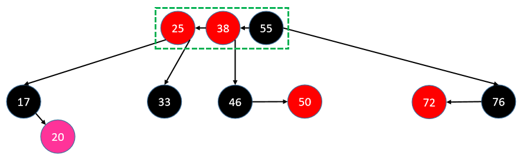

#### 2.2.6 添加-修复性质4-上溢-RL

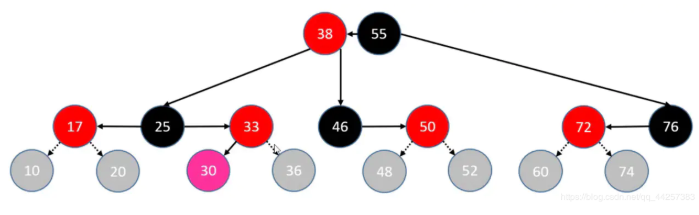


- 判定条件：`uncle`是`RED`。

- 操作步骤：

  1. `parent`，`uncle`染成`BLACK`，成为独立节点。

  2. grand向上合并，染成RED，当作是新添加的节点进行处理。

     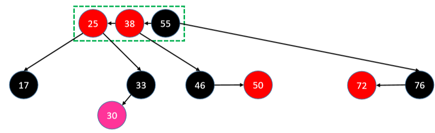

#### 2.3 添加总结

- 添加一共有`12`种情况。
- 其中有`4`种情况，添加之后`父节点`为`黑色`，添加之后不用做处理。依然满足性质`4`。
- 另外`8`种情况，添加之后`父节点`为`红色`，不满足性质`4`，需要进行双红修复处理。
- 修复分为两种情况：
  - uncle不是RED：
    - `LL\RR`，让`祖父节点`进行单旋转，染成`红色`，让`父节点`成为中心，并染成`黑色`。
    - `LR\RL`，让`祖父节点`和`父节点`进行旋转，让新添加成员成为中心节点，染成`黑色`，祖父节点染成`红色`。
  - uncle是RED：
    - `父节点`，`叔父节点`染成`黑色`。
    - `祖父节`点染成`红色`，并`上溢`。

#### 2.4 添加实现

- `rotateLeft`，`rotateRight`函数实现请查看平衡二叉搜索树（AVL）

```java
protected void afterAdd(Node<E> node) {
    Node<E> parent = node.parent;
    // 添加的是根节点 或者 上溢到达了根节点
    if (parent == null) {
        black(node);
        return;
    }
    // 如果父节点是黑色，添加结点不用做任何处理，直接返回
    if (isBlack(parent)) return;
		
    // 叔父节点
    Node<E> uncle = parent.sibling();
    // 祖父节点
    Node<E> grand = red(parent.parent);
    if (isRed(uncle)) { // 叔父节点是红色，说明原来就有3个结点了【B树节点上溢】
        black(parent);
        black(uncle);
        // 把祖父节点当做是新添加的节点
        afterAdd(grand);
        return;
    }
		
    // 叔父节点不是红色
    if (parent.isLeftChild()) { // L
        if (node.isLeftChild()) { // LL
            black(parent);
        } else { // LR
            black(node);
            rotateLeft(parent);
        }
        rotateRight(grand);
    } else { // R
        if (node.isLeftChild()) { // RL
            black(node);
            rotateRight(parent);
        } else { // RR
            black(parent);
        }
        rotateLeft(grand);
    }
}
```

### 3、删除

- B树中，最后真正被删除的元素都在叶子节点上。

  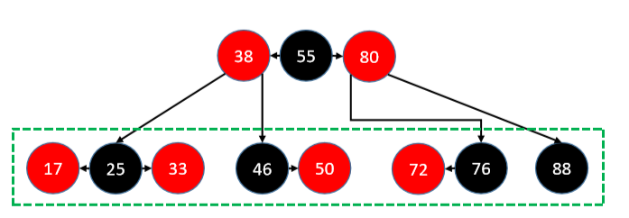

- 删除分为`删除RED节点`和`删除BLACK节点`两种情况。

- 删除RED节点，直接删除即可，不用做任何调整。

  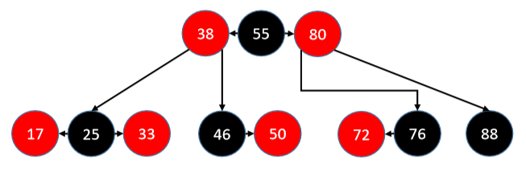

- 删除BLACK节点分为3种情况。

  - 拥有2个RED子节点的BLACK节点，例如25。

    - 不可能被直接删除，因为会找它的`前驱`或`后继`子节点替代删除，因此不用考虑这种情况。

  - 拥有`1`个`RED子节点`的`BLACK节点`，例如`46`，`76`。

  - BLACK叶子节点，例如88。

    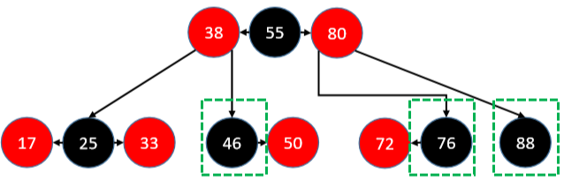

#### 3.1 删除拥有1个RED子节点的BLACK节点

- 判定条件：删除指定节点后，用以代替的子节点是RED。

- 将替代的子节点染成BLACK即可保持红黑树的性质。

- 例如删除50和72。

  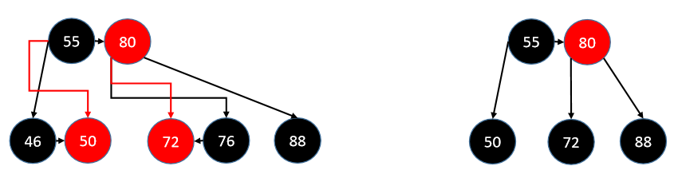

#### 3.2 删除 - BLACK叶子节点 - sibling为BLACK

- `BLACK叶子节`点被删除后，会导致B树节点`下溢`（比如删除`88`）。

#### 3.2.1 sibling至少有1个RED子节点

- 如果sibling至少有1个RED子节点：

  - 进行旋转操作。
  - 旋转之后的中心节点继承`parent`的颜色。
  - 旋转之后的左右节点染为`BLACK`。

- 如果sibling有2个RED子节点，那么可以选择删除其左子节点或右子节点，删除左子节点少做一次旋转。

  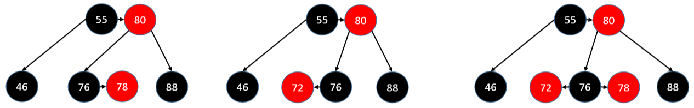

- 举例：（删除88的上三图和下三图相互对应）

  - 删除第一幅图的`88`。（例外两幅图都当作LL来进行统一处理）

  - `76`左旋转，`80`右旋转。

  - 中心节点`(78)`继承`parent`的颜色`(80)`。

  - 80旋转下去之后，染成BLACK。

    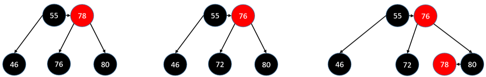

#### 3.2.2 sibling没有RED子节点

- 如果sibling没有1个RED子节点：【下溢】

  - 将sibling染成RED，parent染成BLACK即可修复红黑树性质。

    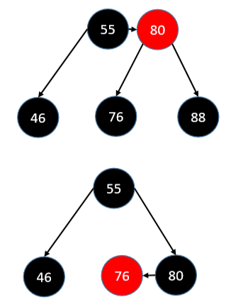

- 如果parent是BLACK

  - 会导致`parent`也下溢。

  - 这时只需要把parent当作被删除的节点处理即可，相当于递归调afterRemove()。

    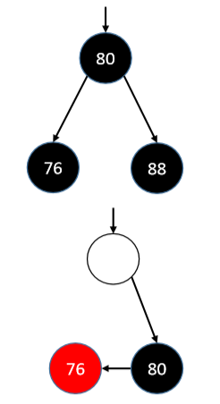

#### 3.2.3 sibling为RED

- 如果sibling是RED：

  - `sibling`染成`BLACK`，parent染成`RED`，进行旋转。

  - 于是又回到sibling是BLACK的情况。

    - 删除88
    
    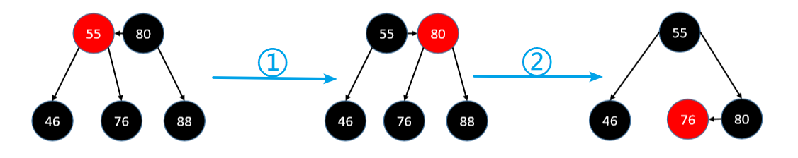
    
    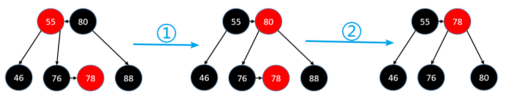
    
    

## 红黑树的平衡

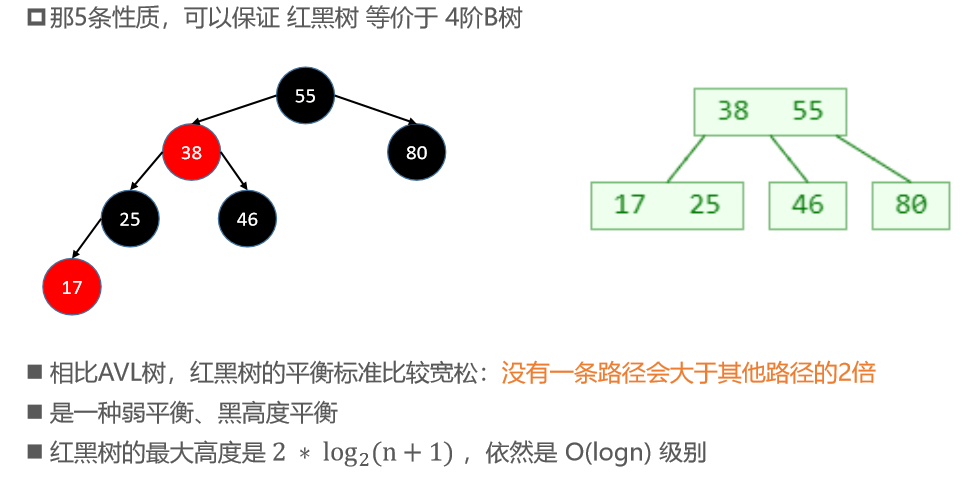

## 平均时间复杂度

- 搜索：O(logn)
- 添加：O(logn)，O(1) 次的旋转操作
- 删除：O(logn)，O(1) 次的旋转操作

## AVL树 vs 红黑树

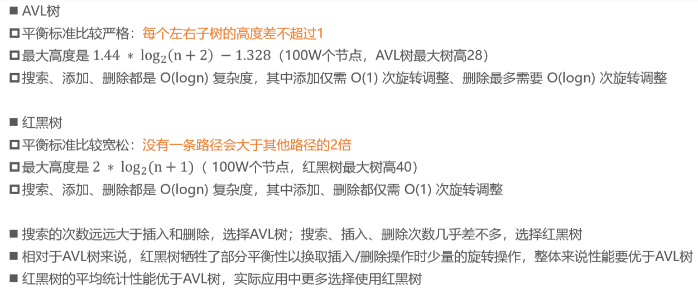

# 整体

```java
public class RBTree<E> extends BalanceBST<E> {
    //规定：false代表红色 true代表黑色
    private static final boolean RED = false;
    private static final boolean BLACK = true;

    RBTree(Comparator<E> comparator){
        super(comparator);
    }
    public RBTree(){
        this(null);
    }

    @Override
    protected void afterAdd(Node<E> node) {
        //先取出当前添加结点的父节点
        Node<E> parent=node.parent;
        //1.如果是第一次添加必然是根结点，默认染成黑色
        if (parent==null){
            black(node);
            return;
        }

        //2.父节点如果是黑色则不用进行任何操作
        if (isBlack(parent) == BLACK) return;

        //3.添加结合父节点都是红色 double red的情况
        //先拿到其叔父结点和祖父结点
        Node<E> uncle=parent.sibling();
        Node<E> grand=parent.parent;

        //3.1如果叔父结点是红色则把其父节点和叔父结点染成黑色
        //再把其祖父结点染成红色并当作新结点进行上溢
        if (isRed(uncle)){
            black(parent);
            black(uncle);
            red(grand);
            //使用递归，重新走添加新结点的逻辑
            afterAdd(grand);
            return;
        }

        //3.2叔父结点是黑色需要进行选择操作
        //先判断父节点的方向再判断自己的方向
        if (parent.isLeftChild()){//L
            red(grand);
            if (node.isRightChild()){
                //LR:先对parent进行右旋再对grand进行左旋
                black(node);
                rotateLeft(parent);
            }else {
                //LL先染色
                black(parent);
            }
            //LL：只用对grand进行右旋
            rotateRight(grand);
        }else {//R
            red(grand);
            if (node.isLeftChild()){
                black(node);
                //RL：先对parent进行右旋再对grand进行右旋
                rotateRight(parent);
            }else {
                black(parent);
            }
            //RR：只用对grand进行左旋
            rotateLeft(grand);
        }

    }

    @Override
    protected void afterRemove(Node<E> node) {
        // 如果删除的节点是红色
        // 或者 用以取代删除节点的子节点是红色
        if (isRed(node)) {
            black(node);
            return;
        }

        Node<E> parent = node.parent;
        // 删除的是根节点
        if (parent == null) return;

        // 删除的是黑色叶子节点【下溢】
        // 判断被删除的node是左还是右
        boolean left = parent.left == null || node.isLeftChild();
        Node<E> sibling = left ? parent.right : parent.left;
        if (left) { // 被删除的节点在左边，兄弟节点在右边
            if (isRed(sibling)) { // 兄弟节点是红色
                black(sibling);
                red(parent);
                rotateLeft(parent);
                // 更换兄弟
                sibling = parent.right;
            }

            // 兄弟节点必然是黑色
            if (isBlack(sibling.left) && isBlack(sibling.right)) {
                // 兄弟节点没有1个红色子节点，父节点要向下跟兄弟节点合并
                boolean parentBlack = isBlack(parent);
                black(parent);
                red(sibling);
                if (parentBlack) {
                    afterRemove(parent);
                }
            } else { // 兄弟节点至少有1个红色子节点，向兄弟节点借元素
                // 兄弟节点的左边是黑色，兄弟要先旋转
                if (isBlack(sibling.right)) {
                    rotateRight(sibling);
                    sibling = parent.right;
                }

                color(sibling, colorOf(parent));
                black(sibling.right);
                black(parent);
                rotateLeft(parent);
            }
        } else { // 被删除的节点在右边，兄弟节点在左边
            if (isRed(sibling)) { // 兄弟节点是红色
                black(sibling);
                red(parent);
                rotateRight(parent);
                // 更换兄弟
                sibling = parent.left;
            }

            // 兄弟节点必然是黑色
            if (isBlack(sibling.left) && isBlack(sibling.right)) {
                // 兄弟节点没有1个红色子节点，父节点要向下跟兄弟节点合并
                boolean parentBlack = isBlack(parent);
                black(parent);
                red(sibling);
                if (parentBlack) {
                    afterRemove(parent);
                }
            } else { // 兄弟节点至少有1个红色子节点，向兄弟节点借元素
                // 兄弟节点的左边是黑色，兄弟要先旋转
                if (isBlack(sibling.left)) {
                    rotateLeft(sibling);
                    sibling = parent.left;
                }

                color(sibling, colorOf(parent));
                black(sibling.left);
                black(parent);
                rotateRight(parent);
            }
        }
    }

    //红黑数结点
    private static class RBNode<E> extends Node<E> {
        //既然是红黑树，必然有红黑两种颜色，刚好boolean就有两种取值方式
        //默认为红色
        boolean color = RED;
        RBNode(E element, Node<E> parent) {
            super(element, parent);
        }

        //打印出颜色

        @Override
        public String toString() {
            String color="";
            if (!this.color) color="red_"+this.element;
            else color="black_"+this.element;
            return "RBNode{" +
                    color +
                    '}';
        }
    }

    /*
    封装好以下方法可以避免很多强制操作，让代码的使用更简洁
     */

    //给我一个结点和颜色进行染色
    private Node<E> color(Node<E> node , boolean color){
        //检查结点适合存在
        if (node==null)  return null;
        //染色
        ((RBNode<E>)node).color=color;
        //尽量返回有用的数据，返回当前被染色后的结点
        return node;
    }

    //专门把结点染成红色
    private Node<E> red(Node<E> node){
        return color(node,RED);
    }

    //专门把结点 染成黑色
    private Node<E> black(Node<E> node){
        return color(node,BLACK);
    }

    //查看当前结点的颜色
    private boolean colorOf(Node<E> node){
        //空结点默认为黑色
        if (node==null) return BLACK;
        return ((RBNode<E>)node).color;
    }

    //判断当前结点是否为红色
    private boolean isRed(Node<E> node){
        return colorOf(node) == RED;
    }

    //判断当前结点是否为黑色
    private boolean isBlack(Node<E> node){
        return colorOf(node) == BLACK;
    }

    //确保生成RBNode
    @Override
    protected Node<E> creatNode(E element, Node<E> parent) {
        return new RBNode<>(element,parent);
    }

    public Object string(Object node) {
       return node;
    }
}
```

