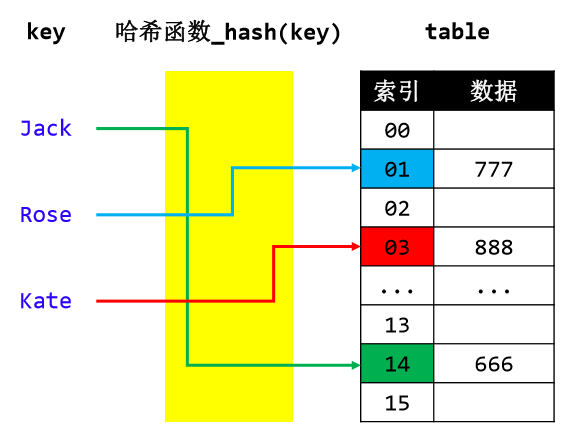
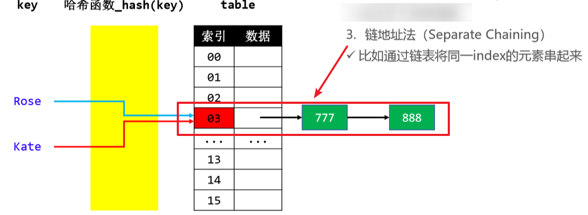
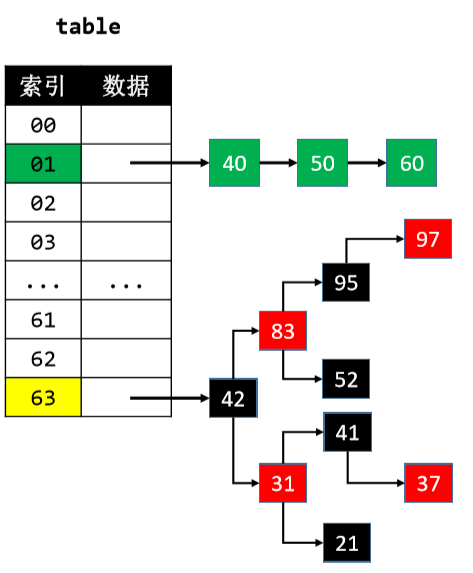
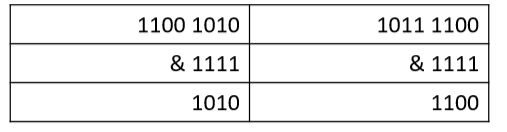
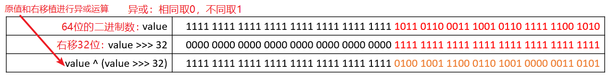
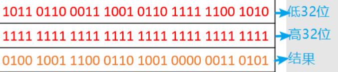
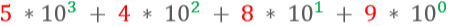
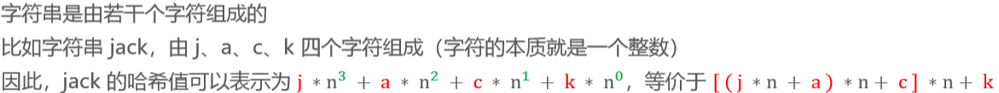

# 哈希表（Hash Table） 

-  哈希表也叫做散列表（ hash 有“剁碎”的意思）

- 它是如何实现高效处理数据的？ 
  - put("Jack", 666); 
  - put("Rose", 777); 
  - put("Kate", 888);



-  添加、搜索、删除的流程都是类似的
  1. 利用哈希函数生成 key 对应的 index【O(1)】 
  2. 根据 index 操作定位数组元素【O(1)】

-  哈希表是【空间换时间】的典型应用 
-  哈希函数，也叫做散列函数 
-  哈希表内部的数组元素，很多地方也叫 Bucket（桶），整个数组叫 Buckets 或者 Bucket Array

## 哈希冲突（Hash Collision） 

-  哈希冲突也叫做哈希碰撞
  - 2 个不同的 key，经过哈希函数计算出相同的结果 
  - key1 ≠ key2 ，hash(key1) = hash(key2)

- 解决哈希冲突的常见办法：
  1. 开放定址法（Open Addressing） ：按照一定规则向其他地址探测，直到遇到空桶 
  2.  再哈希法（Re-Hashing） ：设计多个哈希函数 
  3. 链地址法（Separate Chaining） ：比如通过链表将同一index的元素串起来



## JDK1.8的哈希冲突解决方案

- 默认使用单向链表将元素串起来
- 在添加元素时，可能会由单向链表转为红黑树来存储元素 
  - 比如当哈希表容量 ≥ 64 且 单向链表的节点数量大于 8 时

- 当红黑树节点数量少到一定程度时，又会转为单向链表

- JDK1.8中的哈希表是使用链表+红黑树解决哈希冲突



- 这里为什么使用单链表，而不使用效率更好的双向链表？ 
  - 找到对应索引，每次都是从头节点开始遍历开始找对应的key值
    - 在添加时，如果key值相同，则新value覆盖旧的vaule，没有相同的key则插入到最后
    - 单向链表比双向链表少一个指针，可以节省内存空间

## 哈希函数 

-  哈希表中哈希函数的实现步骤大概如下 
  1.  **先生成 key 的哈希值（必须是整数）** 
  2.  **再让 key 的哈希值跟数组的大小进行相关运算，生成一个索引值**

```java
public int hash(Object key){
    return hash_code(key) % table.length;
}
```

- 为了提高效率，可以使用 & 位运算取代 % 运算【前提：将数组的长度设计为 2 的幂（2n）】

```java
public int hash(Object key){
    return hash_code(key) & (table.length-1);
}
```

>二进制        十进制           二进制数-1
>
>1                   2^0                0
>
>10                 2^1                01
>
>100               2^2                011
>
>1000             2^3                0111
>
>.......               ......
>
>假设hashCode为                   10111000101
>
>​                                                 &
>
>table.length-1                        00000000111
>
>位运算结果                              00000000101    
>
>结果101必然小于等于111，即小于等于数组下标索引，和%的取模运算效果一样，但位运算效率更高



- 良好的哈希函数：让哈希值更加均匀分布 → 减少哈希冲突次数 → 提升哈希表的性能

## 如何生成key的哈希值 

- key 的常见种类可能有 
  - 整数、浮点数、字符串、自定义对象 
  - 不同种类的 key，哈希值的生成方式不一样，但目标是一致的 
    - 尽量让每个 key 的哈希值是唯一的 
    - 尽量让 key 的所有信息参与运算

- 在Java中，HashMap 的 key 必须实现 hashCode、equals 方法，也允许 key 为 null

### 整数的哈希值

 整数本身的值当做哈希值 ，比如 10 的哈希值就是 10

```java
public static int hashCode(int value){
    return value;
}
```

### 浮点数的哈希值

不论是什么类型的数据在计算机中都是以0和1的二进制数据存储的，所以将存储的二进制格式转为整数值就可以得到我们需要的哈希值

```java 
public static int hashCode(float value){
    //Java官方提供的API：把浮点数转换为整数
    return floatToIntBits(value);
}
```

### Long和Double的哈希值

- Java官方规定生成的哈希值必须是int型的，那么int型只有四个字节，而long和double有八个字节，我们是否可以只取long或double的前四位或后四位进行哈希值的计算呢？
  - 从理论上来说是可以的，只要最后生成int型的哈希值就满足要求了。但是我们需要尽量让每个 key 的哈希值是唯一的 ，尽量让 key 的所有信息参与运算，这样才能在最大程度上避免哈希冲突
  - 所以我们需要借助异或运算符`^`和无符号位移运算符`>>>`

```java
public static int hashCode(long value){
    //long是长整型
    return (int)(value ^ (value >>> 32));
}
```

```java
public static int hashCode(double value){
    //先将double型数据转换为64位的整型数据
    long bits = doubleToIntBits(value);
    return (int)(bits ^ (bits >>> 32));
}
```

- ` >>> 和 ^ `的作用是什么？
  - 利用高32bit 和 低32bit 混合计算出 32bit 的哈希值
  - 充分利用所有信息计算出哈希值 





- 为什么不用或（&）运算或与（|）运算？
  - 若用或运算则结果为低32位的值，相当于高32位没有参与运算
  - 若用与运算（有1则为1，否则为0），运算则结果为高32位的值，相当于低32位没有参与运算
  - 所以只有异或才能办到混合运算出不同的东西

### 字符串的哈希值

- 整数 5489 是如何计算出来的？



- 

- **在JDK中，乘数 n 为 31，为什么使用 31？** 


```java
 public static void main(String[] args) {
        String name = "jack";
        int hashCode = 0;
        int len = name.length();
        for (int i = 0; i < len; i++) {
            //取出字符串中对应位置的字符
            char x = name.charAt(i);
            //0 * 31 + j
            //(0 * 31 + j) * 31 + a
            //((0 * 31 + j) * 31 + a) * 31  +c
            //(((0 * 31 + j) * 31 +a ) * 31 + c) * 31 + k
            //实际 = j * 31^3 + a * 31^2 + c  *31^1 + k
            hashCode = 31 * hashCode + x;
        }
        System.out.println(hashCode);//3254239
        //官方的哈希值计算
        System.out.println(name.hashCode());//3254239
    }
```

```java
//hashCode = 31 * hashCode + x;
hashCode = (hashCode << 5) - hashCode + x;
//这两行代码意思是相同的
```


**关于31的探讨：**


-  31不仅仅是符合2^n – 1，它是个奇素数（既是奇数，又是素数，也就是质数） 
  - 素数和其他数相乘的结果比其他方式更容易产成唯一性，减少哈希冲突 
  - 最终选择31是经过观测分布结果后的选择

### 自定义对象的哈希值

定义一个Person类

```java
public class Person {
    private int age;
    private float height;
    private String name;

    public Person(int age, float height, String name) {
        this.age = age;
        this.height = height;
        this.name = name;
    }
}
```

如果就这么创建对象，系统会默认根据两个对象的内存地址生成一个hashCode，两对象的内存地址必然不相同，所以比较之后得出不是同一对象的结论。但是在实际开发中，我们发现两个对象的属性都相同则认为是同一个对象，所以得出的这种结果不是我们所期望的。

```java
 static void test1(){
        Person p1 = new Person(18,175.5f,"Jack");
        Person p2 = new Person(18,175.5f,"Jack");
        System.out.println(p1.equals(p2));//false
    }
```

实现equals(Object obj)方法和hashCode() 方法

```java
public class Person {
    private int age;
    private float height;
    private String name;

    public Person(int age, float height, String name) {
        this.age = age;
        this.height = height;
        this.name = name;
    }

    /*
    在发生哈希冲突的情况下，即两个对象都存放在同一个数组索引中，通过这个方法判断是否为同一     对象
     */
    @Override
    public boolean equals(Object obj) {
        //两个对象的内存地址相同必然为同一对象
        if (this == obj) return true;
        //传入比较的对象为空或者不是同一种类类型的对象必然不相等
        if (obj == null || this.getClass() != obj.getClass()) return false;
        
        //确定为同一对象的前提下比较类中的各个属性是否相等
        Person person = (Person) obj;
        return this.age == person.age && this.height == person.height
                && Objects.equals(this.name, person.name);
    }

    /*
    通过哈希值计算对象在数组中存放的索引位置
     */
    @Override
    public int hashCode() {
        //整型的哈希值
        int hashCode = Integer.hashCode(age);
        //31*i+x
        hashCode = 31 * hashCode + Float.floatToRawIntBits(height);
        //注意name有可能为null，若为null。哈希值默认为0
        hashCode = 31 * hashCode + (name!=null?name.hashCode():0);
        return hashCode;
    }
}
```

再次创建对象进行比较

```java
 static void test2(){
        Person p1 = new Person(18,175.5f,"Jack");
        Person p2 = new Person(18,175.5f,"Jack");
        System.out.println(p1.equals(p2));//ture
    }
```

#### 如果只重写hashCode方法

- 使用hashCode方法计算出一个哈希值是为了和数组长度进行取模运算从而得到这个对象在数组中对应的数组下标，这种计算方法在哈希值不同的情况下也会得到同样的数组下标。如果不重新equals方法，那么系统还是会在发生哈希冲突的时候进行两个对象地址的比较，那么两个同名同姓的人还是会被当作两个不同的人来处理。

#### 如果只重写equals方法

- 系统会根据对象地址值计算出哈希值，两个对象的地址值不同，所以最后得到的哈希值必然不同，但在如数组大小进行取模运算后得到的索引则有两种情况：可能相同，也可能不同。如果还是传入两个同名同姓的我们认为本是一个人的两个对象，在索引相同的情况下因为重写equals方法所以会判断为相同对象，则后则会覆盖前者；而索引不同的情况下没有发生哈希冲突，虽然调用equals方法为ture也同时存在两个被认为是相等的对象。所以只重写equals方法是不稳定的。

### 总结

- 自定义对象作为 key，最好同时重写 hashCode 、equals 方法 

- equals ：用以判断 2 个 key 是否为同一个 key 
  - 自反性：对于任何非 null 的 x，x.equals(x)必须返回true 
  - 对称性：对于任何非 null 的 x、y，如果 y.equals(x) 返回 true，x.equals(y) 必须返回 true 
  - 传递性：对于任何非 null 的 x、y、z，如果 x.equals(y)、y.equals(z) 返回 true，那么x.equals(z) 必须 返回 true 
  - 一致性：对于任何非 null 的 x、y，只要 equals 的比较操作在对象中所用的信息没有被修改，多次调用 x.equals(y) 就会一致地返回 true，或者一致地返回 false ；对于任何非 null 的 x，x.equals(null) 必须返回 false 
- hashCode ：必须保证 equals 为 true 的 2 个 key 的哈希值一样 ，反过来 hashCode 相等的 key，不一定 equals 为 true
- 不重写 hashCode 方法只重写 equals 会有什么后果？ 
  - 可能会导致 2 个 equals 为 true 的 key 同时存在哈希表中


# 实现哈希表

要求key可以存放任何数据类型且不一定具有可比较性

## Map接口

```java
public interface Map<K, V> {
	int size();
	boolean isEmpty();
	void clear();
	V put(K key, V value);
	V get(K key);
	V remove(K key);
	boolean containsKey(K key);
	boolean containsValue(V value);
	void traversal(Visitor<K, V> visitor);
	
	public static abstract class Visitor<K, V> {
		boolean stop;
		public abstract boolean visit(K key, V value);
	}
}
```

## HashMap实现

