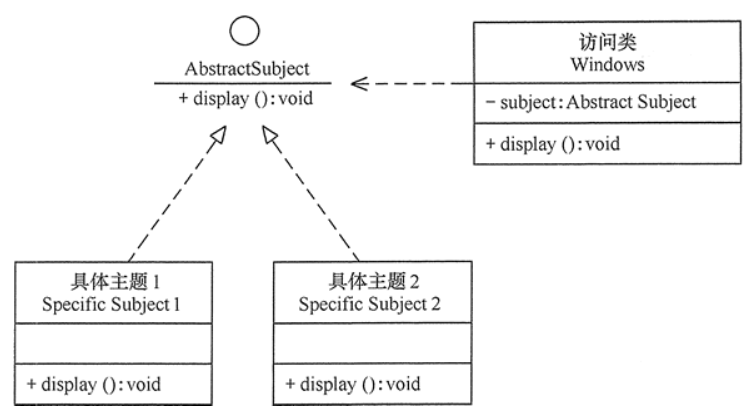
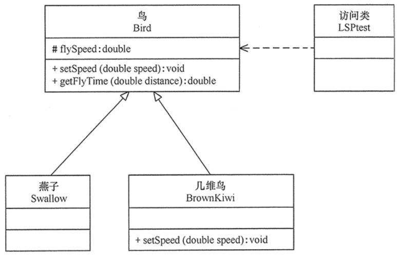
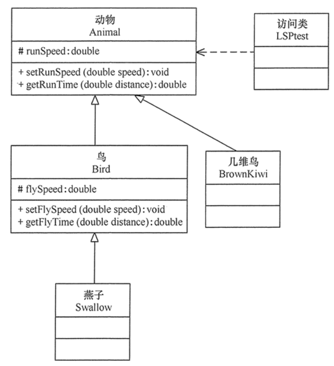
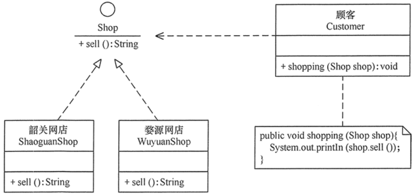
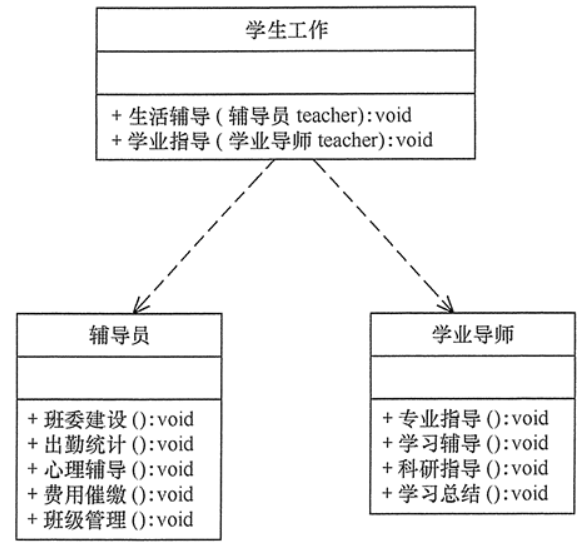
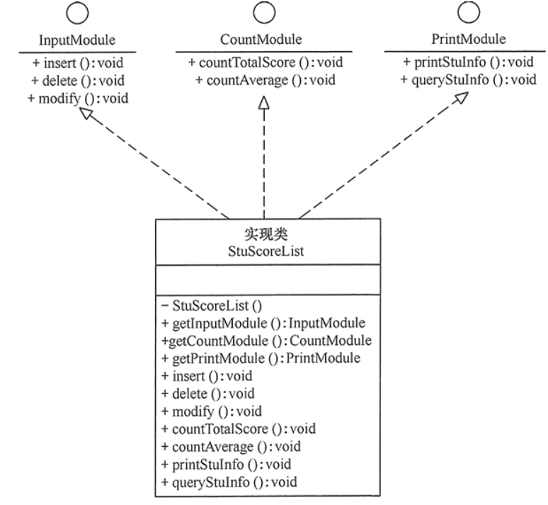
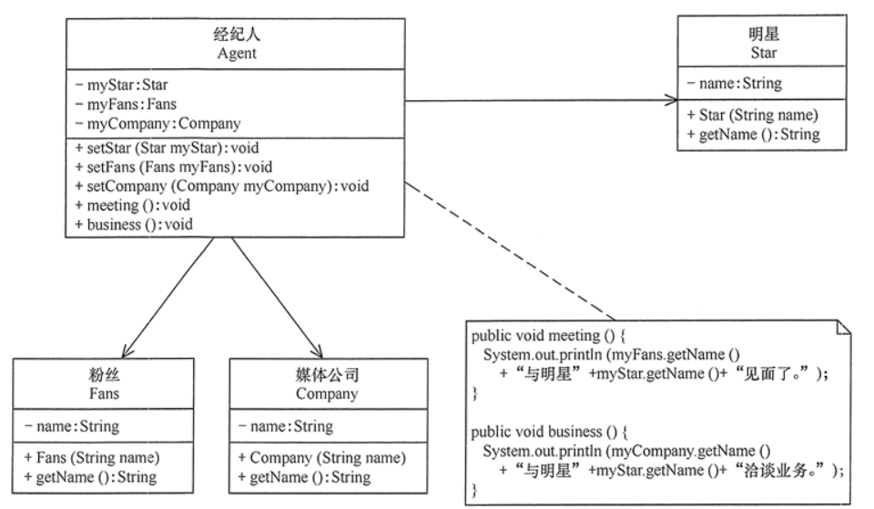
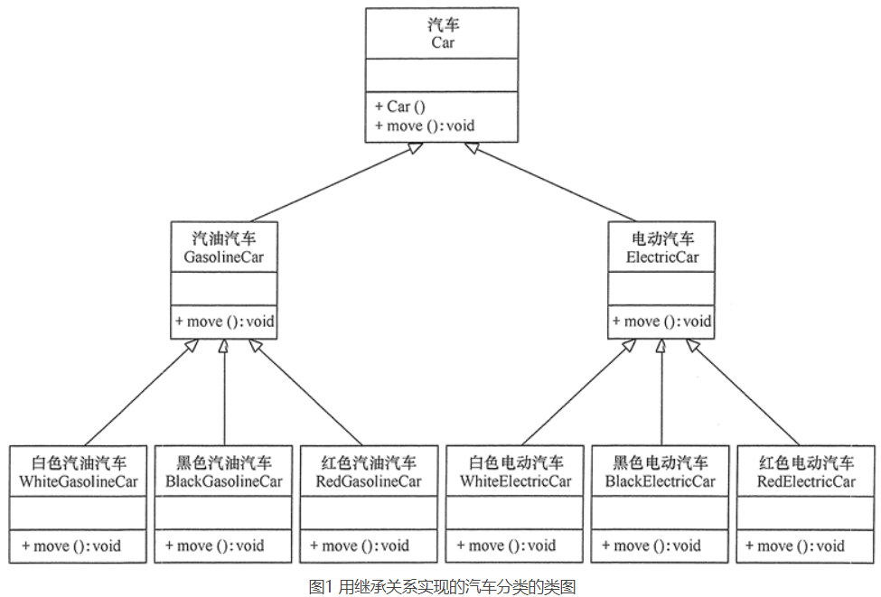
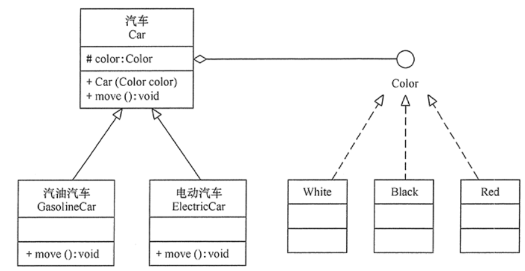

# 设计模式原则

在软件开发中，为了提高软件系统的可维护性和可复用性，增加软件的可扩展性和灵活性，程序员要尽量根据 7 条原则来开发程序，从而提高软件开发效率、节约软件开发成本和维护成本。

## 开闭原则

- 含义：当应用的需求改变时，在不修改软件实体的源代码或者二进制代码的前提下，可以扩展模块的功能，使其满足新的需求。

### 开闭原则的作用

- 开闭原则是面向对象程序设计的终极目标，它使软件实体拥有一定的适应性和灵活性的同时具备稳定性和延续性。具体来说，其作用如下。

1. **对软件测试的影响**

   软件遵守开闭原则的话，软件测试时只需要对扩展的代码进行测试就可以了，因为原有的测试代码仍然能够正常运行。

2. **可以提高代码的可复用性**

   粒度越小，被复用的可能性就越大；在面向对象的程序设计中，根据原子和抽象编程可以提高代码的可复用性。

3. **可以提高软件的可维护性**

   遵守开闭原则的软件，其稳定性高和延续性强，从而易于扩展和维护。

### 开闭原则的实现方法

- 可以通过“抽象约束、封装变化”来实现开闭原则，即通过接口或者抽象类为软件实体定义一个相对稳定的抽象层，而将相同的可变因素封装在相同的具体实现类中。
- 因为抽象灵活性好，适应性广，只要抽象的合理，可以基本保持软件架构的稳定。而软件中易变的细节可以从抽象派生来的实现类来进行扩展，当软件需要发生变化时，只需要根据需求重新派生一个实现类来扩展就可以了。

---

### 栗子

- Windows 的桌面主题设计。

>分析：Windows 的主题是桌面背景图片、窗口颜色和声音等元素的组合。用户可以根据自己的喜爱更换自己的桌面主题，也可以从网上下载新的主题。这些主题有共同的特点，可以为其定义一个抽象类（Abstract Subject），而每个具体的主题（Specific Subject）是其子类。用户窗体可以根据需要选择或者增加新的主题，而不需要修改原代码，所以它是满足开闭原则的。



## 里氏替换原则

- 里氏替换原则主要阐述了有关继承的一些原则，也就是什么时候应该使用继承，什么时候不应该使用继承，以及其中蕴含的原理。里氏替换原是继承复用的基础，它反映了基类与子类之间的关系，是对开闭原则的补充，是对实现抽象化的具体步骤的规范。

### 里氏替换原则的作用

1. 里氏替换原则是实现开闭原则的重要方式之一。
2. 它克服了继承中重写父类造成的可复用性变差的缺点。
3. 它是动作正确性的保证。即类的扩展不会给已有的系统引入新的错误，降低了代码出错的可能性。

### 里氏替换原则的实现方法

- 里氏替换原则通俗来讲就是：子类可以扩展父类的功能，但不能改变父类原有的功能。也就是说：子类继承父类时，除添加新的方法完成新增功能外，尽量不要重写父类的方法。

>- 如果通过重写父类的方法来完成新的功能，这样写起来虽然简单，但是整个继承体系的可复用性会比较差，特别是运用多态比较频繁时，程序运行出错的概率会非常大。
>- 如果程序违背了里氏替换原则，则继承类的对象在基类出现的地方会出现运行错误。这时其修正方法是：取消原来的继承关系，重新设计它们之间的关系。

### 栗子

- 里氏替换原则在“几维鸟不是鸟”实例中的应用。

>分析：鸟一般都会飞行，如燕子的飞行速度大概是每小时 120 千米。但是新西兰的几维鸟由于翅膀退化无法飞行。假如要设计一个实例，计算这两种鸟飞行 300 千米要花费的时间。显然，拿燕子来测试这段代码，结果正确，能计算出所需要的时间；但拿几维鸟来测试，结果会发生“除零异常”或是“无穷大”，明显不符合预期，其类图如图所示。



```java
package principle;
public class LSPtest
{
    public static void main(String[] args)
    {
        Bird bird1=new Swallow();
        Bird bird2=new BrownKiwi();
        bird1.setSpeed(120);
        bird2.setSpeed(120);
        System.out.println("如果飞行300公里：");
        try
        {
            System.out.println("燕子将飞行"+bird1.getFlyTime(300)+"小时.");
            System.out.println("几维鸟将飞行"+bird2.getFlyTime(300)+"小时。");
        }
        catch(Exception err)
        {
            System.out.println("发生错误了!");
        }
    }
}
//鸟类
class Bird
{
    double flySpeed;
    public void setSpeed(double speed)
    {
        flySpeed=speed;
    }
    public double getFlyTime(double distance)
    {
        return(distance/flySpeed);
    }
}
//燕子类
class Swallow extends Bird{}
//几维鸟类
class BrownKiwi extends Bird
{
    public void setSpeed(double speed)
    {
           flySpeed=0;
    }
}
```

程序的运行结果如下：

```
如果飞行300公里：
燕子将飞行2.5小时.
几维鸟将飞行Infinity小时。
```

>程序运行错误的原因是：几维鸟类重写了鸟类的 setSpeed(double speed) 方法，这违背了里氏替换原则。正确的做法是：取消几维鸟原来的继承关系，定义鸟和几维鸟的更一般的父类，如动物类，它们都有奔跑的能力。几维鸟的飞行速度虽然为 0，但奔跑速度不为 0，可以计算出其奔跑 300 千米所要花费的时间。其类图如图所示。



## 依赖倒置原则

- 依赖倒置原则的原始定义为：高层模块不应该依赖低层模块，两者都应该依赖其抽象；抽象不应该依赖细节，细节应该依赖抽象。其核心思想是：要面向接口编程，不要面向实现编程。
- 依赖倒置原则是实现开闭原则的重要途径之一，它降低了客户与实现模块之间的耦合。
- 由于在软件设计中，细节具有多变性，而抽象层则相对稳定，因此以抽象为基础搭建起来的架构要比以细节为基础搭建起来的架构要稳定得多。这里的抽象指的是接口或者抽象类，而细节是指具体的实现类。
- 使用接口或者抽象类的目的是制定好规范和契约，而不去涉及任何具体的操作，把展现细节的任务交给它们的实现类去完成。

### 依赖倒置的作用

- 依赖倒置原则可以降低类间的耦合性。
- 依赖倒置原则可以提高系统的稳定性。
- 依赖倒置原则可以减少并行开发引起的风险。
- 依赖倒置原则可以提高代码的可读性和可维护性。

### 依赖倒置原则的实现方法

1. 每个类尽量提供接口或抽象类，或者两者都具备。
2. 变量的声明类型尽量是接口或者是抽象类。
3. 任何类都不应该从具体类派生。
4. 使用继承时尽量遵循里氏替换原则。

### 栗子

- 依赖倒置原则在“顾客购物程序”中的应用。

>分析：本程序反映了 “顾客类”与“商店类”的关系。商店类中有 sell() 方法，顾客类通过该方法购物以下代码定义了顾客类通过淘宝网店购物

```java
class Customer
{
    public void shoppingTaoBaoShop shop)
    {
        //购物
        System.out.println（shop.sell());
    }
}
```

这种设计存在缺点，如果该顾客想从另外一家商店购物，就要将该顾客的代码修改如下：

```java
class Customer
{
    public void shopping(JingDongShop shop)
    {
        //购物
        System.out.println(shop.sell());
    }
}
```

顾客每更换一家商店，都要修改一次代码，这明显违背了开闭原则。存在以上缺点的原因是：顾客类设计时同具体的商店类绑定了，这违背了依赖倒置原则。解决方法是：定义“淘宝网店”和“京东网店”的共同接口 Shop，顾客类面向该接口编程，其代码修改如下：

```java
class Customer
{
    public void shopping(Shop shop)
    {
        //购物
        System.out.println(shop.sell());
    }
}
```

这样，不管顾客类 Customer 访问什么商店，或者增加新的商店，都不需要修改原有代码了，其类图如图所示。



```java
package principle;
public class DIPtest
{
    public static void main(String[] args)
    {
        Customer wang=new Customer();
        System.out.println("顾客购买以下商品："); 
        wang.shopping(new TaoBaoShop()); 
        wang.shopping(new JingDongShop());
    }
}
//商店
interface Shop
{
    public String sell(); //卖
}
//淘宝网店
class TaoBaoShop implements Shop
{
    public String sell()
    {
        return "买阿迪，耐克等衣服……"; 
    } 
}
//婺源网店
class JingDongShop implements Shop
{
    public String sell()
    {
        return "买华为，苹果等电子设备……"; 
    }
} 
//顾客
class Customer
{
    public void shopping(Shop shop)
    {
        //购物
        System.out.println(shop.sell()); 
    }
}
```

程序的运行结果如下：

```
顾客购买以下商品：
买阿迪，耐克等衣服……
买华为，苹果等电子设备……
```

## 单一职责原则

- 这里的职责是指类变化的原因，单一职责原则规定一个类应该有且仅有一个引起它变化的原因，否则类应该被拆分
- 该原则提出对象不应该承担太多职责，如果一个对象承担了太多的职责，至少存在以下两个缺点：
  1. 一个职责的变化可能会削弱或者抑制这个类实现其他职责的能力；
  2. 当客户端需要该对象的某一个职责时，不得不将其他不需要的职责全都包含进来，从而造成冗余代码或代码的浪费。

### 单一职责原则的优点

单一职责原则的核心就是控制类的粒度大小、将对象解耦、提高其内聚性。如果遵循单一职责原则将有以下优点。

- 降低类的复杂度。一个类只负责一项职责，其逻辑肯定要比负责多项职责简单得多。
- 提高类的可读性。复杂性降低，自然其可读性会提高。
- 提高系统的可维护性。可读性提高，那自然更容易维护了。
- 变更引起的风险降低。变更是必然的，如果单一职责原则遵守得好，当修改一个功能时，可以显著降低对其他功能的影响。

### 单一职责原则的实现方法

单一职责原则是最简单但又最难运用的原则，需要设计人员发现类的不同职责并将其分离，再封装到不同的类或模块中。而发现类的多重职责需要设计人员具有较强的分析设计能力和相关重构经验。下面以大学学生工作管理程序为例介绍单一职责原则的应用。

### 栗子

- 大学学生工作管理程序。

>分析：大学学生工作主要包括学生生活辅导和学生学业指导两个方面的工作：
>
>1. 其中生活辅导主要包括班委建设、出勤统计、心理辅导、费用催缴、班级管理等工作；
>
>2. 学业指导主要包括专业引导、学习辅导、科研指导、学习总结等工作。
>
>- 如果将这些工作交给一位老师负责显然不合理，正确的做法是生活辅导由辅导员负责，学业指导由学业导师负责，其类图如图所示。



- 注意：单一职责同样也适用于方法。一个方法应该尽可能做好一件事情。如果一个方法处理的事情太多，其颗粒度会变得很粗，不利于重用。

## 接口隔离原则

- 要求程序员尽量将臃肿庞大的接口拆分成更小的和更具体的接口，让接口中只包含客户感兴趣的方法。
- 要为各个类建立它们需要的专用接口，而不要试图去建立一个很庞大的接口供所有依赖它的类去调用。
- 接口隔离原则和单一职责都是为了提高类的内聚性、降低它们之间的耦合性，体现了封装的思想，但两者是不同的：
  - 单一职责原则注重的是职责，而接口隔离原则注重的是对接口依赖的隔离。
  - 单一职责原则主要是约束类，它针对的是程序中的实现和细节；接口隔离原则主要约束接口，主要针对抽象和程序整体框架的构建。

### 接口隔离原则的优点

接口隔离原则是为了约束接口、降低类对接口的依赖性，遵循接口隔离原则有以下 5 个优点。

1. 将臃肿庞大的接口分解为多个粒度小的接口，可以预防外来变更的扩散，提高系统的灵活性和可维护性。
2. 接口隔离提高了系统的内聚性，减少了对外交互，降低了系统的耦合性。
3. 如果接口的粒度大小定义合理，能够保证系统的稳定性；但是，如果定义过小，则会造成接口数量过多，使设计复杂化；如果定义太大，灵活性降低，无法提供定制服务，给整体项目带来无法预料的风险。
4. 使用多个专门的接口还能够体现对象的层次，因为可以通过接口的继承，实现对总接口的定义。
5. 能减少项目工程中的代码冗余。过大的大接口里面通常放置许多不用的方法，当实现这个接口的时候，被迫设计冗余的代码。

### 接口隔离原则的实现方法

在具体应用接口隔离原则时，应该根据以下几个规则来衡量。

- 接口尽量小，但是要有限度。一个接口只服务于一个子模块或业务逻辑。
- 为依赖接口的类定制服务。只提供调用者需要的方法，屏蔽不需要的方法。
- 了解环境，拒绝盲从。每个项目或产品都有选定的环境因素，环境不同，接口拆分的标准就不同深入了解业务逻辑。
- 提高内聚，减少对外交互。使接口用最少的方法去完成最多的事情。

### 栗子

- 学生成绩管理程序。

>分析：学生成绩管理程序一般包含插入成绩、删除成绩、修改成绩、计算总分、计算均分、打印成绩信息、査询成绩信息等功能，如果将这些功能全部放到一个接口中显然不太合理，正确的做法是将它们分别放在输入模块、统计模块和打印模块等 3 个模块中。



```java
package principle;
public class ISPtest
{
    public static void main(String[] args)
    {
        InputModule input =StuScoreList.getInputModule();
        CountModule count =StuScoreList.getCountModule();
        PrintModule print =StuScoreList.getPrintModule();
        input.insert();
        count.countTotalScore();
        print.printStuInfo();
        //print.delete();
    }
}
//输入模块接口
interface InputModule
{
    void insert();
    void delete();
    void modify();
}
//统计模块接口
interface CountModule
{
    void countTotalScore();
    void countAverage();
}
//打印模块接口
interface PrintModule
{
    void printStuInfo();
    void queryStuInfo();
}
//实现类
class StuScoreList implements InputModule,CountModule,PrintModule
{
    private StuScoreList(){}
    public static InputModule getInputModule()
    {
        //进行强转，这样就只能调用这个接口中的方法了
        return (InputModule)new StuScoreList();
    }
    public static CountModule getCountModule()
    {
        return (CountModule)new StuScoreList();
    }
    public static PrintModule getPrintModule()
    {
        return (PrintModule)new StuScoreList();
    }
    public void insert()
    {
        System.out.println("输入模块的insert()方法被调用！");
    }
    public void delete()
    {
        System.out.println("输入模块的delete()方法被调用！");
    }
    public void modify()
    {
        System.out.println("输入模块的modify()方法被调用！");
    }
    public void countTotalScore()
    {
        System.out.println("统计模块的countTotalScore()方法被调用！");
    }
    public void countAverage()
    {
        System.out.println("统计模块的countAverage()方法被调用！");
    }
    public void printStuInfo()
    {
        System.out.println("打印模块的printStuInfo()方法被调用！");
    }
    public void queryStuInfo()
    {
        System.out.println("打印模块的queryStuInfo()方法被调用！");
    }
}
```

程序的运行结果如下：

```
输入模块的insert()方法被调用！
统计模块的countTotalScore()方法被调用！
打印模块的printStuInfo()方法被调用！
```

## 迪米特法则

- 迪米特法则的定义是：只与你的直接朋友交谈，不跟“陌生人”说话。其含义是：如果两个软件实体无须直接通信，那么就不应当发生直接的相互调用，可以通过第三方转发该调用。其目的是降低类之间的耦合度，提高模块的相对独立性。
- 迪米特法则中的“朋友”是指：当前对象本身、当前对象的成员对象、当前对象所创建的对象、当前对象的方法参数等，这些对象同当前对象存在关联、聚合或组合关系，可以直接访问这些对象的方法。

### 迪米特法则的优点

1. 降低了类之间的耦合度，提高了模块的相对独立性。
2. 由于亲合度降低，从而提高了类的可复用率和系统的扩展性。

- 但是，过度使用迪米特法则会使系统产生大量的中介类，从而增加系统的复杂性，使模块之间的通信效率降低。所以，在釆用迪米特法则时需要反复权衡，确保高内聚和低耦合的同时，保证系统的结构清晰。

### 迪米特法则的实现方法

从迪米特法则的定义和特点可知，它强调以下两点：

1. 从依赖者的角度来说，只依赖应该依赖的对象。
2. 从被依赖者的角度说，只暴露应该暴露的方法。


所以，在运用迪米特法则时要注意以下 6 点。

1. 在类的划分上，应该创建弱耦合的类。类与类之间的耦合越弱，就越有利于实现可复用的目标。
2. 在类的结构设计上，尽量降低类成员的访问权限。
3. 在类的设计上，优先考虑将一个类设置成不变类。
4. 在对其他类的引用上，将引用其他对象的次数降到最低。
5. 不暴露类的属性成员，而应该提供相应的访问器（set 和 get 方法）。
6. 谨慎使用序列化（Serializable）功能。

### 栗子

- 明星与经纪人的关系实例。

>分析：明星由于全身心投入艺术，所以许多日常事务由经纪人负责处理，如与粉丝的见面会，与媒体公司的业务洽淡等。这里的经纪人是明星的朋友，而粉丝和媒体公司是陌生人，所以适合使用迪米特法则。



```java
package principle;
public class LoDtest
{
    public static void main(String[] args)
    {
        Agent agent=new Agent();
        agent.setStar(new Star("周星驰"));
        agent.setFans(new Fans("粉丝马云"));
        agent.setCompany(new Company("中国传媒有限公司"));
        agent.meeting();
        agent.business();
    }
}
//经纪人
class Agent
{
    private Star myStar;
    private Fans myFans;
    private Company myCompany;
    public void setStar(Star myStar)
    {
        this.myStar=myStar;
    }
    public void setFans(Fans myFans)
    {
        this.myFans=myFans;
    }
    public void setCompany(Company myCompany)
    {
        this.myCompany=myCompany;
    }
    public void meeting()
    {
        System.out.println(myFans.getName()+"与明星"+myStar.getName()+"见面了。");
    }
    public void business()
    {
        System.out.println(myCompany.getName()+"与明星"+myStar.getName()+"洽淡业务。");
    }
}
//明星
class Star
{
    private String name;
    Star(String name)
    {
        this.name=name;
    }
    public String getName()
    {
        return name;
    }
}
//粉丝
class Fans
{
    private String name;
    Fans(String name)
    {
        this.name=name;
    }
    public String getName()
    {
        return name;
    }
}
//媒体公司
class Company
{
    private String name;
    Company(String name)
    {
        this.name=name;
    }
    public String getName()
    {
        return name;
    }
}
```

程序的运行结果如下：

```
粉丝马云与周星驰见面了。
中国传媒有限公司与明星周星驰洽淡业务。
```

## 合成复用原则

- 它要求在软件复用时，要尽量先使用组合或者聚合等关联关系来实现，其次才考虑使用继承关系来实现。
- 如果要使用继承关系，则必须严格遵循里氏替换原则。合成复用原则同里氏替换原则相辅相成的，两者都是开闭原则的具体实现规范。

### 合成复用原则的重要性

通常类的复用分为继承复用和合成复用两种，继承复用虽然有简单和易实现的优点，但它也存在以下缺点。

1. 继承复用破坏了类的封装性。因为继承会将父类的实现细节暴露给子类，父类对子类是透明的，所以这种复用又称为“白箱”复用。
2. 子类与父类的耦合度高。父类的实现的任何改变都会导致子类的实现发生变化，这不利于类的扩展与维护。
3. 它限制了复用的灵活性。从父类继承而来的实现是静态的，在编译时已经定义，所以在运行时不可能发生变化。


采用组合或聚合复用时，可以将已有对象纳入新对象中，使之成为新对象的一部分，新对象可以调用已有对象的功能，它有以下优点。

1. 它维持了类的封装性。因为成分对象的内部细节是新对象看不见的，所以这种复用又称为“黑箱”复用。
2. 新旧类之间的耦合度低。这种复用所需的依赖较少，新对象存取成分对象的唯一方法是通过成分对象的接口。
3. 复用的灵活性高。这种复用可以在运行时动态进行，新对象可以动态地引用与成分对象类型相同的对象。

### 合成复用原则的实现方法

合成复用原则是通过将已有的对象纳入新对象中，作为新对象的成员对象来实现的，新对象可以调用已有对象的功能，从而达到复用。

### 栗子

- 汽车分类管理程序。

>分析：汽车按“动力源”划分可分为汽油汽车、电动汽车等；按“颜色”划分可分为白色汽车、黑色汽车和红色汽车等。如果同时考虑这两种分类，其组合就很多。图 1 所示是用继承：关系实现的汽车分类的类图。



从图 1 可以看出用继承关系实现会产生很多子类，而且增加新的“动力源”或者增加新的“颜色”都要修改源代码，这违背了开闭原则，显然不可取。但如果改用组合关系实现就能很好地解决以上问题，其类图如下图所示。



## 总结

- 开闭原则是总纲，它告诉我们要对扩展开放，对修改关闭；
- 里氏替换原则告诉我们不要破坏继承体系；
- 依赖倒置原则告诉我们要面向接口编程；
- 单一职责原则告诉我们实现类要职责单一；
- 接口隔离原则告诉我们在设计接口的时候要精简单一；
- 迪米特法则告诉我们要降低耦合度；
- 合成复用原则告诉我们要优先使用组合或者聚合关系复用，少用继承关系复用。