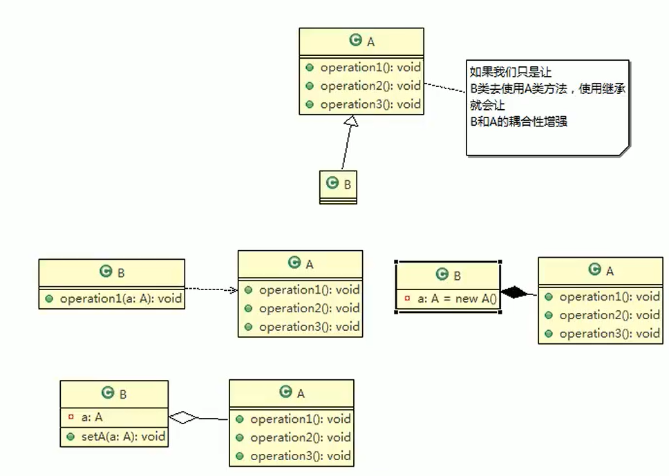

# 设计模式的目的

- 编写软件过程中，程序员面临着来自**耦合性，内聚性以及可维护性，可扩展性，重用性，灵活性**等多方面的挑战，设计模式是为了让程序（软件），具有更好的：

>- 代码重用性（即：相同功能的代码，不用多次编写）
>- 可读性（即：编程规范性，便于其他程序员的阅读和理解）
>- 可扩展性（即：当需要增加新的功能时，非常的方便，称为可维护）
>- 可靠性（即：当我们增加新的功能后，对原来的功能没有影响）
>- 使程序呈现高内聚，低耦合的特性

# 一、单一职责原则

- 对类来说的，即一个类应该只负责一项职责。如类A负责两个不同职责：职责1，职责2。当职责1需求变更而改变A时，可能造成职责2执行错误，所以需要将类A的粒度分解为A1，A2

## 1.1引入案例

```java
public class SingleResponsibilityTest1 {
    public static void main(String[] args) {
        Vehicle vehicle = new Vehicle();
        vehicle.run("汽车");
        vehicle.run("轮船");
        vehicle.run("飞机");
    }

    static class Vehicle{
        public void run(String transport){
            System.out.println(transport + "在公路上跑...");
        }
    }
}
```

- 不同的交通工具运行的结果是一样的，违背了单一职责原则


## 1.2初步解决

- 根据交通工具运行方法不同，分解成不同类即可

```java
public class SingleResponsibilityTest2 {

    public static void main(String[] args) {
        RoadVehicle roadVehicle = new RoadVehicle();
        roadVehicle.run("汽车");
        WaterVehicle waterVehicle = new WaterVehicle();
        waterVehicle.run("轮船");
        AirVehicle airVehicle = new AirVehicle();
        airVehicle.run("飞机");
    }

    static class RoadVehicle {
        public void run(String transport) {
            System.out.println(transport + "在公路上跑...");
        }
    }

    static class WaterVehicle {
        public void run(String transport) {
            System.out.println(transport + "在水路上跑...");
        }
    }

    static class AirVehicle {
        public void run(String transport) {
            System.out.println(transport + "在天空上飞...");
        }
    }
}
```

- 遵守了单一职责原则
- 问题：基于1.1的基础上将类分解开来，对类的改动很大


## 1.3二次改动

- 直接修改Vehicle类，改动的代码会比较少

```java
public class SingleResponsibilityTest3 {
    public static void main(String[] args) {
        Vehicle vehicle = new Vehicle();
        vehicle.runRoad("汽车");
        vehicle.runWater("轮船");
        vehicle.runAir("飞机");
    }

    static class Vehicle {
        public void runRoad(String transport) {
            System.out.println(transport + "在公路上跑...");
        }

        public void runWater(String transport) {
            System.out.println(transport + "在水路上跑...");
        }

        public void runAir(String transport) {
            System.out.println(transport + "在天上飞...");
        }
    }
}
```

- 这种方法没有对原来的类做大的修改，只是在类中增加了方法
- 虽然没有在类的级别上遵守单一职责，但是在方法的级别上遵守了单一职责


## 1.4小结

- 降低类的复杂度，一个类只负责一项职责
- 提高类的可读性，可维护性
- 降低变更引起的风险
- 通常情况下，我们应当遵守单于职责原则，只有逻辑足够简单，才可以在代码级违反单一职责原则；只有类中方法数量足够少，可以在方法级别保持单一职责原则

# 二、接口隔离原则

- 客户端不应该依赖它不需要的接口，即一个类对另一个类的依赖应该建立在最小的接口上

## 2.1引入案例

- 类A通过接口Interface1依赖类B，类C通过接口Interfacel依赖类D，如果接口Interfacel对于类A和类C来说不是最小接口，那么类B和类D必须去实现他们不需要的方法


- 代码实现

```java
package segregation;

public class SegregationTest1 {
    
    interface Interface1 {
        void operation1();
        void operation2();
        void operation3();
        void operation4();
        void operation5();
    }

    static class B implements Interface1{
        public void operation1() {
            System.out.println("B实现了operation1方法");
        }

        public void operation2() {
            System.out.println("B实现了operation2方法");
        }

        public void operation3() {
            System.out.println("B实现了operation3方法");
        }

        public void operation4() {
            System.out.println("B实现了operation4方法");
        }

        public void operation5() {
            System.out.println("B实现了operation5方法");
        }
    }

    static class D implements Interface1{

        public void operation1() {
            System.out.println("D实现了operation1方法");
        }

        public void operation2() {
            System.out.println("D实现了operation2方法");
        }

        public void operation3() {
            System.out.println("D实现了operation3方法");
        }

        public void operation4() {
            System.out.println("D实现了operation4方法");
        }

        public void operation5() {
            System.out.println("D实现了operation5方法");
        }
    }

    static class A{ //A类通过接口Interfacel依赖(使用)B类，但是只会用到1,2,3方法
        public void depend1(Interface1 i){
            i.operation1();
        }
        public void depend2(Interface1 i){
            i.operation2();
        }
        public void depend3(Interface1 i){
            i.operation3();
        }
    }
    static class C{ //C类通过接口Interfacel依赖(使用)D类，但是只会用到1,4,5方法
        public void depend1(Interface1 i){
            i.operation1();
        }
        public void depend4(Interface1 i){
            i.operation4();
        }
        public void depend5(Interface1 i){
            i.operation5();
        }
    }
}
```

## 2.2初步改进

- 将接口拆分


- 代码实现

```java
public class SegregationTest2 {
    public static void main(String[] args) {
        A a = new A();
        a.depend1(new B()); //A类通过接口去依赖B
        a.depend2(new B());
        a.depend3(new B());

        C c = new C();
        c.depend1(new D()); //C类通过接口去依赖D
        c.depend4(new D());
        c.depend5(new D());
    }

    //接口二
    interface Interface1 {
        void operation1();
    }
    //接口一
    interface Interface2 {
        void operation2();
        void operation3();
    }

    //接口三
    interface Interface3 {
        void operation4();
        void operation5();
    }

    static class B implements Interface1,Interface2 {
        public void operation1() {
            System.out.println("B实现了operation1方法");
        }

        public void operation2() {
            System.out.println("B实现了operation2方法");
        }
        public void operation3() {
            System.out.println("B实现了operation3方法");
        }
    }

    static class D implements Interface1,Interface3 {

        public void operation1() {
            System.out.println("D实现了operation1方法");
        }

        public void operation4() {
            System.out.println("D实现了operation4方法");
        }

        public void operation5() {
            System.out.println("D实现了operation5方法");
        }
    }

    static class A{ //
        public void depend1(Interface1 i){
            i.operation1();
        }
        public void depend2(Interface2 i){
            i.operation2();
        }
        public void depend3(Interface2 i){
            i.operation3();
        }
    }
    static class C{
        public void depend1(Interface1 i){
            i.operation1();
        }
        public void depend4(Interface3 i){
            i.operation4();
        }
        public void depend5(Interface3 i){
            i.operation5();
        }
    }
}
```

## 2.3小结

- 将接口Interface1拆分为独立的几个接口（这里我们拆分成3个接口），类A和类C分别与他们需要的接口建立依赖关系。也就是采用接口隔离原则

# 三、依赖倒转原则

- 依赖倒转原则（Dependence InversionPrinciple）是指：
  1. 高层模块不应该依赖低层模块，二者都应该依赖其抽象
  2. **抽象不应该依赖细节，细节应该依赖抽象**
  3. **依赖倒转（倒置）的中心思想是面向接口编程**
  4. 依赖倒转原则是基于这样的设计理念：相对于细节的多变性，抽象的东西要稳定的多。以抽象为基础搭建的架构比以细节为基础的架构要稳定的多。在java中，抽象指的是接口或抽象类，细节就是具体的实现类
  5. 使用接口或抽象类的目的是制定好规范，而不涉及任何具体的操作，把展现细节的任务交给他们的实现类去完成

## 2.1引入案例

- Person类的receive接收信息的方法直接依赖Email邮件类

```java
public class DependencyReversionTest1 {
    public static void main(String[] args) {
        Person person = new Person();
        person.receive(new Email());
    }

  static class Email {
        public String getInfo() {
            return "电子邮件信息:hello,world";
        }
    }

    static class Person {
        //接收消息,这里直接依赖了Email邮件类
        //如果我们获取的对象是微信，短信等等，则新增类，同时Perons也要增加相应的接收方法
        public void receive(Email email) {
            System.out.println(email.getInfo());
        }
    }
}
```

## 3.2初步改进

- 解决思路：引入一个抽象的接口IReceiver，表示接收者，这样Person类与接口IReceiver发生依赖
- 因为Email，WeChat等等属于接收的范围，他们各自实现IReceiver接口就ok，这样我们就符合依赖倒转原则

```java
public class DependencyReversionTest2 {
    public static void main(String[] args) {
        Person person = new Person();
        person.receive(new Email());
        person.receive(new WeChat());
    }

    //通信接口
    interface ICommunication{
        String getInfo();
    }
    //实现邮件通信
    static class Email implements ICommunication{
        public String getInfo() {
            return "电子邮件信息:hello,world";
        }
    }

    //实现微信通信
    static class WeChat implements ICommunication{
        @Override
        public String getInfo() {
            return "微信消息:在吗?约吗?";
        }
    }
    static class Person {
        //接收消息,依赖通信接口
        public void receive(ICommunication application) {
            System.out.println(application.getInfo());
        }
    }
}
```


## 3.3小结

- 依赖关系传递有三种方式
  - 接口传递
  - 构造器传递
  - setter方法传递
- 注意事项和细节
  - 低层模块尽量都要有抽象类或接口，或者两者都有，程序稳定性更好
  - 变量的声明类型尽量是抽象类或接口，这样我们的变量引用和实际对象间，就存在一个缓冲层，利于程序扩展和优化
  - 继承时遵循里氏替换原则

# 四、里氏替换原则

- oop中的继承性的思考和说明
  1. 继承包含这样一层含义：父类中凡是已经实现好的方法，实际上是在设定规范和契约，虽然它不强制要求所有的子类必须遵循这些契约，但是如果子类对这些已经实现的方法任意修改，就会对整个继承体系造成破坏
  2. 继承在给程序设计带来便利的同时，也带来了弊端。比如**使用继承会给程序带来侵入性，程序的可移植性降低，增加对象间的耦合性**，如果一个类被其他的类所继承，则当这个类需要修改时，必须考虑到所有的子类，并且父类修改后，所有涉及到子类的功能都有可能产生故障
  3. 问题提出：在编程中，如何正确的使用继承？=> 里氏替换原则
- 里氏替换原则基本介绍
  1. 里氏替换原则（Liskov Substitution Principle）在1988年，由麻省理工学院的以为姓里的女士提出的
  2. 如果对每个类型为T1的对象01，都有类型为T2的对象02，使得以T1定义的所有程序P在所有的对象01都代换成02时，程序P的行为没有发生变化，那么类型T2是类型TI的子类型。换句话说，**所有引用基类的地方必须能透明地使用其子类的对象**

## 4.1引入案例

```java
public class LiskovTest1 {
    public static void main(String[] args) {
        A a = new A();
        System.out.println("2+8= " + a.func1(2, 8));

        B b = new B();
        System.out.println("2+8= " + b.func1(2, 8)); //本意是求2加8的和
        System.out.println("4+7+9= " + b.add9(4, 9));
    }

    static class A {
        //求两数之和
        public int func1(int num1, int num2) {
            return num1 + num2;
        }
    }

    static class B extends A {
        @Override //可能是在无意识的情况下重写了父类的方法
        public int func1(int num1, int num2) {
            return num1 - num2;
        }

        //增加了一个新功能,完成两数相加再加9
        public int add9(int num1, int num2) {
            return func1(num1, num2) + 9;
        }
    }
}
```

## 4.2初步改进

- 我们发现原来运行正常的相减功能发生了错误。原因就是类B无意中重写了父类的方法，造成原有功能出现错误。在实际编程中，我们常常会通过重写父类的方法完成新的功能，这样写起来虽然简单，但整个继承体系的复用性会比较差。特别是运行多态比较频繁的时候
- 通用的做法是：原来的父类和子类都继承一个更通俗的基类，原有的继承关系去掉，采用依赖，聚合，组合等关系代替.
- 改进方案


```java
public class LiskovTest2 {
    public static void main(String[] args) {
        A a = new A();
        System.out.println("2+8= " + a.func1(2, 8));
        B b = new B();
        //没有再继承A类,所以调用者不会再认为该方法是A类中的方法
        System.out.println("2-8= " + b.func1(2, 8));
        //使用组合,调用了A类中的加法
        System.out.println("4+7+9= " + b.add9(4, 9));
    }

    static class Base{
        //把更加基础的方法写到Base类中
    }

    static class A extends Base{
        //求两数之和
        public int func1(int num1, int num2) {
            return num1 + num2;
        }
    }

    static class B extends Base{
        private A a = new A();
        //求两数之差,B类自己的方法,和A类无关
        public int func1(int num1, int num2) {
            return num1 - num2;
        }

        //增加了一个新功能,完成两数相加再加9
        public int add9(int num1, int num2) {
            return a.func1(num1, num2) + 9;
        }
    }
}
```

## 4.3小结

1. 在使用继承时，遵循里氏替换原则，在子类中尽量不要重写父类的方法
2. 里氏替换原则告诉我们，继承实际上让两个类耦合性增强了，在适当的情况下，可以通过聚合，组合，依赖来解决问题

# 五、开闭原则

- 基本介绍
  1. 开闭原则（Open Closed Principle）是编程中最基础、最重要的设计原则
  2. 一个软件实体如类，模块和函数应该对扩展开放（对提供方），对修改关闭（对使用方），用抽象构建框架，用实现扩展细节
  3. 当软件需要变化时，尽量通过扩展软件实体的行为来实现变化，而不是通过修改现有的代码来实现变化
  4. 编程中遵循其他原则，用设计模式的目的就是遵循开闭原则

## 5.1引入案例


- 代码

```java
package opc;

public class OpcTest1 {
    public static void main(String[] args) {
        GraphicEditor editor = new GraphicEditor();
        editor.drawShape(new Rectangle());
        editor.drawShape(new Circle());
    }


    //绘制图形的类(使用方使用)
    static class GraphicEditor {
        //画图
        public void drawShape(Shape shape) {
            if (shape.m_type == 1) {
                //绘制长方形
                drawRectangle();
            } else if (shape.m_type == 2) {
                //绘制圆形
                drawCircle();
            }
        }

        private void drawRectangle() {
            System.out.println("画长方形");
        }

        private void drawCircle() {
            System.out.println("画圆形");
        }

    }

    //图型类
    static class Shape {
        int m_type;
    }

    //长方形
    static class Rectangle extends Shape {
        public Rectangle() {
            super.m_type = 1;
        }
    }

    //圆形
    static class Circle extends Shape {
        public Circle() {
            super.m_type = 2;
        }
    }
}
```

- 优点是比较好理解，简单易操作
- 缺点是违反了设计模式的ocp原则，即对拉展开放（提供方），对修改关闭（使用方）
- 即当我们给类增加新功能的时候，尽量不修改代码，或者尽可能少修改代码.
- 比如我们这时要新增加一个图形种类三角形，我们需要做如下修改，修改的地方较多


- 使用方需要修改的代码


## 5.2初步改进

- 思路：把创建Shape类做成抽象类，并提供一个抽象的draw方法，让子类去实现即可，这样我们有新的图形种类时，只需要让新的图形类继承Shape，并实现draw方法即可，使用方的代码就不需要修改------满足了开闭原则

```java
public class OpcTest2 {
    public static void main(String[] args) {
        GraphicEditor editor = new GraphicEditor();
        editor.drawShape(new Rectangle());
        editor.drawShape(new Circle());
    }


    //绘制图形的类(使用方使用)
    static class GraphicEditor {
        //画图
        public void drawShape(Shape shape) {
            shape.draw();
        }
    }

    //图型类,抽象类
    static abstract class Shape {
        int m_type;
        public abstract void draw();
    }

    //长方形
    static class Rectangle extends Shape {
        public Rectangle() {
            super.m_type = 1;
        }

        @Override
        public void draw() {
            System.out.println("画长方形");
        }
    }

    //圆形
    static class Circle extends Shape {
        public Circle() {
            super.m_type = 2;
        }

        @Override
        public void draw() {
            System.out.println("画圆形");
        }
    }
}
```

# 六、迪米特法则

- 基本介绍
  1. 一个对象应该对其他对象保持最少的了解
  2. 类与类关系越密切，耦合度越大
  3. **迪米特法则（Demeter Principle）又叫最少知道原则，即一个类对自己依赖的类知道的越少越好**。也就是说，对于被依赖的类不管多么复杂，都尽量将逻辑封装在类的内部。对外除了提供的public方法，不对外泄露任何信息
  4. 迪米特法则还有个更简单的定义：**只与直接的朋友通信**
  5. 直接的朋友：每个对象都会与其他对象有耦合关系，只要两个对象之间有耦合关系，我们就说这两个对象之间是朋友关系。耦合的方式很多，依赖，关联，组合，聚合等。**其中，我们称出现成员变量，方法参数，方法返回值中的类为直接的朋友，而出现在局部变量中的类不是直接的朋友。也就是说，陌生的类最好不要以局部变量的形式出现在类的内部**

## 6.1引入案例

```java
package demeter;

import java.util.ArrayList;
import java.util.List;

public class DemeterTest1 {

    public static void main(String[] args) {
        SchoolManager manager = new SchoolManager();
        //输出学院员工的ID和学校总部员工的信息
        manager.printAllEmployee(new CollegeManager());
    }

    //学院总部的员工
    static class Employee{
        private int id;

        public int getId() {
            return id;
        }

        public void setId(int id) {
            this.id = id;
        }
    }

    //各学院的员工
    static class CollegeEmployee{
        private int id;

        public int getId() {
            return id;
        }

        public void setId(int id) {
            this.id = id;
        }
    }

    //学院员工的管理类
    static class CollegeManager{
        //返回学院的所有员工
        public List<CollegeEmployee> getCollegeEmployees(){
            List<CollegeEmployee> employees = new ArrayList<>();
            for (int i = 0; i < 10; i++) {
                CollegeEmployee e = new CollegeEmployee();
                e.setId(i);
                employees.add(e);
            }
            return employees;
        }
    }

    //学校总部员工的管理类
    static class SchoolManager{
        //返回学校总部的所有员工
        public List<Employee> getEmployees(){
            List<Employee> employees = new ArrayList<>();
            for (int i = 0; i < 5; i++) {
                Employee e = new Employee();
                e.setId(i);
                employees.add(e);
            }
            return employees;
        }

        //输出学校总部员工和学院员工的信息
        public void printAllEmployee(CollegeManager manager){
            //这里的CollegeEmployee是以局部变量的形式出现的,不是直接朋友
            //违反了迪米特法则
            List<CollegeEmployee> e1 = manager.getCollegeEmployees();
            System.out.println("------学院员工信息------");
            for (CollegeEmployee e : e1) {
                System.out.println(e.id);
            }
            System.out.println("------学校总部员工信息------");
            List<Employee> e2 = this.getEmployees();
            for (Employee e : e2) {
                System.out.println(e.id);
            }
        }
    }
}
```

## 6.2案例分析

- Employee出现在方法返回值中，是SchoolManager类的直接朋友


- CollegeManager出现在方法参数中，是SchoolManager类的直接朋友


- CollegeEmployee类出现在了局部变量里，不是SchoolManager类的直接朋友


## 6.3初步改进

- 将打印学院员工信息的方法放入CollegeManager类中
- CollegeManager类

```java
//学院员工的管理类
static class CollegeManager{
    //返回学院的所有员工
    public List<CollegeEmployee> getCollegeEmployees(){
        List<CollegeEmployee> employees = new ArrayList<>();
        for (int i = 0; i < 10; i++) {
            CollegeEmployee e = new CollegeEmployee();
            e.setId(i);
            employees.add(e);
        }
        return employees;
    }

    //输出学校学院员工的信息
    public void printCollegeEmployees(){
        List<CollegeEmployee> e1 = getCollegeEmployees();
        System.out.println("------学院员工信息------");
        for (CollegeEmployee e : e1) {
            System.out.println(e.id);
        }
    }
}
```

- SchoolManager类

```java
//学校总部员工的管理类
static class SchoolManager{
    //返回学校总部的所有员工
    public List<Employee> getEmployees(){
        List<Employee> employees = new ArrayList<>();
        for (int i = 0; i < 5; i++) {
            Employee e = new Employee();
            e.setId(i);
            employees.add(e);
        }
        return employees;
    }

    //输出学校总部员工和学院员工的信息
    public void printAllEmployee(CollegeManager manager){
        //打印学院的员工信息
        manager.printCollegeEmployees();
        System.out.println("------学校总部员工信息------");
        List<Employee> e2 = this.getEmployees();
        for (Employee e : e2) {
            System.out.println(e.id);
        }
    }
}
```

## 6.4小结

1. 迪米特法则的核心是降低类之间的耦合
2. 但是注意：由于每个类都减少了不必要的依赖，因此迪米特法则只是要求降低类间（对象间）耦合关系，并不是要求完全没有依赖关系

# 七、合成复用原则

- 核心原则是尽量使用合成聚合的方式，而不是使用继承



# 设置核心思想

1. 找出应用中可能需要变化之处，把它们独立出来，不要和那些不需要变化的代码混在一起。
2. 针对接口编程，而不是针对实现编程。
3. 为了交互对象之间的松耦合设计而努力