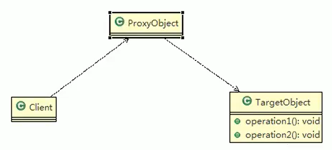
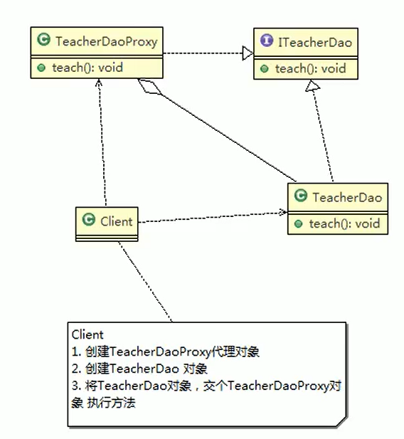
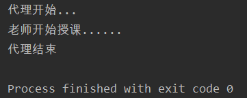
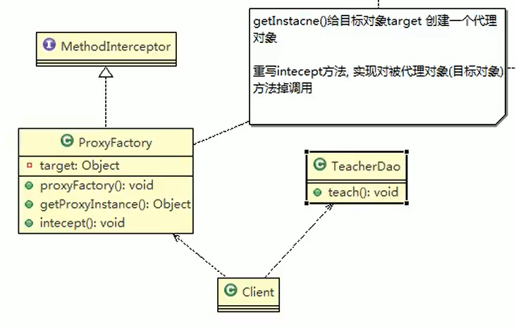
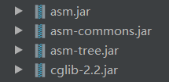
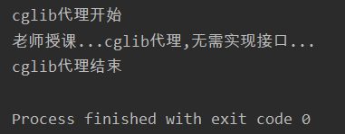

# 代理模式

## 概念

- 代理模式：为一个对象提供一个替身，以控制对这个对象的访问。即通过代理对象访问目标对象这样做的好处是：可以在目标对象实现的基础上，增强额外的功能操作，即扩展目标对象的功能
- 被代理的对象可以是远程对象、创建开销大的对象或需要安全控制的对象代理模式有不同的形式，主要有三种
- 静态代理、动态代理（JDK代理、接口代理）和Cglib代理（可以在内存动态的创建对象，而不需要实现接口，他是属于动态代理的范畴）。
- 代理模式示意图



## 静态代理

- 静态代理在使用时，需要定义接口或者父类，被代理对象（即目标对象）与代理对象一起实现相同的接口或者是继承相同父类
  应用实例
- 具体要求
  1. 定义一个接口：ITeacherDao
  2. 目标对象TeacherDAO实现接口ITeacherDAO
  3. 使用静态代理方式，就需要在代理象TeacherDAOProxy中也实现1TeacherDAO
  4. 调用的时候通过调用代理对象的方法来调用目标对象
  5. 特别提醒：代理对象与目标对象要实现相同的接口，然后通过调用相同的方法来调用目标对象的方法



- 代码实现

```java
package proxy;

public interface ITeacherDao {
    void teach(); //授课
}
```

- 被代理类

```java
package proxy;

public class TeacherDao implements ITeacherDao {
    @Override
    public void teach() {
        System.out.println("老师开始授课......");
    }
}
```

- 代理类

```java
package proxy;

public class TeacherDaoProxy implements ITeacherDao {
    private ITeacherDao teacherDao; //被代理对象

    public TeacherDaoProxy(ITeacherDao teacherDao) {
        this.teacherDao = teacherDao;
    }

    //可以做方法的增强
    @Override
    public void teach() {
        System.out.println("代理开始...");
        teacherDao.teach();
        System.out.println("代理结束");
    }
}
```

- 测试

```java
package proxy;

public class Client {
    public static void main(String[] args) {
        TeacherDao teacherDao = new TeacherDao(); //被代理对象
        TeacherDaoProxy proxy = new TeacherDaoProxy(teacherDao); //代理对象
        proxy.teach(); //代理对象执行授课方法,实际内部还是被代理对象调用授课方法
    }
}
```



1. 优点：在不修改目标对象的功能前提下，能通过代理对象对目标功能扩展
2. 缺点：因为代理对象需要与目标对象实现一样的接口，所以会有很多代理类
3. 一旦接口增加方法，目标对象与代理对象都要维护

## 动态代理

- 代理对象，不需要实现接口，但是目标对象要实现接口，否则不能用动态代理
- 代理对象的生成，是利用JDK的API，动态的在内存中构建代理对象
- 动态代理也叫做：JDK代理、接口代理
- JDK中生成代理对象的API
  1. 代理类所在包：java.lang.reflect.Proxy
  2. JDK实现代理只需要使用newProxylnstance方法，但是该方法需要接收三个参数，完整的写法是：`static Object newProxylnstance(ClassLoader loader，Class<？>[] interfaces，InvocationHandler h)`

---

- 代理接口

```java
package proxy.dynamic;

public interface ITeacherDao {
    void teach(); //授课
}
```

- 被代理类

```java
package proxy.dynamic;

public class TeacherDao implements ITeacherDao {
    @Override
    public void teach() {
        System.out.println("老师授课...");
    }
}
```

- 代理工厂实现动态代理

```java
package proxy.dynamic;

import java.lang.reflect.Proxy;

public class ProxyFactory {
    private Object target; //被代理对象

    public ProxyFactory(Object target) {
        this.target = target;
    }

    public Object getProxyInstance() {
        return Proxy.newProxyInstance(target.getClass().getClassLoader(), target.getClass().getInterfaces(),
                (obj, method, args) -> {
                    System.out.println("JDK代理开始");
                    Object returnVal = method.invoke(target, args); //调用被代理对象的方法 
                    System.out.println("动态代理结束......");
                    return returnVal;
                });
    }
}
```

- 客户端测试

```java
package proxy.dynamic;

public class Client {
    public static void main(String[] args) {
        ITeacherDao teacherDao = new TeacherDao();
        ProxyFactory factory = new ProxyFactory(teacherDao);
        ITeacherDao proxy = (ITeacherDao) factory.getProxyInstance();
        proxy.teach(); //代理对象中持有和被代理对象方法名相同的方法
    }
}
```

## Cglib代理

1. 静态代理和JDK代理模式都要求目标对象是实现一个接口，但是有时候目标对象只是一个单独的对象，并没有实现任何的接口，这个时候可使用目标对象子类来实现代理-这就是Cglib代理
2. Cglib代理也叫作子类代理，它是在内存中构建一个子类对象从而实现对目标对象功能扩展，有些书也将Cglib代理归属到动态代理
3. Cglib是一个强大的高性能的代码生成包，它可以在运行期扩展java类与实现java接口它广泛的被许多AOP的框架使用，例如Spring AOP，实现方法拦截
4. 在AOP编程中如何选择代理模式：
   1. 目标对象需要实现接口，用JDK代理
   2. 目标对象不需要实现接口，用Cglib代理
5. Cglib包的底层是通过使用字节码处理框架ASM来转换字节码并生成新的类



- 无需接口的代理类

```java
package proxy.cglib;

public class TeacherDao {
    public void teach(){
        System.out.println("老师授课...cglib代理,无需实现接口...");
    }
}
```

- 代理工厂，继承的MethodInterceptor类需要使用cglib的jar包

```java
package proxy.cglib;

import net.sf.cglib.proxy.Enhancer;
import net.sf.cglib.proxy.MethodInterceptor;
import net.sf.cglib.proxy.MethodProxy;

import java.lang.reflect.Method;

public class ProxyFactory implements MethodInterceptor {

    private Object target; //代理对象

    public ProxyFactory(Object target) {
        this.target = target;
    }

    public Object getProxyInstance(){
        //1.创建一个工具类---增强器
        Enhancer enhancer = new Enhancer();
        //2.设置父类
        enhancer.setSuperclass(target.getClass());
        //3.设置回调函数
        enhancer.setCallback(this);
        //4.创建子类对象,即代理对象
        return enhancer.create();
    }

    @Override
    public Object intercept(Object o, Method method, Object[] args, MethodProxy methodProxy) throws Throwable {
        System.out.println("cglib代理开始");
        Object returnVal = method.invoke(target, args);
        System.out.println("cglib代理结束");
        return returnVal;
    }
}
```

- 客户端测试

```java
package proxy.cglib;

public class Client {
    public static void main(String[] args) {
        TeacherDao teacherDao = new TeacherDao();
        ProxyFactory factory = new ProxyFactory(teacherDao);
        TeacherDao proxy = (TeacherDao)factory.getProxyInstance();
        //执行代理对象的方法,触发intercept(),从而实现对目标对象的调用
        proxy.teach();
    }
}
```

