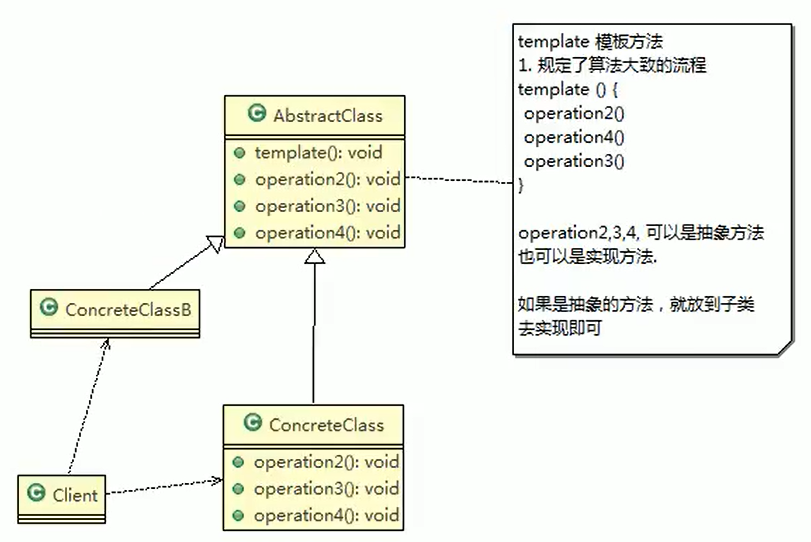
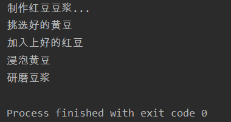
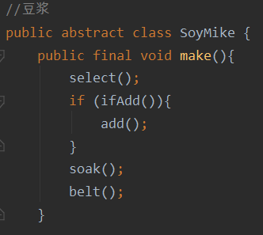
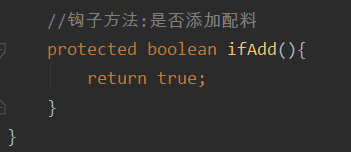

# 模板方法

- 模板方法模式基本介绍
  1. 模板方法模式（Template Method Pattern），又叫模板模式（Template Pattern），z在一个抽象类公开定义了执行它的方法的模板。它的子类可以按需要重写方法实现，但调用将以抽象类中定义的方式进行
  2. 简单说，模板方法模式定义一个操作中的算法的骨架，而将一些步骤延迟到子类中，使得子类可以不改变一个算法的结构，就可以重定义该算法的某些特定步骤
  3. 这种类型的设计模式属于行为型模式


- 豆浆制作问题，编写制作豆浆的程序，说明如下：
  1. 制作豆浆的流程选材->添加配料 >浸泡--）放到豆浆机打碎
  2. 通过添加不同的配料，可以制作出不同口味的豆浆
  3. 选材、浸泡和放到豆浆机打碎这几个步骤对于制作每种口味的豆浆都是一样的

## 一般模板



- 豆浆制作模板

```java
package template;

//豆浆
public abstract class SoyMike {
    public final void make(){
        select();
        add();
        soak();
        belt();
    }

    //挑选黄豆
    protected void select(){
        System.out.println("挑选好的黄豆");
    }
    //添加配料
    protected abstract void add();
    //浸泡黄豆
    protected void soak(){
        System.out.println("浸泡黄豆");
    }
    //研磨
    protected void belt(){
        System.out.println("研磨豆浆");
    }

}
```

- 红豆豆浆添加配料

```java
package template;

public class RedBeanSoyMilk extends SoyMike {
    @Override
    public void add() {
        System.out.println("加入上好的红豆");
    }
}
```

- 客户端

```java
package template;

public class Client {
    public static void main(String[] args) {
        System.out.println("制作红豆豆浆...");
        RedBeanSoyMilk redBeanSoyMilk = new RedBeanSoyMilk();
        redBeanSoyMilk.make();
    }
}
```



## 钩子方法

1. 在模板方法模式的父类中，我们可以定义一个方法，它默认不做任何事，子类可以视情况要不要覆盖它，该方法称为“钩子”
2. 还是用上面做豆浆的例子来讲解，比如，我们还希望制作纯豆浆，不添加任何的配料，请使用钩子方法对前面的模板方法进行改造



- 纯豆浆类

```java
package template;

public class PureSoyMilk extends SoyMike {
    @Override
    protected void add() {
        //纯豆浆,不添加配料,默认空实现
    }

    //不添加配料
    @Override
    protected boolean ifAdd() {
        return false;
    }
}
```

