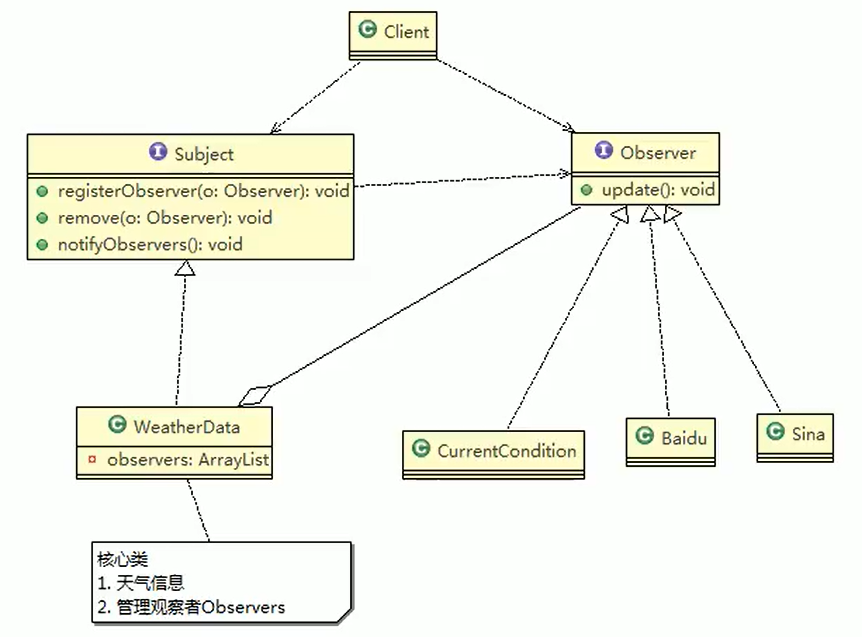
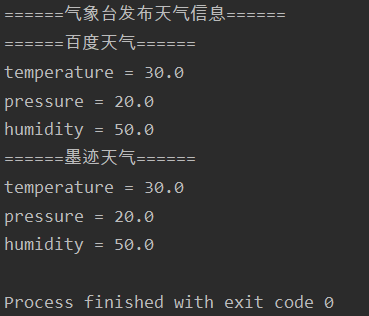

# 观察者模式

- 天气预报项目需求
  1. 气象站可以将每天测量到的温度，湿度，气压等等以公告的形式发布出去（比如发布到自己的网站或第三方）
  2. 需要设计开放型API，便于其他第三方也能接入气象站获取数据
  3. 提供温度、气压和湿度的接口
  4. 测量数据更新时，要能实时的通知给第三方


- 观察者模式原理
- Subject：登记注册、移除和通知
  1. registerObserver注册
  2. removeObserver移除
  3. notifyOobservers() 通知所有的注册的用户，根据不同需求，可以是更新数据，让用户来取，也可能是实施推送，看具体需求定
- Observer：接收输入
- 观察者模式：对象之间多对一依赖的一种设计方案，被依赖的对象为Subject，依赖的对象为Observer，Subject通知Observer变化，比如这里的奶站是Subject，是1的一方。用户时Observer，是多的一方



- 被观察者接口

```java
package observer;

public interface Subject {
    //注册观察者
    void registerObserver(Observer observer);

    //移除观察者
    void removeObserver(Observer observer);

    //通知观察者
    void notifyObserver();
}
```

- 被观察者实现------气象台

```java
package observer;

import java.util.ArrayList;
import java.util.List;

public class WeatherData implements Subject {
    private Float temperature; //温度
    private Float pressure; //气压
    private Float humidity; //湿度
    private List<Observer> observerList; //观察者集合

    public WeatherData(){
        observerList = new ArrayList<>();
    }

    public void setter(float temperature,float pressure,float humidity){
         System.out.println("======气象台发布天气信息======");
        this.temperature = temperature;
        this.pressure = pressure;
        this.humidity = humidity;
    }

    @Override
    public void registerObserver(Observer observer) {
        observerList.add(observer);
    }

    @Override
    public void removeObserver(Observer observer) {
        observerList.remove(observer);
    }

    @Override
    public void notifyObserver() {
        //通知观察者更新后的天气信息
        for (Observer observer : observerList) {
            observer.update(temperature,pressure,humidity);
        }
    }
}
```

- 观察者接口

```java
package observer;

public interface Observer {
    void update(float temperature,float pressure,float humidity); //更新天气情况
}
```

- 观察者实现------百度天气

```java
package observer;

public class BaiDuWeather implements Observer{
    private Float temperature; //温度
    private Float pressure; //气压
    private Float humidity; //湿度

    @Override
    public void update(float temperature, float pressure, float humidity) {
        this.temperature = temperature;
        this.pressure = pressure;
        this.humidity = humidity;
        display(); //更新数据后展示在百度页面
    }

    public void display(){
        System.out.println("======百度天气======");
        System.out.println("temperature = " +  temperature);
        System.out.println("pressure = " + pressure);
        System.out.println("humidity = " + humidity);
    }
}
```

- 观察者实现------墨迹天气

```java
package observer;

public class MoJiWeather implements Observer{
    private Float temperature; //温度
    private Float pressure; //气压
    private Float humidity; //湿度

    @Override
    public void update(float temperature, float pressure, float humidity) {
        this.temperature = temperature;
        this.pressure = pressure;
        this.humidity = humidity;
        display(); //更新数据后展示在百度页面
    }

    public void display(){
        System.out.println("======墨迹天气======");
        System.out.println("temperature = " +  temperature);
        System.out.println("pressure = " + pressure);
        System.out.println("humidity = " + humidity);
    }
}
```

- 客户端测试

```java
package observer;

public class Client {
    public static void main(String[] args) {
        //1.创建被观察者者---气象台
        WeatherData weatherData = new WeatherData();
        //2.创建观察者---百度天气
        BaiDuWeather baiDuWeather = new BaiDuWeather();
        MoJiWeather moJiWeather = new MoJiWeather();
        //3.注册观察者
        weatherData.registerObserver(baiDuWeather);
        weatherData.registerObserver(moJiWeather);
        //4.气象台发布天气状况
        weatherData.setter(30f, 20,50f);
        //5.被观察者通知观察者天气变化
        weatherData.notifyObserver();
    }
}
```



# 小结

1. 观察者模式设计后，会以集合的方式来管理用户（Observer），包括注册，移除和通知
2. 这样，我们增加观察者（这里可以理解成一个新的公告板），就不需要去修改核心类WeatherData不会修改代码，遵守了ocp原则