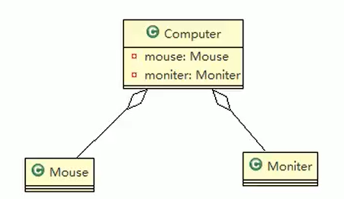

# UML类图

## 关系介绍

1. 用于描述系统中的类（对象）本身的组成和类（对象）之间的各种静态关系
2. 类之间的关系：依赖、泛化（继承）、实现、关联、聚合与组合

```java
public class Person {
    private Integer id;
    private String name;

    public Integer getId() {
        return id;
    }

    public void setId(Integer id) {
        this.id = id;
    }

    public String getName() {
        return name;
    }

    public void setName(String name) {
        this.name = name;
    }
}
```

- UML类图：

## 依赖关系

- 只要是在类中用到了对方，那么他们之间就存在依赖关系。如果没有对方，连编绎都通过不了

```java
package uml;

public class PersonServiceBean {
    private PersonDao personDao;
    public void save(Person person){};
    public IDCard getIDCard(Integer personId){
        return null;
    }
    public void modify(){
        Department department = new Department();
    }
}

package uml;
public class PersonDao {
}

package uml;
public class IDCard {
}

package uml;
public class Person {
}

package uml;
public class Department {
}
```

- UML类图示例


1. 类中用到了对方
2. 如果是类的成员属性
3. 如果是方法的返回类型
4. 是方法接收的参数类型
5. 方法中使用到

## 泛化关系

```java
public abstract class DaoSupport 
{
    public void save(Object entity)
    public void delete(Object id)
}

public class PersonServiceBean extends Daosupport{
}
```

- UML类图：
- 小结
  1. 泛化关系实际上就是继承关系
  2. 如果A类继承了B类，我们就说A和B存在泛化关系

## 实现关系

- 实现关系实际上就是A类实现B接口，他是依赖关系的特例

```java
public interface PersonService {
    public void delete(Interger id); 
}
                                
public class PersonServiceBean implements PersonService {
    public void delete(Interger id){}
}
```


## 关联关系

- 关联关系实际上就是类与类之间的联系，他是依赖关系的特例
- 关联具有航性：即双向关系或单向关系
- 关系具有多重性：如"1"（表示有且仅有一个），"0.."（表示0个或者多个）

---

- 单向一对一关系

```java
public class Person {
    private IDCard card;
}
public class IDCard{}
```

- 双向一对一关系

```java
public class Person {
    private IDCard card;
}

public class IDCard{
    private Person person;
}
```

## 聚合关系

- 聚合关系（Aggregation）表示的是整体和部分的关系，整体与部分可以分开。聚合关系是关联关系的特例，所以他具有关联的导航性与多重性
- 如：一台电脑由键盘（keyboard）、显示器（monitor），鼠标等组成；组成电脑的各个配件是可以从电脑上分离出来的，使用带空心菱形的实线来表示：

```java
public class Computer {
    priate Mouse mouse; //电脑和鼠标可以分离
    priate Monitor or monitor; //电脑和显示器可以分离

    public void set Mouse(Mouse mouse){
        this. mouse = mouse;
    }

    public void set Monit or(Monitor monitor)
    {
        this. monitor = monitor
    }
}

public class Mouse {}
public class Monitor {}
```



## 组合关系

- 组合关系：也是整体与部分的关系，但是整体与部分不可以分开
- 再看一个案例：在程序中我们定义实体：Person与IDCard，Head，那么Head和Person就是组合，IDCard和Person就是聚合
- 但是如果在程序中Person实体中定义了对IDCard进行级联删除，即删除Person时连同IDCard一起删除，那么IDCard和Person就是组合了

```java
public class Person{
    private IDCard card; //身份证和人是聚合关系,可有可无
    private Head head = new Head(); //人头和人是组合关系,不可分离
}

public class IDCard{}
public class Head{}
```


# 关系总结

