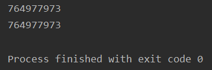
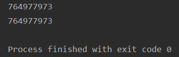
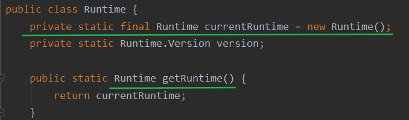

# 设计模式

- 掌握设计模式的层次

>- 第1层：刚开始学编程不久，听说过什么是设计模式
>- 第2层：有很长时间的编程经验，自己写了很多代码，其中用到了设计模式，但是自己却不知道
>- 第3层：学习过了设计模式，发现自己已经在使用了，并且发现了一些新的模式挺好用的
>- 第4层：阅读了很多别人写的源码和框架，在其中看到别人设计模式，并且能够领会设计模式的精妙和带来的好处
>- 第5层：代码写着写着，自己都没有意识到使用了设计模式，并且熟练的写了出来

- 设计模式是程序员在面对同类软件工程设计问题所总结出来的有用的经验，**模式不是代码，而是某类问题的通用解决方案**，设计模式（Design pattern）代表了最佳的实践。这些解决方案是众多软件开发人员经过相当长的一段时间的试验和错误总结出来的
- 设计模式的本质提高软件的维护性，通用性和扩展性，并降低软件的复杂度
- 设计模式分为三种类型，共23种

---

1. 创建型模式：**单例模式**、抽象工厂模式、原型模式、建造者模式、**工厂模式**
2. 结构型模式：适配器模式、桥接模式、**装饰模式**、组合模式、外观模式、享元模式、**代理模式**
3. 行为型模式：模版方法模式、命令模式、访问者模式、迭代器模式、**观察者模式**、中介者模式、备忘录模式、解释器模式（Interpreter模式）、状态模式、策略模式、职责链模式（责任链模式）

# 单例模式(重点)

- 单例模式有八种方式

## 1.饿汉式（静态常量）:star:

### 1.1实现

- 加final就必须在定义变量或构造方法中私有化
- final修饰的staic在准备阶段完成，没有final修饰的staic在初始化阶段完成

```java
public class SingletonTest1 {
    public static void main(String[] args) {
        Singleton instance1 = Singleton.getInstance();
        Singleton instance2 = Singleton.getInstance();
        System.out.println(instance1.hashCode());
        System.out.println(instance2.hashCode());
    }
}

class Singleton{
    //1.让构造函数私有化,外界不能通过new获取实例对象
    private Singleton(){}

    //2.本类内部创建对象实例
    private final static Singleton instance = new Singleton(); 

    //3.提供一个公有的静态方法，返回实例对象
    public static Singleton getInstance(){
        return instance;
    }
}
```

- 哈希值输出相同，两次获取的都为同一个对象：



### 1.2优缺点

1. 优点：这种写法比较简单，就是在类装载的时候就完成实例化。避免了线程同步问题。
2. 缺点：在类装载的时候就完成实例化，没有达到Lazy Loading的效果。如果从始至终从未使用过这个实例，则会造成内存的浪费
3. 这种方式基于classloder机制避免了多线程的同步问题，不过，instance在类装载时就实例化，在单例模式中大多数都是调用getInstance方法，但是导致类装载的原因有很多种，因此不能确定有其他的方式（或者其他的静态方法）导致类装载，这时候初始化instance就没有达到lazy loading的效果
4. <u>结论：这种单例模式可用，可能造成内存浪费</u>

## 2.饿汉式（静态代码块）:star:

### 2.1实现

```java
public class SingletonTest2 {
    public static void main(String[] args) {
        Singleton instance1 = Singleton.getInstance();
        Singleton instance2 = Singleton.getInstance();
        System.out.println(instance1.hashCode());
        System.out.println(instance2.hashCode());
    }
}

class Singleton{
    //1.让构造函数私有化,外界不能通过new获取实例对象
    private Singleton(){}

    //2.2本类内部创建对象实例
    private final static Singleton instance;

    //2.1在静态代码块中创建对象实例
    static {
        instance = new Singleton();
    }

    //3.提供一个公有的静态方法，返回实例对象
    public static Singleton getInstance(){
        return instance;
    }
}
```

### 2.2优缺点

1. 这种方式和上面的方式其实类似，只不过将类实例化的过程放在了静态代码块中，也是在类装载的时候，就执行静态代码块中的代码，初始化类的实例。优缺点和上面是一样的。
2. <u>结论：这种单例模式可用，但是可能造成内存浪费</u>

## 3.懒汉式（线程不安全）

### 3.1实现

```java
public class SingletonTest3 {
    public static void main(String[] args) {
        Singleton instance1 = Singleton.getInstance();
        Singleton instance2 = Singleton.getInstance();
        System.out.println(instance1.hashCode());
        System.out.println(instance2.hashCode());
    }
}

class Singleton{
    //1.让构造函数私有化,外界不能通过new获取实例对象
    private Singleton(){}

    //2.本类内部创建对象实例
    private static Singleton instance;

    //3.提供一个公有的静态方法,返回实例对象
    //懒汉式:需要使用对象时再创建
    public static Singleton getInstance(){
        if (instance == null){
            instance = new Singleton();
        }
        return instance;
    }
}
```

### 3.2优缺点

1. 起到了Lazy Loading的效果，但是只能在单线程下使用。
2. 如果在多线程下，一个线程进入了`if(singleton== null)`判断语句块，还未来得及往下执行，另一个线程也通过了这个判断语句，这时便会产生多个实例。所以在多线程环境下不可使用这种方式
3. <u>结论：在实际开发中，不要使用这种方式</u>

## 4.懒汉式（线程安全，同步方法）

### 4.1实现

```java
public class SingletonTest4 {
    public static void main(String[] args) {
        Singleton instance1 = Singleton.getInstance();
        Singleton instance2 = Singleton.getInstance();
        System.out.println(instance1.hashCode());
        System.out.println(instance2.hashCode());
    }
}

class Singleton{
    //1.让构造函数私有化,外界不能通过new获取实例对象
    private Singleton(){}

    //2.本类内部创建对象实例
    private static Singleton instance;

    //3.提供一个公有的静态方法,返回实例对象,增加了同步代码块
    //懒汉式:需要使用对象时再创建
    public static synchronized Singleton getInstance(){
        if (instance == null){
            instance = new Singleton();
        }
        return instance;
    }
}
```

### 4.2优缺点

1. 解决了线程不安全问题
2. 效率太低了，每个线程在想获得类的实例时候，执行getInstance()方法都要进行同步。而其实这个方法只执行一次实例化代码就够了，后面的想获得该类实例，直接return就行了。方法进行同步效率太低
3. <u>结论：在实际开发中，不推荐使用这种方式</u>

## 5.懒汉式（线程安全，同步代码块）

### 5.1实现

```java
class Singleton{
    //1.让构造函数私有化,外界不能通过new获取实例对象
    private Singleton(){}

    //2.本类内部创建对象实例
    private static Singleton instance;

    //3.提供一个公有的静态方法,返回实例对象,增加了同步代码块
    //懒汉式:需要使用对象时再创建
    public static Singleton getInstance(){
        if (instance == null){
            synchronized (Singleton.class){
                instance = new Singleton();
            }
        }
        return instance;
    }
}
```

### 5.2优缺点

1. 这种方式，本意是想对第四种实现方式的改进，因为前面同步方法效率太低，改为同步产生实例化的的代码块
2. 但是这种同步并不能起到线程同步的作用。跟第3种实现方式遇到的情形一致，假如一个线程进入了`if(singleton==null)`判断语句块，还未来得及往下执行，另一个线程也通过了这个判断语句，这时便会产生多个实例
3. <u>结论：在实际开发中，不能使用这种方式</u>

## 6.双重检查:star:

### 6.1实现

```java
public class SingletonTest6 {
    public static void main(String[] args) {
        Singleton instance1 = Singleton.getInstance();
        Singleton instance2 = Singleton.getInstance();
        System.out.println(instance1.hashCode());
        System.out.println(instance2.hashCode());
    }
}

class Singleton {
    //1.让构造函数私有化,外界不能通过new获取实例对象
    private Singleton() {
    }

    //2.本类内部创建对象实例
    private static volatile Singleton instance;

    //3.提供一个公有的静态方法,加入双重检查代码，解决线程安全问题，同时解决懒加载问题
    //懒汉式:需要使用对象时再创建
    public static Singleton getInstance() {
        if (instance == null) {
            synchronized (Singleton.class) {
                if (instance == null) { //双重检查
                    instance = new Singleton();
                }
            }
        }
        return instance;
    }
}
```

### 6.2优缺点

1. Double-Check概念是多线程开发中常使用到的，如代码中所示，我们进行了两次if（singleton==null）检查，这样就可以保证线程安全了
2. 这样，实例化代码只用执行一次，后面再次访问时，判断if（singleton-null），直接return实例化对象，也避免的反复进行方法同步
3. 线程安全：延迟加载；效率较高
4. <u>结论：在实际开发中，推荐使用这种单例设计模式</u>

## 7.静态内部类:star:

### 7.1实现

```java
public class SingletonTest7 {
    public static void main(String[] args) {
        Singleton instance1 = Singleton.getInstance();
        Singleton instance2 = Singleton.getInstance();
        System.out.println(instance1.hashCode());
        System.out.println(instance2.hashCode());
    }
}

class Singleton {
    //1.让构造函数私有化,外界不能通过new获取实例对象
    private Singleton() {
    }

    //2.写一个静态内部类
    static class SingletonInstance{
        private final static Singleton INSTANCE = new Singleton();
    }

    //3.返回对象实例
    public static Singleton getInstance(){
        return SingletonInstance.INSTANCE;
    }
}
```

### 7.2优缺点

1. 这种方式采用了类装载的机制来保证初始化实例时只有一个线程
2. 静态内部类方式在singleton类被装载时并不会立即实例化，而是在需要实例化时，调用getiInstance方法，才会装载Singletonlnstance类，从而完成Singleton的实例化
3. 类的静态属性只会在第一次加载类的时候初始化，所以在这里，JVM帮助我们保证了线程的安全性，在类进行初始化时，别的线程是无法进入的
4. 优点：避免了线程不安全，利用静态内部类特点实现延迟加载，效率高
5. <u>结论：推荐使用</u>

## 8.枚举:star:

### 8.1实现

```java
public class SingletonTest6 {
    public static void main(String[] args) {
        Singleton singleton1 = Singleton.INSTANCE;
        Singleton singleton2 = Singleton.INSTANCE;
        System.out.println(singleton1.hashCode());
        System.out.println(singleton2.hashCode());
    }
}

//枚举类
enum Singleton{
    INSTANCE
}
```



### 8.2优缺点

1. 这借助JDK1.5中添加的枚举来实现单例模式。不仅能避免多线程同步问题，而且还能防止反序列化重新创建新的对象。
2. 这种方式是Efective Java作者Josh Bloch提倡的方式
3. 结论：推荐使用

# 小结

1. 单例模式保证了系统内存中该类只存在一个对象，节省了系统资源，对于一些需要频繁创建销毁的对象，使用单例模式可以提高系统性能
2. 当想实例化一个单例类的时候，必须要记住使用相应的获取对象的方法，而不是使用new
3. 单例模式使用的场景：需要频繁的进行创建和销毁的对象、创建对象时耗时过多或耗费资源过多（即：重量级对象），但又经常用到的对象、工具类对象、频繁访问数据库或文件的对象（比如数据源、session工厂等）
4. JDK中的Runtime就使用了单例模式



