# 一、简单工厂模式:star:

- 看一个披萨的项目：要便于披萨种类的扩展，要便于维护
  1. 披萨的种类很多（比如GreekPizz、CheesePizz等）
  2. 披萨的制作有prepare，bake，cut，box
  3. 完成披萨店订购功能

## 1.1传统思路

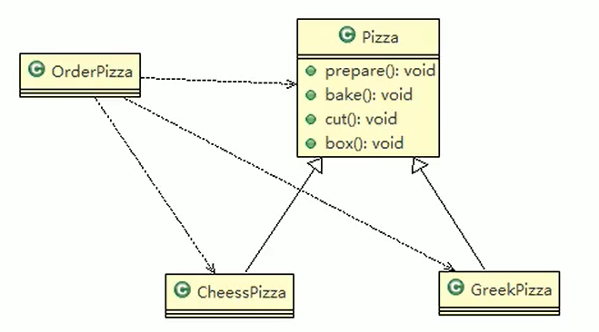

- 抽象Pizza类

```java
package pattern.factory;

public abstract class Pizza {
    private String name;

    public void setName(String name) {
        this.name = name;
    }

    //不同的披萨所需要的原材料不同
    public abstract void prepare();

    public void bake(){
        System.out.println("准备烹饪"+name+"Pizza");
    }

    public void cut(){
        System.out.println("切分"+name+"Pizza");
    }

    public void box(){
        System.out.println("将"+name+"Pizza打包");
    }
}
```

- 奶酪披萨实现

```java
package pattern.factory;

public class ChessPizza extends Pizza{
    @Override
    public void prepare() {
        System.out.println("给ChessPizza准备原材料...");
    }
}
```

- 希腊披萨实现

```java
package pattern.factory;

public class GreekPizza extends Pizza {
    @Override
    public void prepare() {
        System.out.println("给GreekPizza准备原材料...");
    }
}
```

- 用户订单类(针对使用方)

```java
package pattern.factory.order;

import pattern.factory.pizza.ChessPizza;
import pattern.factory.pizza.ChinaPizza;
import pattern.factory.pizza.GreekPizza;
import pattern.factory.pizza.Pizza;
import java.util.Scanner;

//根据用户的披萨订单制作披萨
public class UserOrderPizza {

    //生成订单的前提是需要获取到用户需要订购的披萨并且能够制作对应的披萨给用户
    public UserOrderPizza() {
        while (true) {
            //披萨的类型
            String pizzaType = getType();
            Pizza pizza;
            switch (pizzaType) {
                case "Chess":
                    pizza = new ChessPizza();
                    break;
                case "Greek":
                    pizza = new GreekPizza();
                    break;
                case "China":
                    pizza = new ChinaPizza();
                    break;
                default: //只有任何条件都不匹配的情况下才会执行
                    return;
            }
            pizza.setName(pizzaType);
            //制作披萨
            pizza.prepare();
            pizza.bake();
            pizza.cut();
            pizza.box();
        }
    }

    private String getType() {
        Scanner scanner = new Scanner(System.in); //用户输入想要的披萨
        System.out.println("请输入您需要订单的pizza名称...");
        return scanner.nextLine();
    }
}
```

- 披萨商店测试

```java
package pattern.factory.order;

public class PizzaStore {
    public static void main(String[] args) {
        new UserOrderPizza(); //生成订单
    }
}
```

## 2.2优缺点

1. 优点是比较好理解，简单易操作
2. 缺点是违反了设计模式的ocp原则，即对扩展开放，对修改关闭。即当我们给类增加新功能的时候，尽量不修改代码，或者尽可能少修改代码
3. 比如我们这时要新增加一个Pizza的种类（China披萨），我们需要做如下修改

---

- 在提供方添加一个ChinaPizza类

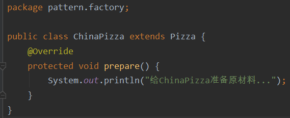

- 在使用方增加判断

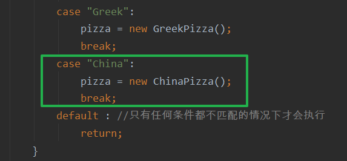

## 2.3初步改进

- 分析：修改代码可以接受，但是如果我们在其它的地方也有创建Pizza的代码，就意味着，也需要修改，而创建Pizza的代码，往往有多处
- 思路：把创建Pizza对象封装到一个类中，这样我们有新的Pizza种类时，只需要修改该类就可，其它有创建到Pizza对象的代码就不需要修改了，这就是简单工厂模式
- 简单工厂模式是属于**创建型模式**，是工厂模式的一种。简单工厂模式是由一个工厂对象决定创建出哪一种产品类的实例。简单工厂模式是工厂模式家族中**最简单实用的模式**
- 简单工厂模式：定义了一个创建对象的类，由这个类来封装实例化对象的行为（代码）
- 在软件开发中，当我们会用到大量的创建某种、某类或者某批对象时，就会使用到工厂模式
- **简单工厂模式也叫静态工厂模式**

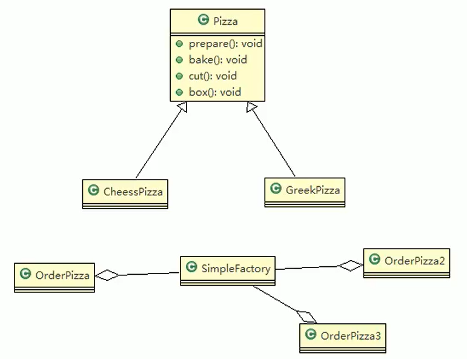

- 增加工厂类

```java
package pattern.factory.order;

import pattern.factory.pizza.ChessPizza;
import pattern.factory.pizza.GreekPizza;
import pattern.factory.pizza.Pizza;

public class SimpleFactory {

    public static Pizza createPizza(String pizzaType){
        Pizza pizza = null;
        switch (pizzaType) {
            case "Chess":
                pizza = new ChessPizza();
                break;
            case "Greek":
                pizza = new GreekPizza();
                break;
        }
        return pizza;
    }
}
```

- 修改订单类

```java
package pattern.factory.order;

import pattern.factory.pizza.Pizza;
import java.util.Scanner;

//根据用户的披萨订单制作披萨
public class UserOrderPizza {

    //生成订单的前提是需要获取到用户需要订购的披萨并且能够制作对应的披萨给用户
    public UserOrderPizza() {
        while (true) {
            //披萨的类型
            String pizzaType = getType();
            Pizza pizza = SimpleFactory.createPizza(pizzaType); //使用静态工厂模式生产披萨
             if (pizza == null){
                System.out.println("订单披萨失败~~~");
                return;
            }
            pizza.setName(pizzaType);
            //制作披萨
            pizza.prepare();
            pizza.bake();
            pizza.cut();
            pizza.box();
        }
    }


    private String getType() {
        Scanner scanner = new Scanner(System.in);
        System.out.println("请输入您需要订单的pizza名称...");
        return scanner.nextLine();
    }
}
```

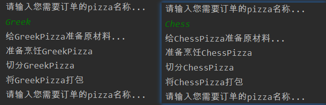

## 2.4优点

- 当我们需要增加新的披萨种类，只需要创建一个新的披萨类，并在工厂类(提供方)进行添加即可

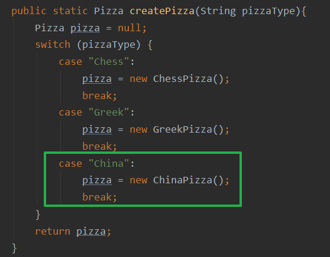

# 二、工厂方法模式

- 需求如下

>披萨项目新的需求：客户在点披萨时，可以点不同口味的披萨，比如北京的奶酪pizza、北京的胡椒pizza或者是伦敦的奶酪pizza、伦敦的胡椒pizza

- **分析需要：制作的披萨需要同时满足【地区，口味】两个条件**，上面案例中的静态工厂模式只能判断是什么口味的，如果再加地区判断就会，静态工厂模式承担的逻辑就会很冗杂，需要在口味之前再加一个地区判断
- 思路一：使用简单工厂模式，创建不同的简单工厂类，比如BJPizzaSimpleFactory，LDPizzaSimpleFactory等等从当前这个案例来说，也是可以的，但是考虑到项目的规模，以及软件的可维护性、可扩展性并不是特别好
- 思路二：使用工厂方法模式
- 工厂方法模式的介绍

>1. 工厂方法模式设计方案：将披萨项目的实例化功能抽象成抽象方法，在不同的口味点餐子类中具体实现
>2. 工厂方法模式：定义了一个创建对象的抽象方法，由子类决定要实例化的类。**工厂方法模式将对象的实例化推迟到子类**

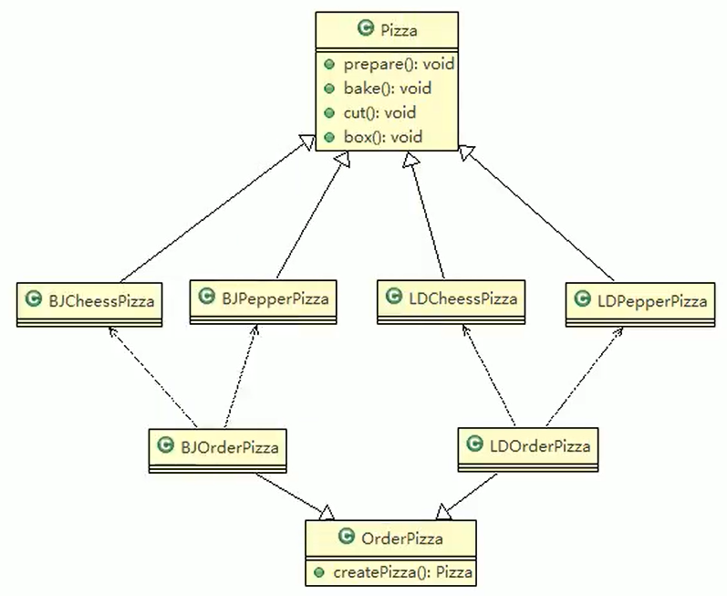

- pizza包下的实现

```java
package pattern.factorymethod.pizza;
public abstract class Pizza {
    private String name;

    public void setName(String name) {
        this.name = name;
    }

    //不同的披萨所需要的原材料不同
    public abstract void prepare();

    public void bake(){
        System.out.println("准备烹饪"+name+"Pizza");
    }

    public void cut(){
        System.out.println("切分"+name+"Pizza");
    }

    public void box(){
        System.out.println("将"+name+"Pizza打包");
    }
}

package pattern.factorymethod.pizza;
public class LDPepperPizza extends Pizza {
    @Override
    public void prepare() {
        this.setName("LDPepperPizza");
        System.out.println("准备LDPepperPizza的原材料...");
    }
}

package pattern.factorymethod.pizza;
public class LDChessPizza extends Pizza{
    @Override
    public void prepare() {
        this.setName("LDChessPizza");
        System.out.println("准备LDChessPizza的原材料...");
    }
}

package pattern.factorymethod.pizza;
public class BJPepperPizza extends Pizza {
    @Override
    public void prepare() {
        this.setName("BJPepperPizza");
        System.out.println("准备BJPepperPizza的原材料...");
    }
}

package pattern.factorymethod.pizza;
public class BJChessPizza extends Pizza {
    @Override
    public void prepare() {
        this.setName("BJChessPizza");
        System.out.println("准备BJChessPizza的原材料...");
    }
}
```

- order包下的实现：抽象类OrderPizza

```java
package pattern.factorymethod.order;

import pattern.factory.order.SimpleFactory;
import pattern.factorymethod.pizza.Pizza;
import java.util.Scanner;

public abstract class OrderPizza {
    //创建披萨的种类由具体子类去实现
    public abstract Pizza createPizza(String pizzaType);

    public OrderPizza(){
        while (true) {
            //披萨的类型
            String pizzaType = getType();
            Pizza pizza = this.createPizza(pizzaType); //工厂方法模式生成披萨
            if (pizza == null){
                System.out.println("订单披萨失败~~~");
                return;
            }
            //制作披萨
            pizza.prepare();
            pizza.bake();
            pizza.cut();
            pizza.box();
        }
    }


    private String getType() {
        Scanner scanner = new Scanner(System.in);
        System.out.println("请输入您需要订单的pizza名称...");
        return scanner.nextLine();
    }
}
```

- 具体子类LDOrderPizza实现

```java
public class LDOrderPizza extends OrderPizza {
    @Override
    public Pizza createPizza(String pizzaType) {
        Pizza pizza = null;
        switch (pizzaType){
            case "Chess":
                pizza = new LDChessPizza();
                break;
            case "Pepper":
                pizza = new LDPepperPizza();
                break;
            default:
                break;
        }
        return pizza;
    }
}
```

- 具体子类BJOrderPizza实现

```java
public class BJOrderPizza extends OrderPizza {
    @Override
    public Pizza createPizza(String pizzaType) {
        Pizza pizza = null;
        switch (pizzaType){
            case "Chess":
                pizza = new BJChessPizza();
                break;
            case "Pepper":
                pizza = new BJPepperPizza();
                break;
            default:
                break;
        }
        return pizza;
    }
}
```

- 商店测试

```java
public class PizzaStore {
    public static void main(String[] args) {
        Scanner scan = new Scanner(System.in);
        System.out.println("选择地区:");
        String loc = scan.nextLine();
        if (loc.equals("BJ")){
            new BJOrderPizza();
        }else {
            new LDOrderPizza();
        }
    }
}
```

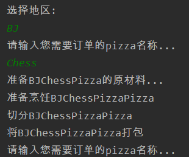

# 三、抽象工厂模式:star:

1. 抽象工厂模式：**定义了一个interface用于创建相关或有依赖关系的对象簇，而无需指明具体的类**
2. 抽象工厂模式可以将**简单工厂模式和工厂方法模式进行整合**
3. 从设计层面看，抽象工厂模式就是对简单工厂模式的改进（或者称为进一步的抽象）
4. **将工厂抽象成两层，AbsFactory（抽象工厂）和具体实现的工厂子类**。程序员可以根据创建对象类型使用对应的工厂子类。这样将单个的简单工厂类变成了工厂簇，更利于代码的维护和扩展
5. 类图

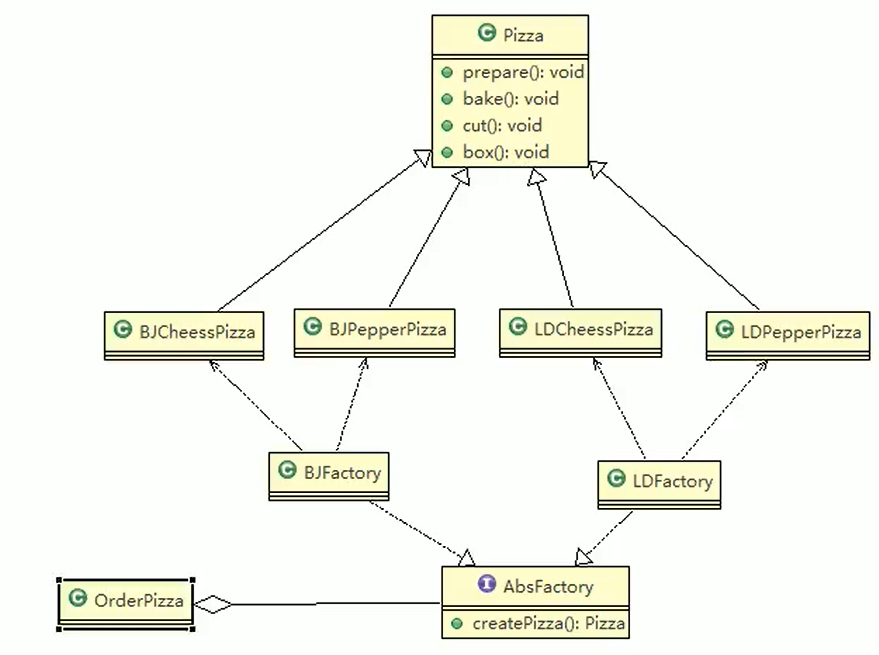

- 抽象工厂

```java
package pattern.abstractfactory.factory;

import pattern.abstractfactory.pizza.Pizza;

public interface AbcFactory {
    //生产披萨
    Pizza createPizza(String pizzaType);
}
```

- 具体工厂BJFactory实现

```java
package pattern.abstractfactory.factory.impl;

import pattern.abstractfactory.factory.AbcFactory;
import pattern.abstractfactory.pizza.BJChessPizza;
import pattern.abstractfactory.pizza.BJPepperPizza;
import pattern.abstractfactory.pizza.Pizza;

public class BJFactory implements AbcFactory {
    @Override
    public Pizza createPizza(String pizzaType) {
        Pizza pizza = null;
        switch (pizzaType){
            case "Chess":
                pizza = new BJChessPizza();
                break;
            case "Pepper":
                pizza = new BJPepperPizza();
                break;
        }
        return pizza;
    }
}
```

- 具体工厂LDFactory实现

```java
package pattern.abstractfactory.factory.impl;

import pattern.abstractfactory.factory.AbcFactory;
import pattern.abstractfactory.pizza.*;

public class LDFactory implements AbcFactory {
    @Override
    public Pizza createPizza(String pizzaType) {
        Pizza pizza = null;
        switch (pizzaType){
            case "Chess":
                pizza = new LDChessPizza();
                break;
            case "Pepper":
                pizza = new LDPepperPizza();
                break;
        }
        return pizza;
    }
}
```

- 订购披萨

```java
package pattern.abstractfactory.order;

import pattern.abstractfactory.factory.AbcFactory;
import pattern.abstractfactory.pizza.Pizza;

import java.util.Scanner;

public class OrderPizza {

    public OrderPizza(AbcFactory factory){
        while (true){
            String pizzaType = getType();
            Pizza pizza = factory.createPizza(pizzaType);
            if (pizza == null){
                System.out.println("订购失败");
                break;
            }
            pizza.prepare();
            pizza.bake();
            pizza.cut();
            pizza.box();
        }
    }


    private String getType() {
        Scanner scanner = new Scanner(System.in);
        System.out.println("请输入您需要订单的pizza名称...");
        return scanner.nextLine();
    }
}
```

- 披萨店订购测试

```java
package pattern.abstractfactory.order;

import pattern.abstractfactory.factory.impl.BJFactory;

public class PizzaStore {
    public static void main(String[] args) {
        new OrderPizza(new BJFactory());
    }
}
```

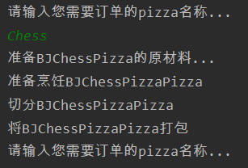

# 源码分析

```java
public class CalendarTest {
    public static void main(String[] args) {
        Calendar cal = Calendar.getInstance();
        System.out.println("年："+cal.get(Calendar.YEAR));
        //月份是从零开始的
        System.out.println("月："+(cal.get(Calendar.MONTH)+ 1));
        System.out.println("日："+ cal.get(Calendar.DAY_OF_MONTH));
        System.out.println("时："+ cal.get(Calendar.HOUR_OF_DAY));
        System.out.println("分："+ cal.get(Calendar.MINUTE));
        System.out.println("秒："+ cal.get(Calendar.SECOND));
    }
}
```

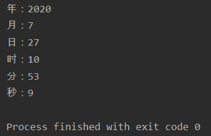

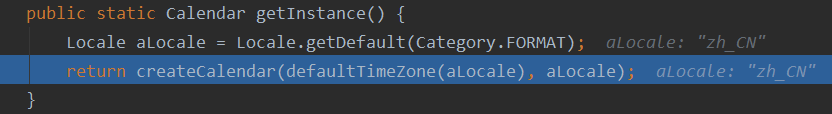

```java
private static Calendar createCalendar(TimeZone zone, Locale aLocale) {
    CalendarProvider provider = LocaleProviderAdapter.getAdapter(CalendarProvider.class, aLocale).getCalendarProvider();
    if (provider != null) {
        try {
            return provider.getInstance(zone, aLocale);
        } catch (IllegalArgumentException var7) {
        }
    }

    Calendar cal = null;
    if (aLocale.hasExtensions()) {
        String caltype = aLocale.getUnicodeLocaleType("ca");
        if (caltype != null) {
            byte var6 = -1;
            switch(caltype.hashCode()) {
            case -1581060683:
                if (caltype.equals("buddhist")) {
                    var6 = 0;
                }
                break;
            case -752730191:
                if (caltype.equals("japanese")) {
                    var6 = 1;
                }
                break;
            case 283776265:
                if (caltype.equals("gregory")) {
                    var6 = 2;
                }
            }

            switch(var6) {
            case 0:
                cal = new BuddhistCalendar(zone, aLocale);
                break;
            case 1:
                cal = new JapaneseImperialCalendar(zone, aLocale);
                break;
            case 2:
                cal = new GregorianCalendar(zone, aLocale);
            }
        }
    }

    if (cal == null) {
        if (aLocale.getLanguage() == "th" && aLocale.getCountry() == "TH") {
            cal = new BuddhistCalendar(zone, aLocale);
        } else if (aLocale.getVariant() == "JP" && aLocale.getLanguage() == "ja" && aLocale.getCountry() == "JP") {
            cal = new JapaneseImperialCalendar(zone, aLocale);
        } else {
            cal = new GregorianCalendar(zone, aLocale);
        }
    }
    return (Calendar)cal;
}
```

# 小结

1. 工厂模式的意义：将实例化对象的代码提取出来，放到一个类中统一管理和维护，达到和主项目的依赖关系的解耦。从而提高项目的扩展和维护性。
2. 三种工厂模式（简单工厂模式、工厂方法模式、抽象工厂模式）
3. 设计模式的依赖抽象原则

>- 创建对象实例时，不要直接new类，而是把这个new类的动作放在一个工厂的方法中，并返回。有的书上说，变量不要直接持有具体类的引用
>- 不要让类继承具体类，而是继承抽象类或者是实现interface（接口）
>- 不要覆盖基类中已经实现的方法