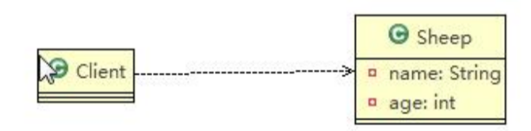
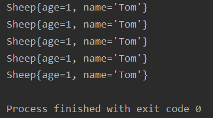
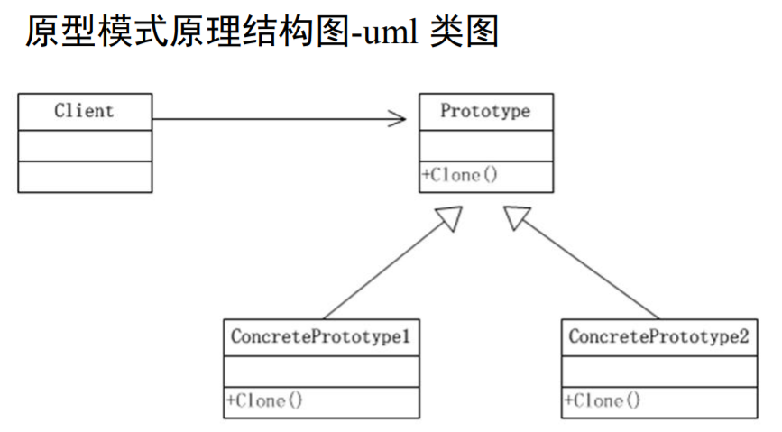
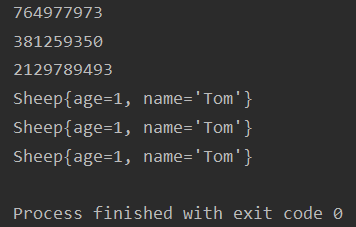
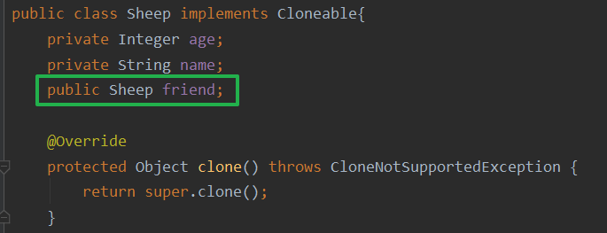
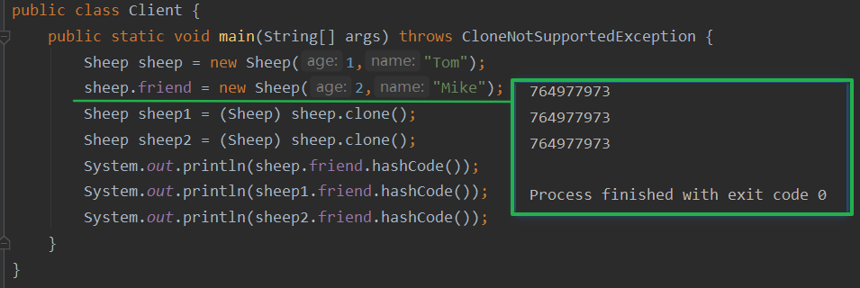
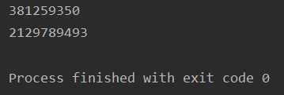
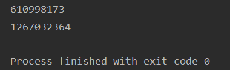

## 1.1引入案例

- 克隆羊问题：现在有一只羊tom，姓名为：tom，年龄为：1，颜色为：白色，请编写程序创建和tom羊属性完全相同的5只羊
- 传统方式解决克隆羊问题



```java
public class Sheep {
    private Integer age;
    private String name;
    
      public Sheep(Integer age, String name) {
        this.age = age;
        this.name = name;
    }
    
    //......
}
```

```java
public class Client {
    public static void main(String[] args) {
        Sheep sheep = new Sheep(1,"Tom");
        Sheep sheep1 = new Sheep(sheep.getAge(), sheep.getName());
        Sheep sheep2 = new Sheep(sheep.getAge(), sheep.getName());
        Sheep sheep3 = new Sheep(sheep.getAge(), sheep.getName());
        Sheep sheep4 = new Sheep(sheep.getAge(), sheep.getName());
        Sheep sheep5 = new Sheep(sheep.getAge(), sheep.getName());
        //hashcode是不相同的
        System.out.println(sheep1);
        System.out.println(sheep2);
        System.out.println(sheep3);
        System.out.println(sheep4);
        System.out.println(sheep5);
    }
}
```

- 克隆出了五只羊



## 1.2优缺点

1. 优点是比较好理解，简单易操作
2. 在创建新的对象时，总是需要重新获取原始对象的属性，如果创建的对象比较复杂时，效率较低
3. 总是需要重新初始化对象，而不是动态地获得对象运行时的状态，不够灵活

## 1.3原型模式

- 改进的思路分析：Java中Objet类是所有类的根类，Object类提供了一个clone()方法，该方法可以将一个Java对象复制一份，但是需要实现clone的Java类必须要实现一个接口Cloneable，该接口表示该类能够复制且具有复制的能力 ===> 原型模式
- 原型模式（Prototype模式）是指：**用原型实例指定创建对象的种类，并且通过拷贝这些原型，创建新的对象**
- 原型模式是一种创建型设计模式，允许一个对象再创建另外一个可定制的对象，无需知道如何创建的细节
- 工作原理是：通过将一个原型对象传给那个要发动创建的对象，这个要发动创建的对象通过请求原型对象拷贝它们自己来实施创建，即`对象.clone()`
- 形象的理解：孙大圣拔出猴毛，变出其它孙大圣:monkey_face::monkey::monkey::monkey::monkey::monkey:
- **Spring中原型bean的创建，就是原型模式的应用**



- Prototype：原型类，声明一个克隆自己的接口
- ConcretePrototype：具体的原型类，实现一个克隆自己的操作
- Client：让一个原型对象克隆自己，从而创建一个新的对象（属性一样）

## 1.4初步改进

- 实现Cloneable接口，重写clone方法

```java
public class Sheep implements Cloneable{
    private Integer age;
    private String name;

    public Sheep(Integer age, String name) {
        this.age = age;
        this.name = name;
    }
    @Override
    protected Object clone() throws CloneNotSupportedException {
        return super.clone();
    }
    
    //.....
}
```

- 客户端克隆测试

```java
public class Client {
    public static void main(String[] args) throws CloneNotSupportedException {
        Sheep sheep = new Sheep(1,"Tom");
        Sheep sheep1 = (Sheep) sheep.clone(); //克隆
        Sheep sheep2 = (Sheep) sheep.clone();
        Sheep sheep3 = (Sheep) sheep.clone();
        Sheep sheep4 = (Sheep) sheep.clone();
        Sheep sheep5 = (Sheep) sheep.clone();
        System.out.println(sheep.hashCode());
        System.out.println(sheep1.hashCode());
        System.out.println(sheep2.hashCode());
        System.out.println(sheep3);
        System.out.println(sheep4);
        System.out.println(sheep5);
    }
}
```

- 克隆成功，从哈希值可以看出不是同一个对象



## 1.5浅拷贝

1. 对于数据类型是基本数据类型的成员变量，浅拷贝会直接进行值传递，也就是将该属性值复制一份给新的对象
2. 对于数据类型是引用数据类型的成员变量，比如说成员变量是某个数组、某个类的对象等，那么浅拷贝会进行引用传递，也就是只是将该成员变量的引用值（内存地址）复制一份给新的对象。因为实际上两个对象的该成员变量都指向同一个实例。在这种情况下，在一个对象中修改该成员变量会影响到另一个对象的该成员变量值
3. 前面我们克隆羊就是浅拷贝
4. 浅拷贝是使用默认的clone）方法来实现sheep = (Sheep)super.clone()

---

- 增加一个自定义类对象进行克隆测试



- 克隆结束后friend属性没有改变，只是进行了引用传递



## 1.6深拷贝

1. 复制对象的所有基本数据类型的成员变量值
2. 为所有引用数据类型的成员变量申请存储空间，并复制每个引用数据类型成员变量所引用的对象，直到该对象可达的所有对象。也就是说，**对象进行深拷贝要对整个对象（包括对象的引用类型）进行拷贝**
3. 深拷贝实现方式

>- 深拷贝实现方式1：重写**clone**方法来实现深拷贝
>- 深拷贝实现方式2：**通过对象序列化实现深拷贝（推荐）**

---

### 方式一：重写clone方法

```java
package prototype;

public class DeepCloneTarget implements Cloneable{
    public String property1;
    public String property2;

    //因为该类的属性,都是String,因此我们这里使用默认的clone完成即可
    @Override
    protected Object clone() throws CloneNotSupportedException {
        return super.clone();
    }
}
```

```java
package prototype;

public class DeepProtoType implements Cloneable{
    public Integer property1;
    public String property2;
    public DeepCloneTarget target;

    @Override
    protected Object clone() throws CloneNotSupportedException {
        DeepProtoType deep = (DeepProtoType) super.clone(); //对类中的基本属性进行克隆
        deep.target = (DeepCloneTarget) deep.target.clone(); //对引用属性单独处理
        return deep;
    }
}
```

- 运行测试

```java
package prototype;

public class Client {
    public static void main(String[] args) throws CloneNotSupportedException {
        DeepCloneTarget target = new DeepCloneTarget();
        target.property1 = "目标属性1";
        target.property2 = "目标属性2";
        DeepProtoType deep = new DeepProtoType();
        deep.target = target;
        deep.property1 = 1;
        deep.property2 = "类属性2";

        DeepProtoType d1 = (DeepProtoType) deep.clone();
        System.out.println(deep.target.hashCode());
        System.out.println(d1.target.hashCode());
    }
}
```

- 从结果看出克隆后类中的DeepCloneTarget属性确实是被重新创建了一份，而非之前仅仅是引用传递



---

### 方式二：通过序列化的方式

```java
package prototype;

import java.io.Serializable;

public class DeepCloneTarget implements Serializable {
    public String property1;
    public String property2;
}
```

```java
package prototype;

import java.io.*;

public class DeepProtoType implements Serializable {
    public Integer property1;
    public String property2;
    public DeepCloneTarget target;

    //克隆对象
    public DeepProtoType deepClone(){
        DeepProtoType protoType = null;
        try (ByteArrayOutputStream bos = new ByteArrayOutputStream();
        ObjectOutputStream oos = new ObjectOutputStream(bos)) {
            //序列化
            oos.writeObject(this);
            try(ByteArrayInputStream bis = new ByteArrayInputStream(bos.toByteArray());
            ObjectInputStream ois = new ObjectInputStream(bis)){
                //反序列化
                protoType = (DeepProtoType) ois.readObject();
            }
        } catch (IOException | ClassNotFoundException e) {
            e.printStackTrace();
        }
        return protoType;
    }
}
```

- 克隆测试

```java
package prototype;

public class Client {
    public static void main(String[] args) throws CloneNotSupportedException {
        DeepCloneTarget target = new DeepCloneTarget();
        target.property1 = "目标属性1";
        target.property2 = "目标属性2";
        DeepProtoType deep = new DeepProtoType();
        deep.target = target;
        deep.property1 = 1;
        deep.property2 = "类属性2";

        DeepProtoType d1 =  deep.deepClone();
        System.out.println(deep.target.hashCode());
        System.out.println(d1.target.hashCode());
    }
}
```



## 1.7注意事项和细节

1. 创建新的对象比较复杂时，**可以利用原型模式简化对象的创建过程，同时也能够提高效率**
2. 不用重新初始化对象，而是**动态地获得对象运行时的状态**
3. 如果原始对象发生变化（增加或者减少属性），其它克隆对象的也会发生相应的变化，无需修改代码
4. 在实现深克隆的时候可能需要比较复杂的代码
5. 缺点：需要为每一个类配备一个克隆方法，这对全新的类来说不是很难，但对已有的类进行改造时，需要修改其源代码，**违背了ocp原则，这点需要注意**

