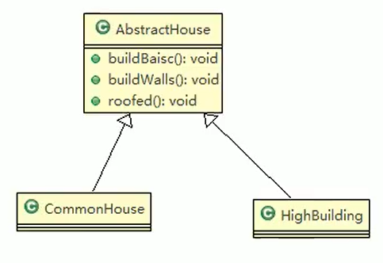
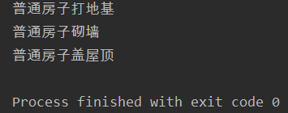
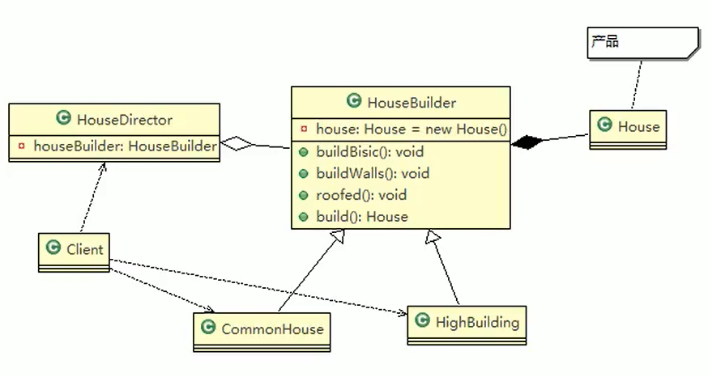
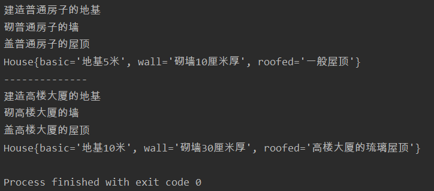

# 建造者模式

- 盖房项目需求

>1. 需要建房子：这一过程为打桩、砌墙、封顶
>2. 房子有各种各样的，比如普通房，高楼，别墅，各种房子的过程虽然一样，但是要求不要相同的
>3. 请编写程序，完成需求



## 案例引入

- 抽象房子

```java
package constructer;

public abstract class AbstractHouse {
    //打地基
    public abstract void buildBasic();

    //砌墙
    public abstract void buildWall();

    //盖屋顶
    public abstract void roofed();

    public void build(){
        buildBasic();
        buildWall();
        roofed();
    }
}
```

- 普通房子

```java
package constructer;

public class CommonHouse extends AbstractHouse {
    @Override
    public void buildBasic() {
        System.out.println("普通房子打地基");
    }
    @Override
    public void buildWall() {
        System.out.println("普通房子砌墙");
    }
    @Override
    public void roofed() {
        System.out.println("普通房子盖屋顶");
    }
}
```

- 测试

```java
package constructer;

public class Client {
    public static void main(String[] args) {
        new CommonHouse().build();
    }
}
```



## 优缺点分析

- 优点是比较好理解，简单易操作
- 设计的程序结构，过于简单，没有设计缓存层对象，程序的扩展和维护不好，也就是说，这种设计方案，把产品（即：房子）和创建产品的过程（即：建房子流程）封装在一起，耦合性增强了
- 解决方案：将产品和产品建造过程解耦 ===》建造者模式

## 建造者模式

- 建造者模式（Builder Pattern）又叫生成器模式，是一种对象构建模式。它可以将复杂对象的建造过程抽象出来（抽象类别），使这个抽象过程的不同实现方法可以构造出不同表现（属性）的对象
- 建造者模式是一步一步创建一个复杂的对象，它允许用户只通过指定复杂对象的类型和内容就可以构建它们，用户不需要知道内部的具体构建细节
- 建造者模式的四个角色

>1. Product（产品角色）：一个具体的产品对象
>2. Builder（抽象建造者）：创建一个Product对象的各个部件指定的接口/抽象类
>3. ConcreteBuilder（具体建造者）：实现接口，构建和装配各个部件
>4. Director（指挥者）：构建一个使用Builder接口的对象。它主要是用于创建一个复杂的对象。它主要有两个作用，一是：隔离了客户与对象的生产过程，二是：负责控制产品对象的生产过程

---

- 建造者模式解决盖房需求应用实例



- 产品类

```java
package constructer.improve;

//产品
public class House {
    private String basic;
    private String wall;
    private String roofed;

    public String getBasic() {
        return basic;
    }

    public void setBasic(String basic) {
        this.basic = basic;
    }

    public String getWall() {
        return wall;
    }

    public void setWall(String wall) {
        this.wall = wall;
    }

    public String getRoofed() {
        return roofed;
    }

    public void setRoofed(String roofed) {
        this.roofed = roofed;
    }

    @Override
    public String toString() {
        return "House{" +
                "basic='" + basic + '\'' +
                ", wall='" + wall + '\'' +
                ", roofed='" + roofed + '\'' +
                '}';
    }
}
```

- 抽象建造者

```java
package constructer.improve;

//抽象的建造者
public abstract class AbsHouseBuilder {
    protected House house = new House();

    //建造一个房子需要的流程
    public abstract void buildBasic();
    public abstract void buildWall();
    public abstract void buildRoofed();

    //建造好房子
    public House getHouse(){
        return house;
    }
}
```

- 普通房子的建造者

```java
package constructer.improve;

public class CommonHouseBuilder extends AbsHouseBuilder {
    @Override
    public void buildBasic() {
        house.setBasic("地基5米");
        System.out.println("建造普通房子的地基");
    }

    @Override
    public void buildWall() {
        house.setWall("砌墙10厘米厚");
        System.out.println("砌普通房子的墙");
    }

    @Override
    public void buildRoofed() {
        house.setRoofed("一般屋顶");
        System.out.println("盖普通房子的屋顶");
    }
}
```

- 高楼大厦的建造者

```java
package constructer.improve;

public class HighHouseBuilder extends AbsHouseBuilder {

    @Override
    public void buildBasic() {
        house.setBasic("地基10米");
        System.out.println("建造高楼大厦的地基");
    }

    @Override
    public void buildWall() {
        house.setWall("砌墙30厘米厚");
        System.out.println("砌高楼大厦的墙");
    }

    @Override
    public void buildRoofed() {
        house.setRoofed("高楼大厦的琉璃屋顶");
        System.out.println("盖高楼大厦的屋顶");
    }
}
```

- 指挥者，指挥建造流程

```java
package constructer.improve;

//指导者
public class HouseDirector {
    private AbsHouseBuilder builder;

    public HouseDirector(AbsHouseBuilder builder) {
        this.builder = builder;
    }

    public void setBuilder(AbsHouseBuilder builder) {
        this.builder = builder;
    }

    //建造房子的实际流程交给指挥者安排
    public House constructHouse(){
        builder.buildBasic();
        builder.buildWall();
        builder.buildRoofed();
        return builder.getHouse();
    }
}
```

- 客户端测试

```java
package constructer.improve;

public class Client {
    public static void main(String[] args) {
        HouseDirector director = new HouseDirector(new CommonHouseBuilder());
        House common = director.constructHouse();
        System.out.println(common);
        System.out.println("--------------");
        director.setBuilder(new HighHouseBuilder());
        House high = director.constructHouse();
        System.out.println(high);
    }
}
```

- 实际建楼效果



# 注意事项

1. 客户端（使用程序）不必知道产品内部组成的细节，将产品本身与产品的创建过程解耦，使得相同的创建过程可以创建不同的产品对象
2. 每一个具体建造者都相对独立，而与其他的具体建造者无关，因此可以很方便地替换具体建造者或增加新的具体建造者，用户使用不同的具体建造者即可得到不同的产品对象
3. 可以更加精细地控制产品的创建过程。将复杂产品的创建步骤分解在不同的方法中，使得创建过程更加清晰，也更方便使用程序来控制创建过程
4. 增加新的具体建造者无须修改原有类库的代码，指挥者类针对抽象建造者类编程，系统扩展方便，符合“开闭原则"
5. **建造者模式所创建的产品一般具有较多的共同点，其组成部分相似，如果产品之间的差异性很大，则不适合使用建造者模式，因此其使用范围受到一定的限制**
6. 如果产品的内部变化复杂，可能会导致需要定义很多具体建造者类来实现这种变化，导致系统变得很庞大，因此在这种情况下，要考虑是否选择建造者模式

---

- 抽象工厂模式vs建造者模式：
  - 抽象工厂模式实现对产品家族的创建，一个产品家族是这样的一系列产品：具有不同分类维度的产品组合，采用抽象工厂模式不需要关心构建过程，只关心什么产品由什么工厂生产即可。而**建造者模式则是要求按照指定的蓝图建造产品，它的主要目的是通过组装零配件而产生一个新产品**

