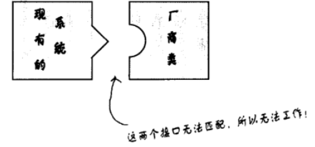
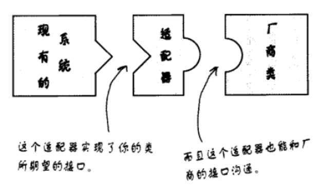
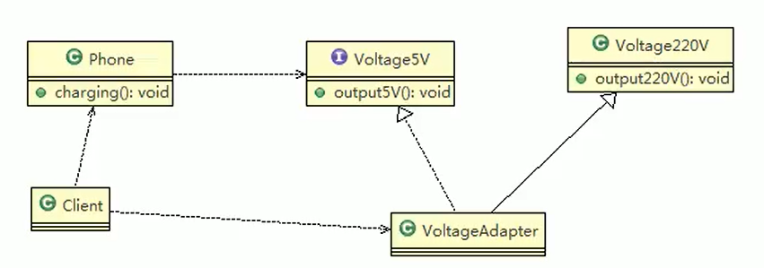
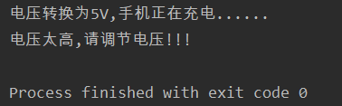
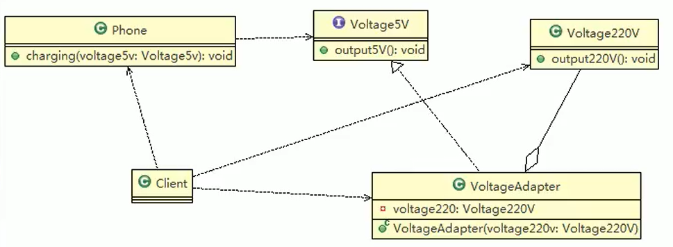
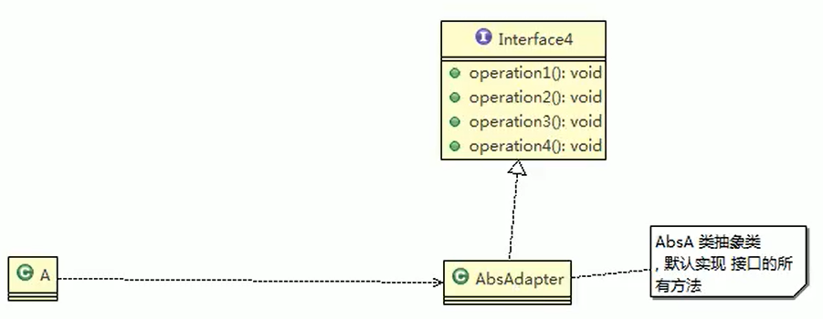
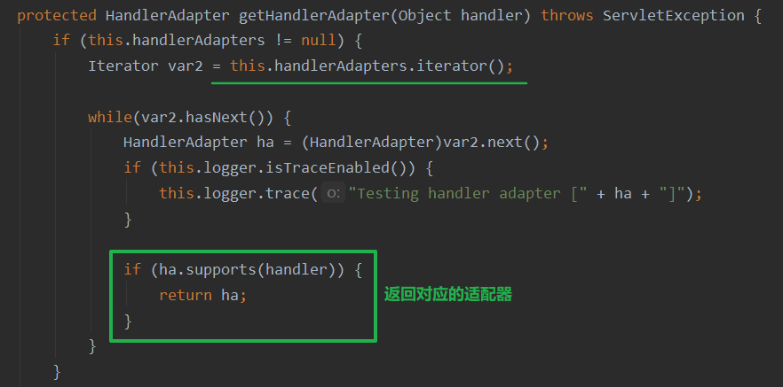
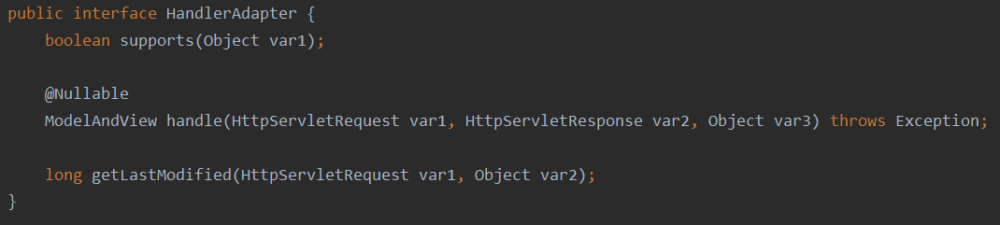
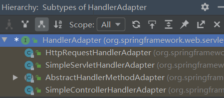
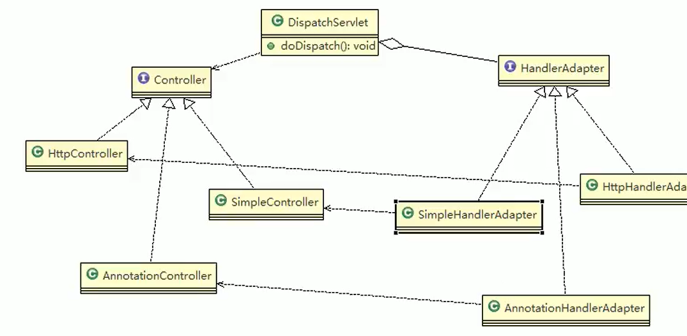

# 适配器模式

1. 适配器模式（Adapter Patter）将某个类的接口转换成客户端期望的另一个接口表示，主的目的是兼容性，让原本因接口不匹配不能一起工作的两个类可以协同工作。其别名为包装器（Wrapper）
2. 适配器模式属于结构型模式
3. 主要分为三类：类适配器模式、对象适配器模式、接口适配器模式

- 工作原理

>1. 适配器模式：将一个类的接口转换成另一种接口让原本接口不兼容的类可以兼容
>2. 从用户的角度看不到被适配者，是解耦的
>3. 用户调用适配器转化出来的目标接口方法，适配器再调用被适配者的相关接口方法
>4. 用户收到反馈结果，感觉只是和目标接口交互，如图

## 1.问题引入

- 有一个插座，这个插座是三个口的，但是我们手上只有两个触角的插头，一种笨方法就是直接强行把两个触角掰弯，插进去，还有一种方法就是找一个转换头来
- 看下面一张图就大概明白了，很明显现有系统很难和厂商提供的匹配，该怎么做呢？那么适配器这是就派上用场了



- 将一个类的接口，转换成客户期望的另一个接口。适配器让原本接口不兼容的类可以合作无间



- 这个模式可以通过创建适配器进行接口转换，让不兼容的接口变成兼容。这可以让客户从实现的接口解耦。如果在一段时间之后，我们想要改变接口，适配器可以将改变的部分封装起来，客户就不必为了应对不同的接口每次跟着修改

## 2.1类适配器模式

- 应用实例说明：以生活中充电器的例子来讲解适配器，充电器本身相当于Adapter，220V交流电相当于src（即被适配者），我们的目dst（即目标）是5V直流电
- 程序分析图如下：



- 被适配的类(220V电压)

```java
package adapt;

//被适配的类
public class Voltage220V {
    //输出src = 220V 的电压
    public int output220V(){
        return 220;
    }
}
```

- 接口(5V电压实现)

```java
package adapt;

public interface IVoltage5V {
    int output5V();
}
```

- 适配器(电压转换器)实现接口并继承被适配的类

```java
package adapt;

public class VoltageAdapter extends Voltage220V implements IVoltage5V {

    @Override
    public int output5V() {
        int src = output220V();
        return src / 44; //---> des=220/44=5V
    }
}
```

- 手机装载适配器(转换器)

```java
package adapt;

public class Phone {
    public void charging(IVoltage5V voltage5V){
        if (voltage5V == null){
            System.out.println("电压太高,请调节电压!!!");
            return;
        }
        int dst = voltage5V.output5V();
        if (dst == 5) System.out.println("电压转换为"+dst+"V,手机正在充电......");
    }
}
```

- 测试使用

```java
package adapt;

public class Client {
    public static void main(String[] args) {
        Phone phone = new Phone();
        phone.charging(new VoltageAdapter());
        phone.charging(null);
    }
}
```

- 使用电源适配器和没有使用电源适配器的区别



## 2.1类适配器的优缺点

1. Java是单继承机制，所以类适配器需要继承src类这一点算是一个缺点，因为这要求dst必须是接口，有一定局限性
2. src类的方法在Adapter中都会暴露出来，也增加了使用的成本
3. 由于其继承了src类，所以它可以根据需求重写src类的方法，使得Adapter的灵活性增强了

## 3.1对象适配器

1. 基本思路和类的适配器模式相同，只是将Adapter类作修改，不是继承src类，而是持有src类的实例，以解决兼容性的问题。即：持有src类，实现dst类接口，完成src->dst的适配
2. **根据“合成复用原则”，在系统中尽量使用关联关系（聚合）来替代继承关系**
3. 对象适配器模式是适配器模式常用的一种

---

- 应用实例说明
  以生活中充电器的例子来讲解适配器，充电器本身相当于Adapter，220V交流电相当于src（即被适配者），我们的目dst（即目标）是5V直流电，使用对象适配器模式完成
- 思路分析（类图）：只需修改适配器即可，如下：



- 只需修改适配器类

```java
package adapt;

public class VoltageAdapter implements IVoltage5V {
    private Voltage220V voltage220V; //聚合关系

    public VoltageAdapter() {
    }

    public VoltageAdapter(Voltage220V voltage220V) {
        this.voltage220V = voltage220V;
    }

    @Override
    public int output5V() {
        int src = voltage220V.output220V();
        return src / 44; //---> des=220/44=5V
    }
}
```

- 客户端测试

```java
package adapt;

public class Client {
    public static void main(String[] args) {
        Phone phone = new Phone();
        phone.charging(new VoltageAdapter(new Voltage220V()));
        phone.charging(null);
    }
}
```

## 3.2对象适配器优缺点

1. 对象适配器和类适配器其实算是同一种思想，只不过实现方式不同
2. 根据合成复用原则，使用组合替代继承，所以它解决了类适配器必须继承src的局限性问题，也不再要求dst必须是接口
3. 使用成本更低，更灵活。

## 4.1接口适配器

1. 一些书籍称为：适配器模式（Default Adapter Pattern）或缺省适配器模式
2. 核心思路：当不需要全部实现接口提供的方法时，可先设计一个抽象类实现接口，并为该接口中每个方法提供一个默认实现（空方法），那么该抽象类的子类可有选择地覆盖父类的某些方法来实现需求
3. 适用于一个接口不想使用其所有的方法的情况



- 接口

```java
package adapt;

public interface Interface4 {
    void fun1();
    void fun2();
    void fun3();
    void fun4();
}
```

- 抽象适配器类，全是空的默认实现

```java
package adapt;

public class AbsAdapter implements Interface4 {
    @Override
    public void fun1() {

    }

    @Override
    public void fun2() {

    }

    @Override
    public void fun3() {

    }

    @Override
    public void fun4() {

    }
}
```

- 客户端根据需要重写所需要的方法并使用

```java
package adapt;

public class Client {
    public static void main(String[] args) {
        new AbsAdapter(){
            @Override
            public void fun1() {
                System.out.println("重写了fun1方法");
            }
        }.fun1(); //调用重写的方法
    }
}
```

## 5.1适配器模式在SpringMVC框架应用的源码剖析
1. SpringMVC中的HandlerAdapter，就使用了适配器模式
2. SpringMVC处理请求的流程回顾
3. 使用HandlerAdapter的原因分析：可以看到处理器的类型不同，有多重实现方式，那么调用方式就不是确定的，如果需要直接调用Controller方法，需要调用的时候就得不断是使用ifelse来进行判断是哪一种子类然后执行。那么如果后面要扩展Controller，就得修改原来的代码，这样违背了OCP原则

---

- DispatcherServlet类


- DispatcherServlet类中的方法



- 控制器需要适配的接口



- HandlerAdapter的实现子类，使得每一种Controller都有对应的适配器实现类





## 小结

1. 三种命名方式，是根据src是以怎样的形式给到Adapter（在Adapter里的形式）来命名的
2. 类适配器：以类给到，在Adapter里，就是将src当做类，**继承**
3. 对象适配器：以对象给到，在Adapter里，将src作为一个对象，**持有**
4. 接口适配器：以接口给到，在Adapter里，将src作为一个接口，**实现**
5. Adapter模式最大的作用还是将原本不兼容的接口融合在一起工作
6. 实际开发中，实现起来不拘泥于我们讲解的三种经典形式