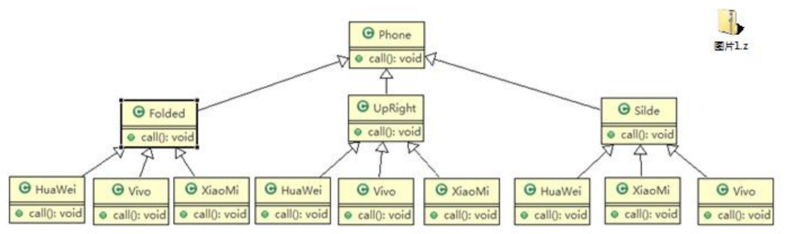
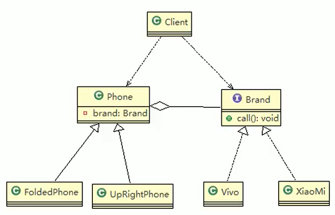
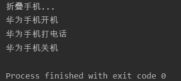

# 传统模式



1. 扩展性问题（类爆炸），如果我们再增加手机的样式（旋转式），就需要增加各个品牌手机的类，同样如果我们增加一个手机品牌，也要在各个手机样式类下增加。
2. 违反了单一职责原则，当我们增加手机样式时，要同时增加所有品牌的手机，这样增加了代码维护成本.
3. 解决方案 ===》使用桥接模式

# 桥接模式

1. 桥接模式（Bridge模式）是指：将实现与抽象放在两个不同的类层次中，使两个层次可以独立改变。
2. 是一种结构型设计模式
3. Bridge模式基于类的最小设计原则，通过使用封装、聚合及继承等行为让不同的类承担不同的职责。它的主要特点是把抽象（Abstraction）与行为实现（Implementation）分离开来，从而可以保持各部分的独立性以及应对他们的功能扩展

---

- 桥接模式解决手机操作问题
- 类图中的Brand就是Function



- 抽象接口

```java
package bridge;

public interface Function {
    void open(); //开机

    void call(); //打电话

    void close(); //关机
}
```

- 具体手机品牌实现

```java
package bridge;

public class HuaWei implements Function {
    @Override
    public void open() {
        System.out.println("华为手机开机");
    }

    @Override
    public void call() {
        System.out.println("华为手机打电话");
    }

    @Override
    public void close() {
        System.out.println("华为手机关机");
    }
}
```

```java
package bridge;

public class Apple implements Function {
    @Override
    public void open() {
        System.out.println("苹果手机开机");
    }

    @Override
    public void call() {
        System.out.println("苹果手机打电话");
    }

    @Override
    public void close() {
        System.out.println("苹果手机关机");
    }
}
```

- 手机样式类组合手机品牌

```java
package bridge;

public abstract class Phone {
    //组合功能
    private Function function;

    public Phone(Function function) {
        this.function = function;
    }

    protected void open() {
        this.function.open();
    }

    protected void call() {
        this.function.call();
    }

    protected void close() {
        this.function.close();
    }
}
```

- 具体样式实现

```java
package bridge;

public class FoldedPhone extends Phone {

    public FoldedPhone(Function function) {
        super(function);
        System.out.println("折叠手机...");
    }

    public void open(){
        super.open();
    }

    public void call(){
        super.call();
    }

    public void close(){
        super.close();
    }
}
```

- 客户端测试

```java
package bridge;

public class Client {
    public static void main(String[] args) {
        //获取折叠式手机(样式 + 品牌)
        Phone phone = new FoldedPhone(new HuaWei());
        phone.open();
        phone.call();
        phone.close();
    }
}
```

