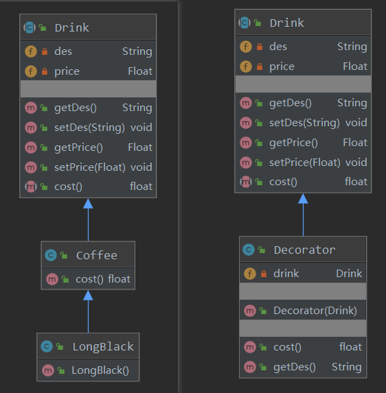
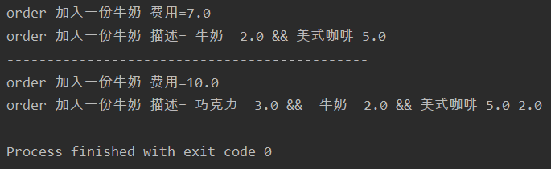
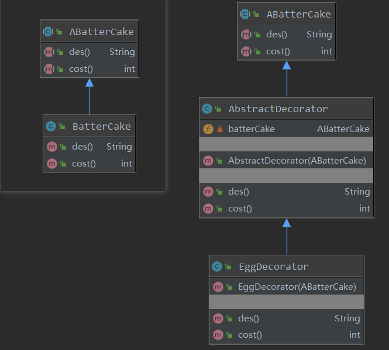
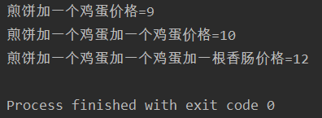

# 装饰者模式

- 星巴克咖啡订单项目（咖啡馆）：
  1. 咖啡种类/单品咖啡：Espresso（意大利浓咖啡）、ShortBlack，LongBlack（美式咖啡）、Decaf（无因咖啡）
  2. 调料：Milk，Soy（豆浆）、Chocolate
  3. 要求在扩展新的咖啡种类时，具有良好的扩展性、改动方便、维护方便
  4. 使用00的来计算不同种类咖啡的费用：客户可以点单品咖啡，也可以单品咖啡+调料组合

## 概念和案例分析一

- 装饰者模式：动态的将新功能附加到对象上。在对象功能扩展方面，它比继承更有弹性，装饰者模式也体现了开闭原则（ocp）
- 这里提到的动态的将新功能附加到对象和ocp原则，在后面的应用实例上会以代码的形式体现
- 装饰者模式就像打包一个快递
  - 主体：比如：陶瓷、衣服（Component）===》被装饰者
  - 包装：比如：报纸填充、塑料泡沫、纸板、木板（Decorator）
- Component主体：比如类似前面的Drink
- ConcreteComponent和Decorator ConcreteComponent：具体的主体，比如前面的各个单品咖啡
- Decorator：装饰者，比如各调料



- 饮料类

```java
package decorate;

public abstract class Drink {
    private String des; //饮料的描述
    private Float price = 0f; //价格

    public String getDes() {
        return des;
    }

    public void setDes(String des) {
        this.des = des;
    }

    public Float getPrice() {
        return price;
    }

    public void setPrice(Float price) {
        this.price = price;
    }

    //抽象方法,子类必须实现,每种咖啡的定价
    public abstract float cost(); 
}
```

- 咖啡类：每种咖啡都要定价，抽取公共部分作为BaseParent

```java
package decorate;

/*
不同的咖啡需要不同的定价
 */
public class Coffee extends Drink{
    @Override
    public float cost() {
        return super.getPrice();
    }
}
```

- 单品咖啡一

```java
package decorate;

public class Decaf extends Coffee {
    public Decaf(){
        setDes("无因咖啡");
        setPrice(5f);
    }
}
```

- 单品咖啡二

```java
package decorate;

public class LongBlack extends Coffee {
    public LongBlack(){
        setDes("美式咖啡");
        setPrice(5.0f);
    }
}
```

- 装饰类

```java
package decorate;

public class Decorator extends Drink {
    private Drink drink;

    public Decorator(Drink drink){
        this.drink = drink;
    }

    @Override
    public float cost() {
        return super.getPrice() + drink.cost();
    }

    @Override
    public String getDes() {
        return super.getDes() + " " + getPrice() + " && " + drink.getDes() + " " + drink.getPrice();
    }
}
```

- 用牛奶装饰咖啡

```java
package decorate;

public class Milk extends Decorator {

    public Milk(Drink drink) {
        super(drink);
        setDes(" 牛奶 ");
        setPrice(2.0f);
    }
}
```

- 用巧克力装饰咖啡

```java
package decorate;

//具体的Decorator， 这里就是调味品
public class Chocolate extends Decorator {

    public Chocolate(Drink drink) {
        super(drink);
        setDes(" 巧克力 ");
        setPrice(3.0f); // 调味品的价格
    }
}
```

- 测试

```java
package decorate;

public class Cafe {
    public static void main(String[] args) {
        //1.点一杯单品咖啡
        Drink longBlack = new LongBlack();
        //2.给咖啡加一份牛奶
        longBlack = new Milk(longBlack);
        System.out.println("order 加入一份牛奶 费用=" + longBlack.cost());
        System.out.println("order 加入一份牛奶 描述=" + longBlack.getDes());

        System.out.println("---------------------------------------------");

        //3.给咖啡再加一份巧克力
        longBlack = new Chocolate(longBlack);
        System.out.println("order 加入一份牛奶 费用=" + longBlack.cost());
        System.out.println("order 加入一份牛奶 描述=" + longBlack.getDes());
    }
}
```



## 案例二

- 假设一个应用场景吧假设我们现在在路边摊看到一个卖煎饼果子的，现在想买煎饼果子，煎饼果子一般的话都是可以加鸡蛋加香肠什么的，好那我们就来模拟一下加在煎饼果子上加东西的操作
- 首先我们看一下使用继承的方式怎么实现

### 继承

- 创建一个煎饼果子类

```java
public class Battercake {
    protected String getDesc(){
        return "煎饼果子";
    }
    protected int cost(){
        return 8;
    }
}
```

- 加鸡蛋类，我们让加鸡蛋类继承煎饼果子类

```java
public class BattercakeWithEgg extends Battercake {
    @Override
    public String getDesc() {
        return super.getDesc()+" 加一个鸡蛋";
    }

    @Override
    public int cost() {
        return super.cost()+1;
    }
}
```

- 加香肠类，同样的继承煎饼果子类

```java
public class BattercakeWithEggSausage extends BattercakeWithEgg {
    @Override
    public String getDesc() {
        return super.getDesc()+ " 加一根香肠";
    }

    @Override
    public int cost() {
        return super.cost()+2;
    }
}
```

- 测试类

```java
public class DecoratorV1Test {
    public static void main(String[] args) {
        Battercake battercake = new Battercake();
        System.out.println(battercake.getDesc()+" 销售价格:"+battercake.cost());

        Battercake battercakeWithEgg = new BattercakeWithEgg();
        System.out.println(battercakeWithEgg.getDesc()+" 销售价格:"+battercakeWithEgg.cost());

        Battercake battercakeWithEggSausage = new BattercakeWithEggSausage();
        System.out.println(battercakeWithEggSausage.getDesc()+" 销售价格:"+battercakeWithEggSausage.cost());
    }
}
```

- 输出结果

```css
煎饼 销售价格:8
煎饼 加一个鸡蛋 销售价格:9
煎饼 加一个鸡蛋 加一根香肠 销售价格:11
```

- 这样做有个问题，什么问题呢？假设我们现在要加2个鸡蛋呢？糟糕我们没写加2个鸡蛋的类，如果还有3个4个什么的那是不是就要类爆炸了。下面我们使用装饰者模式实现一下

### 装饰模式



- 首先我们定义一个抽象的煎饼果子

```java
public abstract class ABatterCake {
    protected abstract String getDesc();
    protected abstract int cost();
}
```

- 实体煎饼果子类，实体煎饼果子继承了抽象煎饼果子类

```java
public class Battercake extends ABatterCake {
    @Override
    protected String getDesc() {
        return "煎饼";
    }

    @Override
    protected int cost() {
        return 8;
    }
}
```

- 装饰父类，这里也是可以使用抽象类，等会儿我们再说什么时候使用抽象类什么时候使用实体类。注意构造器和这个里面的花费、描述方法的写法。这里注入一个抽象煎饼类的对象。我们的获取描述花费的操作都委托抽象煎饼类来执行

```java
public  class AbstractDecorator extends ABattercake {
    private ABatterCake aBattercake;

    public AbstractDecorator(ABatterCake aBattercake) {
        this.aBattercake = aBattercake;
    }
    
    @Override
    protected String getDesc() {
        return this.aBattercake.getDesc();
    }

    @Override
    protected int cost() {
        return this.aBattercake.cost();
    }
}
```

- 鸡蛋的装饰类，这里注意他的构造器，参数是父类的对象抽象煎饼类对象，这里获取描述和花费方法都是调用了父类的方法

```java
public class EggDecorator extends AbstractDecorator {
    
    public EggDecorator(ABatterCake aBattercake) {
        super(aBattercake);
    }

    @Override
    protected String getDesc() {
        return super.getDesc()+" 加一个鸡蛋";
    }

    @Override
    protected int cost() {
        return super.cost()+1;
    }
}
```

- 香肠装饰类

```java
public class SausageDecorator extends AbstractDecorator{
    public SausageDecorator(ABattercake aBattercake) {
        super(aBattercake);
    }

    @Override
    protected String getDesc() {
        return super.getDesc()+" 加一根香肠";
    }

    @Override
    protected int cost() {
        return super.cost()+2;
    }
}
```

- 最后是测试类，创建一个实体煎饼果子类并赋值给抽象煎饼果子类，然后将这个父类对象注入装饰类，再把得到的对象赋值给创建的抽象对象

```java
public class Stall {
    public static void main(String[] args) {
        ABatterCake batterCake = new BatterCake();
        batterCake = new EggDecorator(batterCake);
        System.out.println(batterCake.des() + "价格="+batterCake.cost());

        batterCake = new EggDecorator(batterCake);
        System.out.println(batterCake.des() + "价格="+batterCake.cost());

        batterCake = new SausageDecorator(batterCake);
        System.out.println(batterCake.des() + "价格="+batterCake.cost());
    }
}
```

