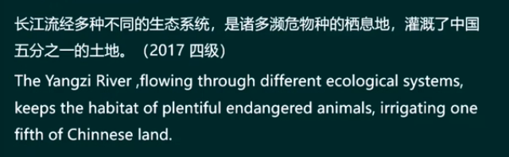

# 考前复习规划

## 听力

模仿：模仿两个主播的发音和速度；

## 阅读

1. 在规定的时间内先把题目做一遍；
2. 核实对错：知道每一个正确选项正确的原因并且明确的知道自己做错的原因是什么；
3. 精度全文：所有拿不准的单词全部的查出来直接标在真题上；
4. 背真题上自己不认识的词汇；

## 写作和翻译

1. 语言准确多变；
2. 句子和句子之间多用逻辑关系词；
3. 内容切题；

# 四级

1. 听力
2. 写作：20-22分钟
3. 仔细阅读：20分钟
4. 长篇阅读：15分钟
5. 翻译：25分钟
6. 选词填空

## 四六级作文

1. 图画图表
2. 谚语警句
3. 书信
4. 论说文

### 写作翻译保底原则

- 单词语法正确：写作中所有写不来的单词都可以写成自己会的词汇
  1. 翻译中的单词不会写怎么办：用该单词的上位词来代替
  2. 用该单词的同义词或近义词来代替这个单词
  3. 用我们会的单词把这个单词的意思解释出来
  4. 语法正确：所有写不来的长难句都写成简单句
- 写作翻译高分原则：
  1. 单词语法准确多变
  2. 结构上句子和句子之间多用逻辑关系词
  3. 内容切题
- 常见土单词排行榜：需要替换
  1. think：
     - have been covinced that
     - be of the opinon that
     - cling to the perspective that
     - maintain
     - contend
     - assert
     - argue
     - assume
     - claim
  2. many:
     - a sea of
     - multitudes of
     - immense amounts of
     - numerous
     - innumerable
     - plentiful
  3. people we us:
     - private individuals
     - youngsters and teenagers
     - all children and adults
     - experts and professors
     - parents
     - kids
     - offspring
     - bussinessman
     - youngersters on campus
  4. very:
     - exceedingly
     - distinctly
     - strikingly
     - more than
     - extraordinarily
     - outstandingly
  5. important:
     - significant
     - crucial
     - critical
     - indispensable
     - play a crucial role in sth
  6. and:
     - similarly
     - equally
     - likewise
     - at the same time
     - in the meanwhile

### 写作中可用的满分句型

1. 主语从句：可以写在作文中任何一句话的前面用来拉长句子

- 写在各段的段首句或段尾句的前面，作文总的三段，写在六句话的某一句话前面

2. 定义从句：which引导的非限制性定语从句可以修饰前面整句话

可以写在作文中任何一句话的后面用来拉长句子，要么第一段要么第二段某句比较短的后面

3. 万能状语：状语可以写在作文中任何一句话的任何一句位置

1. 显而易见
2. 随着科学和技术的快速进步
3. 目前，现在 = nowadays
4. 在我们的日常生活中

4. 插入语：插在第一段或第二段或第三段的段首之间

5. 强调句型：作文中的任何一句话都可以写成强调句型，把强调内容放在it is和that中间，其他地方一个字不变

推荐写在1,2,3,段的某一段段首句，只能用一次

### 谚语警句型

措施一

措施二

最后一句

### 图画图表型

第一段：一二句主语从句引出描述图画或图表

第三段：完全同谚语警句型第三段

### 论说文

以前：

现在：

第三段，完全和谚语警句型

### 书信

## 翻译

- 英汉差异对比

1. 句子结构上；
2. 逻辑关系的使用上；

1. and 替换
2. but 替换
3. so 替换
4. 递进的替换

- 英语多长句，汉语多短句，把汉语写成英语长句的三种方法：

1. 非谓语动词

2. 从句

3. 连词

- 英语多被动，汉语多主动：所以我们要经常把汉语的主动句翻译成英语的被动句

### 翻译的步骤

## 选词填空

