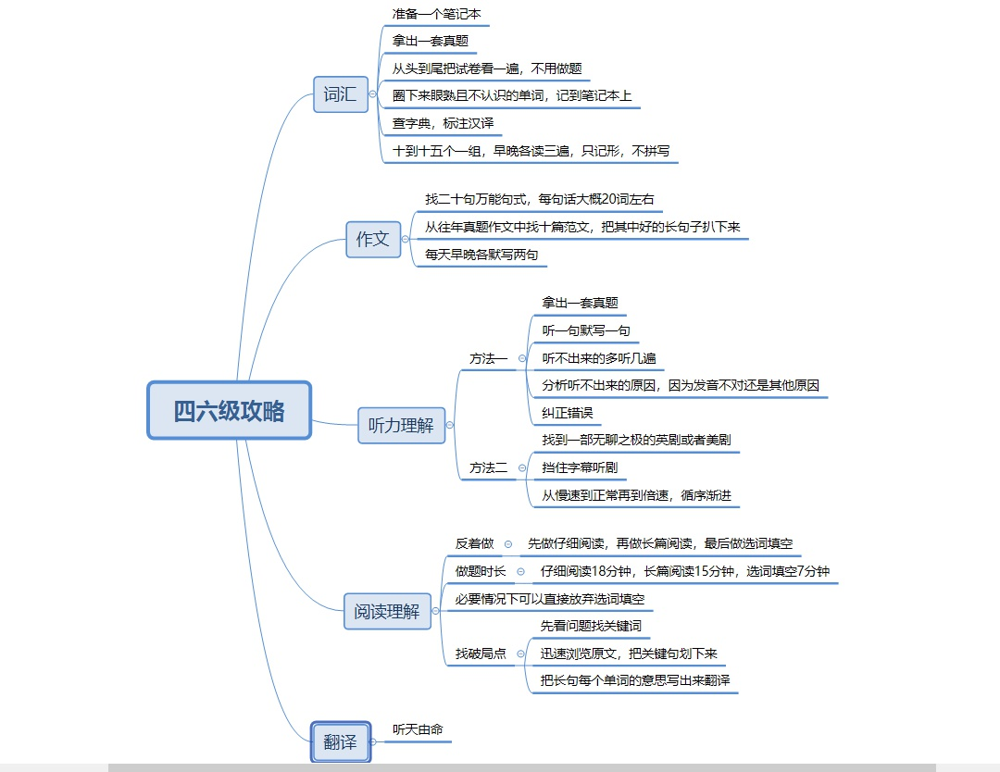

# 词汇记忆

1. 首先，准备一个笔记本，作为我们自己的单词笔记本
2. 拿出一套真题，记住，一定要是真题！
3. 从头到尾把试卷看一遍，不用做题
4. 把整张试卷中**眼熟并且不认识**的单词圈下来，记到笔记本上，记住一定要同时满足这两点，眼熟并且不认识
5. 查字典，把汉语意思写到单词的旁边，如果单词汉语意思很多，挑一到两个常见的写上去就行
6. 之后每天早上起来之后和晚上睡觉之前，拿出单词本，读三遍，然后看英语想汉译，再看汉译想英语，不用拼写，只需要记读音和单词大概长什么样，以后看到这个单词能知道是什么意思就行
7. 如果有没记住的单词就重复刚才的步骤，再读三遍，十个到十五个一组，每天两次，两个星期下来，四六级的高频核心单词基本上就全部掌握了
8. 其实这个记单词方法的原理很简单，眼熟说明你经常见到这个词，基本上就是高频词汇，而不认识说明这个词你还没有掌握

---

- **最重要的一点，这个方法适用于所有人**
- 每个人的单词储备量都不一样，不管词汇量多大还是多小的人，都能通过这个方法来对自己进行查漏补缺，即使有些高频词汇第一遍不熟悉，但是**只要是高频词汇，就一定会出现第二遍第三遍**，然后自然而然就会变成眼熟且不认识的单词，这也是为什么一定要选择真题试卷的原因，就是要保证这些词是真题中的高频词汇

# 听力理解

- 听力理解是四级考试的第二部分，满分249分，占比35%，做题时间25分钟。这一部分占比较重，做题时间最短，其中听力理解的第三部分占比最多，每年的听力理解也是整套试题最难的一部分
- 想要做好听力理解，不要过分依赖技巧，只有提升自身实力才能拿到高分
- 那怎样才能在短时间内提升听力能力呢？
- 听写，这是**最笨拙也是最有效的方法**
  - 首先，拿出一套真题
  - 听一句默写一句
  - 如果一遍下来只能写下来一个词，那就返回去听两遍，听三遍，四遍
  - 如果四遍还不能写出来的话，就要找一下自身的问题，是不是由于自己的发音不对，才导致听到正确的读音写不出来或是由于其他的原因
- 这样做一套真题下来，你的听力能力会有质的飞跃。做三套题下来，那应付四级听力就是小菜一碟了，不过这其中的过程可能会稍微有些痛苦，对于四六级要求不是太高的同学可以适当调整

# 作文部分

- 四级写作的评分标准分为三个方面：
  - 语言：准确+高级
  - 内容：不跑题+丰富
  - 结构：引题+分析+总结
- 除了这三方面外，一个老师评改试卷时，看一篇作文的时间大概是二十秒钟，不管你作文写得多优秀，多丰富，老师也只有二十秒左右的时间去修改，所以**作文的第一印象极其重要，即使字写的很难看也不要随意涂鸦，尽量保持卷面的整洁**
- **四级作文是试卷中比较容易提分的一部分**，为什么这么说，因为四级作文的题材种类并不多，你只需要背几篇范文，考试时直接将范文默写下来再稍加修改，就是一篇新的四级优秀文章
- 四级作文单词一般要求120~180词，六级作文一般150~200词。是不是觉得有点难？如果是你，**怎么在保证高质量作文的前提下去凑够这么多词？**
- 一篇四六级作文去掉am、 is 、are这些凑数词汇，大概还需要90~100个跟作文相关的词汇，而这100个单词里还包括作文题目中给的一些专业名词10~15个，和一些语法语句的固定形式里的单词20~30个，所以一篇作文真正需要我们掌握的单词大概在50~60个左右

---

1. 先找了二十个万能长句式，一句话大概在20个词左右，总共有三四百个词
2. 然后又从往年真题中找了十篇范文，把其中好的长句子扒下来，这样就又有三四百个词
3. 接着把这些句子抄在笔记本上，每天早晚默写两句，记住，是默写

---

- 到考试的时候随便从这些句子中抽出来四五句就能凑够将近一百个单词，而且还能保证作文的质量不会掺水，**即使是在写一些废话，也能保证句子写得高大上**

# 阅读理解

- 阅读理解是四级考试的第三部分，满分249分，占比35%，做题时间40分钟。这一部分是整套试题的最核心部分，占比与听力部分相同
- 细心的同学应该也会发现，阅读理解总共分为三个部分，选词填空、长篇阅读和仔细阅读
- 最有意思的事情是，这三个部分的难度与分值成反比，其中选词填空的难度最大，但是分值占比最小，只有5％，而仔细阅读的难度最小，分值占比最大，有20%
- 所以，做阅读理解的第一个技巧就是，**反着做，先做仔细阅读，再做长篇阅读，最后再做选词填空**
- 做题时间总共40分钟，根据试题的难易程度和分值分布，建议仔细阅读18分钟，长篇阅读15分钟，选词填空7分钟
- 做阅读理解时，每道题都会有一个“**破局点**”，找到这个破局点，问题也就迎刃而解了，那怎么找这个“破局点”？

---

1. 很简单，拿到一篇阅读理解时，先看问题，找到问题里面的那个关键词
2. 然后回到文章中，迅速浏览，找到这个关键词所在的位置
3. 然后把关键词所在位置的句子划下来
4. 翻译这个句子

---

- 另外同学们做题时一定要注意以下几个地方：
  1. 开头结尾段落和各段首尾
     - 首段首句
     - 二段开头的转折
     - 末段总结
  2. 注意出现频率较高的词汇
  3. 文章开头的提问与回答
- 很多问题的“破局点”都会出现在这几个地方，重点关注这几点，很有可能会有意想不到的收获

# 翻译部分

- 翻译是四级考试的第四部分，满分106分，占比15%，做题时间30分钟。这是四级考试中的最后一题，需要将一段话翻译成英语，主要考察对句子语法的运用，难度偏难
- 再来说一说翻译的出题形式：翻译内容涉及中国的历史、文化、经济、社会发展等。四级长度为140~160个汉字；六级长度为180~200个汉字
- 那四六级考试时做好翻译题的技巧是什么？我的回答是：**没有技巧！**
- **翻译不管做的好坏，对于最终成绩的影响不会太大**

# 结尾

- 最后一点，考试之前，**一定要自己掐着点完整地做一套四六级真题**，能让自己对考试有一个大概的认知，可以避免考试中出现的一些意外情况

