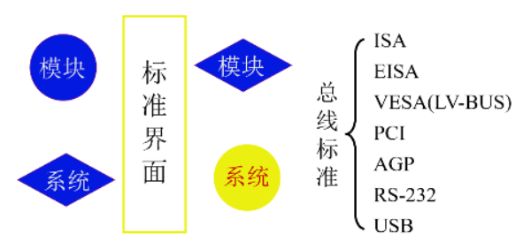

# 系统总线

- 概念：总线是连接各个部件的信息传输线， 是各个部件共享的传输介质

 ## 为什么使用总线？

1. **简化了硬件的设计。**便于采用模块化结构设计方法，面向总线的微型计算机设计只要按照这些规定制作cpu插件、存储器插件以及I/O插件等，将它们连入总线就可工作，而不必考虑总线的详细操作。 
2. **简化了系统结构。**整个系统结构清晰。连线少，底板连线可以印制化。
3. **系统扩充性好。**一是规模扩充，规模扩充仅仅需要多插一些同类型的插件。二是功能扩充，功能扩充仅仅需要按照总线标准设计新插件，插件插入机器的位置往往没有严格的限制。 
4. **系统更新性能好。**因为cpu、存储器、I/O借口等都是按总线规约挂到总线上的，因而只要总线设计恰当，可以随时随着处理器的芯片以及其他有关芯片的进展设计新的插件，新的插件插到底板上对系统进行更新，其他插件和底板连线一般不需要改。 
5. **便于故障诊断和维修。**用主板测试卡可以很方便找到出现故障的部位，以及总线类型。 采用总线结构的缺点是利用总线传送具有分时性。当有多个主设备同时申请总线的使用是必须进行总线的仲裁。

## 总线上信息的传送

- 串行：把要传输的信息一位一位的放在总线上去，然后接收方再一位一位的进行接收
- 并行：要传输的数据多位放在传输线上进行传输，接收方也同时接收多位数据并行方式需要多条数据线进行传输。

>**由于数据线是平行向外走的，线和线之间会产生干扰，如果传输距离比较长，传输的信号就会发生变形，在接收方很难接收到正确的数据，所以通常情况下并行传输的距离都比较短。可以把它集中在计算机机箱的内部。而串行传输支持的距离就比较长，可以在机器和机器之间或者机器和更远的设备之间进行传输。如果想要通过并行传输到较远距离，只能采取一些特殊的技术措施**。

## 单总线结构

- 在单总线结构中，CPU与主存之间、CPU与I/O设备之间、I/O设备与主存之间、各种设备之间都通过系统总线交换信息。

- 单总线结构的优点：控制简单方便，扩充方便。
- 单总线结构的缺点：总线只能分时工作，使总线传送的吞吐量受到限制。

## 面向CPU的双总线结构

- 以CPU为核心，CPU和主存之间连接了一条专用总线，CPU运行程序的时候指令来自于主存，数据也要来自于主存，CPU和主存之间的信息交换是非常繁忙的，利用这条主线来专门负责CPU和主存之间的数据传输，这是一个比较好的思路。
- 优点：由于在CPU与主存储器之间、CPU与I/O设备之间分别设置了总线，从而提高了微机系统信息传送的速率和效率。
- 缺点：由于外部设备与主存储器之间没有直接的通路，它们之间的信息交换必须通过CPU才能进行中转，从而降低了CPU的工作效率（或增加了CPU的占用率。一般来说，外设工作时要求CPU干预越少越好。CPU干预越少，这个设备的CPU占用率就越低，说明设备的智能化程度越高）

## 以存储器为中心的双总线结构

- 优点：优点是信息传送速率高；
- 缺点是需要增加硬件的投资。

## 总线的分类

- 根据总线的位置进行分类

  - 总线在芯片内部完成了芯片内部不同部件之间的连接，这种被称为片内总线；

  1. 片内总线：芯片内部的总线；
  2. 系统总线：计算机各部件之间的信息传输线；

  - 系统总线根据总线上传输的信号的不同，又可以分成以下三类
    - 数据总线：传输数据信号
    - 地址总线
    - 控制总线

3. 通信总线：用于计算机系统之间或计算机系统与其他系统（如控制仪表、移动通信等）之间的通信

   - 有两种传输方式：

   

- 注：也可以用其他的分类标准对总线进行分类，只有科学合理就行。

## 总线的特性及性能指标

### 一、总线的物理实现

### 二、总线特性

1. 机械特性：尺寸、形状、管脚数及排列顺序；
2. 电气特性：信号的传输方向和有效的电平范围；
3. 功能特性：每根传输线的功能
   - 地址
   - 数据
   - 控制
4. 时间特性：信号的时序关系

### 三、总线的性能指标

1. 总线宽度：在某种总线上同时传输数据，可以同时传输多少位数据
   - 数据线的根数。根数越多，同时传输的数据就越多，总线性能越好
2. 标准传输率：
   - 每秒传输的最大字节数（MBps）
     - 最大：要满负荷传输
     - 字节数：每秒传输了多少百万的字节
3. 时钟同步/异步：同步、不同步
4. 总线复用：
   - 地址线与数据线复用
   - 如8086，有20根地址线，其中16根也作为数据线使用。主要是为了减少芯片的管脚数（管脚的大小对芯片的大小影响很大）
5. 信号线数：地址线、数据线和控制线的总和
6. 总线控制方式：突发、自动、仲裁、逻辑、技术
7. 其他指标：
   - 负载能力：一条总线上可以挂载多少个IO设备

### 四、总线标准

现在的计算机比较复杂，计算机的生产、设计、制造也越来越专业化，某些企业可以专门生产计算机的内存，某些企业可以专门生产系统的CPU，不同企业生产的东西集成在一起组合成了计算机。所以大家在生产各个部件的时候就要遵守一些约定，这样就能够组成一个能够协调运行的计算机硬件系统。

## 总线结构

### 一、单总线结构

### 二、多总线结构

- 通道：是具有特殊功能的处理器，由通道对IO统一管理
  - 有自己的控制器和指令系统，能够执行一些简单的指令，通常是由操作系统的编写的

2. **三总线结构**

- DMA：直接存储器访问
  - 外部设备直接访问系统内存

3. **三总线结构的又一形式**

- 多种速度类型的设备都连接到了扩展总线了，这会影响外部设备的工作速度

4. **四总线结构**

- 高速设备都连接到高速总线上
- 低速设备连接到扩展总线上
- 特点：将高速设备和低速设备进行分类组织

## 总线控制（重点）

总线上连接了多个设备，设备间要进行通讯，必须要解决两个问题

1. 总线的判优控制：多个设备可能同时向总线发出占用总线的请求，到底哪个设备来使用总线这是个问题，因为总线在同一时刻只能由一个设备来使用
2. 设备占用总线后需要进行通讯，那么要如何完成通信过程，保证通信过程的正确性

### 总线的判优控制

- 基本概念：根据是否能提出总线请求，将总线上的设备分为两类
  1. 主设备（或叫主模块），对总线有控制权
     - 可以提出对总线的占用申请，并且在占用总线后可以控制和另外一台设备间的通信过程
  2. 从设备（或叫从模块），响应从主设备发来的总线命令
     - 本身不能对总线进行控制，也不能提出对总线的占用请求，只能响应从主设备发来的总线命令

- 集中式：把总线的判优逻辑做在一个部件上，比如说放在CPU中
- 分布式：判优逻辑分布到各个设备或各个设备的端口上

### 链式查询方式

- 总线控制部件是集中在一起的，这是集中式的特征
- 数据总线：用于信息交换过程中数据的传输
- 地址总线：主设备占用总线后要和从设备进行数据传输，那么就要通过地址总线找到要与之通信的从设备
- BR：总线请求。所以的线都通过这条线发出总线占用或总线使用的请求
- BS：总线忙。如果某一个设备占用了总线的控制权，就通过总线忙这条信号来告诉总线控制部件或其他部件总线忙
- BG：总线授权线，是链式查询的关键。

>BG线上是一个一个的向下进行查询。如果挂接在总线上的这些IO接口有总线请求的话，它就会通过BR这条线向总线控制部件提出总线占用请求，总线控制部件接收到请求后可以让出总线控制权，交给IO设备进行使用。那么这个时候就要通过BG这条线逐个的向下进行查询，首先查询IO接口0是否提出来总线占用请求，如果是它提出的就把总线使用权交给它，否则总线控制信号继续向下进行传送，直到找到第一个提出总线占用请求的接口，那么接口1就获得了总线的使用权，之后接口1就通过BS那条线设置总线忙。

#### 特点：

- 各个设备占用总线的优先机是怎么确定的：这个优先机和BG的查询顺序有直接关系，查询顺序就是各个IO设备占用总线的优先权的先后顺序
- 同上图所看，这个设备的优先机是由连接方式来决定的，事先已经确定了。如果某个设备的优先权比较低的话，在比较靠后的情况下，那么它提出的总线占用请求可能一直都得不到应答
- 缺点：
  1. 对电路故障特别敏感，尤其是下方总线授权的那条BG线，在向下传输的过程中，如果某一个接口电路出现了电路故障，那么这个信号无法向下传递的话，那么后面的那些设备就再也无法获得总线的使用权了。
  2. BG查询速度比较慢，它是从头一直向下进行查询
- 优点：
  1. 结构特别简单，和优先级和总线仲裁相关的线主要就只有3条；
  2. 增加设备非常容易，想增加设备直接再放入一个接口即可
  3. 优先级的算法也很简单
  4. 进行可靠性设计的时候比较容易实现：可以把BG或BS设计为两条线，一条线出现了问题就使用另外一条线

#### 用途

一般用在微型计算机和简单的嵌入式系统中

### 计数器定时查询方式

- 设备地址：这上面传输的地址实际上是由一个计数器给出的，通过这个地址来查找某一个设置是否发出了总线的占用请求

- 计数器：如果某一个主设备想要占用主线，或某一个从设备要进行数据传输，那么它通过BR这条线向总线控制部件提出总线占用请求，总线控制部件接收到总线占用请求后在能够响应的条件下就会启用计数器。计数器的值是通过设备地址这条线向外进行输出的

>例如：现在计数器的值是0，那么就对IO接口0进行查询，判断IO接口0上的设备是否提出了总线占用请求。如果发现其没有提出总线占用请求的话，那么计数器就会自动进行加1，接着对IO接口1这个设备进行判断是否提出了总线占用请求，如果是，那么接口1就会进行响应，通过BS那条线进行应答，IO接口1则被选中

- 优点：优先级确定非常灵活，可以通过软件设置的方式对总线控制部件进行设置，使优先级的顺序改变
- 和链式查询相比少了BG线，多了一条设备地址线。设备地址线的宽度和设备数有关

### 独立请求方式

- 优点：

  - 优先级设置非常灵活，可以在排队器里设置

  - 查询速度很快

- 缺点：使用的总线很多

## 总线通信控制

- 目的：解决通信双放协调配合问题
- 总线传输周期：指主设备和从设备之间完成一次完整的、可靠的通信所需要的时间

1. 主设备获得总线的使用权
2. 主设备要找到从设备，通过地址找到从设备，通过命令控制从设备完成相应的操作
3. 如果从设备已经准备好数据，那么就可以发送数据；相反，如果从设备已经准备好进行数据接收，那就可以进行数据接收
4. 主模块撤销相关的传输信息，从模块也结束相关的传输信息

### 总线通信的四种方式

#### 一、同步式数据输入

假如CPU以同步的方式从某一个外部设备进行数据输入，

- 整个总线周期由四个时钟构成，四个时钟周期就可以完成一次完成的、可靠的数据通信
- 还需要地址信号、读信号，并且从设备在给定的时间点上要给出数据的输出，对CPU来说是数据的输入

- 在T1时钟的上升点必须给出地址信号，由主设备给出，这里是由CPU给出的；在第二个时钟T2的上升点必须给出读命令信号，告诉从设备，CPU要读入数据；在第三个时钟周期T3上升点从设备必须给出数据信号，通过数据总线传送；在第四个时钟周期T4上升点数据信号和控制信号就可以撤销了，在T4结束的时候地址信号也撤销了

#### 同步式数据输出 

####  二、异步通信 

#### 三、半同步通信

#### 四、分离式通信 

- 充分挖掘系统总线每个瞬间的潜力 
- 一个总线传输周期 

## 练习

- **为什么要设置总线判优控制？常见的集中式总线控制有几种，各有何特点？**
  1. 总线判优控制解决多个部件同时申请总线时的使用权分配问题；
  2. 常见的集中式总线控制有三种：链式查询、计数器定时查询、独立请求；
  3. 特点：链式查询方式连线简单，易于扩充，对电路故障最敏感；计数器定时查询方式优先级设置较灵活，对故障不敏感，连线及控制过程较复杂；独立请求方式速度最快，但硬件器件用量大，连线多，成本较高。

- **解释下列概念：总线宽度、总线带宽、总线复用、总线的主设备（或主模块）、总线的从设备（或从模块）、总线的传输周期和总线的通信控制。**
  1. 总线宽度：通常指数据总线的根数；
  2. 总线带宽：总线的数据传输率，指单位时间内总线上传输数据的位数；
  3. 总线复用：指同一条信号线可以分时传输不同的信号。
  4. 总线的主设备（主模块）：指一次总线传输期间，拥有总线控制权的设备（模块）；
  5. 总线的从设备（从模块）：指一次总线传输期间，配合主设备完成数据传输的设备（模块），它只能被动接受主设备发来的命令；
  6. 总线的传输周期：指总线完成一次完整而可靠的传输所需时间；
  7. 总线的通信控制：指总线传送过程中双方的时间配合方式。

- **指令和数据都存于存储器中，计算机如何区分它们？**
  1. 方法一：通过不同的时间段来区分指令和数据，即在取指令阶段（或取指微程序）取出的为指令，在执行指令阶段（或相应微程序）取出的即为数据。
  2. 方法二：通过地址来源区分，由PC提供存储单元地址的取出的是指令，由指令地址码部分提供存储单元地址的取出的是操作数。

- **串行传输和并行传输有何区别？各应用于什么场合。**
  1. 串行传输使用的数据线少,每次只能传输一位数据,传输速度慢；并行传输可以多位数据一起传输，传输速度快。
  2. 串行传输：特别适合于远距离传输.对于那些与计算机相距不远的人机交换设备和串行存储的外部设备如终端、打印机、逻辑分析仪、磁盘等，采用串行方式交换数据也很普遍.在实时控制和管理方面，采用多台微机处理机组成分级分布控制系统中，各 CPU 之间的通信一般都是串行方式.所以串行接口是微机应用系统常用的接口。k
  3. 并行传输：广泛应用于微机系统，是微机系统中最基本的信息交换方法，
     - 例如：微机与并行接口打印机、磁盘驱动器，
     - 例如：系统板上各部件之间，接口电路板上各部件之间。

- **设总线的时钟频率为8MHz，一个总线周期等于一个时钟周期。如果一个总线周期中并行传送16位数据，试问总线的带宽是多少？**
  - 带宽=数据/总线周期=`16/(1/f)=16*f=16*8=128Mbps`