# 存储器

- 执行程序时指令和数据都来自于存储器；
- 各种文档和影像资料也是保存在存储器当中的；

- 冯洛伊曼计算机中运算器为核心导致运算器 成为了计算机的瓶颈
  - 改进：以存储器为核心的冯洛伊曼计算机

## 概述

- 存储器的分类：可以根据不同的标准分类

### 按存储介质分类

1. 半导体存储器：U盘，计算机内存条里的芯片等
   - TTL：集成度比较低，功耗高，但是速度快；
   - MOS：集成度比较高，功耗低；
   - **特点：易失：存储器中如果没有电，那么存储信息就会消失**
2. 磁表面存储器：磁盘，磁带等
   - 要有磁头和磁载体
   - 非易失

>以磁盘为例：有一个塑料或合金的机片，在机片表名涂上一层磁层，利用磁层磁化不同的方向来存储0,1。磁层被分成了若干个同心圆，我们把这个同心圆叫做磁道，每个磁道又被分成了若干个扇区，每个扇区保存几百个或几k个数据。

3. 磁芯存储器：华裔科学家王安博士1978年发明
   - 硬磁材料、环状材料
   - 非易失

>磁芯里面有导线，导线里有一定的电流，这个电流可以对磁芯进行磁化，磁芯本身是绝氧体，在电流的作用下会被磁化成N极和S极。那么就可以根据磁场的方向来保存信息。比如把N极朝向定做1，S极朝向定为0。

4. 光盘存储器：激光、磁光材料
   - 非易失

- 按存储介质分类实际只有两类：半导体存储器和磁性存储器

### 按存储方式分类

- 存取时间与物理地址无关（随机访问）
  - 随机存储器：在程序的执行过程中可读可写
  - 只读存储器：在程序的执行过程中只读
- 存取时间与物理地址有关（串行访问）
  - 顺序存取存储器：磁带
  - 直接存取存储器：磁盘

### 按在计算机中的作用分类

### 存储器的层次结构

#### 存储器三个主要特性的关系

- 计算机系统中我们为什么要使用这么多类型的存储器？

  - 用户的要求。任何一种单一的存储器都不能满足用户的要求，用户需要的是大容量，高速度，低价格的存储器。所以采用这种层次结构，形成一个存储体系。

  >存储体系：两种或两种以上的存储介质构成的存储器。用软件或硬件或者是软硬件相结合使用的方式把它们连接成一个整体，使得从某一级的程序员角度去看这一整体具有大容量，高速度，低价格

#### 缓存—主存层次和主存—辅存层次

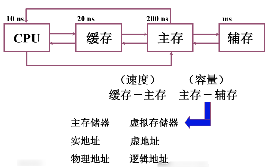

- CPU可以从主存中读信息，也可以把信息保存在主存中。

>主存的容量是有限的，我们的程序如果足够大的话，可能在主存中根本放不下。另外我们有一些文档和资料需要在计算机中进行保存，这些操作都需要我们的辅助存储器。但是程序的运算是在主存那儿，如果这个程序需要运行，那么要把它调入缓存。主存和辅存构成了一个层次，在这个层次上我们使用软硬件结合的方法把主存构成一个整体。从应用程序员的角度来看，这个程序就具备了主存的速度，辅助存储器的容量，辅存的价格。在程序执行的过程中，即使程序非常大，超过了主存的容量，应用程序员也不用自己去考虑如何把这个程序进行分割，哪些部分放在主存中，哪些部分放在辅存中；以及如果现在要执行还在辅存中的那部分程序的话，那么这部分程序如何调入主存应用程序员都不需要关心。这些都由软硬件相结合的机构来完成。

- 主存-辅存这个层次主要是为了解决主存容量的问题
- 主存的速度和CPU的速度也是有差异的。

>- CPU的发展速度非常快，从85年到2002年几乎每年的提升速度是52%，02以后提升速度稍微降低，也达到了30%左右；但是主存的速度提高是有限的，大约每经过十年我们访问一个数据的时间才会减少到原来的一半。那么随着时间的增长，主存和CPU的速度差距越来越大，为了解决这一问题，我们在主存和CPU之间加了一层缓存。这层缓存就是Cache，Cache的容量比主存的容量要小得多，功耗也比主存大，但是它的速度要比主存高很多。它里面保存的一些信息是主存保存的一些信息的副本。

- CPU可以直接访问缓存，通过访问缓存来访问主存，缓存和主存之间也进行信息交换。

>如果缓存中保存的内容是CPU经常使用的信息（指令和数据），如果绝大多数都可以从缓存中得到，那么计算机的速度会得到很大的提升。存在程序的局部性原理：时间的局部性和空间的局部性

## 主存储器

### 概述

#### 主存的基本组成

#### 主存和CPU的联系

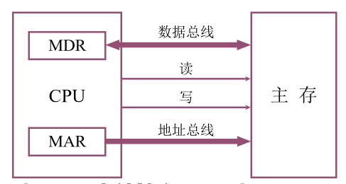

- 数据总线是双向的，可能读出，也可能写入
- 地址总线是单向的，给出要访问的内存单元的地址
- 控制信号也是单向的，由CPU送给主存储器

#### 主存中存储单元地址的分配

- 以32位机为例

---

- 假设主存的存储字长是32位，也就是对这个存储器的某一个存储单元进行读或写的话，一次最多可以读出或写入32位个0,1
- 主存的编址单位是字节，每一个字节都有一个地址。在这种情况下，每个存储子是32位，每个字节是8位，都有一个地址
- 8位16进制数转换为二进制就是32位（一位16进制数可以转换为4位二进制数，1111==16）
- 大端、大尾方式：高位字节存放在低地址，地位地址存放在高地址，并且以高位字节所在的地址把它作为存储字的地址。
- 小端、小尾方式：和上面的大端方式相反
- 数据的存放得有先后，用高电位表示1，低电位表示0，存放任何数据最后都转化为二进制数，用二进制的理由也很简单，电脑只能识别高电平和低电平

- 按字节寻址，代表一共有2^24个字节，即2^24B=2^4MB=16MB
- 若字长16位，则一个字有2个字节，所以要留一根地址线指出该字中哪个字节【0,1】，若字长为32位，则一个字有4个字节，所以要留2根地址线指出该字中的哪个字节【00,01,10,11】
- 32位系统：1字=4个字节=32位；16位系统1字=2个字节=16位，所以分别除以4和除以2

>​        计算机内存储和处理信息的最小单位是位（bit,或比特），它是BInary digiT(二进制数)这个单词的缩写。一个比特值可以是0或1，它是不可拆分的，不能再将其分为更小的信息单位。
>
>　　数字计算机将信息以一组或一串比特（称作字）的形式保存在存储器中。例如，串01011110表示一个8位的字。按照惯例，我们以最低位在最右端的方式书写二进制串。
>
>　　计算机通常不会每次只对一个二进制位进行操作，它们对一组二进制位进行操作。8个二进制位为一个字节（byte）。现在的微处理器都是面向字节的，其字长是8位的整数倍（即它们的数据和地址是8、16、32、64或128位），一个字可以是2个、4个或8个字节长，因为它的所有位可以被分别组织为2个、4个或8个8位的组。
>
>　　一些计算机制造商用术语“字”（word）表示16位的值（与字节对应，字节是8位的值），长字表示32位的值。还有一些制造商则用字表示32位的值，用半字表示16位的值。

#### 主存的技术指标

1. 存储容量：主存中存放二进制代码的总位数；
2. 存储速度：
   - 存取时间：从存储器给出地址到稳定的数据输出或输入所花费的时间。根据是读出还是写入数据，又分为了读出时间和写入时间。
   - 存取周期：连续两次独立的存储操作（读或写）所需的最小间隔时间。根据读或写又分为读周期和写周期。
   - 存取时间比存取周期短：存之前要找地址，周期=找地址时间+存取时间。
3. 存储器的带宽：单位时间里我们能够我们能够读取或是向存储器当中写入多少位的数据。单位：位/秒

### 存储器与 CPU 的连接 

CPU执行指令需要数据，都保存在主存储器当中；运行结果也需要保存在主存储器中，因此必须实现CPU和主存储器的正确连接才能够实现主存储器和CPU之间的信息交换。

- 通常情况下CPU的地址线条数比较多，寻址空间和范围也比较大，要构成一个主存储器，需要多个存储芯片共同组成。

#### 存储器容量的扩展 

##### 位扩展 

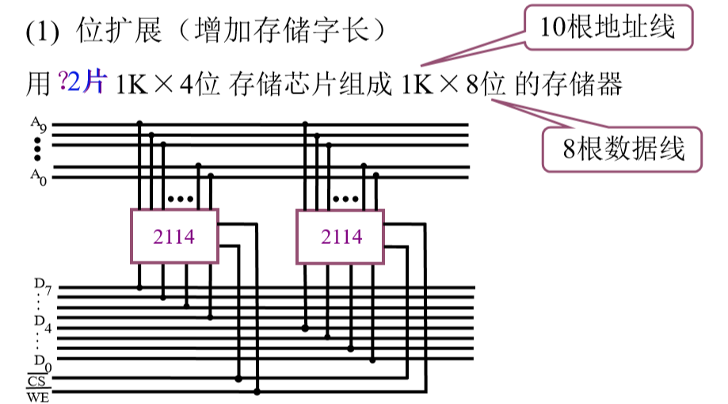

- 把10根地址线输入到2114芯片的地址管角
- 数据线，每个2114是4位的，两个2114合在一起一共提供8位数据，每个2114芯片分别和CPU上的4条数据线进行连接。这样就可以满足CPU需要8位数据的要求。
  - 两个芯片的片选一定要连在一起，使两个芯片能同时进行工作

##### 字扩展

![image-20200309104909377](图片.assets/image-20200309104909377.png

- 芯片和系统的数据线相连
- 这两个芯片不能同时进行工作，如果同时工作，每个芯片同时提供8位数据，那么在数据线上就会遭成混乱。
- 怎么保证两个芯片不同时工作？
  - 把一个2K X 8位的存储空间分成2个 1K X 8位的存储空间
  - A10 = 0就选择第一个芯片，A10 = 1就选择第二个芯片

##### 字和位的扩展

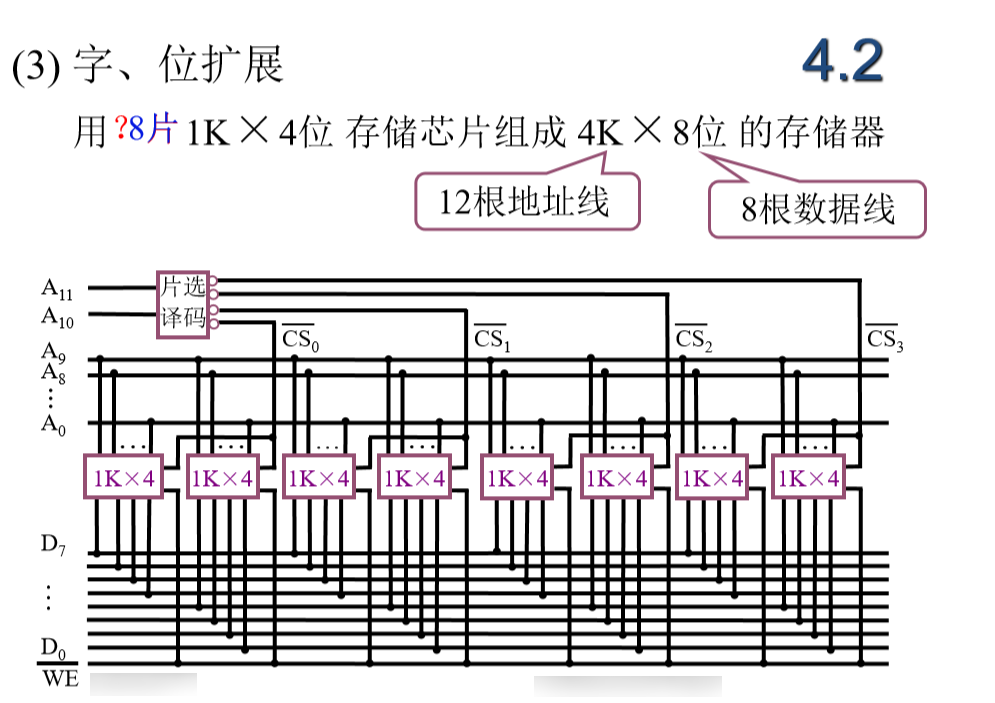

- 用两个1K X 4位的芯片构成一个 1K X 8位的芯片，他们的片选连在一起
- 用了10根地址线，还有2根是空线
- 把4K X 8位的存储空间分配到4个存储器当中，每个存储器包括两个芯片
  - 第一组芯片：1K的地址
    - 00 0000000000
    - 00 1111111111
  - 第二组：
    - 01 0000000000
    - 01 1111111111
  - 第三组：
    - 10 0000000000
    - 10 1111111111
  - 第四组：
    - 11 0000000000
    - 11 1111111111
- 要在最高的两位，A10和A11判断要访问的地址空间到底在哪一组地址芯片中
- A10和A11进行片选译码，00的时候选择第一组芯片，01的时候选择第二组芯片，以此类推

#### 地址线的连接 

CPU给出地址，存储器要根据CPU给出的地址找到相应的存储单元，这个存储单元在哪一个芯片当中，是哪个芯片的哪个存储单元；一般来说在进行地址连接的时候都是把地址的低位作为地址送入到存储器的地址线中，高位作为芯片选择信号

#### 数据线的连接

CUP的数据线条数可能比存储器的数据线条数要多，这种情况下就需要做位扩展，使存储器输出或输入的数据能够满足CPU的要求

#### 读/写命令线的连接 

一般来说，CPU给出读写命令，我们可以把读写线连接到每一个芯片上，连接到他的读写控制端上，但RAM除外，它只能读不能写

#### 片选线的连接 

访问的地址空间落在哪一个或者哪几个芯片上就是由片选线来决定的

- 当片选线连接的时候：
  1. 确认CPU这次的访问操作访问的是存储器，不是IO；对存储器的访问信号一定要在片选信号中得以体现
  2. 每一个内存芯片都有自己的地址范围，它在和CPU构成的系统当中我们是给他分了指定的地址范围，这个地址范围必须要满足CPU的要求。也就是说每一根地址线我们都要用到

#### 合理选择存储芯片 

1. 芯片的数量尽可能的少

2. 片选逻辑尽可能的简单

####  其他：时序和负载 

1. CPU的时序和存储器的时序要能够相互配合，才能够读出或写入
2. 负载：CPU能够带多少个存储芯片

## 高速缓冲存储器

>为什么使用高速缓冲存储器?

CPU的发展速度非常快，Cache速度提升比较慢，双方的速度差距越来越大，CPU执行指令的时候需要的指令，数据，执行的结果都要取自或保存在存储器中，也就是说CPU跑得再快，但是取不到指令就无法完成数据的写入操作，再快也没有用，只能空等。那么Cache的出现就是为了解决CPU空等的问题。

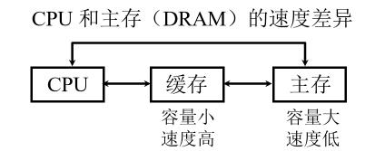

要想充分的发挥Cache的能力，使机器的速度的得到确切的提高，那么就要保证CPU所需的数据大多数情况下都能在Cache中取得。那么我们就要依靠程序访问的局部性原理。(这是计算机访问系统中非常重要的一个原理，是人们在研究程序执行过程中得到的一个数据使用的规律)

- 程序访问的局部性原理
  - 时间的局部性：当前正在使用的指令和数据在不久的将来还会被使用到。那么当前我们使用的指令和数据我们就应该把它们放到Cache中去，方便再次使用
  - 空间的局部性：当前正在使用的指令和数据在不久的将来其相邻的指令和数据可能就会被用到。那么就把当前的指令和数据从内存当中放入Cache，同时还需要把相邻的指令和数据放到Cache
- Cache和主存之间数据交换的单位是一块，这个块当中既包括了正在使用的指令和数据，也包括了相邻的指令和数据。块的大小要通过实验的方式来确定

### Cache工作原理

- 主存和缓存的编址

- 把主存储器和Cache分成大小相等的块，主存当中一共有M块，Cache中一共有C块，Cache的容量要远远小于主存的容量，即C << M 。

- 如果把主存或Cache分成若干块，那么CPU给出的内存地址就可以分成两部分：

  - 一部分是块内偏移地址，它的位数决定块的大小

  >如果一个块包含了16个字节，并且内存的编址单位是字节，那么块内地址部分就是4位（2^4 = 16）,剩余的部分就是主存块的编号。同样，Cache的地址也分成了两部分，在实际应用中Cache地址的意义不大，也不需要真正去形成Cache这个地址

- 块内地址：内存块和Cache块的大小是相同的，所以块内地址位数是完全相同的，一个块在内存和地址之间进行传送的时候是整体进行传送，块内子节的顺序不会发生任何变化。所以内存地址的快内地址部分和Cache地址的块内地址部分的值是完全相同的。Cache上有一个标记，标记了主存块和Cache块之间的对应关系。如果一个主存块号被调入到Cache块中，那么就会把主存块号写入到标记中。将来CPU给出一个内存地址，它希望在Cache块中访问到这个数据，那它首先要确定这个块是否已经被送到了Cache快中，那么它就会拿它给出的地址的主存块号和Cache中的标记进行比较，如果和某一个标记正好相等并且这个Cache块是有效的，那么这个块里面就保存了它需要在内存中访问的信息，它就可以直接从Cache中获取这些信息。那么速度就会得到很大的提高。
- 主存—Cache 这个层次结构中是按块来进行存储的，按块来进行传送的，块的大小是相等的，块内地址是完全相同的，不需要任何转化。

### 命中和未命中

- 命中：在CPU访问主存的时候，如果要访问的块已经放到了缓存中，它在缓存中能够取到相应的数据和指令，就称为命中。那么主存块和缓冲块就会建立一个对应关系，这个关系就会用标记进行标识。
- 未命中：相反，如果如果要访问的块没有被放到了缓存，CPU必须从主存中去获得相应的指令和数据，就称为未命中。

### Cache的命中率

- 命中率：CPU 欲访问的信息在 Cache中的比率 
- 命中率 与 Cache 的 容量与块长有关 

- 一般每块可取 4~8 个字
- 块长取一个存取周期内从主存调出的信息长度 

### Cache –主存系统的效率 

- 效率 e 与命中率有关 

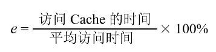

- 平均访问时间：CPU对主存的访问有些是访问Cache，从Cache中取到需要的指令和数据，不命中的时候就从内存中取。平均访问时间就是每一次访问操作平均时间是多少

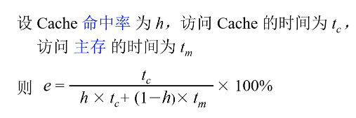

- 访问Cache和访问内存是并行进行的才能得到这个公式
- 如果说CPU是先访问Cache，如果Cache未命中再去访问内存那么这个公式就会发生变化

### Cache 的基本结构 

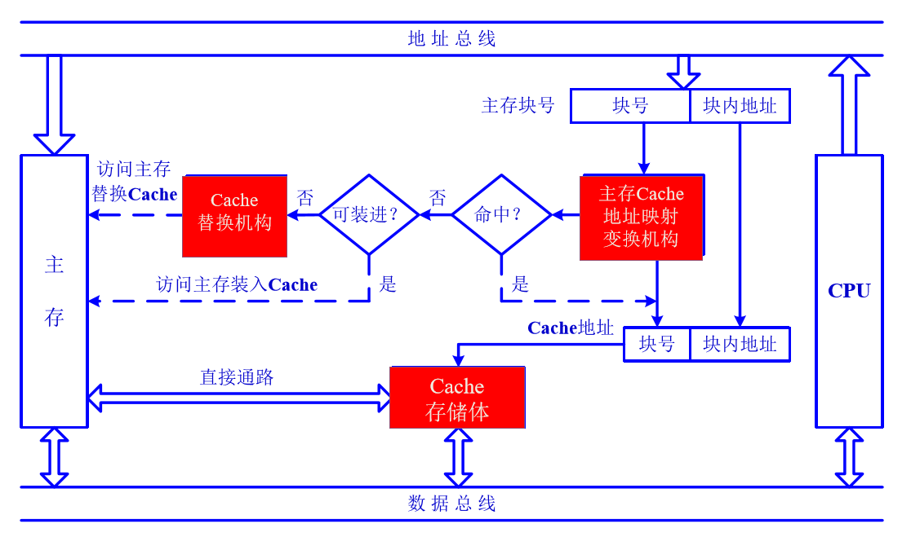

- 通过主存Cache地址映射变换机构来确定是否发生命中

  - 映射(Map)：主存当中的快如果要放入Cache的话，它要放入到Cache中的哪一个块或者是哪些块当中

  >一个学校有很多机房，不同的班级使用对应的机房，这就是映射。

  - 变化：把主存的块号转换成相应Cache的块号

- Cache替换机构根据替换算法决定哪一块要从Cache块中退出写入主存或者直接作废，并且把主存中我们要用的快写入到Cache块中

###  Cache的读写操作

- 读：

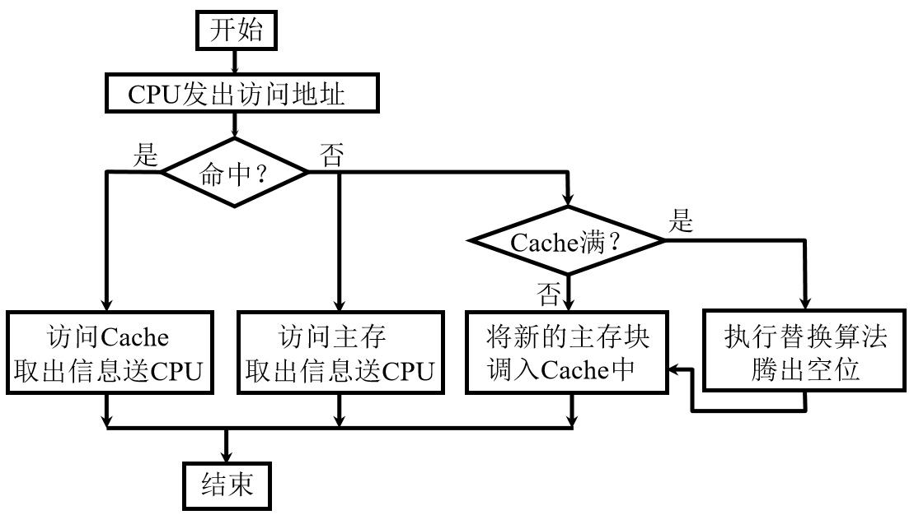

- 写

>Cache是内存当中某一个块的缓存或者是某些块的缓存，Cache当中有的信息在内存当中也有。读操作不对Cache块中的任何信息进行修改，主存和Cache的信息是相同的。但写操作会造成主存和Cache信息不一致，如：只对Cache写，没有对主存写。所以写操作一定要解决Cache和主存的一致性问题。

1. 写直达法：写操作时数据既写入Cache又写入主存 

   - 写操作时间就是访问主存的时间，Cache块退出时， 不需要对主存执行写操作，更新策略比较容易实现 
   - 优点：Cache和主存一直保存一致
   - 缺点：可能会导致CPU对同一个内存单元反复的写

   >如，执行一个求和的程序，和保存在某一个内存单元中，那么执行过程可能需要多次对这个和进行累加，每一次累加都要访问相同的内存的存储单元，造成Cache和内存之间进行频繁的信息交换

2. 写回法：写操作时只把数据写入 Cache 而不写入主存 

   - 当 Cache 数据被替换出去时才写回主存，写操作时间就是访问 Cache 的时间， Cache块退出时，被替换的块需写回主存，增加了Cache 的复杂性 

### Cache 的改进 

1. 增加 Cache 的级数 
   - 片载（片内）Cache 
   - 片外 Cache 
2. 统一缓存和分立缓存 
   - 指令 Cache 
   - 数据 Cache 
   - 与指令执行的控制方式有关 是否流水

### Cache-主存的地址映射 

- 地址映射：指主存当中的任意一块如果要加载到Cache中的话，可以加载到Cache中的哪些块，根据映射的方法不同，Cache-主存的地址映射的映射可以分为3种：
  1. 直接映射 
  2. 全相联映射 
  3. 组相联映射 

#### 直接映射 

主存当中任意的一个给定的块只能映射或装载到某一个指定的Cache块中

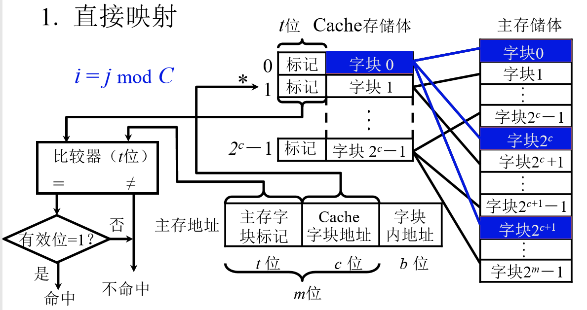

相当于是把Cache块当作一把尺子，然后把主存按照Cache的大小分成若干份，再从上到下进行编号，从0号开始编到C，因为主存大小M远远大于Cache大小C，所以再继续从0编号到C。这样就和Cache块形成映射关系，Cache中的字块0就只能映射主存中的字块0。

这种方法如果CPU给出一个地址，我们可以把它分成三部分，一部分是区号，一部分是块号，最后一部分是块内的偏移地址

由于Cache块中的第0块装载的可能是主存中任何一个区的第0块，所以要把区号写入主存字块标记中，一共是t位。主存给出一个地址，我们就要确定这个地址所在的区，相应的块是否已经被加入到Cache。根据块号我们就可以找到，如果块号已经被加载到Cache中了，那么它一定在一个给定的Cache字块当中，就可以直接定位到那个字块。但是还要确定这个字块是不是给定区的字块，那么就需要区号和Cache标记的区号进行比较，如果两者相同就命中了。

- 特点：每个缓存块  i  可以和若干个主存块对应 ，每个主存块  j  只能和 一 个缓存块对应 
- 优点：访问的速度快
- 缺点：Cache的利用率不高

#### 全相联映射 

- 主存当中任何一个块可以被放入到Cache中的任意一个块当中
- 优点：Cache的利用率高了。任何一个块要从主存储器调入Cache，只要Cache当中还有空闲的字块就可以调入进来

>如果给出一个主存地址，CPU要访问这个主存地址，首先我们要确认这个地址所在的块是被调入到了Cache当中。因为是全相联映射，这个块如果被调入到Cache，它可能在Cache的任何一个字块当中。所以我们主存储器的标记要和Cache当中所有块的标记进行比较，如果有相等的就命中了，否则未命中

缺点：电路复杂，速度较慢；参加比较的位数也比较长

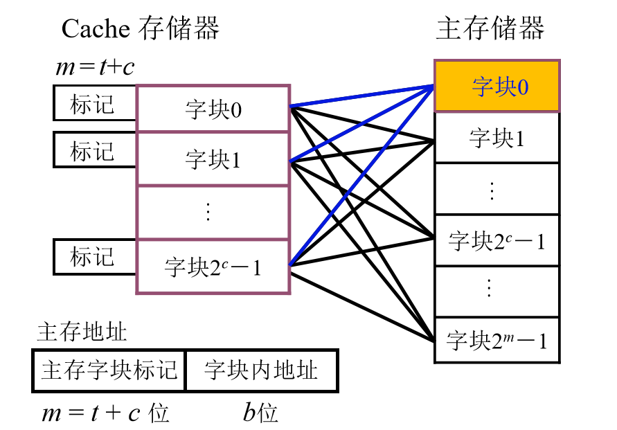

- 主存 中的 任一块可以映射到缓存中的任一块 

#### 组相联映射 

- 是直接相连映射和全相连映射的折中，先把Cache分成块，再把这些块分成若干个组，每组当中可以包含2块，4块，8块甚至16块。具体做法和直接相连映射是相似的。我们把主存储器当中的字块也进行分区，每个区的的大小和Cache中的组数大小是相同的。即Cache被分成了多少组，那么主存储器的每个区就包含了多少块。映射的时候主存储器的第0块可以放到，Cache中第0组的任何一个位置。即主存当中的每一个块在区里面的编号就直接决定了它在放入到Cache当中时可以放入到Cache中的哪一个组。
- 这种方法和直接相连对比，一个块可以有多个位置，即使其中的一个位置被占用了，如果另一个位置是空的，那么内存块就可以调入这个空块的位置。
- 和全相连相比，如果去找某一个内存块是不是被调入了Cache当中，我们只需要确定它在某个区的多少块，这个块的标号是多少，给出标号以后就找到给定的组。比较时，给定的组当中的几个块它的标记和区号进行比较。不需要和每一个Cache的标记进行比较，比较的次数就少了很多。

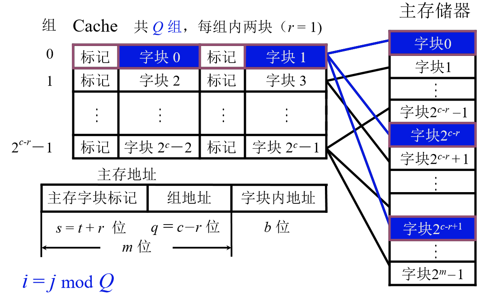

- 某一主块 j 按模Q 映射到缓存的第 i 组的任意一块

#### 小结

靠近CPU的Cache层次我们要求的是高速度，在这些层次我们就可以采用直接相连或路数较少的组相连。中间的一些层次我们可以采用组相连的方式，如2路组相连，每1组包含2个字块。距离CPU最远的Cache层次我们就可以采用全相连的方式，因为距离越远，我们对速度的强调就越低，并且对Cache利用率的强调就越高

- 直接相连：某一主存块只能固定映射到某一缓存块
  - 不灵活，Cache的利用率低，但是速度快
- 全相连：某一主存块能映射到任意缓存块
  - 成本高，速度慢，但Cache的利用率高
- 组相连：某一主存块能映射到给定的几个Cache块当中(某一缓存组)
  - 速度比较快，Cache的利用率也比较高

### 替换算法

Cache的映射给出了一个内存块如果放入到Cache可以放入的Cache的哪些位置，而在放入的过程中我们发现可以放入的Cache块已经被占用了，没有位置可以存放这个内存块，那么必须有一个Cache中的内存块被替换出来，以使我们需要的这个内存块被放入Cache，这就是替换算法

1. 先进先出（FIFO）算法：
   - 不能很好的体现出程序的局部性原理
2. 近期最少使用（LRU）算法：
   - 认为最近一段时间里面我们使用的最小的那个块将来我们就不用了，比较好的体现出了程序的局部性原理

# 练习

>1. **存储器的层次结构主要体现在什么地方？为什么要分这些层次？计算机如何管理这些层次？**

- 存储系统层次结构主要体现在缓存(Cache)—主存和主存—辅存两个存储层次上 
- 缓存—主存层次主要解决CPU和主存速度不匹配的问题。
- 主存—辅存层次主要起扩容作用，解决存储系统的容量问题。
- 综合上述两个存储层次的作用，从整个存储系统来看，就达到了速度快、容量大、位价低的优化效果。
- 主存与Cache之间的信息调度功能全部由硬件自动完成，主存和辅存之间的数据调用时由硬件和操作系统共同完成

>2. **说明存取周期和存取时间的区别。**

- 存取时间仅为完成一次操作的时间，而存取周期不仅包含操作时间，还包含操作后线路的恢复时间。即：
  - 存取周期=存取时间+恢复时间

>3. **什么是存储器的带宽？若存储器的数据总线宽度为32位，存取周期为200ns，则存储器的带宽是多少？**

- 存储器的带宽指单位时间内从存储器进出信息的最大数量。

- 存储器带宽=1/200ns × 32bit = 160Mb/秒 = 20MB/秒 = 5M字/秒

  - 带宽＝（总线频率×数据位宽）÷ 8

  - 注意：字长32位，不是16位。（注：1ns=10^-9s）
  - 一般计算机的字长在8 ~ 64位之间，即一个字由1 ~ 8个字节组成，如一台8位机，它的1个字就等于1个字节，字长为8位.如果是一台16位机，那么，它的1个字就由2个字节构成，字长为16位
  
  

>4. **某机字长为32位，其存储容量是64KB，按字编址其寻址范围是多少？若主存以字节编址，试画出主存字地址和字节地址的分配情况。**

- 存储容量是64KB时，按字节编址的寻址范围就是64K，如按字编址，其寻址范围为：
  - 64K/（32/8）=16K
  - 具体计算：(64 * 1024 * 8) ÷ 32 = 16 * 1024 = 16K
- 补充：

| 16 MB （2^27位）的存储器 |  寻址范围  | 容量 |
| :----------------------: | :--------: | :--: |
|       按 字节 寻址       | 2^24= 16 M | 2^27 |
|    按 字（16位）寻址     | 2^23 = 8 M | 2^27 |
|    按 字 （32位）寻址    | 2^22 = 4 M | 2^27 |

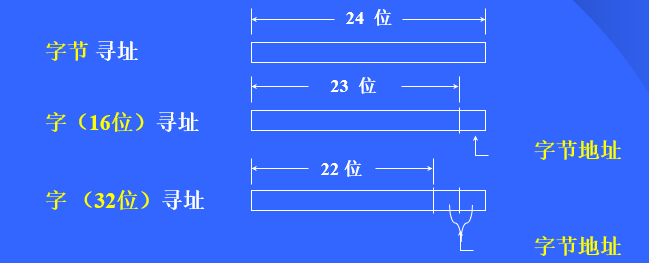

>5. **一个容量为16K×32位的存储器，其地址线和数据线的总和是多少？当选用下列不同规格的存储芯片时，各需要多少片？**
>
>- **1K×4位，2K×8位，4K×4位，16K×1位，4K×8位，8K×8位**

- 地址线和数据线的总和=14+32=46根；

  - 16K = 2^4 * 2^10，即地址线有14根
  - 32位是一次所能处理二进制的位数
    - 16位机有16根数据总线
    - 32位机有32根数据总线
  - 那么地址和数据总线的和就是14+32=46根

- 选择不同的芯片时，各需要的片数为：

  - 1K×4：（16K×32）/（1K×4）=16×8=128片
  
  - 2K×8：（16K×32）/（2K×8）=8×4=32片
  
  - 4K×4：（16K×32）/（4K×4）=4×8=32片
  - 16K×1：（16K×32）/（16K×1）=1×32=32片
  - 4K×8：（16K×32）/（4K×8）=4×4=16片
  - 8K×8：（16K×32）/（8K×8）=2×4=8片

>6. **某8位微型机地址码为18位，若使用4K×4位的RAM芯片组成模块板结构的存储器，试问：**
>    1. **该机所允许的最大主存空间是多少？**
>      2. **若每个模块板为32K×8位，共需几个模块板？**
>      3. **每个模块板内共有几片RAM芯片？**
>      4. **共有多少片RAM？**

- （1）该机所允许的最大主存空间是：2^18 × 8位 = 256K × 8位 = 256KB
  - 在微型计算机中，通常用多少字节来表示存储器的存储容量。
  - K代表数值1000的意思，B是字节，KB就是1000字节，也可以将K理解为Kb的简称。
- （2）模块板总数 = 256K × 8 / 32K × 8 = 8块
- （3）板内片数 = 32K × 8位 / 4K × 4位 = 8 × 2 = 16片
- （4）总片数 = 16片 × 8 = 128片
  - 每个模板内的片数 x 模块板总数

>7. **什么是“程序访问的局部性”？存储系统中哪一级采用了程序访问的局部性原理？**

- 程序运行的局部性指：在一小段时间内，最近被访问过的程序和数据很可能再次被访问；在空间上，这些被访问的程序和数据往往集中在一小片存储区；在访问顺序上，指令顺序执行比转移执行的可能性大（大约5：1）。存储系统中Cache一主存层次采用了程序访问的局部性原理。

>8. **计算机中设置Cache的作用是什么？能不能把Cache的容量扩大，最后取代主存，为什么？**

- 计算机中设置Cache的作用是解决CPU和主存速度不匹配问题。
  不能将Cache的容量扩大取代主存，原因是：
  1. Cache容量越大成本越高，难以满足人们追求低价格的要求；
  2. 如果取消主存，当CPU访问Cache失败时，需要将辅存的内容调入Cache再由CPU访问，造成CPU等待时间太长，损失更大。

>9. **设主存容量为256K字，Cache容量为2K字，块长为4。**
>   - 问：
>     1. **设计Cache地址格式，Cache中可装入多少块数据？**
>       2. **在直接映射方式下，设计主存地址格式。**
>
>       3. **在四路组相联映射方式下，设计主存地址格式。**
>
>       4. **在全相联映射方式下，设计主存地址格式。**
>
>       5. **若存储字长为32位，存储器按字节寻址，写出上述三种映射方式下主存的地址格式。**
>
>

- （1）Cache容量为2K字，块长为4，Cache共有2K/4 = 2^11/2^2 = 2^9 = 512块，Cache字地址9位，字块内地址为2位
- **因此，Cache地址格式设计如下：**

| Cache字块地址 | 字块内地址 |
| :-----------: | :--------: |
|      9位      |    2位     |

- （2）主存容量为256K字 = 2^18字，主存地址共18位，共分256K/4 = 2^16块，主存字块标记为18-9-2=7位。
- **直接映射方式下主存地址格式如下：**

| 主存字块标记 | Cache字块地址 | 字块内地址 |
| :----------: | :-----------: | :--------: |
|     7位      |      9位      |    2位     |

- （3）**根据四路组相联的条件，一组内共有4块，得Cache共分为512/4 = 128 = 2^7组，主存字块标记位18 - 7 - 2 = 9位，主存地址格式设计如下：**

| 主存字块标记 | 组地址 | 字块内地址 |
| :----------: | :----: | :--------: |
|     9位      |  9位   |    2位     |

- （4）**在全相联映射方式下，主存字块标记为18-2=16位，其地址格式如下：**

| 主存字块标记 | 字块内地址 |
| :----------: | :--------: |
|     16位     |    2位     |

>10. **Cache制作在CPU芯片内有什么好处？将指令Cache和数据Cache分开又有什么好处？**

Cache做在CPU芯片内主要有下面几个好处：

1. 可提高外部总线的利用率。因为Cache在CPU芯片内，CPU访问Cache时不必占用外部总线；
2. Cache不占用外部总线就意味着外部总线可更多地支持I/0设备与主存的信息传输，增强了系统的整体效率；
3. 可提高存取速度。因为Cache与CPU之间的数据通路大大缩短，故存取速度得以提高；

将指令Cache和数据Cache分开有如下好处：

1. 可支持超前控制和流水线控制，有利于这类控制方式下指令预取操作的完成；
2. 指令Cache可用ROM实现，以提高指令存取的可靠性；
3. 数据Cache对不同数据类型的支持更为灵活，既可支持整数（例32位），也可支持浮点数据（如64位）。

>11. **一个组相联映射的Cache由64块组成，每组内包含4块。主存包含4096块，每块由128字组成，访存地址为字地址。试问主存和Cache的地址各为几位？画出主存的地址格式。** 

解：一块128个字，访存地址为字地址，用7位表示块内地址。主存4096块，每块由128字组成，共2^12 * 2^7 = 2^19字，地址19位。Cache 64块，共2^6 * 2^7=2^13字，地址13位。Cache 64块，每组4块，共16组。

| 主存字块标记 | 组地址 | 字块内存地址 |
| ------------ | ------ | ------------ |
| 8            | 4      | 7            |

>12. **设主存容量为1MB，采用直接映射方式的Cache容量为16KB，块长为4，每字32位。试问主存地址为ABCDEH的存储单元在Cache中的什么位置？**

- 一块4个字，一字32位（4B），则一块16B，用4位表示块内地址。
- 主存1MB，地址20位。主存共2^20 / 2^4 = 2^16块。
  Cache16KB，地址14位。Cache共2^14 / 2^4 = 2^10块。
- 直接映射方式下主存地址划分如下：

| 主存字块标记 | Cache字块地址 | 字块内存地址 |
| ------------ | ------------- | ------------ |
| 6            | 10            | 4            |

- 主存地址为ABCDEH写成二进制为：10101011110011011110最后4位为块内地址，1110B=EH，中间10位是其在Cache中的字块地址，1111001101=3CDH 
- ABCDEH内存单元在Cache中的3CDH块，块内地址为EH。

>13. **设主存容量为512K x 16位，Cache容量为4096 x 16位，块长为4个16位的字，访存地址为字地址。**
>    - 问：
>       1. **若Cache采用直接映射，设计主存的地址格式。**
>         2. **若Cache采用二路组相联映射，设计主存的地址格式。**
> 

- 主存块=4个字=2^2个字，块内字地址2位
- 主存容量=512K个字=512K/4个块=2^17个块
- Cache容量=4096个字=4096/4=2^10行

1. 直接映射下，主存的块号编码=Cache行号编码=10位，主存各个块标记Tag=17-10=7位；主存地址格式：Tag（7位），块号（10位），块内字（2位）
2. Cache组数=2^10/2=2^9组，主存块号编码=Cache组数编码=9位，Tag=17-9=8位。主存地址格式：Tag（8位）块号（9位）块内字（2位）

>14. **假设CPU执行某段程序时共访问Cache命中4800次，访问主存200次，已知Cache的存取周期为30ns，主存的存取周期为150ns，求Cache的命中率以及Cache-主存系统的平均访问时间和效率，试问该系统的性能提高了多少倍？**

- Cache命中率=4800 ÷（4800+200）= 96%
- 平均访问时间=30 × 0.96 + 150 × 0.04 = 34.8ns
- 效率e =（30 ÷ 34.8）×100% = 86.2%
- 性能提高了150 ÷ 34.8  - 1 = 3.3倍

>15. **设某计算机采用直接映射缓存，已知主存容量为4MB，缓存容量为4096B，字块长度为8个字（32位/字）。**
>    - 问：
>      1. **画出反映主存与缓存映射关系的主存地址各字段分配框图，并说明每个字段的名称及位数。**
>      2. **设缓存初态为空，若CPU依次从主存第0，1，…，99号单元读出100个字（主存一次读出一个字），并重复按此次序读10次，问命中率为多少？**
>      3. **如果缓存的存取时间是50ns，主存的存取时间是500ns，根据2求出的命中率，求平均存取时间。**
>      4. **计算缓存─主存系统的效率。**

1. Cache: 4KB /（8 * 4B）= 128（块）由于容量是按字节表示的，则主存地址字段格式划分如下：

| 21       12  | 11     5    | 4      0   |
| ------------ | ----------- | ---------- |
| 10位         | 7位         | 5位        |
| 主存地址标识 | Cache块地址 | 块内存地址 |

2. 未命中次数100/8 ≈ 13；命中率h =（100 * 10 - 13）/（100 * 10）= 98.7%
3. 平均访问时间：Ta = 50 * 98.7% + 500 * 0.3% =50.85ns
4. (50 ÷ 50.85) x 100% = 98%

>16. **假设主存容量为512KB,Cache容量为4KB,每个字块为16个字，每个字为32位。**
>    - **问：**
>      1. **Cache地址为多少位？可容纳多少块？**
>      2. **主存地址为多少位？可容纳多少块？**
>      3. **在直接映射方式下，主存的第几块映射到Cache中的第五块（设起始字块号为1）**
>      4. **画出直接映射方式下主存地址字段中各段的位数。**

1. 这里没有说按照字还是字节编址，那么按照其给的容量的格式，可以得出其默认按照字节编址。那么根据容量的计算方法:地址数 * 字长，则Cache的4KB可得地址数为4K，即2^12个数据单元，每个数据单元为8位，即一个字节B,那么就可以得到地址为12位，每块有16 * 32位，则4KB的Cache可容纳的块数为：4KB / (16 * 32位)=64块。
2. 同一理可得到主存地址为19位,可容纳2^13=8192块。
3. Cache共有64块，则按照主存块号按照64取模为5的主存块都会映射到Cache中的第5块，则满足要求的主存块号为5，64 + 5，2×64 + 5， … ， 8192 – 64 + 5 块能映射到 Cache 的第 5 块
4.  要求主存地址格式，首先可以求字块内地址，由于按照字节编址，即按照字节访存，则最小数据单元为字节，那么每个字块内有16 ∗ 32 / 8 = 64个最小访存单元，每个单元有一个地址，那么字块内就有64个地址，这样的话字块内地址就需要6位，即在直接映射下主存地址中b=6位，由于Cache共有64个字块，所以需要6位即有2^6地址才能访问到每个Cache块，即c=6位，所以最终主存字块标记位数 = 主存地址数 - 字块地址数 - 字块内地址数，即t = 19  6 - 6 =7 位，所以得到主存地址格式为：
   

>17. **假设主存容量为 512K×16 位，Cache 容量为 4096×16 位，块长为 4个16 位的字，访存地址为字地址。**
>    - **问：**
>      1. **在直接映射下，设计主存的地址格式。**
>      2. **在全相联映射下，设计主存的地址格式。**
>      3. **在二路组相联映射方式下，设计主存的地址格式。**
>      4. **若主存容量为512K * 32位，块长不变，在四路组相联映射下，设计主存的地址格式。**

- 16位就是1个字

1. 用容量除以块大小得到块的个数，个数为:(4096 * 16位) / 4 * 16位 = 1024 = 2^10，所以Cache块地址位数为10,即c=10,由于这里按照字访存，主存地址也很容易得到为19位（512 x 1024 x 16 / 16），对于字块内地址，字块内共有4 * 16位 / 16位 = 4个访存单元，所以就有4个字块内地址，所以字块内地址就有2位，即b=2,所以最后求得主存字块标记有19-10-2=7位，得到主存字块地址格式：

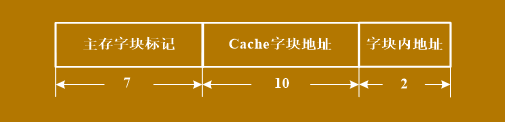

2. 在全相联映射下，主存地址仅由字块内地址和主存字块标记构成，而字块内地址在 1 中求得为2位，所以这里的字块内地址为19-2=17位。此时的主存地址格式为：

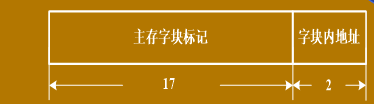

3. 在二路组相联映射中，每组有两个字块，所以一共有2^10 / 2 = 2^9组，故组地址有9位，即q=9,由于每个字块到这里都是没有变化的，所以字块内地址仍为2位，即b=2,所以主存字块标记为19-9-2=8位，故得到主存地址格式为：

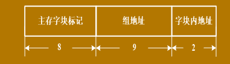

4. 主存容量为512K * 32位，即双字宽存储器，即每次可以访问两个字(最小访存单元)，这里的访存地址单元仍为字没有变，并且块长仍为4个16位的字，所以字块内地址仍为2位，而主存容量可以转为512K * 32位=1024K * 16位,这样就可以得到共有1024K个字，即2^20个数据单元，地址数为2^20，所以主存地址有20位。同时，这里改为四路相联组映射，即每个Cache组内有4个Cache块，所以共有2^10 / 4 = 2^8组，所以组地址为8位，即q=8,这样得到主存字块标记有20-8-2=10位，得到如下主存字块地址格式：

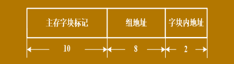

