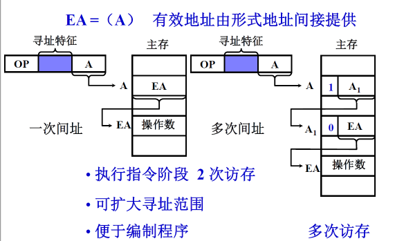

# 指令系统

- 机器指令：指计算机系统的CPU能够直接识别并且执行的操作命令。一个处理器能够执行的所以的机器指令构成的集合称为指令集。
- 软件通过指令系统高告诉计算机硬件做什么操作，计算机的硬件通过指令系统把运算结果和硬件的状态返回给软件。

## 1.机器指令

- 指令的格式
  - 操作码：指令要进行操作就要知道这个指令做的是什么操作，需要操作码识别
  - 地址码：对谁进行操作，使用地址码识别
  - 寻址方式
- 指令的字长：一条指令的长度是多少位
  - 固定字长
  - 可变字长

### 扩展操作码技术

- 保留操作码的某一个码点进行扩展
- 在操作码的扩展中必须遵守一个原则：短操作码一定不能是长操作码的前缀

### 地址码

- 32-8=24，剩下的24位分给了4个操作数，每个地址码字段的长度都是相同的，均为6位。就可以推出寻址范围。
- 减少地址码的个数来增加地址码字段的长度，从而增加寻址的范围。
- 四次访存：
  1. 取指令
  2. 取A1
  3. 取A2
  4. 把结果保存在A3

- 用PC代替A4，地址码就可以减少一个，指令就会变成3地址的指令
- 地址码的个数减少了，每个地址码的长度就会增加
- 地址码字段 = （32 - 8）/ 3 = 8，寻址范围变大

- 2次访存：取指令，取A1操作数
- 寻址范围大大增加

### 指令字长

### 小结

- 当用一些硬件资源代替指令字中的地址码字段后
  - 可扩大指令的寻址范围 (指令字长固定的情况)
  - 可缩小指令字长
- 当指令的地址字段为寄存器时
  - 三地址 OP R1, R2, R3
  - 二地址 OP R1, R2
  - 一地址 OP R1
  - 可缩短指令字长
  - 指令执行阶段不访存

## 2寻址方式

- 确定本条指令的操作数地址和下一条要执行指令的指令地址

### 指令寻址

### 数据寻址

- 形式地址：并不是我们要找到的数据所在的存储单元或者是寄存器的真实地址

#### 1.立即寻址

#### 2.直接寻址

#### 3.隐含寻址

#### 4.间接寻址

#### 5.寄存器寻址

#### 6.寄存器间接寻址

#### 7.基址寻址

#### 8.变址寻址

### RISC技术

- RISC：精简指令集计算机
  - Reduced Instruction Set Computer
- CISC：复杂指令集计算机
  - Complex Instruction Set Computer

>为了适应计算机应用的发展，为了面向目标程序进行优化，面向高级语言进行优化，面向操作系统进行优化。把目标程序中经常用到的一些操作变成计算机的指令来加快计算机的运行速度。于是指令集逐渐复杂。于是人们开始思考是不是指令集越多越好，指令集是不是越复杂越好，于是得出了以下的结论

- 典型程序中 80% 的语句仅仅使用处理机中 20% 的指令
- 执行频度高的简单指令，因复杂指令的存在，执行速度无法提高

#### RISC主要特征

- 选用使用频度较高的一些简单指令， 复杂指令的功能由简单指令来组合
- 指令长度固定、指令格式种类少、寻址方式少
- 只有 LOAD / STORE 指令访存
- 采用流水技术一个时钟周期内完成一条指令
- 采用组合逻辑实现控制器
- CPU 中有多个通用寄存器

#### CISC的主要特征

- 系统指令复杂庞大，各种指令使用频度相差大
- 指令长度不固定、指令格式种类多、寻址方式多
- 访存指令不受限制
- CPU中设有专用寄存器
- 大多数指令需要多个时钟周期执行完毕
- 采用微程序控制器

#### RISC和CISC 的比较

1. RISC更能充分利用 VLSI 芯片的面积
2. RISC 更能提高计算机运算速度指令数、指令格式、寻址方式少，通用 寄存器多，采用组合逻辑 ，便于实现指令流水
3.	RISC 便于设计，可降低成本，提高可靠性
4.	RISC不易实现指令系统兼容

# 作业

>什么是指令字长、机器字长和存储字长？

- 指令字长：是指机器指令中二进制代码的总位数。指令字长取决于从操作码的长度、操作数地址的长度和操作数地址的个数。不同的指令的字长是不同的。
- 机器字长：是指计算机进行一次整数运算所能处理的二进制数据的位数（整数运算即定点整数运算）。机器字长也就是运算器进行定点数运算的字长，通常也是CPU内部数据通路的宽度。即字长越长，数的表示范围也越大，精度也越高。机器的字长也会影响机器的运算速度。
- 存储字长：一个存储单元存储一串二进制代码（存储字），这串二进制代码的位数称为存储字长，存储字长可以是8位、16位、32位等。

>2. 比较基址寻址和变址寻址的异同点。

- 基址寻址方式和变址寻址方式，在形式上是类似的。但用户可使用变址寻址方式编写程序，而基址寻址方式中对于基址寄存器，用户程序无权操作和修改，由系统软件管理控制程序使用特权指令来管理的。再者基址寻址方式主要用以解决程序在存储器中的定位和扩大寻址空间等问题。

>3. 比较间接寻址和变址寻址的异同点。

- 间接寻址中，指令中的地址内容指定了另一个数据所在的有效地址位置。
- 变址寻址就是将变址寄存器（S：24）中的数值加上指令的初始地址形成新的寻址地址。

>4. 什么是RISC？简述它的主要特点。

- RISC（reduced instruction set computer，精简指令集计算机）是一种执行较少类型计算机指令的微处理器，起源于80 年代的MIPS主机（即RIS机），RISC机中采用的微处理器统称RISC处理器。
- 主要特点：
  1. 选取使用频度较高的一些简单指令以及一些很有用但又不复杂的指令，让复杂指令的功能由频度高的简单指令的组合来实现。 
  2. 指令长度固定，指令格式种类少，寻址方式种类少。  
  3. 只有取数/存数指令访问存储器，其余指令的操作都在寄存器内完成。  
  4. CPU中有多个通用寄存器。  
  5. 采用流水线技术，大部分指令在一个时钟周期内完成。采用超标量和超流水线技术，可使每条指令的平均执行时间小于一个时钟周期。  
  6. 控制器采用组合逻辑控制，不用微程序控制。  
  7. 采用优化的编译程序。

>5. 比较RISC和CISC。

- RISC的设计重点在于降低由硬件执行指令的复杂度，因为软件比硬件容易提供更大的灵活性和更高的智能，因此RISC设计对编译器有更高的要求；CISC的设计则更侧重于硬件执行指令的功能，使CISC的指令变得很复杂。总之RISC对编译器的要求高，CISC强调硬件的复杂性，CPU的实现更复杂。
- 指令的强弱是CPU的重要指标，指令集是提高微处理器效率的最有效工具之一。从现阶段的主流体系结构讲，指令集可分为复杂指令集（CISC）和精简指令集（RISC）两部分。相应的，微处理随着微指令的复杂度也可分为CISC及RISC这两类。

>6. 假设指令字长为16位，操作数的地址码为6位，指令有零地址、一地址、二地址三种格式。
>   1. 设操作码固定，若零地址指令有M种，一地址指令有N种，则二地址指令最多有几种？
>     2. 采用扩展码操作技术，二地址指令最多有几种？
>     3. 采用扩展操作码技术，若二地址指令有P种，零地址指令有M种，则一地址指令最多有几种？

- 若采用定长操作码时，二地址指令格式如下：设二地址指令有K种，则：K=2^4-M-N，当M=1，N=1时，二地址指令最多有：Kmax=16-1-1=14种

|  4   |  6   |  6   |
| :--: | :--: | :--: |
|  OP  |  A1  |  A2  |

- 若采用变长操作码时，二地址指令格式仍如上图所示，但操作码长度可随地址码的个数而变。此时，K=2^4-（N/2^6+M/2^12），（N/2^6+M/2^12向上取整），当（N/2^6+M/2^12）<=1时，K最大，则二地址指令最多有：Kmax=16-1=15种（只留一种编码作扩展标志用）。

 >7. 设指令字长为16位，采用扩展操作码技术，每个操作数的地址为6位。如果定义了13条二地址指令，试问还可安排多少条一地址指令？

- 二地址指令格式如下：

|  4   |  6   |  6   |
| :--: | :--: | :--: |
|  OP  |  A1  |  A2  |

- 设二地址指令格式为该指令系统的基本格式，4位操作码共有16种编码，其中13种用来定义二地址指令，还剩3种可用来作扩展标志。如不考虑零地址指令，该指令系统最多还能安排：  
  -  一地址指令条数= 3 * 2^6 = 192条

>8. 某机指令字长16位，每个操作数的地址码为6位，设操作码长度固定，指令分为零地址、一地址和二地址三种格式。若零地址指令有M种，一地址指令有N种，则二地址指令最多有几种？若操作码位数可变，则二地址指令最多允许有几种？

- 若采用定长操作码时,二地址指令格式如下：
  - OP（4位）
  - A1（6位）
  - A2（6位）
- 设二地址指令有K种,则：K=24-M-N
  - 当M=1（最小值）,N=1（最小值）时,二地址指令最多有：Kmax=16-1-1=14种
- 若采用变长操作码时,二地址指令格式仍如 1 所示,但操作码长度可随地址码的个数而变.此时,K= 24 -（N/2^6 + M/2^12 ）；
  - 当（N/2^6 + M/2^12 ）<= 1时（N/2^6 + M/2^12 向上取整）,K最大,则二地址指令最多有：Kmax=16-1=15种（只留一种编码作扩展标志用）

>9. 假设指令字长为16位，操作数的地址码为6位，指令有零地址、一地址、二地址三种格式。
>   1. 设操作码固定，若零地址指令有3种，一地址指令有5种，则二地址指令最多有几种？
>     2. 采用扩展操作码技术，若二地址指令有8种，零地址指令有64种，则一地址指令最多有几种？

- 若采用定长操作码时，二地址指令格式如下：设二地址指令有K种，则：K=2^4-M-N，当M=3，N=5时，二地址指令最多有：Kmax=16-3-5=8种
- 511种