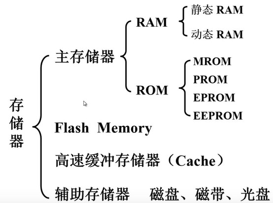
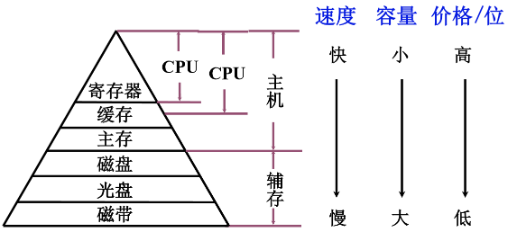
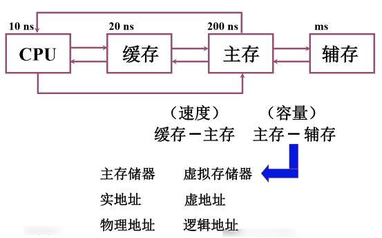
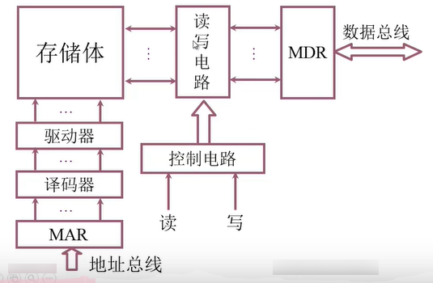
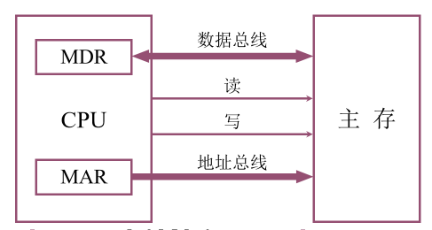
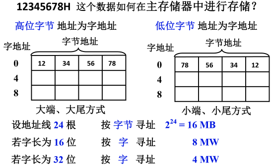
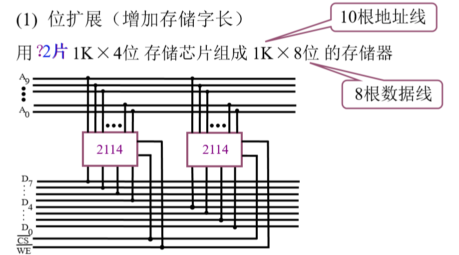
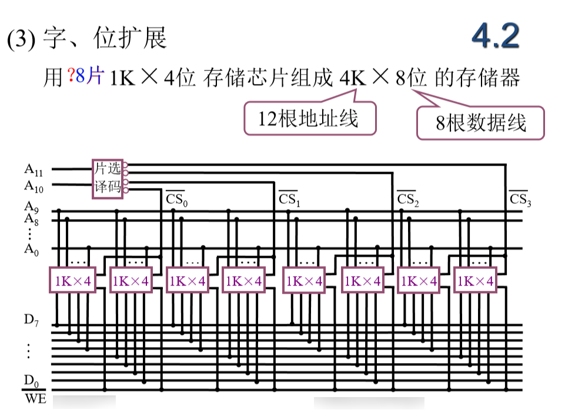

# 存储器

- 执行程序时指令和数据都来自于存储器；
- 各种文档和影像资料也是保存在存储器当中的；

- 冯洛伊曼计算机中运算器为核心导致运算器 成为了计算机的瓶颈
  - 改进：以存储器为核心的冯洛伊曼计算机

## 概述

- 存储器的分类：可以根据不同的标准分类

### 按存储介质分类

1. 半导体存储器：U盘，计算机内存条里的芯片等
   - TTL：集成度比较低，功耗高，但是速度快；
   - MOS：集成度比较高，功耗低；
   - **特点：易失：存储器中如果没有电，那么存储信息就会消失**
2. 磁表面存储器：磁盘，磁带等
   - 要有磁头和磁载体
   - 非易失

>以磁盘为例：有一个塑料或合金的机片，在机片表名涂上一层磁层，利用磁层磁化不同的方向来存储0,1。磁层被分成了若干个同心圆，我们把这个同心圆叫做磁道，每个磁道又被分成了若干个扇区，每个扇区保存几百个或几k个数据。

3. 磁芯存储器：华裔科学家王安博士1978年发明
   - 硬磁材料、环状材料
   - 非易失

>磁芯里面有导线，导线里有一定的电流，这个电流可以对磁芯进行磁化，磁芯本身是绝氧体，在电流的作用下会被磁化成N极和S极。那么就可以根据磁场的方向来保存信息。比如把N极朝向定做1，S极朝向定为0。

4. 光盘存储器：激光、磁光材料
   - 非易失

- 按存储介质分类实际只有两类：半导体存储器和磁性存储器

### 按存储方式分类

- 存取时间与物理地址无关（随机访问）
  - 随机存储器：在程序的执行过程中可读可写
  - 只读存储器：在程序的执行过程中只读
- 存取时间与物理地址有关（串行访问）
  - 顺序存取存储器：磁带
  - 直接存取存储器：磁盘

### 按在计算机中的作用分类

### 存储器的层次结构

#### 存储器三个主要特性的关系

- 计算机系统中我们为什么要使用这么多类型的存储器？

  - 用户的要求。任何一种单一的存储器都不能满足用户的要求，用户需要的是大容量，高速度，低价格的存储器。所以采用这种层次结构，形成一个存储体系。

  >存储体系：两种或两种以上的存储介质构成的存储器。用软件或硬件或者是软硬件相结合使用的方式把它们连接成一个整体，使得从某一级的程序员角度去看这一整体具有大容量，高速度，低价格

#### 缓存—主存层次和主存—辅存层次

- CPU可以从主存中读信息，也可以把信息保存在主存中。

>主存的容量是有限的，我们的程序如果足够大的话，可能在主存中根本放不下。另外我们有一些文档和资料需要在计算机中进行保存，这些操作都需要我们的辅助存储器。但是程序的运算是在主存那儿，如果这个程序需要运行，那么要把它调入缓存。主存和辅存构成了一个层次，在这个层次上我们使用软硬件结合的方法把主存构成一个整体。从应用程序员的角度来看，这个程序就具备了主存的速度，辅助存储器的容量，辅存的价格。在程序执行的过程中，即使程序非常大，超过了主存的容量，应用程序员也不用自己去考虑如何把这个程序进行分割，哪些部分放在主存中，哪些部分放在辅存中；以及如果现在要执行还在辅存中的那部分程序的话，那么这部分程序如何调入主存应用程序员都不需要关心。这些都由软硬件相结合的机构来完成。

- 主存-辅存这个层次主要是为了解决主存容量的问题
- 主存的速度和CPU的速度也是有差异的。

>- CPU的发展速度非常快，从85年到2002年几乎每年的提升速度是52%，02以后提升速度稍微降低，也达到了30%左右；但是主存的速度提高是有限的，大约每经过十年我们访问一个数据的时间才会减少到原来的一半。那么随着时间的增长，主存和CPU的速度差距越来越大，为了解决这一问题，我们在主存和CPU之间加了一层缓存。这层缓存就是Cache，Cache的容量比主存的容量要小得多，功耗也比主存大，但是它的速度要比主存高很多。它里面保存的一些信息是主存保存的一些信息的副本。

- CPU可以直接访问缓存，通过访问缓存来访问主存，缓存和主存之间也进行信息交换。

>如果缓存中保存的内容是CPU经常使用的信息（指令和数据），如果绝大多数都可以从缓存中得到，那么计算机的速度会得到很大的提升。存在程序的局部性原理：时间的局部性和空间的局部性

## 主存储器

### 概述

#### 主存的基本组成

#### 主存和CPU的联系

- 数据总线是双向的，可能读出，也可能写入
- 地址总线是单向的，给出要访问的内存单元的地址
- 控制信号也是单向的，由CPU送给主存储器

#### 主存中存储单元地址的分配

- 以32位机为例

---

- 假设主存的存储字长是32位，也就是对这个存储器的某一个存储单元进行读或写的话，一次最多可以读出或写入32位个0,1
- 主存的编址单位是字节，每一个字节都有一个地址。在这种情况下，每个存储子是32位，每个字节是8位，都有一个地址
- 8位16进制数转换为二进制就是32位（一位16进制数可以转换为4位二进制数，1111==16）
- 大端、大尾方式：高位字节存放在低地址，地位地址存放在高地址，并且以高位字节所在的地址把它作为存储字的地址。
- 小端、小尾方式：和上面的大端方式相反
- 数据的存放得有先后，用高电位表示1，低电位表示0，存放任何数据最后都转化为二进制数，用二进制的理由也很简单，电脑只能识别高电平和低电平

- 按字节寻址，代表一共有2^24个字节，即2^24B=2^4MB=16MB
- 若字长16位，则一个字有2个字节，所以要留一根地址线指出该字中哪个字节【0,1】，若字长为32位，则一个字有4个字节，所以要留2根地址线指出该字中的哪个字节【00,01,10,11】
- 32位系统：1字=4个字节=32位；16位系统1字=2个字节=16位，所以分别除以4和除以2

>​        计算机内存储和处理信息的最小单位是位（bit,或比特），它是BInary digiT(二进制数)这个单词的缩写。一个比特值可以是0或1，它是不可拆分的，不能再将其分为更小的信息单位。
>
>　　数字计算机将信息以一组或一串比特（称作字）的形式保存在存储器中。例如，串01011110表示一个8位的字。按照惯例，我们以最低位在最右端的方式书写二进制串。
>
>　　计算机通常不会每次只对一个二进制位进行操作，它们对一组二进制位进行操作。8个二进制位为一个字节（byte）。现在的微处理器都是面向字节的，其字长是8位的整数倍（即它们的数据和地址是8、16、32、64或128位），一个字可以是2个、4个或8个字节长，因为它的所有位可以被分别组织为2个、4个或8个8位的组。
>
>　　一些计算机制造商用术语“字”（word）表示16位的值（与字节对应，字节是8位的值），长字表示32位的值。还有一些制造商则用字表示32位的值，用半字表示16位的值。

#### 主存的技术指标

1. 存储容量：主存中存放二进制代码的总位数；
2. 存储速度：
   - 存取时间：从存储器给出地址到稳定的数据输出或输入所花费的时间。根据是读出还是写入数据，又分为了读出时间和写入时间。
   - 存取周期：连续两次独立的存储操作（读或写）所需的最小间隔时间。根据读或写又分为读周期和写周期。
   - 存取时间比存取周期短：存之前要找地址，周期=找地址时间+存取时间。
3. 存储器的带宽：单位时间里我们能够我们能够读取或是向存储器当中写入多少位的数据。单位：位/秒

### 存储器与 CPU 的连接 

CPU执行指令需要数据，都保存在主存储器当中；运行结果也需要保存在主存储器中，因此必须实现CPU和主存储器的正确连接才能够实现主存储器和CPU之间的信息交换。

- 通常情况下CPU的地址线条数比较多，寻址空间和范围也比较大，要构成一个主存储器，需要多个存储芯片共同组成。

#### 存储器容量的扩展 

##### 位扩展 

- 把10根地址线输入到2114芯片的地址管角
- 数据线，每个2114是4位的，两个2114合在一起一共提供8位数据，每个2114芯片分别和CPU上的4条数据线进行连接。这样就可以满足CPU需要8位数据的要求。
  - 两个芯片的片选一定要连在一起，使两个芯片能同时进行工作

##### 字扩展

![image-20200309104909377](图片.assets/image-20200309104909377.png

- 芯片和系统的数据线相连
- 这两个芯片不能同时进行工作，如果同时工作，每个芯片同时提供8位数据，那么在数据线上就会遭成混乱。
- 怎么保证两个芯片不同时工作？
  - 把一个2K X 8位的存储空间分成2个 1K X 8位的存储空间
  - A10 = 0就选择第一个芯片，A10 = 1就选择第二个芯片

##### 字和位的扩展

- 用两个1K X 4位的芯片构成一个 1K X 8位的芯片，他们的片选连在一起
- 用了10根地址线，还有2根是空线
- 把4K X 8位的存储空间分配到4个存储器当中，每个存储器包括两个芯片
  - 第一组芯片：1K的地址
    - 00 0000000000
    - 00 1111111111
  - 第二组：
    - 01 0000000000
    - 01 1111111111
  - 第三组：
    - 10 0000000000
    - 10 1111111111
  - 第四组：
    - 11 0000000000
    - 11 1111111111
- 要在最高的两位，A10和A11判断要访问的地址空间到底在哪一组地址芯片中
- A10和A11进行片选译码，00的时候选择第一组芯片，01的时候选择第二组芯片，以此类推

#### 地址线的连接 

CPU给出地址，存储器要根据CPU给出的地址找到相应的存储单元，这个存储单元在哪一个芯片当中，是哪个芯片的哪个存储单元；一般来说在进行地址连接的时候都是把地址的低位作为地址送入到存储器的地址线中，高位作为芯片选择信号

#### 数据线的连接

CUP的数据线条数可能比存储器的数据线条数要多，这种情况下就需要做位扩展，使存储器输出或输入的数据能够满足CPU的要求

#### 读/写命令线的连接 

一般来说，CPU给出读写命令，我们可以把读写线连接到每一个芯片上，连接到他的读写控制端上，但RAM除外，它只能读不能写

#### 片选线的连接 

访问的地址空间落在哪一个或者哪几个芯片上就是由片选线来决定的

- 当片选线连接的时候：
  1. 确认CPU这次的访问操作访问的是存储器，不是IO；对存储器的访问信号一定要在片选信号中得以体现
  2. 每一个内存芯片都有自己的地址范围，它在和CPU构成的系统当中我们是给他分了指定的地址范围，这个地址范围必须要满足CPU的要求。也就是说每一根地址线我们都要用到

#### 合理选择存储芯片 

1. 芯片的数量尽可能的少

2. 片选逻辑尽可能的简单

####  其他：时序和负载 

1. CPU的时序和存储器的时序要能够相互配合，才能够读出或写入
2. 负载：CPU能够带多少个存储芯片

### 练习